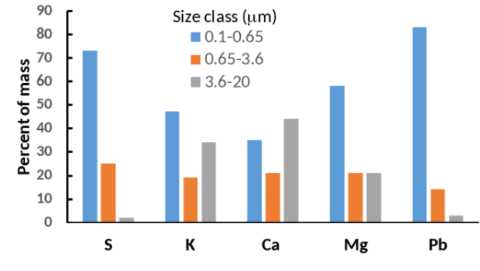
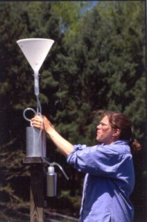
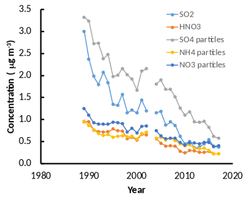
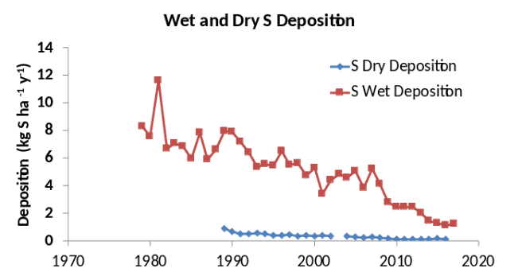
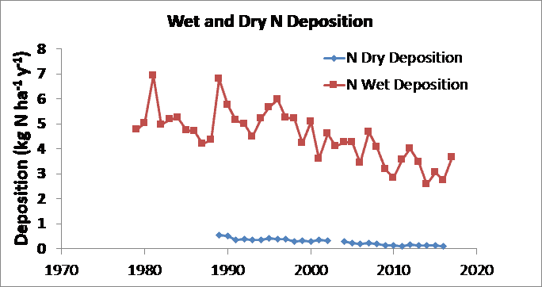
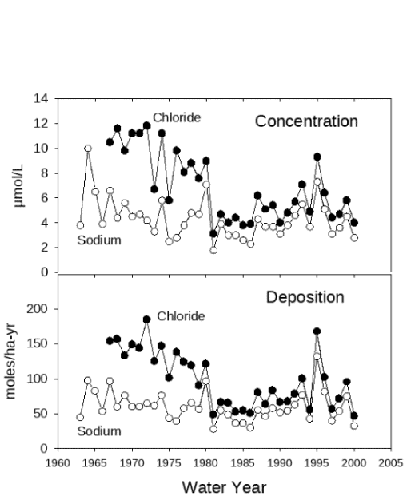
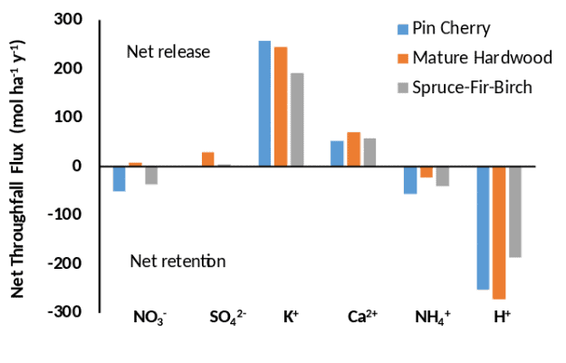

Chapter Editors: Gary Lovett and Charles Driscoll

While many of the nutrients that trees at Hubbard Brook need for growth are supplied from minerals in the soil, some, notably nitrogen (N) and sulfur (S), are primarily supplied by atmospheric deposition. In addition to being important for the nutrient supply of the forest, atmospheric deposition also delivers pollutants to the forest, particularly oxides of N and S and trace metals such as lead (Pb) and mercury (Hg). Because Hubbard Brook is downwind of many air pollution sources in the eastern and midwestern US, the forest has been receiving excess N, S and trace metal deposition for decades and has suffered consequences of that deposition. Impacts of N and S deposition are discussed in the Ecosystem Effects of Acid Deposition chapter; in this chapter we discuss the rates and mechanisms of deposition of these and other substances to the forest and how they interact with the canopy after they are deposited.

## Forms in the atmosphere and mechanisms of deposition

{#fig-sizedist}

The rate at which a substance is deposited to an ecosystem depends on whether it occurs in the atmosphere as a gas or a particle. Particles can occur in a wide range of sizes that are often categorized as fine (<2 µm diameter) and coarse (> 2µm); these have different rates of deposition as explained below. Nitrogen has many gaseous forms including nitrogen oxides (NO, NO2, and HNO3) and ammonia (NH3) as well as some organic N compounds such as peroxyacetyl nitrate (PAN). In rural areas like Hubbard Brook, the dominant forms are generally HNO3 and in some cases NH3, especially in the vicinity of agricultural sources of NH3. In addition, N occurs in particulate form as both ammonium and nitrate salts (e.g., (NH4)2SO4 and NH4NO3) which are predominantly in the fine particle size range. Likewise, S has a gaseous form (SO2) and can also occur as a salt in fine particles. Potassium (K), calcium (Ca), and magnesium (Mg) are important plant nutrients that occur in the atmosphere exclusively as particles, and often in larger size classes than those of N and S. Lead (Pb) is an atmospheric pollutant that is also principally present in fine particles (@fig-sizedist). Mercury is also a trace metal of concern which can be deposited as gaseous elemental mercury (Hgo), and gaseous and particulate oxidized mercury (Hg2+) (Driscoll et al. 2013). Both the gases and particles can also dissolve in raindrops, snowflakes and cloud droplets.

These atmospheric substances can be deposited to the ecosystem either dissolved in rain or snow (a process known as wet deposition) or in the particulate and gaseous forms (dry deposition) (Lovett 1994). The form of the substance in the atmosphere affects the rate of dry deposition. In general, gases like SO2, HNO3, Hg2+ and Hgo deposit to plants and soil surfaces relatively quickly, especially if the gas is water soluble. These gases can deposit on exterior leaf and bark surfaces and can also diffuse through the stomata to the interior of the leaf. Coarse particles also are deposited on canopy surfaces at a relatively high rate through gravitational settling. Fine particles, however, are only slowly deposited because they must first undergo the slow process of diffusion through the leaf boundary layer, the layer of minimally mixed air surrounding the leaf. In general, the smaller the particle size, the lower the deposition rate.

Deposition of cloud droplets can also occur if clouds or fog enshroud canopy surfaces. This process is most important on mountaintops and seacoasts where there is frequent cloud/fog accompanied by strong winds that increase the deposition of the droplets by inertial impaction. This is not a significant deposition process at Hubbard Brook, where clouds at tree level are relatively infrequent, but it is very important at higher elevations in nearby high mountains (Lovett et al. 1982).

## Trends in atmospheric concentrations and deposition.
{#fig-precipcollector}

{#fig-bulkdep}

At Hubbard Brook, precipitation chemistry and wet deposition have been measured since 1979, and air chemistry and dry deposition since 1989, at a site near the Forest Service headquarters building in the lower part of the valley. These measurements are part of national monitoring programs, including the National Atmospheric Deposition Program (NADP) for wet deposition (https://nadp.slh.wisc.edu/) and the U.S. Environmental Protection Agency Clean Air Status and Trends Network (CASTNet) for atmospheric gases and dry deposition (https://www.epa.gov/castnet) (see photo). In addition, bulk deposition has been measured since 1963 using a network of collectors in the experimental watersheds.

Bulk deposition uses collection devices that are continuously open (@fig-precipcollector), while wet deposition collectors are covered during dry periods (@fig-bulkdep). The differences in these collection methods are discussed further in the section on 'Measurement methods' below.

The air chemistry measurements for S and N show that both particulate and gaseous forms of both elements have declined markedly since the measurements began (@fig-castnetparticulate). These trends are largely caused by the reductions in N and S emissions in the US resulting from the Clean Air Act (1970) and its amendments (1990) and rules. This reduction in air pollution is a clear success story in environmental policy (Sullivan et al. 2018).

{#fig-castnetparticulate}

At Hubbard Brook, wet deposition of S and N are substantially larger than dry deposition (Figutrds 5, 6), although that is generally not the case for sites that are closer to emission sources such as urban areas. Both wet and dry deposition have declined over the period of record for both S and N, reflecting the decline in air concentrations of these pollutants (Figures 5, 6). Base cation (Ca2+, Mg2+, K+ and Na+) deposition has also declined, probably due mainly to reduction of particulate emissions from power plants (Hedin et al. 1994). Sulfur oxide emissions emanate primarily from combustion of coal in power plants and industrial facilities, and the sulfur reduction methods for those facilities have been quite effective, reducing S deposition by 75% or more (Figure 5). In contrast, nitrogen oxides emanate from all forms of combustion, including stationary sources such as power plants and factories, and mobile sources such as cars and trucks. As a result, the Clean Air Act regulations, which primarily target stationary sources, have been less effective in reducing nitrogen deposition, which has declined by < 50% (Figure 6).

Trends in deposition of sodium (Na+) and chloride (Cl-) provide an interesting case study about changing sources of atmospheric constituents. Early in the record of bulk deposition at Hubbard Brook, Cl- deposition was higher than Na+ deposition on a molar basis and the two ions did not vary synchronously (Figure 7). Chloride deposition declined in parallel with the decline in S deposition through the 1970s, because the emissions controls on coal-burning power plants removed HCl as well as SO2. Deposition of Na+, which is derived mainly from sea salt aerosols, remained essentially flat during this period. From the 1980s onward, Cl- and Na+ deposition have varied in concert and at about the ratio these elements are found in seawater (1.2). These patterns indicate that as the coal-burning emission source was reduced, Cl- deposition declined and reached a 'floor' established by the natural sea-salt emissions and deposition, where it has remained (Lovett et al. 2005).

{#fig-sulfur}

{#fig-nitrogen}

{#fig-chloride}

{#fig-throughfall}

## Measurement of deposition

Measurement of wet deposition is relatively straightforward, generally involving a funnel or cylinder for collecting the precipitation as it falls. Care must be taken to shield the collector from strong winds that can affect its efficiency of collection. Typically, samples are collected at daily or weekly intervals and returned to a laboratory for chemical analysis. ??Bulk deposition?? is the term used when the deposition collectors are continuously left open (Figure 2), and therefore collect the wet deposition plus any fraction of the particles and gases that fall into or adhere to the surfaces of the collector. 'Wet-only' deposition is collected using automatic devices that cover the collecting bucket when it is not raining or snowing, thus avoiding the particle and gas contamination (Figure 3). The wet deposition shown in Figures 5 and 6 is wet-only deposition. Precipitation amount is generally measured using a specialized weighing rain gauge (Figure 3).

Measurement of dry deposition is considerably more complex. Typically air concentrations of the depositing substances are measured and dry deposition rates are estimated using a model that is parameterized with measurements of such variables as canopy height, wind speed, and surface wetness. This is how the dry deposition estimates in Figures 5 and 6 were made. Dry deposition of some gases, including SO2 and NO2, can be measured using eddy covariance, but that technique requires a relatively flat and homogeneous site, so much of the Hubbard Brook landscape is unsuitable. Coarse particle deposition is not well captured by the models generally used for dry deposition estimates, so for cases where coarse particle deposition is important, these approaches result in significant underestimation. This is unlikely to be a problem for N and S, which are dominated by fine particles, but could be important for K, Ca, and other elements associated with larger particle sizes (Figure 1).

Other methods have been used for estimating dry deposition. If the element is relatively inert in the canopy (neither leached from nor taken up by the foliage), the flux in throughfall and stemflow (rainwater dripping below the canopy, see below) can be used to estimate total (wet + dry) deposition, and then wet deposition can be subtracted to calculate dry deposition (Lindberg and Lovett 1992). Likewise, dry deposition can be calculated on a whole watershed scale from a mass balance if the other inputs, outputs and internal sources and sinks are either known or can be assumed to be negligible (Eaton et al. 1978). Lovett et al. (1992) compared these three methods for S dry deposition for Hubbard Brook for one year, and the estimates ranged from 2.0 kg S ha-1 y-1 for the concentration-based calculation, to 3.3 for the throughfall method and 7.8 for the whole watershed mass balance. Subsequent study has indicated that the large value for the watershed technique is probably biased by a source of S from within the watershed (Likens et al. 2002, Mitchell et al. 2011), but the concentration-based and throughfall estimates are both credible and their range (2.0 to 3.3 kg S ha-1 y-1) is a testament to the fact that exact measurement of dry deposition remains elusive.

For the elements discussed above, wet deposition dominates inputs to the landscape. In contrast for mercury, dry deposition generally exceeds wet deposition; typically, dry Hg deposition is 50 to 70% of total Hg deposition to forested landscapes. The deposition pathways for Hg are similar to those for other elements, but their distribution is different. For deciduous stands Hg largely is deposited to the forest floor via litter. Elemental Hg enters the stomata of leaves and deposition of Hg in leaf litter is a more important input pathway for Hg than for other elements. For coniferous stands, litter Hg is also important, but a much larger fraction of Hg adheres to the exterior leaf surface where it may be washed off by rainfall, so throughfall (rain dripping below the canopy) typically is the dominant pathway of atmospheric Hg deposition.

##Landscape variation in deposition rates

The Hubbard Brook valley contains complex and varied terrain and canopy types, which can influence rates of deposition. Wet deposition is dependent on the amount of precipitation and the chemistry of that precipitation. Chemistry tends to be relatively uniform over an area the size of Hubbard Brook (3000 ha) but precipitation amount can vary, especially as a result of elevation. For example, Likens et al. (2002) found that the S concentrations were not significantly different between sites at 250 m vs 549 m, but the precipitation amount was 17% higher at the higher site, leading to a 5% higher bulk deposition rate for S.

Dry deposition is considerably more variably spatially because it depends on canopy type, wind speed, and other factors that vary across the landscape. Lovett et al. (1997) found that dry deposition of the gases SO2 and HNO3 were 2.1 and 3.5 times greater, respectively, at a high-elevation site (650 m elevation) compared to a lower site (250 m elevation) within the Hubbard Brook valley. The higher deposition fluxes were due both to higher deposition rates and higher atmospheric concentrations at the high-elevation site.

Measurement of throughfall S in eight sites at Hubbard Brook did not reveal any significant differences between evergreen and deciduous stands that could be attributed to dry deposition (Lovett et al. 1996). The apparent lack of a difference is probably due to the overall low level of dry deposition at Hubbard Brook (Figure 5), and the fact that the measurements were restricted to the growing season. If the measurements had encompassed the full year, one might expect higher dry deposition fluxes on an annual basis in evergreen stands compared to deciduous stands simply because of the longer exposure of the evergreen canopy as a collecting surface for particles and gases (e.g., Weathers et al. 2006).

## Exchange at the leaf surface and generation of throughfall and stemflow

When precipitation falls on a forest canopy, multiple processes take place that change the amount and chemistry of the precipitation:

* The water may drip through the canopy to produce throughfall; it may be diverted to flow down the trunk of the tree as stemflow; or it may evaporate from the canopy surfaces, thereby increasing the concentrations of solutes.
* The rain may dissolve material that was previously dry-deposited on the canopy as particles or surface-adsorbed gases.
* Solutes from the precipitation may be taken up into the plant or into microbes or epiphytes on the canopy surfaces.
* Chemicals may leach out of the plant through the foliage or bark and dissolve in the canopy water.

Because of this array of counteracting processes, throughfall chemistry is a variable that is relatively easy to measure but difficult to interpret.

In a classic study of throughfall at Hubbard Brook, Eaton et al. (1973) found that throughfall chemistry varied significantly among tree species. For some elements, notably K and S, leaching from the canopy into throughfall drained a significant fraction of the amount of the element present in the foliage, and delivered more of the element to the forest floor than was present in litterfall. Eaton et al. (1978) also measured stemflow, and found it to constitute only about 6% of the total water delivered to the forest floor (throughfall + stemflow), but because stemflow generally has higher chemical concentrations than throughfall, stemflow delivered 8%, 12%, 9%, and 7% of the Ca, K, N and S, respectively. There was a net release of N from the canopy, and organic N comprised an average of 52% of the total dissolved N in throughfall.

Throughfall at Hubbard Brook varies significantly by forest type. Lovett et al. (1996) measured growing-season throughfall under eight sites of three canopy types - successional hardwoods (dominated by pin cherry), mature hardwoods (dominated by beech, sugar maple, and yellow birch), and spruce-fir-paper birch. Calculation of net throughfall flux (NTF = throughfall ?? bulk deposition) showed that some ions are released from the canopy and some ions are retained by it. NO3- and NH4+ are in most cases retained by all three canopy types, presumably by leaves or surface microbes assimilating the nutrient. The strongest retention was in the pin cherry and spruce-fir-birch canopies (Figure 8). Hydrogen ion was also strongly retained by all canopy types, resulting in partial neutralization of the acidic precipitation falling on this forest. In contrast, base cations K+ and Ca2+ were released by all canopies, and the similarity of charge equivalents between the base cation leaching and the H+ retention suggests that a cation exchange process is occurring on canopy surfaces.

In statistical analysis of single-event throughfall data, Lovett et al. (1996) found that the strongest control on net throughfall flux in these stands was the amount of precipitation. Larger precipitation amounts were associated with more leaching of base cations and more uptake of NH4+, NO3-, and H+. In addition, greater H+ concentration in precipitation was associated with greater leaching of the divalent cations, Ca2+ and Mg2+, lending further support to the hypothesis of cation exchange on canopy surfaces. Increased precipitation free acidity extracted more base cations from the mature hardwood canopy than from the pin cherry or spruce-fir-birch canopies.

In summary, atmospheric deposition is an important source of some elements and pollutants to the forest at Hubbard Brook, and multiple processes deliver these elements to the forest canopy as rain, snow, particles and gases. National ??scale trends in emissions are reflected in the long-term records of deposition at this site. The forest canopy is an active biogeochemical subsystem, receiving deposition from the atmosphere and altering it by processes of uptake, leaching, and spatial redistribution.

## Questions for further study

* As fossil fuel emissions of pollutants continue to decline, will deposition levels of N, S and Hg reach a floor characteristic of natural emissions and deposition? What processes contribute to this floor?
* How has reduction in acid deposition affected the leaching and uptake of ions in forest canopies?
* How much of the N retained by forest canopies is plant uptake v. microbial or epiphyte uptake or transformation?
* Is climate change affecting wet or dry deposition rates or the elevational patterns of deposition?
* How does forest disturbance and regrowth, such as harvesting and climatic events like ice storms or blowdowns, affect atmospheric deposition?

## Access Data

* Hubbard Brook Watershed Ecosystem Record (HBWatER). 2022. Continuous precipitation and stream chemistry data, Hubbard Brook Ecosystem Study, 1963 – present. ver 7. Environmental Data Initiative. https://doi.org/10.6073/pasta/b8ae3f31fcd2de3f53b2b394f122aa69 (Accessed 2022-06-16).
* NADP data access: https://nadp.slh.wisc.edu/sites/ntn-NH02/

## References

Driscoll, C. T., Mason, R. P., Chan, H. M., Jacob, D. J., & Pirrone, N. (2013). Mercury as a global pollutant: Sources, pathways, and effects. <em>Environmental Science & Technology, 47</em>, 4967–4983. <a href="https://doi.org/10.1021/es305071v">https://doi.org/10.1021/es305071v</a>

Eaton, J. S., Likens, G. E., & Bormann, F. H. (1973). Throughfall and stemflow chemistry in a northern hardwood forest. <em>Journal of Ecology, 61</em>, 495–508. <a href="https://doi.org/10.2307/2259041">https://doi.org/10.2307/2259041</a>

Eaton, J. S., Likens, G. E., & Bormann, F. H. (1978). The input of gaseous and particulate sulfur to a forest ecosystem. <em>Tellus B, 30</em>, 546–551. <a href="https://doi.org/10.1111/j.2153-3490.1978.tb00865.x">https://doi.org/10.1111/j.2153-3490.1978.tb00865.x</a>

Hedin, L. O., Granat, L., Likens, G. E., Buishand, T. A., Galloway, J. N., Butler, T. J., & Rodhe, H. (1994). Steep declines in atmospheric base cations in regions of Europe and North America. <em>Nature, 367</em>, 351–354. <a href="https://doi.org/10.1038/367351a0">https://doi.org/10.1038/367351a0</a>

Likens, G. E., Driscoll, C. T., Buso, D. C., Mitchell, M. J., Lovett, G. M., Bailey, S. W., Siccama, T. G., Reiners, W. A., & Alewell, C. (2002). The biogeochemistry of sulfur at Hubbard Brook. <em>Biogeochemistry, 60</em>, 235–316. <a href="https://doi.org/10.1023/A:1012254108472">https://doi.org/10.1023/A:1012254108472</a>

Lindberg, S. E., & Lovett, G. M. (1992). Deposition and canopy interactions of airborne sulfur: Results from the Integrated Forest Study. <em>Atmospheric Environment, 26A</em>, 1477–1492. <a href="https://doi.org/10.1016/0960-1686(92)90137-6">https://doi.org/10.1016/0960-1686(92)90137-6</a>

Lovett, G. M. (1994). Atmospheric deposition of nutrients and pollutants in North America: An ecological perspective. <em>Ecological Applications, 4</em>, 629–650. <a href="https://doi.org/10.2307/1941997">https://doi.org/10.2307/1941997</a>

Lovett, G. M., Bowser, J. J., & Edgerton, E. S. (1997). Atmospheric deposition to watersheds in complex terrain. <em>Hydrological Processes, 11</em>, 645–654. <a href="https://doi.org/10.1002/(SICI)1099-1085(199705)11:6<645::AID-HYP474>3.0.CO;2-C">https://doi.org/10.1002/(SICI)1099-1085(199705)11:6&lt;645::AID-HYP474&gt;3.0.CO;2-C</a>

Lovett, G. M., Likens, G. E., Buso, D. C., Driscoll, C. T., & Bailey, S. W. (2005). The biogeochemistry of chlorine at Hubbard Brook, New Hampshire, USA. <em>Biogeochemistry, 72</em>, 191–232. <a href="https://doi.org/10.1007/s10533-004-0364-5">https://doi.org/10.1007/s10533-004-0364-5</a>

Lovett, G. M., Likens, G. E., Nolan, S. S., & Schwarz, S. E. (1992). Dry deposition of sulfur to the Hubbard Brook Experimental Forest: A preliminary comparison of methods. In <em>Precipitation scavenging and atmosphere–surface exchange</em> (Vol. 3, pp. 1391–1402). Hemisphere Publishing.

Lovett, G. M., Nolan, S. S., Driscoll, C. T., & Fahey, T. J. (1996). Factors regulating throughfall flux in a New Hampshire forested landscape. <em>Canadian Journal of Forest Research, 26</em>, 2134–2144. <a href="https://doi.org/10.1139/x26-241">https://doi.org/10.1139/x26-241</a>

Lovett, G. M., Reiners, W. A., & Olson, R. K. (1982). Cloud droplet deposition in subalpine balsam fir forests: Hydrological and chemical inputs. <em>Science, 218</em>, 1303–1304. <a href="https://doi.org/10.1126/science.218.4579.1303">https://doi.org/10.1126/science.218.4579.1303</a>

Mitchell, M. J., Lovett, G. M., Bailey, S., Beall, F., Burns, D., Buso, D., Clair, T. A., Courchesne, F., Duchesne, L., Eimers, C., Fernandez, I., Houle, D., Jeffries, D. S., Likens, G. E., Moran, M. D., Rogers, C., Schwede, D., Shanley, J., Weathers, K. C., & Vet, R. (2011). Comparisons of watershed sulfur budgets in southeast Canada and northeast United States: New approaches and implications. <em>Biogeochemistry, 103</em>, 181–207. <a href="https://doi.org/10.1007/s10533-010-9455-1">https://doi.org/10.1007/s10533-010-9455-1</a>

Sullivan, T. J., Driscoll, C. T., Beier, C. M., Burtraw, D., Fernandez, I. J., Galloway, J. N., Gay, D. A., Goodale, C. L., Likens, G. E., Lovett, G. M., & Watmough, S. A. (2018). Air pollution success stories in the United States: The value of long-term observations. <em>Environmental Science & Policy, 84</em>, 69–73. <a href="https://doi.org/10.1016/j.envsci.2018.02.016">https://doi.org/10.1016/j.envsci.2018.02.016</a>

Weathers, K. C., Simkin, S. M., Lovett, G. M., & Lindberg, S. E. (2006). Empirical modeling of atmospheric deposition in mountainous landscapes. <em>Ecological Applications, 16</em>, 1590–1607. <a href="https://doi.org/10.1890/1051-0761(2006)016[1590:EMOADI]2.0.CO;2">https://doi.org/10.1890/1051-0761(2006)016[1590:EMOADI]2.0.CO;2</a>

