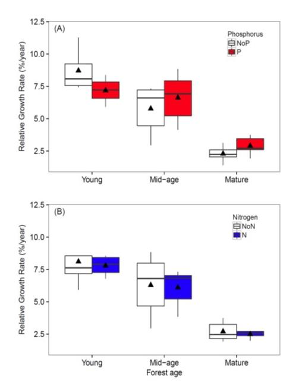
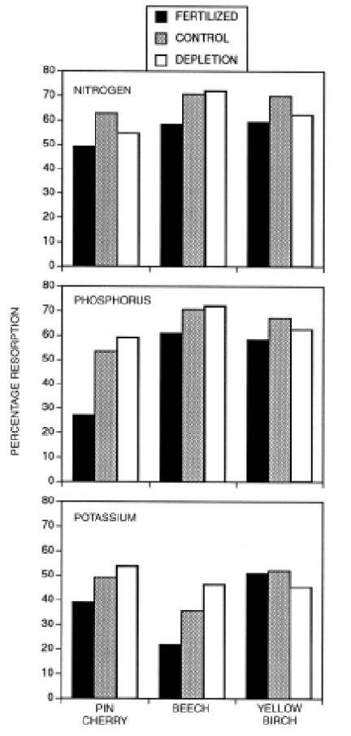
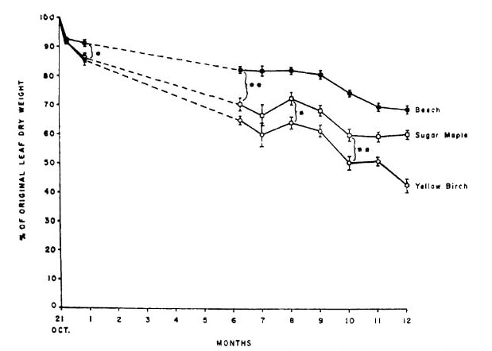
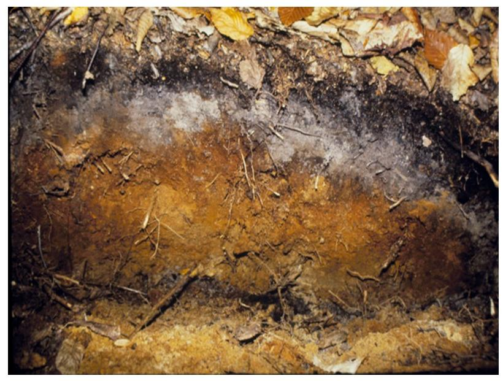
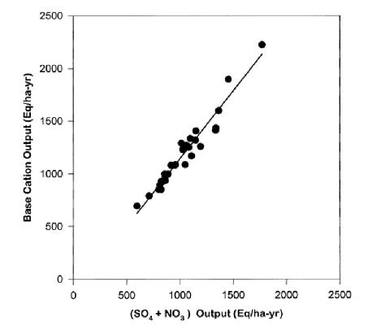
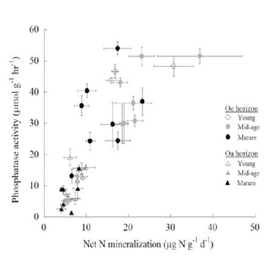
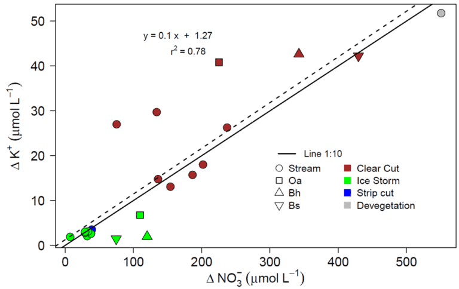

Chapter Editors: Tim Fahey

## Introduction

The Hubbard Brook Ecosystem Study (HBES) originated in 1960 with the
idea of using a small watershed approach to study element flux and
cycling (Bormann and Likens 1967; see Introductory chapter for details).
The stream draining a small watershed provides an integrated measurement
of nutrient flux from the complex forest landscape, and the role of the
forest vegetation in regulating biogeochemical cycles could be evaluated
by manipulating the forest ecosystem at the scale of the small
watershed. Thus, after quantifying the budgets of key nutrient elements
in the intact forest (Likens et al. 1967), the researchers conducted a
deforestation experiment on W2 to measure biogeochemical responses
(Likens et al. 1970). These studies provided novel insights into
nutrient cycles in northern hardwood forest ecosystems; this led
naturally to further mechanistic studies that would open up the
watershed black box for a look inside. Why do the different chemical
elements exhibit contrasting behaviors, such as seasonal and
inter-annual changes in concentrations and responses to deforestation?
How does the transformation of one element influence the fluxes of other
elements? Addressing these questions required detailed and long-term
observations of the pools and fluxes of elements within the Hubbard
Brook watersheds (Likens 2013). In this chapter we summarize some of the
key insights into element behavior and interactions that have been
provided by the HBES.

Whittaker et al. (1979) synthesized the understanding of element cycles
and behaviors afforded by the first decade of research in the HBES. They
identified three key questions about element behavior: 1) how does the
climate-soils-biotic community interact to influence element cycles; 2)
how do various biological and geological controls regulate the behavior
of different elements; and 3) what are the evolutionary considerations
that apply to nutrient conservation and interactions among organisms?
Further, they identified several mechanisms that determine element
behavior including: 1) differences in concentration among plant tissues;
2) inherent differences in the leachability of various nutrients; 3)
relative flow rate of different elements through vegetation pools; and
4) contrasts among plant taxa in the foregoing features. Whittaker et al
(1979) originally hypothesized that the behaviors of different elements
in the HB watershed could be explained largely on the basis of their
particular chemical properties and their functions in organisms. The
objective of this chapter is to provide a broad overview of our current
understanding of the behavior of key chemical elements in the forested
watersheds of the HBEF. We consider some of the mechanisms that shape
these fascinating behaviors, including how the biogeochemical cycles of
various elements interact with one another.

## Background

A few basic observations about the chemical elements are helpful for
understanding their biogeochemical behaviors and cycles. The first
category includes elements with "sedimentary cycles", in that they are
derived primarily from earth minerals, do not enter gas phase at Earth
temperatures, and are transported from the watershed as dissolved or
particulate matter. This grouping includes the base cations (Ca2+, Mg2+,
K+, Na+ ) as well as the rock-forming elements (Al, Si, Fe) and the
often growth limiting P (see Phosphorus chapter). In contrast are
elements with a gas phase (O, C, N, H, and S) that can also be
transported from the watershed as gases. Another useful way to classify
the elements is as nutrients essential to plant nutrition, non-essential
elements (e.g., Na, Al) and the typically most growth-limiting nutrients
(N and P).

Some key biological functions that Whittaker et al. (1979) emphasized as
explaining element behaviors also should be pointed out. The basic
cations, Ca, Mg, and K serve a wide variety of roles in organisms, but K
is particularly mobile because of its high water solubility and its
importance in intercellular transport functions both of which make it
highly susceptible to leaching. In contrast, Ca plays a role in cell
wall structure and is much less mobile than K. Notably, Ca usually
dominates the acid-base balance in forest soils, as explained below.

Although N and P play some different roles in organisms, both are
required in relatively large amounts relative to their availability in
soils and hence are often limiting to plant growth. Thus, these two
nutrients should be strongly conserved within plants and perhaps
efficiently cycled through the ecosystem. Moreover, constraints on the
cycling of N and P may be imposed by stoichiometric considerations; the
macronutrients are required in roughly fixed proportions that depend
upon the biochemistry of key organisms (Redfield 1958, Elser et al.
2000).

Like N, most of the S in plants is contained in amino acids and
proteins, but S is a much smaller constituent of proteins than N and has
been supplied to the HB watersheds in great excess by acid deposition
(Likens et al. 2002). Finally, although soils in the HB watersheds are
predominantly well drained and hence aerated (i.e. high in O2), evidence
for the importance of chemical oxidation-reduction (redox) cycles
continues to accumulate. Elements like N, S, Fe and Mn are involved with
organic matter in these redox cycles which may play important roles in
element interactions in the watersheds.

## Watershed Setting

{#fig-till}

Six headwater catchments were originally chosen to provide paired small
watersheds for comparative and experimental studies (see Introductory
chapter for full description). These watersheds encompass a steep hill
slope that exhibits characteristic soil and landscape features which
influence biogeochemical and hydrological behavior . The watersheds can
conveniently be sub-divided into three zones (@fig-till). At the highest
elevations on and near the ridgeline, soils are thin, often bedrock
limited and support a mix of conifer (spruce-fir) and low productivity
hardwood forest. Below are steep slopes with somewhat deeper soils and
mixed hardwood forest. In the lower watershed, slopes are less steep,
soils and glacial deposits are much deeper and the forests are taller
and more productive (Johnson et al. 2000). Soils on the watersheds are
predominantly well-drained, and highly acid spodosols with
well-developed surface organic horizons; see Chapter on soil formation
(forthcoming) for detailed explanations of soils and soil-forming
processes at HB.

{#fig-watershedmap}

Long-term biogeochemical monitoring of water and element flux have been
measured at the weir located at the base of each watershed. However, to
increase the resolution of element sources and sinks, sampling programs
have been established within selected watersheds (@fig-watershedmap)
corresponding to the elevation zones noted above. Free-draining soil
solutions are collected with a network of zero-tension lysimeters
positioned beneath the Oa (8 cm depth), Bh (20cm), and B5 (\>30cm)
horizons. In addition, stream water is sampled monthly at stations
located along the main channel of the streams draining W1, W5 and W6
(@fig-watershedmap). These samples are used to interpret the element behavior
within the HB watersheds.

## Watershed-scale Hydrochemistry

The most basic indicator of element behavior in watersheds is the
concentration-discharge (C-D) relationship. How does the concentration
of a solute change with increasing flow of water in the stream? At one
extreme we could imagine that solute flux might remain constant with
increasing water flow as the extra water simply dilutes a finite pool of
the solute. In contrast, solute flux might increase linearly with water
flow if increasing amounts of the solute are supplied to the stream;
hence, concentrations would remain roughly constant with increasing
water flow. It is even possible that solute concentrations could
increase with higher water flow if the additional water was flushing
chemicals from previously inaccessible pores in the soils or sediments.
In fact, all three of these behaviors were observed for different
nutrients in the early measurements at HB. Johnson et al. (1969)
observed dilution of Si and Na with increasing flow, apparent
chemostatic behavior (i.e. invariant concentration) for Mg and SO4, and
increased Al concentration with increasing stream discharge (@fig-conc-disch).
For NO3 and K the C-D relationships differed greatly between the growing
season and the dormant season.

Concentration-discharge relationships for inorganic Al (left) and
dissolved silica (right) in umol/L for two locations along the stream
draining W6 (from Lawrence and Driscoll 1990).

{#fig-conc-disch}

Johnson et al (1969) devised the simplest "working model" explaining
such C-D relationships in the HB watersheds. The streamwater consists of
a mixture of meteoric input (rain, snowmelt) and water stored in the
soils and sediments. They assumed that when stream discharge is zero
there remains a finite water storage pool and that stream discharge
increases in proportion to the increase in the amount of water in the
storage pool following meteoric input. In the case of Al, presumably the
increasing Al concentration with increasing discharge results from the
increased water storage flushing soil pores where this rock-derived,
non-essential element accumulated in soluble form between large rain
events.

Empirical observations using this model suggested that for some solutes,
it may be more appropriate to regard surface soil solutions as the
"input" because the fitting of empirical C-D relationships required much
higher concentrations than observed for precipitation chemistry. Others
have suggested three-component mixing models (e.g. atmospheric, soil,
groundwater) to help accommodate observations of hysteresis loops in C-D
relationships in which the change in concentration with increasing
discharge is not the mirror image of that with decreasing discharge
(Hooper et al. 1990). More recently, Godsey et al. (2009) noted the
surprising, near-chemostatic behavior of most elements in most
watersheds, i.e. solute concentrations only change slightly over several
orders of magnitude of stream discharge. They suggested that this
behavior may reflect decreasing porosity and average pore size with
increasing depth in the soil or sediments in the watersheds. In effect,
as water volume in the storage pool increases there is a rapid increase
in the amount of contact between porewater and particle surfaces from
which solutes are derived. Thus, physical hydrology may be regulating
C-D relationships.

Monthly mean concentration of potassium in (a) stream-water in cutover
W5 and reference W6, and B horizon soil solution in W6; and (b) W5
stream-water and soil solution collected from three depths (from
Romanowicz et al. 1996).

{#fig-potassium}

The behavior of K in the HB watersheds provides some insights into
controls of element fluxes at the catchment scale. As noted, K is highly
soluble and leachable and in high demand for uptake by the vegetation.
Likens et al. (1994) attributed the observed summer decline in stream
water K in W6 (@fig-potassium) in part to vegetation uptake by the deciduous
forest, and an autumn peak in K concentration to rapid leaching from
fallen leaf litter (Gosz et al. 1973, see below). Following whole-tree
harvest of adjacent W5, K concentrations in the stream increased
markedly and exhibited the same seasonal pattern (@fig-potassium). However, K
concentrations in soil solutions in W5 (mobile water collected with
zero-tension lysimeters; @fig-potassium) exhibited the opposite seasonal
pattern, paradoxically increasing during the growing season (Romanowicz
et al. 1996).

The explanation for this anomalous behavior invokes the dual-pore
concept of soil water (Shaeffer et al. 1979): large macropores that
drain under the force of gravity and tiny capillary micropores in which
water is retained by adhesion to soil particles. We hypothesize that
most plant uptake is from the micropores which would allow for the high
K in free-draining soil solutions during the summer. Moreover, average K
concentrations in stream water on both W5 and W6 greatly exceeded that
in the deep soil solution during the high stream flow period associated
with spring snowmelt (March to May; @fig-potassium). This pattern is
consistent with the hypothesis that during high flow, deep soil
flowpaths to the stream are short-circuited as lateral, near surface
flowpaths with lower K concentrations (@fig-potassium) become more important
sources of stream water; the rapid flow itself may contribute to the low
K.

In sum, the watershed-scale behavior of solutes is controlled by a
complex conjunction of climate, soils, biota and hydrology, with a
particular emphasis on the last-named. One implication is that in terms
of biogeochemical behavior, the greatest effects of climate change at HB
may be associated with increasing precipitation rather than increasing
air temperature (see Climate Change chapter).

## Plant nutrient uptake, storage and resorption

Uptake of nutrients by plant roots and mycorrhizae is among the largest
flux pathways in the forest and plays a key role in regulating element
flow through the watershed. Plants require nutrients in proportion to
their demand for growing new tissues; different plant tissues contain
different nutrient concentrations (e.g., wood vs. leaf) and the
proportions of various tissues in the plant change as the plants grow
(i.e. allometry changes). For example, Whittaker et al. (1979) noted
that although all macronutrients are at much lower concentrations in
wood than in deciduous tissues of trees (e.g., leaves, fine roots), this
difference is much more pronounced for N, P, K than for Ca and Mg.
Vitousek et al. (1988) noted that analogous changes in the proportions
of woody vs. deciduous tissues during forest development (i.e. more and
more wood) results in changing C:N:P stoichiometry; both C:N and C:P in
the forest increase with forest age but C:N increases faster than C:P.

{#fig-relgrowth}

The implication of these stoichiometric considerations for forest
nutrient limitation was realized by Rastetter et al. (2013) who
evaluated nutrient limitation of vegetation regrowth following forest
harvest or other large-scale disturbance at HB. The cycles of the
limiting macronutrients, N and P, are strongly coupled in ecological
systems. The uptake of both N and P is supplied almost entirely by
recycling from detritus, and the N:P ratio in the detrital residue
following disturbance is much lower than that of the recovering
vegetation. As a result, N is strongly retained whereas P is released in
excess from the decaying detritus and lost from rapidly cycling pools.
Thus, in the initial stages of recovery N is most limiting to plant
growth and "resynchronization" of the N and P cycle occurs gradually
with forest succession. Results from an N-P factorial fertilization
experiment in and around HB supported this concept, with N most limiting
in young forests and P more limiting in older stands (@fig-relgrowth).

The nutrient content of plant litter, as well as the root nutrient
uptake demand, depends upon the process of resorption in which nutrients
are retracted from dying tissues and stored in perennial tissues like
sapwood. The resorbed nutrients can then be used to grow new tissues
later. Whittaker et al. (1979) observed that 7 of 11 nutrients they
measured were resorbed from deciduous leaves of northern hardwood trees
at HB. Subsequent studies demonstrated the magnitude of this flux
pathway, differences among nutrients and species (Ryan and Bormann
1982), and some environmental controls of leaf resorption (Fahey et al.
1998; See et al. 2015). Typically P and N are the most tightly cycled
nutrients and 50-80% of the P and N content of northern hardwood leaves
is resorbed in an average year. This provides roughly one-third of the
annual vegetation demand for tissue growth at HB (Ryan and Bormann
1982). Somewhat lower amounts of K and Mg are resorbed, with uncertainty
for K owing to its high leachability from foliage. Notably, the
important macronutrient, Ca, is not resorbed because it is insoluble in
phloem sap which serves as the pathway of nutrient resorption from
foliage to stem tissue. Thus, root uptake of Ca must be much greater
relative to its abundance in the tree than for the other macronutrients.

{#fig-resorp}

Resorption of leaf nutrients requires an energy expenditure, and it
seems logical that in more fertile sites this nutrient conservation
mechanism would be down regulated. However, the evidence for this
hypothesis is mixed: although some fertilization experiments, as well as
surveys along fertility gradients, support the hypothesis, meta-analyses
have noted only weak associations between nutrient availability and
resorption (Killingbeck 1996). Nevertheless, studies of northern
hardwoods in and around HB indicate that N and P resorption decrease
with increasing soil nutrients (@fig-resorp; Fahey et al 1998; See et al.
2015; Gonzalez et al, in review). One consequence of foliar nutrient
resorption is the effect on the quality of plant litter and consequently
microbial decomposition of litter (see Decomposition chapter).

Whittaker et al. (1979) noted that nutrient resorption from other dying
plant tissues also occurs at HB; the transition from living sapwood to
heartwood includes nutrient retraction as does the death of branches and
bark tissue. Notably, most evidence discounts the significance of
nutrient resorption from ephemeral fine roots and mycorrhizae, although
Li et al. (2015) indicated that ectomycorrhial fungi probably recover N
and P from dying roots of pine, presumably transporting them through the
fungal hyphal network to living roots.

One final key observation from HB about nutrient resorption: the process
seems to differ markedly among years. For example, Hughes and Fahey
(1994) observed roughly two-fold variation in N resorption (35-70%)
across three years in mature northern hardwood forest. The causes and
consequences of interannual variation in nutrient resorption are unknown
and deserve further study given the large magnitude of this flux
pathway.

## Decomposition and nutrient mineralization

{#fig-litterdecay}

The availability of mineral nutrients for root uptake depends on their
conversion from the organic forms in which they occur in tissues to
inorganic forms. The release of nutrients during litter decomposition
differs markedly among elements and tissues. At one extreme, K release
from decaying leaves is very rapid and largely independent of the
pattern of overall litter decay. In contrast, the mineralization of N
and P is closely tied to the progression of organic matter decomposition
and the microbially-mediated decay process (see Decomposition chapter).
Classical theory suggests that the release pattern of N and P from
decaying litter depends upon the ratio of carbon to nutrient (C:Nt) in
the residue, with immobilization occurring at high C:Nt and
mineralization at low C:Nt . Because C is lost from the residue as
respiratory CO2, the C:Nt declines with decay and the switch from
immobilization to mineralization is expected when the C:Nt in the
residue is similar to that of the decomposers, the bacteria and fungi.
In fact, litter decay studies at HB demonstrated that not only are N and
P immobilized in decaying leaf litter of northern hardwoods, but these
nutrients are transported in large quantity from soil into litter (Gosz
et al. 1973), probably primarily by fungal hyphae. Note that after a
year of decay the N and P content of leaf litter can nearly double
(@fig-litterdecay). This N and P flux pathway is one of the largest in the
hardwood forest (Li and Fahey 2015). By comparison, release of Ca from
litter roughly follows that of C while both K and Mg are much more
rapidly released (Gosz et al. 1973).

Soils in cold, acidic environments accumulate a discrete organic horizon
(forest floor) overlying the mineral soil. At HB this forest floor
ranges from about 5-10 cm depth (@fig-profile) greatest in the spruce-fir
forest at high elevation.

{#fig-profile}

Apparently the decomposition of plant litter does not keep pace with its
production (Olson 1963); the relatively discrete nature of the forest
floor also reflects a lack of mixing of surface litter with mineral soil
by soil invertebrates such as annelid earthworms which are uncommon at
HB. The forest floor plays a crucial role in ecosystem nutrient dynamics
as at least half of tree root uptake occurs there. Mycorrhizae are
highly concentrated in the forest floor (e.g., 35-40% of fine root
biomass resides there; Fahey and Hughes 1985). Moreover, the roots and
mycorrhizae clearly play an important role in the accumulation of forest
floor layers, as root turnover and exudation supply much of the organic
matter. A positive feedback mechanism can be envisioned where root
growth in the forest floor and organic matter accumulation there are
mutually reinforcing, thereby resulting in forest floor development. The
persistence of well-developed forest floor layers enhances soil
permeability and protects soil from erosion, services that are lost when
invasive earthworms eliminate these horizons (Bohlen et al. 2004).
Finally, the forest floor plays a key role in soil profile development
(see forthcoming Soil Chapter) and in leaching of nutrients through the
soil profile, as explained next.

## Leaching of Elements Through the Soil

As water flows through soil pores, solutes are added and removed from
the soil solution by a variety of biotic and abiotic mechanisms, and the
net effect is transport of elements through soil by leaching. Most
solutes in the soil solution are in ionic forms, positively-charged
cations (H+, Al3+, Ca2+, etc.) and negatively-charged anions (OH-,
HCO3-, SO42-, NO3-). These ions are electrostatically attracted to
particle surfaces and because most of these surfaces are negatively
charged, the cations are most tightly held on what is termed the cation
exchange complex (CEC) consisting of clays, oxides and organic particles
(humus). Differences in the strength of attraction between the CEC and
different cations depends on their chemical properties as represented by
the lyotropic series of decreasing attraction:
Al3+\>H+\>Ca2+\>Mg2+\>K+\>NH4+\>Na+. Thus, H+ will normally displace
some of the adsorbed base cations from the CEC. In contrast, most soils
possess limited anion exchange properties; hence, anions are potentially
more mobile in soil than cations. On this basis the mobile anion concept
of cation leaching from soil was devised (McColl and Cole 1968):
leaching of cations from soil is regulated by processes supplying mobile
anions to soil solution. The principal anions in soils include the
strong mineral acid anions (SO42-, NO3-, Cl-), bicarbonate and carbonate
(HCO3-, CO23-), and organic anions (mostly carboxyl, COO-). To
understand the leaching process in HB soils we need to evaluate the
sources of these anions and any processes that may limit their mobility.

In some forests the principal mobile anion is HCO3- generated by
dissolution of respiratory CO2 and subsequent dissociation of carbonic
acid, H2CO3 to H+ + HCO3-. The H+ will displace base cations like K+,
Ca2+ from CEC and transport them through soil as neutral salts. Which
cations are leached will depend on their abundance on the CEC and the
lyotropic series. However, at HB soils and solutions are mostly too
acidic for the weak carbonic acid to significantly dissociate so that
bicarbonate leaching is minimal. The principal mobile anions in mineral
soil at HB are SO42- and NO3-, and variation in base cation leaching is
very strongly correlated with their abundance and mobility (@fig-basecation).

{#fig-basecation}

These mineral acid anions, NO3- and SO42-, are supplied to the soil
solution both by atmospheric deposition ("acid rain"; Climate Change
chapter) and by internal processes. Most of the SO4 is supplied by wet
and dry deposition with a much smaller amount from weathering of
S-bearing minerals in bedrock and glacial till (Likens et al. 2002). In
addition to atmospheric deposition, NO3 is supplied to soil solution by
the process of nitrification of NH4+ which is carried out by prokaryotic
soil microbes (see Nitrogen Cycling chapter). Note that this is an
acidifying process as two moles of H+ are generated for each mole of N
nitrified.

The mobility of the acid anions is decreased by biotic and abiotic
processes. High demand for N by plants and soil microbes can strongly
limit NO3 mobility in soil; although S is also an essential nutrient, it
is available in much greater amounts than its demand by organisms.
Sulfate is retained in mineral soil primarily by adsorption to the Fe
and Al oxides present in mineral soil, a process that is pH dependent.
Thus, SO4 adsorption increased markedly at HB following forest harvest
that acidified soil by greatly stimulating nitrification (Fuller 1987).
Although nitrate is not significantly adsorbed in HB soils, it may be
retained in surface organic horizons in part by an abiotic redox process
involving iron (Davidson et al. 2002, Dittman et al. 2007).

A final source of anionic charge that contributes to cation leaching is
a complex suite of soluble organic compounds. This dissolved organic
carbon (DOC) is generated primarily by partial decomposition of dead
organic matter, especially in the forest floor horizons (McDowell et al.
1998). Fulvic acid - the generic term for organic acids in soil
solutions - consists of various large aliphatic and aromatic CHO groups
containing many carboxyl groups (COOH), that dissociate to COO- and H+.
The strength of these carboxylic acids - their tendency to dissociate -
varies greatly but even at the relatively low pH of HB soils, lots of
organic anion charge is found in soil solutions. In general, the supply
of DOC to soil solution depends upon the soil organic matter (SOM) pool
size and decomposition processes; higher DOC generation is expected with
thicker forest floor and under seasonally warmer conditions (McDowell
and Likens 1988). The mobility of DOC is controlled mostly by adsorption
processes associated with humus, clay minerals and oxides (McDowell and
Wood 1984). These processes are complex and beyond the scope of this
chapter, but they will be more fully explored in the chapter on soil
formation (forthcoming) because DOC plays a key role in podsolization.
Suffice it to say that DOC retention in HB soil depends upon
co-precipitation with Fe (Fuss et al. 2011), the increase in soil pH
with depth, and soil water contact with particle surfaces in micropores.
Transport of DOC through soil to streams is limited except where shallow
flowpaths allow rapid transport from forest floor to stream water
(Dittman et al. 2007).

The importance of DOC in soil nutrient leaching is also evident from the
high proportion of N and P leaching associated with dissolved organic
matter; under undisturbed conditions half or more of N and P leaching
occurs in organic forms at HB (see Nitrogen Cycling chapter and
Phosphorus chapter). Thus, besides being the source of mineral nutrients
released by decomposition, the forest floor also serves as the source of
leaching power in the form of soluble organic matter.

To further illustrate the process of soil leaching, and to introduce
additional elemental interactions, we consider the particular case of
calcium. This divalent cation is an essential macronutrient but it also
plays a pivotal role as the most abundant base cation in most soils. As
such, Ca exerts control over the pH of soils and soil solution; when Ca
decreases so also does pH. Importantly, when Ca and pH are very low,
toxic aluminum becomes very soluble; many of the effects of acid rain on
ecosystem health stem from Ca depletion and Al toxicity (Driscoll et al.
1980; see Aluminum chapter \[forthcoming\]). At HB, long-term monitoring
has demonstrated that soil Ca pools were seriously depleted in the 20th
century as a result of increased leaching by acid deposition and removal
by logging (Likens et al. 1996). The resulting low soil and surface
water pH resulted in mobilization of Al with consequences for the health
of forest and aquatic ecosystems. Despite marked reductions in acid
loading since the late 20th century, recovery of soils and surface
waters has been delayed by the slow re-supply of Ca from primary mineral
weathering.

Additional insights into the mechanisms driving forest ecosystem element
behavior were afforded by analysis of the coupling between two
chemically mobile solutes, nitrate and potassium, in ecosystem solutions
(soil water, streams) following various forest disturbances (clear
cutting, ice storm etc.). Despite considerable variation in the coupling
of nitrate and potassium flux across disturbances, solution types and
years, an overall stoichiometric consistency exhibiting a molar ratio of
10:1 was detected (Fig. 13). But what mechanisms might account for
residual variation in this coupling? Fakhraei et al. (2019) suggested
that differences in the timing and magnitude of flushing of nitrate and
potassium following large-sale disturbance were influenced primarily
by: 1) rapid K flux from dead fine roots vs. delayed increase in
nitrification; 2) K retention and subsequent release from the soil
cation exchange complex; 3) greater plant demand for N than K relative
to supply; and 4) additional involvement of sulfate mobilization in
driving K leaching. Still, some mysteries remain. For example, a few
years after whole-tree harvest of WS5, K+ and NO3- exhibited a large,
coupled increase in leaching from surface organic horizons over four
consecutive years. A mechanism accounting for this curious behavior has
not been identified to date.

## Nitrogen-Phosphorus Co-limitation of forest ecosystems

The assimilation of C by northern hardwood forests may commonly be
co-limited by N and P (Vadeboncouer 2010), with the addition of both
nutrients together stimulating production more than either element
alone. Tree foliage in the HB and Bartlett forests contains N and P at
about the mass ratio that indicates some degree of co-limitation (N:P=15
to 17; @fig-leafnvp), and the addition of N pushes the ratio into the P
limitation range (20-25) and vice versa (Gonzales et al. 2023). The long
history of pollutant N deposition in the eastern U.S. may have induced a
"transactional" limitation of productivity by P (Vitousek et al. 2010)
in many forests, including those in and around HB. The ability of the
forest ecosystem to balance N and P limitation of C assimilation is
illustrated by increased effort at P acquisition (i.e. phosphatase
enzyme production) where soil N availability is high (Ratliff and Fisk
2016; @fig-nvsphos).

To test these ideas we initiated a broad scale study of Multiple Element
Limitation in Northern Hardwood Ecosystems (MELNHE). Beginning in 2011
relatively low levels of N (30 kg/ha-yr) and P (10 kg/ha-yr) have been
added in a full factorial design to thirteen forest stands that vary
widely in age, composition and site quality. As noted above in the
initial stages of recovery following large-scale disturbances, we
expected N to be most limiting to plant growth and "resynchronization"
of the N and P cycle would occur gradually with forest succession.
Initial results after four years supported this concept, with N being
most limiting in young forests and P more limiting in older stands
(@fig-relgrowth). More recently, continued treatment in these forests
indicated that co-limitation by N and P predominates in most of the
stands, with significantly greater tree growth response to N+P than to
either nutrient alone. This exciting result provides a strong basis for
evaluating the mechanisms contributing to the maintenance of nutrient
co-limitation, including foliar resorption, mycorrhizae and soil
enzymes.

## Synthesis

In this brief chapter we have touched on only a few of the innumerable
element behaviors and interactions in the HB ecosystems. We now return
to some of the original ideas raised by Whittaker et al. (1979) in their
seminal study of element cycling and behavior at HB. Both geologic and
biological factors exert primary control over element fluxes in the HB
forest - i.e. biogeochemistry! We emphasize the particular importance of
soil pores; their sizes and distributions apparently help to explain
concentration-discharge relationships as well as patterns of K and DOC
transport through the watershed. The formation of macropores and pipes
in soil is mediated both biologically (e.g., root channels) and
physically (e.g., freeze-thaw cycles) and deserves further study. We
also note that both biotic and geologic processes are involved in the
supply and mobility of the mobile anions that "drag" nutrient cations
from soil; whereas NO3 mobility is regulated mostly by biotic uptake
that of SO4 involves a geochemical adsorption process.

As hypothesized by Whittaker et al (1979) the biogeochemical behavior of
the elements fundamentally depends upon their chemical properties and
functions in the organisms. The lyotropic series of cation exchange is
determined by ionic radius and charge density, while the differential
leachability of K and Ca from plant tissues depends mostly on their
function in the plant (for K, membrane transport vs. the role of Ca in
cell wall structure). Differences among plant tissues in element
concentrations also leads to shifting patterns of availability of
different nutrients during stand development, with likely consequences
for trait selection and evolutionary changes. Among the most notable
adaptations to nutrient limitation is high nutrient-use efficiency
(NUE), defined as the amount of C assimilated per unit nutrient uptake
(Vitousek 1982). For N and P high NUE is associated especially with
foliar resorption which appears to be a highly plastic process in
northern hardwood forest, decreasing markedly with increased site
fertility. Moreover, depleted soil Ca appears to be limiting forest
production at HB (Battles et al. 2014), but the trees have no capacity
to respond with increased NUE for Ca simply because Ca is insoluble in
phloem sap.

A useful way to express the mobility of different elements in forest
ecosystems is on the basis of their residence times, defined as the
ratio of element stock in an ecosystem compartment to the annual input
or output (@tbl-residencetime). 

| Element     | Forest Floor | Biomass |
|-------------|-------------:|--------:|
| Calcium     |          3.9 |     8.8 |
| Magnesium   |          2.7 |     5.1 |
| Potassium   |          0.7 |     3.3 |
| Phosphorus  |         12.8 |     8.3 |
| Nitrogen    |         11.9 |     6.2 |
| Carbon      |          8.0 |    24.3 |
: **Steady state residence times (years) of macronutrients in forest floor (from Gosz et al. 1976) and aboveground biomass (adapted from Whittaker et al. 1979).** {#tbl-residencetime}

The residence time would be roughly equal to the time that an average
atom of an element remains within the compartment. Gosz et al. (1976)
calculated the residence time of various elements in the forest floor at
HB on the basis of measurements of forest floor stocks and annual inputs
in litterfall, precipitation and net throughfall/stemflow flux.
Similarly, Whittaker et al. (1979) calculated residence times for
aboveground biomass using data on litterfall and canopy leaching flux.
Not surprisingly residence time for K is the shortest and Mg is next for
both forest floor and aboveground biomass (Table 1). Strong retention of
N and P by microbes in the forest floor is reflected in their
particularly long residence times. Notably, the residence time of base
cations in biomass is much greater than in forest floor whereas the
reverse is true for N and P. Why do you think this is the case?

The biogeochemical cycles of the various elements are interwoven in
complex ways, and we have emphasized some of the prominent element
interactions. Besides the co-dependence of the cycling of cations and
anions in soils and

{#fig-leafnvp}

vegetation, perhaps the most important element interactions in the
ecosystem involve the tight coupling among C, N, and P, a broadly
applicable (global?) ecosystem pattern enshrined as so-called Redfield
ratios (Redfield 1958). The assimilation of C by northern hardwood
forests appears to be commonly co-limited by N and P (Vadeboncouer
2010), the addition of both nutrients often stimulating production more
than either element alone. Tree foliage in the HB and Bartlett forests
contains N and P at about the mass ratio that indicates some degree of
co-limitation (N:P=15 to 17; @fig-leafnvp), and the addition of N pushes
the ratio into the P limitation range (20-25) and vice versa (Gonzalez
et al. 2023). The long history of pollutant N deposition in the eastern
U.S. has probably induced a "transactional" limitation of productivity
by P (Vitousek et al. 2010) in many forests, including those in and
around HB. The ability of the forest ecosystem to balance N and P
limitation of C assimilation is illustrated by increased effort at P
acquisition (i.e. phosphatase enzyme production) where soil N
availability is high (Ratliff and Fisk 2016; @fig-nvsphos).

{#fig-nvsphos}

Among the most intriguing and complex biogeochemical interactions are
those involving oxidation-reduction (redox) processes. In aerobic (O­2
rich) situations, O2 serves as the "dump" for respiratory electron
transport chains, but when oxygen is scarce in soils and sediments,
alternative electron sinks include the reduction of oxidized forms of
Fe, S and N. The mostly well drained soils at HB only rarely reach O2
levels at which such biochemical reduction processes would be expected.
However, some evidence indicates that reduction of NO3 to gaseous forms
by denitrification may be a qualitatively significant N flux pathway at
HB (see Nitrogen Cycling chapter).

The redox situation with Fe is also intriguing. Iron is a major
rock-forming element and when weathered from soil minerals, can occur in
either oxidized (ferric, Fe+3) or reduced (ferrous Fe2+) form. Despite
the predominance of well-aerated (O2 rich) soils at HB, a surprisingly
high proportion of Fe in soil and soil solutions is found in the reduced
form (10-60%, Fuss et al. 2011). Most of the soluble ferrous iron occurs
as metal-organic matter complexes which apparently are somehow protected
from oxidation. The reduction of ferric iron may occur in O2 depleted
rhizosphere soil where lots of labile organic matter resides. The
transport of these organic complexes plays a key role in soil
podsolization, as Fe and DOC co-precipitate in B5 horizons. Thus,
exudation of organic matter and consumption of O2 by roots, interacts
with Fe weathering from soil minerals and helps to drive soil formation
at HB.

In conclusion, in this chapter we have only scratched the surface
regarding the behavior and interactions of elements in forest
biogeochemical cycles. We trust that this overview has stimulated the
reader's interest in the fascinating study of nutrient cycling.

Overall response of the change in potassium relative to nitrate in
solutions following disturbances of different watersheds at the Hubbard
Brook Experimental Forest.

{#fig-kvno3}

## Questions for Further Study.

-   Can the decrease in soil porosity, permeability and pore widths with
    increasing depth explain patterns of element concentration-discharge
    relationship in HB watersheds? What role does biological uptake play
    in controlling C-D relationships?
-   How do feedbacks and interactions among soils, climate and
    vegetation communities at the hardwood-conifer boundary influence
    nutrient cycles? What are the implications for ecosystem response to
    climate change?
-   Exactly how does resorption of N and P work, i.e. what is the
    biochemical mechanism and energetic cost of resorption, including
    that associated with sapwood, branches and bark?
-   What causes the high annual variation in foliar resorption?
-   What controls the formation and stoichiometry of DOC, DON, and DOP?
    Is there differential transport of these components that could
    de-couple their cycles to some degree?

## References

Battles, J. J., Fahey, T. J., Driscoll, C. T., Jr., Blum, J. D., & Johnson, C. E. (2014). Restoring soil calcium reverses forest decline. *Environmental Science & Technology Letters, 1*(1), 15–19. [https://doi.org/10.1021/ez400033d](https://doi.org/10.1021/ez400033d){target="_blank" rel="noopener"}

Bohlen, P. J., Scheu, S., Hale, C. M., McLean, M. A., Migge, S., Groffman, P. M., & Parkinson, D. (2004). Non-native invasive earthworms as agents of change in northern temperate forests. *Frontiers in Ecology and the Environment, 2*(8), 427–435. [https://doi.org/10.1890/1540-9295(2004)002[0427:NIEAAO]2.0.CO;2](https://doi.org/10.1890/1540-9295(2004)002[0427:NIEAAO]2.0.CO;2){target="_blank" rel="noopener"}

Bormann, F. H., & Likens, G. E. (1967). Nutrient cycling. *Science, 155*(3761), 424–429. [https://doi.org/10.1126/science.155.3761.424](https://doi.org/10.1126/science.155.3761.424){target="_blank" rel="noopener"}

Bormann, F. H., Likens, G. E., & Melillo, J. M. (1977). Nitrogen budget for an aggrading northern hardwood forest ecosystem. *Science, 196*(4293), 981–983. [https://doi.org/10.1126/science.196.4293.981](https://doi.org/10.1126/science.196.4293.981){target="_blank" rel="noopener"}

Davidson, E. A., Chorover, J., & Dail, D. B. (2003). A mechanism of abiotic immobilization of nitrate in forest ecosystems: The ferrous wheel hypothesis. *Global Change Biology, 9*(2), 228–236. [https://doi.org/10.1046/j.1365-2486.2003.00592.x](https://doi.org/10.1046/j.1365-2486.2003.00592.x){target="_blank" rel="noopener"}

Dittman, J. A., Driscoll, C. T., Groffman, P. M., & Fahey, T. J. (2007). Dynamics of nitrogen and dissolved organic carbon at the Hubbard Brook Experimental Forest. *Ecology, 88*(5), 1153–1166. [https://doi.org/10.1890/06-0834](https://doi.org/10.1890/06-0834){target="_blank" rel="noopener"}

Driscoll, C. T., Baker, J. P., Bisogni, J. J., & Schofield, C. L. (1980). Effect of aluminium speciation on fish in dilute acidified waters. *Nature, 284*(5752), 161–164. [https://doi.org/10.1038/284161a0](https://doi.org/10.1038/284161a0){target="_blank" rel="noopener"}

Elser, J. J., Sterner, R. W., Gorokhova, E. A., et al. (2000). Biological stoichiometry from genes to ecosystems. *Ecology Letters, 3*(6), 540–550. [https://doi.org/10.1046/j.1461-0248.2000.00185.x](https://doi.org/10.1046/j.1461-0248.2000.00185.x){target="_blank" rel="noopener"}

Fahey, T. J., & Hughes, J. W. (1994). Fine root dynamics in a northern hardwood forest ecosystem. *Journal of Ecology, 82*, 533–548. [https://doi.org/10.2307/2261262](https://doi.org/10.2307/2261262){target="_blank" rel="noopener"}

Fahey, T. J., Battles, J. J., & Wilson, G. F. (1998). Responses of early successional northern hardwood forests to changes in nutrient availability. *Ecological Monographs, 68*(2), 183–212. [https://doi.org/10.1890/0012-9615(1998)068[0183:ROESNH]2.0.CO;2](https://doi.org/10.1890/0012-9615(1998)068[0183:ROESNH]2.0.CO;2){target="_blank" rel="noopener"}

Fakhraei, H., Fahey, T. J., & Driscoll, C. T. (2020). The biogeochemical response of nitrate and potassium to landscape disturbance. *Forest Water Quality*. [https://doi.org/10.1007/978-3-030-26086-6_22](https://doi.org/10.1007/978-3-030-26086-6_22){target="_blank" rel="noopener"}

Fuss, C. B., Driscoll, C. T., Johnson, C. E., et al. (2011). Dynamics of oxidized and reduced iron in a northern hardwood forest. *Biogeochemistry, 104*, 103–119. [https://doi.org/10.1007/s10533-010-9490-x](https://doi.org/10.1007/s10533-010-9490-x){target="_blank" rel="noopener"}

Godsey, S. E., Kirchner, J. W., & Clow, D. W. (2009). Concentration–discharge relationships reflect chemostatic characteristics. *Hydrological Processes, 23*, 1844–1864. [https://doi.org/10.1002/hyp.7315](https://doi.org/10.1002/hyp.7315){target="_blank" rel="noopener"}

Gonzales, K. E., Yanai, R. D., Fahey, T. J., & Fisk, M. C. (2023). Evidence for P limitation. *Forest Ecology and Management, 529*, 120696. [https://doi.org/10.1016/j.foreco.2022.120696](https://doi.org/10.1016/j.foreco.2022.120696){target="_blank" rel="noopener"}

Gosz, J. R., Likens, G. E., & Bormann, F. H. (1973). Nutrient release from decomposing litter. *Ecological Monographs, 43*, 173–191. [https://doi.org/10.2307/1942193](https://doi.org/10.2307/1942193){target="_blank" rel="noopener"}

Hooper, R. P., Christophersen, N., & Peters, N. E. (1990). Modelling streamwater chemistry. *Journal of Hydrology, 116*, 321–343. [https://doi.org/10.1016/0022-1694(90)90131-G](https://doi.org/10.1016/0022-1694(90)90131-G){target="_blank" rel="noopener"}

Hughes, J. W., & Fahey, T. J. (1994). Litterfall dynamics and ecosystem recovery. *Forest Ecology and Management, 63*, 181–198. [https://doi.org/10.1016/0378-1127(94)90110-4](https://doi.org/10.1016/0378-1127(94)90110-4){target="_blank" rel="noopener"}

Johnson, C. E., Driscoll, C. T., Siccama, T. G., & Likens, G. E. (2000). Element Fluxes and Landscape Position in a Northern Hardwood Forest Watershed Ecosystem. *Ecosystems, 3*, 159–184. [https://doi.org/10.1007/s100210000017](https://doi.org/10.1007/s100210000017){target="_blank" rel="noopener"}

Johnson, N. M., Likens, G. E., Bormann, F. H., et al. (1969).A Working Model for the Variation in Stream Water Chemistry at the Hubbard Brook Experimental Forest, New Hampshire. *Water Resources Research, 5*, 1353–1363. [ https://doi.org/10.1029/WR005i006p01353]( https://doi.org/10.1029/WR005i006p01353){target="_blank" rel="noopener"}

Killingbeck, K. T. (1996). Nutrients in Senesced Leaves: Keys to the Search for Potential Resorption and Resorption Proficiency. *Ecology, 77*, 1716–1727. [https://doi.org/10.2307/2265777](https://doi.org/10.2307/2265777){target="_blank" rel="noopener"}

Lawrence, G. B., & Driscoll, C. T. (1990).Longitudinal patterns of concentration-discharge relationships in stream water draining the Hubbard Brook Experimental Forest, New Hampshire. *Journal of Hydrology, 116*, 147–165. [https://doi.org/10.1016/0022-1694(90)90120-M](https://doi.org/10.1016/0022-1694(90)90120-M){target="_blank" rel="noopener"}

Li, A., Fahey, T. J., Pawlowska, T. E., Fisk, M. C., & Burtis, J. (2015). Fine root decomposition and fungal communities. *Soil Biology & Biochemistry, 83*, 76–83. [https://doi.org/10.1016/j.soilbio.2015.01.019](https://doi.org/10.1016/j.soilbio.2015.01.019){target="_blank" rel="noopener"}

Likens, G. E. (2013). *Biogeochemistry of a forested ecosystem*. Springer.

Likens, G. E., Bormann, F. H., Johnson, N. M., & Pierce, R. S. (1967). Element budgets. *Ecology, 48*, 772–785. 

Likens, G. E., Bormann, F. H., Johnson, N. M., et al. (1970). Effects of Forest Cutting and Herbicide Treatment on Nutrient Budgets in the Hubbard Brook Watershed-Ecosystem. *Ecological Monographs, 40*, 23–47. [https://doi.org/10.2307/1942440](https://doi.org/10.2307/1942440){target="_blank" rel="noopener"}

Likens, G. E., Driscoll, C. T., & Buso, D. C. (1996). Long-Term Effects of Acid Rain: Response and Recovery of a Forest Ecosystem. *Science, 272*, 244–246. [https://doi.org/10.1126/science.272.5259.244](https://doi.org/10.1126/science.272.5259.244){target="_blank" rel="noopener"}

McDowell, W. H., & Likens, G. E. (1988). Origin, Composition, and Flux of Dissolved Organic Carbon in the Hubbard Brook Valley. *Ecological Monographs, 58*, 177–195. [https://doi.org/10.2307/2937024](https://doi.org/10.2307/2937024){target="_blank" rel="noopener"}

Olson, J. S. (1963). Energy Storage and the Balance of Producers and Decomposers in Ecological Systems. *Ecology, 44*, 322–331. [https://doi.org/10.2307/1932179](https://doi.org/10.2307/1932179){target="_blank" rel="noopener"}

Rastetter, E. B., et al. (2013).Recovery from disturbance requires resynchronization of ecosystem nutrient cycles. *Ecological Applications, 23*, 621–642. [ https://doi.org/10.1890/12-0751.1]( https://doi.org/10.1890/12-0751.1){target="_blank" rel="noopener"}

Ratliff, T. J., & Fisk, M. C. (2016). Phosphatase activity is related to N availability but not P availability across hardwood forests in the northeastern United States. *Soil Biology & Biochemistry, 94*, 61–69. [https://doi.org/10.1016/j.soilbio.2015.11.009](https://doi.org/10.1016/j.soilbio.2015.11.009){target="_blank" rel="noopener"}

Redfield, A. C. (1958). Biological control of chemical factors. *American Scientist, 46*, 205–221.

Romanowicz, R. B., et al. (1996).  Changes in the Biogeochemistry of Potassium following a Whole-Tree Harvest. *Soil Science Society of America Journal, 60*, 1664–1674. [ https://doi.org/10.2136/sssaj1996.03615995006000060009x]( https://doi.org/10.2136/sssaj1996.03615995006000060009x){target="_blank" rel="noopener"}

Ryan, D. F., & Bormann, F. H. (1982). Nutrient Resorption in Northern Hardwood Forests . *BioScience, 32*, 29–32. [https://doi.org/10.2307/1308751](https://doi.org/10.2307/1308751){target="_blank" rel="noopener"}

See, C. R., et al. (2015). Soil nitrogen affects phosphorus recycling: foliar resorption and plant–soil feedbacks in a northern hardwood forest. *Ecology, 96*, 2488–2498. [ https://doi.org/10.1890/15-0188.1]( https://doi.org/10.1890/15-0188.1){target="_blank" rel="noopener"}

Shaffer, K. A., Fritton, D. D., & Baker, D. E. (1979). Drainage Water Sampling in a Wet, Dual-Pore Soil System . *Journal of Environmental Quality, 8*, 241–246. [https://doi.org/10.2134/jeq1979.00472425000800020022x](https://doi.org/10.2134/jeq1979.00472425000800020022x){target="_blank" rel="noopener"}

Vadeboncoeur, M. A. (2010). Meta-analysis of fertilization experiments indicates multiple limiting nutrients in northeastern deciduous forests. *Canadian Journal of Forest Research, 40*, 1766–1780. [https://doi.org/10.1139/X10-127](https://doi.org/10.1139/X10-127){target="_blank" rel="noopener"}

Vitousek, P. M. (1982). Nutrient cycling and efficiency. *The American Naturalist, 119*, 553–572. [https://doi.org/10.1086/283931](https://doi.org/10.1086/283931){target="_blank" rel="noopener"}

Vitousek, P. M., Fahey, T., Johnson, D. W., & Swift, M. J. (1988). Element Interactions in Terrestrial Ecosystems. *Biogeochemistry, 5*, 7–34. [https://www.jstor.org/stable/i263979](https://www.jstor.org/stable/i263979){target="_blank" rel="noopener"}

Vitousek, P. M., Porder, S., Houlton, B. Z., & Chadwick, O. A. (2010). Terrestrial phosphorus limitation: mechanisms, implications, and nitrogen–phosphorus interactions. *Ecological Applications, 20*, 5–15. [ https://doi.org/10.1890/08-0127.1]( https://doi.org/10.1890/08-0127.1){target="_blank" rel="noopener"}

Whittaker, R. H., Likens, G. E., Bormann, F. H., Easton, J. S., & Siccama, T. G. (1979). The Hubbard Brook Ecosystem Study: Forest Nutrient Cycling and Element Behavior. *Ecology, 60*, 203–220. [ https://doi.org/10.2307/1936481]( https://doi.org/10.2307/1936481){target="_blank" rel="noopener"}