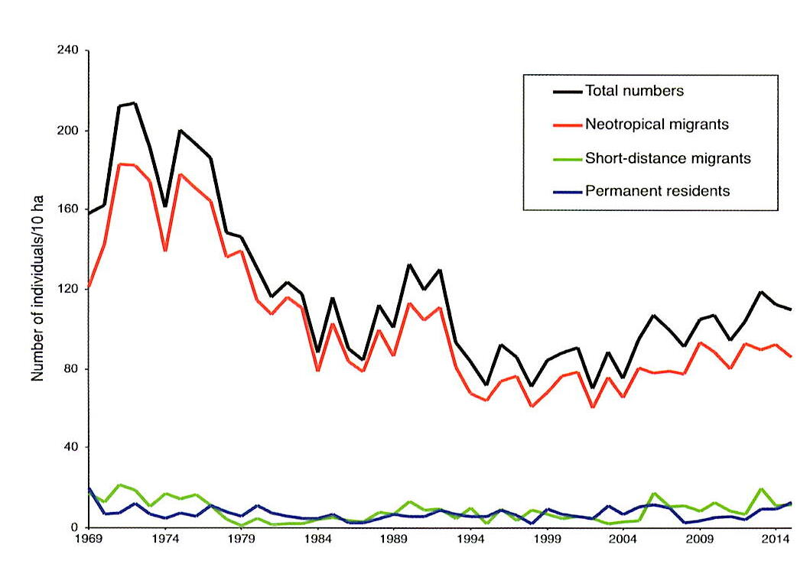
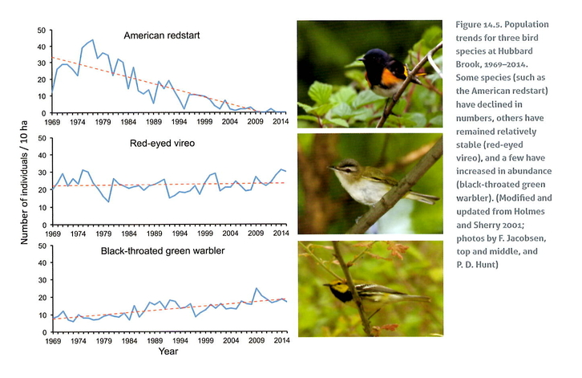
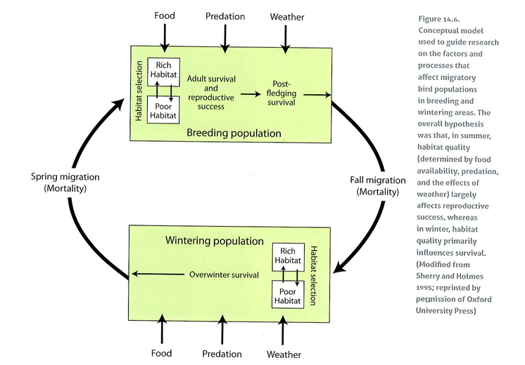
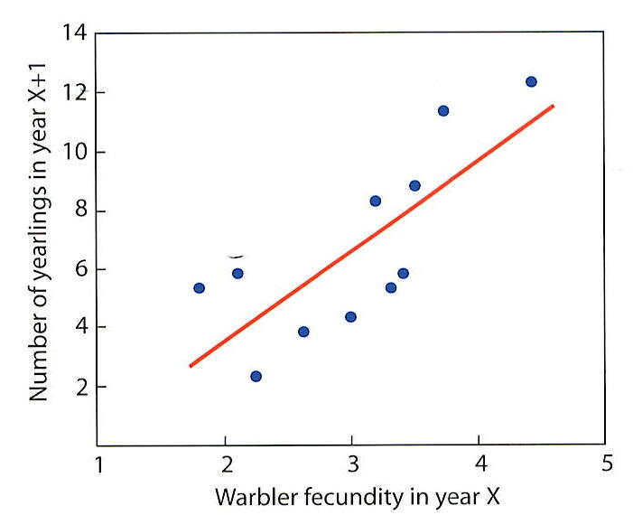
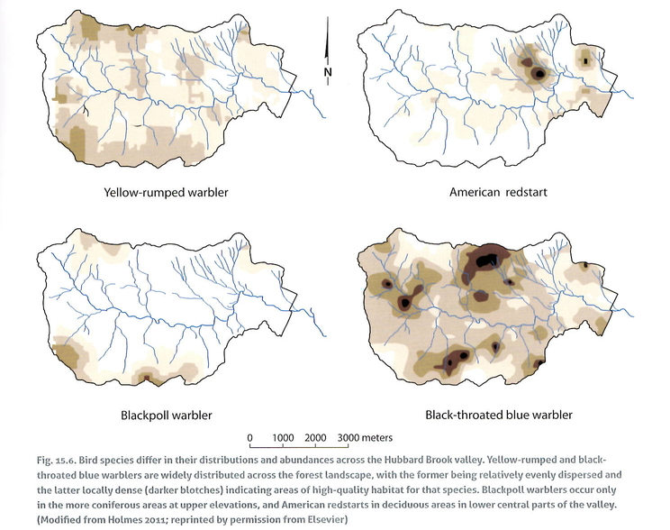
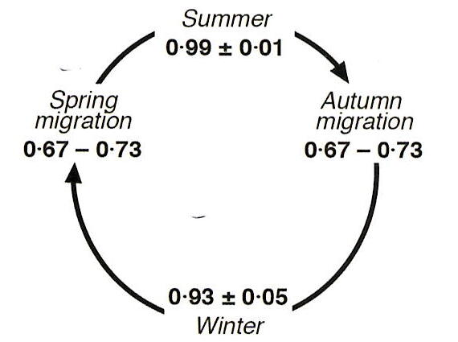

<video controls 
       style="width:80%; max-width:900px; display:block; margin:1.5rem auto;">
  <source src="https://photos.smugmug.com/Videos/Videos/i-gJLx4Bm/0/NJLj5jm72VVTcvST2whvCcLr2Vdw8CZpCDzhBB6Bt/1280/songbirdvideo-1280.mp4" type="video/mp4">
</video>

CAPTION

Chapter Editor(s): Timothy Fahey and Sara Kaiser

## Introduction

Most everyone would agree that birds are a fascinating and attractive group of organisms inhabiting northern hardwood forests. The colorful plumage of warblers and tanagers, the melodic songs of the thrushes and grosbeaks, the eerie calls of the owls and hawks, the low-speed aerobatics of hummingbirds, and the tap, tap, tap and thump, thump, thump of the woodpeckers and grouse have all inspired naturalists and scientists through the years to seek knowledge about the ecology and natural history of these flying creatures. At Hubbard Brook, Dr. Richard Holmes established a research program that has uncovered numerous general insights into the basic ecology of birds and an unparalleled depth of understanding of their population dynamics and species interactions in the forest ecosystem. This chapter primarily draws from a similar account found in the book volume by Holmes and Likens (2016), with species-specific details summarized in Holmes et al. (2020), and readers are directed to those references for additional information on the bird community and the long-term study of the black-throated blue warbler at Hubbard Brook.

## General Natural History of Birds

We begin with a general overview of birds and the bird community at Hubbard Brook to provide background for readers with limited familiarity with our feathered friends. Birds belong to the Class Aves, characterized as warm-blooded vertebrates with feathers, beaked jaws, hollow bones, and hard-shelled eggs laid outside the mother’s body. The bird community recorded at Hubbard Brook includes 135 species, which is slightly lower in terms of species richness compared to other familiar groups like vascular plants (258 species) and Lepidopteran insects (151) but much greater than mammals (41) and fish (13).

This diverse bird community can be categorized beyond its taxonomic status, providing useful information about the life history characteristics of different species, such as their time of occupancy and their feeding strategies or guilds. Only a few bird species are permanent residents of the Hubbard Brook valley, living there year-round (11 species, including woodpeckers, blue jays, and owls). Some species are autumn/winter visitors (7 species, mostly finches), while another seven are transient migrants during fall or spring. The largest group comprises migratory species (about 50) that arrive at Hubbard Brook in spring, breed, and depart during autumn. Most research on birds at Hubbard Brook has focused on migratory birds.

Bird species exhibit a range of strategies to obtain food and differ in their trophic status within forest food webs. A useful distinction is made between the brown (detrital) and green food webs; some birds primarily forage in the brown food web (e.g., thrushes, ovenbirds), while others forage in the green food web (e.g., warblers). Some birds search for food in the canopy, sub-canopy, or understory of the green food web. This differentiation affects which birds increase or decrease in abundance with changes in forest structure over time. Among the species that breed in the forest, four foraging groups or guilds are recognized: insectivores (34 species; e.g., warblers, vireos), herbivores (2 species; turkeys, grouse), sap or nectar feeders (2 species; hummingbirds, sapsuckers), and birds of prey (5 species; raptors). Niche differentiation within these guilds includes differences in where and how they search for food. For example, some insectivores find their prey in or on tree bark (e.g., nuthatches), while others search the foliage in different forest layers (e.g., most warblers). Lastly, among the winter visitors and transient migrants, many are seed eaters whose abundance varies markedly from year to year depending on the seed production of mast-producing trees, such as American beech and sugar maple (see Forest Composition and Dynamics in this volume).

The diverse group of migratory birds that breed at Hubbard Brook arrives in late spring when food resources, such as arthropods, become abundant. Although these birds employ various reproductive strategies, males of a species typically establish territories and defend their sites against competing conspecific neighbors. Most passerine bird species exhibit extraordinary site fidelity, returning to the same territory throughout their lives. Birds choose mates, construct nests, lay eggs, incubate the eggs, and care for the young. However, these birds are not necessarily monogamous, as extra-pair fertilization is common (Webster et al. 2001; Kaiser et al. 2015, 2017). Sometimes, a second clutch of eggs will be laid, depending on seasonal variations in weather and food availability, which affects annual fecundity (Townsend et al. 2013). Migratory birds fly south in early autumn to winter ranges, either relatively nearby in the central and southern USA (short-distance migrants) or in tropical regions such as the Caribbean and South America (long-distance or Neotropical migrants), where they can also exhibit strong site fidelity.

## Shifts in the Bird Community Over A Half Century

Upon establishing a research program at Hubbard Brook in 1969, Holmes had the foresight to recognize that understanding the role of birds in forest ecosystem dynamics required quantitative information on the abundance of each species in a representative forest area. Therefore, he first established an intensive monitoring program to measure, using a standardized census, the number of each bird species breeding in a permanent 10-ha study plot located west of the experimental watersheds on the south-facing slope of the Hubbard Brook valley. The data from this plot have become the foundation for subsequent observational and experimental studies of the bird community and represent one of the longest continuous and detailed records of forest bird populations and community trends in the world, now extending over 55 years.

The total number of adult birds on the 10-ha study plot during the core breeding season has varied, peaking at 214 in 1972 and dropping to a low of 71 in 2002 (@fig-breedbirdtrend). Despite considerable annual fluctuations, the bird population has remained relatively stable since the mid-1980s. Thus, the initial decline in bird abundance was a short-lived phenomenon. Furthermore, this decline was primarily driven by a few long-distance migratory species, including the American redstart, least flycatcher, and wood thrush, all of which have since disappeared from the 10-ha study plot. In contrast, other common species, such as the black-throated green warbler and red-eyed vireo, have increased in abundance through the years (@fig-3bird), while the populations of most species, like the black-throated blue warbler, have remained relatively stable (@tbl-birdabundance).

{#fig-breedbirdtrend}

{#fig-3bird}

 

| Declining              | More or less stable            | Increasing                     |
|-----------------------|-------------------------------|--------------------------------|
| Least flycatcher*     | Yellow-bellied sapsucker*     | Blue-headed vireo             |
| Wood thrush*          | Downy woodpecker              | Black-throated green warbler* |
| Veery*                | Hairy woodpecker              | Yellow-rumped warbler         |
| Philadelphia vireo*   | Winter wren                   | Ovenbird*                     |
| American redstart*    | Hermit thrush                 |                                |
|                       | Swainson’s thrush*            |                                |
|                       | Red-eyed vireo*               |                                |
|                       | Black-throated blue warbler*  |                                |
|                       | Blackburnian warbler*         |                                |
|                       | Scarlet tanager*              |                                |
|                       | Rose-breasted grosbeak*       |                                |
: *Trends in abundances of the most common bird species breeding at Hubbard Brook, 1969-2013.*
{#tbl-birdabundance}

These observations raise several important questions that deserve our attention: 1. Why have some species decreased while others remained stable or even increased? 2. What processes have maintained the long-term, stable populations of most species? and 3. What mechanisms contribute to the large annual fluctuations in the abundance of many bird species? To guide research aimed at gaining a better understanding of the population dynamics in the bird community, Holmes and colleagues developed a conceptual model for the ecology of migratory species on both their summer and wintering grounds (@bird-birdconcept; Sherry and Holmes 1995). The overall hypothesis was that in summer, habitat quality (determined by food availability, nest predation, and weather) influences reproductive output, whereas in winter, habitat quality primarily affects survival (Sherry and Holmes 1995; Holmes 2007). Studies conducted on the 10-ha study plot at Hubbard Brook and in forest habitats on the wintering grounds in Jamaica indicate that changes in forest structure in the breeding habitat, rather than the winter habitat, have played a primary role in driving trends in populations of migratory songbirds at Hubbard Brook.

{#fig-birdconcept}

Birds exhibit species-specific preferences for particular features of their habitats that influence their foraging and nesting success. The vertical and horizontal structure and composition of the forest are critical components of habitat quality for birds, affecting the suitability of the habitat for finding food and building safe nests. Over the 55 years of measurements in the bird study plot, the structure of the northern hardwood forest at Hubbard Brook has gradually changed. Hubbard Brook was heavily logged at the start of the 20th century, resulting in a largely 50- to 60-year-old forest stand featuring scattered older trees, a well-developed understory, and a continuous canopy. As the years progressed, the forest structure changed as older trees died, creating canopy gaps, and the understory vegetation changed markedly, including the emergence of a dense layer of American beech saplings. These changes in habitat structure reduced the suitability of the forest for species like the American redstart, wood thrush, and le

The overriding importance of breeding habitat quality in regulating migratory songbird populations emphasizes the key role of reproductive success in bird population dynamics. For example, the number of one-year-old individuals of several bird species on the 10-ha study plot is strongly correlated with reproductive success (fecundity—the number of young fledged per female) from the previous summer (@fig-fecundity; Sillett et al. 2000). This remains true despite the numerous hazards faced by birds during their long migration and extended stay on their wintering grounds.

{#fig-fecundity}

The location of the 10-ha study plot in the mid-elevation northern hardwood forest adjacent to the gaged watersheds at Hubbard Brook was designed to quantify the role of bird communities in the overall dynamics of the forest ecosystem (e.g., energetics, nutrient cycles) based on the small watershed approach (Holmes and Sturges 1973). However, how representative is this relatively small plot of the 3,160-ha Hubbard Brook valley or the surrounding White Mountain National Forest? On the one hand, the same temporal trends in bird abundance observed on the 10-ha study plot were noted in several other study plots monitored in the region by Holmes and colleagues. On the other hand, the 10-ha study plot includes only some of the distinct habitats found in the Hubbard Brook valley. For example, to supplement the observations from the 10-ha study plot, bird surveys have been conducted along valley-wide transects that cover the entire Hubbard Brook valley (@fig-birdmap); 66 species have been observed breeding across the valley, whereas only 22 species regularly breed in the 10-ha study plot (Doran and Holmes 2005). Although many species are widely distributed in the northern hardwood forest, some have more restricted habitat requirements, such as boreal forests (e.g., blackpoll warbler, Bicknell’s thrush) and areas near beaver ponds. The valley-wide bird surveys that are now conducted using autonomous recording units further inform these patterns (@fig-birdmap) and will prove valuable for exploring the changes in bird distributions accompanying climate change in the 21st century (Tatenhove et al. 2019).

{#fig-birdmap}

## Demography of Black-throated Blue Warblers at Hubbard Brook

Since reproduction is vital to the population dynamics of migratory songbirds, the question arises about what determines bird fecundity. However, identifying the factors that regulate bird abundance requires information on their reproductive success each season and their survival from one year to the next.

In the early 1980s, intensive demographic studies were initiated at Hubbard Brook, focusing on the American Redstart (AMRE), a species in decline, and the Black-throated Blue Warbler (BTBW), which was relatively stable. BTBW was chosen as a model organism because it is relatively abundant and nests in the forest understory, making observing and monitoring breeding activities easier. Adults can be reliably captured and uniquely marked, and their habitat can be experimentally manipulated. Only by banding and resighting all the individual birds in the study area can the balance between births and deaths that determine population trends be quantified. The bird research team has intensively monitored the BTBW for over 40 years. Additionally, experimental manipulations of food availability and observations of feeding behavior have further enhanced the understanding of controls on the population dynamics of this migratory songbird. Lastly, both the winter habitats in the Neotropics and the migration routes of the BTBW have been assessed to fill in the gaps in the complex story of the controls on its population demography (@fig-survival).

{#fig-survival}

Measurements of reproductive success for the BTBW at Hubbard Brook indicate that most annual variation in the number of young fledged is attributed to three factors: food abundance (also influenced by weather), predation, and the effects of local population density (Sillett and Holmes 2005). The primary reason most migratory songbirds move south in autumn is to avoid the harsh winter weather conditions and the lack of available food. For an insectivore like the BTBW, food availability varies markedly both seasonally and annually (Reynolds et al. 2007), often leading to food shortages that act as an important constraint on fecundity (Rodenhouse and Holmes 1992). In years with more abundant food, particularly larval Lepidopteran insects, more young birds are fledged, and experimental manipulations of caterpillar abundance have also shown strong effects on fecundity (Rodenhouse and Holmes 1992). Moreover, during years with abundant food, many birds produce a second clutch of eggs, increasing the number of young fledged (Nagy and Holmes 2005). The influence of weather on caterpillar abundance involves both local and intriguingly global scale weather patterns. Specifically, the well-known El Niño Southern Oscillation (ENSO) global weather cycle significantly influences spring and summer weather at Hubbard Brook, resulting in warm and wet conditions during La Niña years, and cooler, drier conditions during El Niño years. The latter conditions reduce caterpillar growth and abundance, resulting in BTBW to be less well fed and experience reduced fecundity compared to La Niña years (Townsend et al. 2015).

The role of nest predation in determining bird fecundity is well established for many species. At Hubbard Brook, 17 to 42% of BTBW nests are lost to predators each year. Rodents like chipmunks and red squirrels, and corvids such as blue jays, are the principal nest predators of BTBW and several other species that nest close to or on the ground. The complex interactions within the food web involving nest predation help explain an intriguing observation about annual variation in BTBW abundance: significant crashes in BTBW density have repeatedly followed two years after large masting events by American beech. The explanation is that, during mast years, rodent reproduction peaks, but in the absence of a large seed crop the following year, the abundant chipmunks rely on BTBW eggs as a food source, reducing fecundity and leading to a population decline in the subsequent year.

The third variable influencing the number of young fledged each year is the overall density of the breeding population. At Hubbard Brook, in years when the density of nesting pairs of BTBW is high, the females fledge fewer young that are lighter in weight and less likely to survive. This observation may be explained by the disruption of feeding and nest defense activities by the presence of nearby neighbors (Sillett et al. 2004). Such crowding effects indicate negative density dependence, reducing reproductive success when numbers are high and vice versa, so that population size tends to stabilize near a level determined by food availability and territory size (Sillett and Holmes 2005).

## Role of the Nonbreeding Season in Regulating Migratory Bird Abundance

Although our focus has been on the breeding season, most of a bird’s life is spent on their non-breeding grounds, and environmental and habitat conditions in those seasons clearly play a significant role in influencing bird demographics. For example, for bird species that reside year-round at Hubbard Brook, such as woodpeckers, nuthatches, and chickadees, harsh winter weather conditions can lead to high mortality rates, which help explain their generally low population sizes. The numbers of these birds commonly decrease following particularly severe or longer winter storms. For migratory species, the body condition of the birds, and consequently their survival and reproductive success, depends on habitat quality on their non-breeding grounds. Furthermore, migration poses risks, and mortality rates during both spring and fall migration routes are much higher than during their stationary periods. Lastly, environmental stresses or events in one season can have significant “carry-over” effects that influence survival and reproduction in subsequent seasons.

To better understand the role of the nonbreeding season in regulating the abundance of migratory songbirds at Hubbard Brook, Holmes and colleagues conducted a series of studies on two Neotropical migratory species, the Black-throated Blue Warbler (BTBW) and the American redstart (AMRE), on their wintering grounds in Jamaica. Although no banded birds from Hubbard Brook have ever been recovered in this winter range (nor vice versa), despite thousands of birds that have been banded, tracer studies of stable isotopes of hydrogen and carbon in feathers have identified the habitats used by different individual birds in Jamaica (Rubenstein et al. 2002). Along with assessments of habitat utilization and the demographics of banded birds on their non-breeding grounds (similar to those described earlier for Hubbard Brook), the research team has provided an exceptionally detailed account of the environmental factors affecting migratory birds during the non-breeding season.

BTBW and AMRE are widespread across Jamaica, inhabiting a diverse range of habitats that are very different from those at Hubbard Brook, including wet rainforests, mangrove swamps, and various agricultural lands (Johnson et al. 2006). The differences in preferred habitats between the two species are reflected in bird densities, with AMRE favoring coastal mangroves and BTBW preferring montane wet forests. Both birds are territorial, and surprisingly, just as noted for the breeding season, both species exhibit strong site fidelity, often returning to the same location and territory each year.

Detailed study of the demographics of these two migratory species in their non-breeding habitat has demonstrated two important discoveries about environmental factors that affect migratory birds outside the breeding season. First, it is evident that despite the generally mild climatic conditions in the wet tropics, food availability poses a limiting resource for these birds during winter. Defense of territory is a costly activity that can only be justified as a means to safeguard food resources from competing conspecifics. Additionally, the variation in bird abundance across habitats is linked to the presence of specific food resources (insects) within those habitats (Sherry and Holmes 1996). In fact, AMRE spends more time and effort foraging for food in Jamaica than at Hubbard Brook.

Second, the quality of winter habitat affects reproductive success in the subsequent summer (Marra et al. 1998). A key mechanism contributing to this effect is the observation that birds occupying more favorable winter habitats for their species arrive at the breeding habitat earlier in spring than those from less favorable habitats. Late-arriving individuals initiate breeding later and fledge fewer young. Therefore, the impact of habitat quality during winter can carry over from one part of a species’ annual cycle to another.

## Survival During Migratory Periods

Observations of the demography of migratory songbirds during their stationary periods indicate that survivorship is very high, exceeding 90%. Yet, the annual survivorship of these birds typically ranges from 40% to 60%. This suggests that migration can be quite hazardous, leading to much lower survivorship during migratory periods. However, prior to the detailed studies of bird demography in habitats on both the breeding and non-breeding grounds at Hubbard Brook and Jamaica, respectively, little quantitative information on bird mortality during migration was available. The site fidelity of these birds during stationary periods has enabled calculations of bird survivorship across all four seasons (breeding, overwintering, spring migration, and autumn migration; @bird-survival; Sillett and Holmes 2002). The hazards faced during migration include adverse weather conditions (severe storms, hurricanes), collisions with buildings, vehicles, communication towers, power lines, and turbines, predation by domestic cats, and the loss of suitable habitats for food and shelter along migratory stopover routes (Loss et al. 2014).

The condition of a bird at the start of its migration can also influence the likelihood of surviving this arduous journey. Therefore, mortality during migration may be influenced by events that affect individuals' health during stationary periods. Annual variations in rainfall, which determine insect abundance, have been shown to impact the body weight of AMRE over the winter in Jamaica. This factor, in turn, influences AMRE survival during migration (Marra et al. 2015). While the results from Hubbard Brook have expanded our understanding of the connections across seasons for migratory birds, they have only scratched the surface, and future advances are surely forthcoming.

## Responses to Climate Change

Climate change at Hubbard Brook is expected to affect the performance of many species, including birds. Indeed, the monitoring program at Hubbard Brook has already demonstrated that the climate is becoming warmer and, especially, wetter (see chapter on Climate Change in this volume). Naturally, the most straightforward response of highly mobile organisms like birds would be to shift their distributions farther north; however, the mechanisms driving such a response depend on the life history characteristics of the species. Since birds typically time their nesting activities to coincide with peak food availability, one potential mechanism of response could be the development of a mismatch between the timing of nesting behavior and the availability of their food supply (e.g., insects). Although studies in Europe have indicated decreases in the reproductive success of breeding birds due to such a mismatch (Visser et al. 2006), the extensive and detailed measurements at Hubbard Brook have not (yet) revealed a similar response (Lany et al. 2015). So far, birds like the BTBW have been able to adjust their breeding to coincide with annual variations in insect availability, thereby maximizing their reproductive success.

One way to evaluate how birds and their food supply respond to a warming climate is to leverage the climatic gradient associated with elevation across the Hubbard Brook valley. The annual average temperature decreases by approximately 2 °C along the 600-m elevation gradient on the south-facing slope. Researchers have found that the territories occupied by BTBW on the cooler upper slopes provide higher quality habitat, as evidenced by a greater abundance of food (insects), increased vegetation density, fewer predators, and higher overall abundance than sites located lower in the valley (Rodenhouse et al. 2009; @fig-birdmap). Moreover, BTBW in these higher-quality sites fledge more young and exhibit better survival rates compared to those in poorer low-elevation territories. As the climate continues to warm, we can anticipate the expansion of poorer quality habitat upslope, leading to a reduction in the extent of high-quality habitat and affecting the overall fecundity and abundance of BTBW in the Hubbard Brook valley. Consequently, the breeding range is likely to shift farther north. So far, evidence from valley-wide sampling of bird distributions indicates varied responses to climate change (Tatenhove et al. 2019). While the distribution of low-elevation species (e.g., BTBW, chickadee) has shifted upslope, high-elevation species (e.g., blackpoll warbler, dark-eyed junco) have not. The nature of the upslope shift for low-elevation species has varied, including downslope contraction, upslope expansion, or a total distributional shift.

## Questions for future study

* Will total bird abundance in the Hubbard Brook Valley remain roughly constant even in the face of climate change and forest disturbance?
* How does bird condition in winter range affect survival during spring migration?
* Why have birds at Hubbard Brook not suffered lower reproductive success associated with a mismatch between timing of high food abundance and breeding activity?
* What mechanisms explain the variation observed in the upslope shifts of various breeding bird species at Hubbard Brook?
References

## References

Doran, P. J., & Holmes, R. T. (2005). Habitat occupancy patterns of a forest dwelling songbird: causes and consequences. Canadian Journal of Zoology, 83(10), 1297-1305.

Holmes, R. T., & Likens, G. E. (2016). Hubbard Brook: the story of a forest ecosystem. Yale University Press.

Holmes, R. T. (2011). Avian population and community processes in forest ecosystems: Long-term research in the Hubbard Brook Experimental Forest. Forest Ecology and Management, 262(1), 20-32.

Holmes, R. T. (2007). Understanding population change in migratory songbirds: long‐term and experimental studies of Neotropical migrants in breeding and wintering areas. Ibis, 149, 2-13.

Holmes, R. T., & Sturges, F. W. (1973). Annual energy expenditure by the avifauna of a northern hardwoods ecosystem. Oikos, 24-29.

Johnson, M. D., Sherry, T. W., Holmes, R. T., & Marra, P. P. (2006). Assessing habitat quality for a migratory songbird wintering in natural and agricultural habitats. Conservation Biology, 20(5), 1433-1444.

Kaiser, S. A., L. E. Forg, A. N. Stillman, J. F. Deitsch, T. S. Sillett, and G. V. Clucas (2024). Black‐throated blue warblers ( Setophaga caerulescens ) exhibit diet flexibility and track seasonal changes in insect availability. Ecology and Evolution 14:e70340.

Kaiser, S. A., T. S. Sillett, B. B. Risk, and M. S. Webster (2015). Experimental food supplementation reveals habitat-dependent male reproductive investment in a migratory bird. Proceedings of the Royal Society of London B: Biological Sciences 282:20142523.

Kaiser, S. A., T. S. Sillett, and M. S. Webster (2014). Phenotypic plasticity in hormonal and behavioural responses to changes in resource conditions in a migratory songbird. Animal Behaviour 96:19–29.

Lany, N. K., Ayres, M. P., Stange, E. E., Sillett, T. S., Rodenhouse, N. L., & Holmes, R. T. (2016). Breeding timed to maximize reproductive success for a migratory songbird: the importance of phenological asynchrony. Oikos, 125(5), 656-666.

Marra, P. P., Studds, C. E., Wilson, S., Sillett, T. S., Sherry, T. W., & Holmes, R. T. (2015). Non-breeding season habitat quality mediates the strength of density-dependence for a migratory bird. Proceedings of the Royal Society B: Biological Sciences, 282(1811), 20150624.

Marra, P. P., Hobson, K. A., & Holmes, R. T. (1998). Linking winter and summer events in a migratory bird by using stable-carbon isotopes. Science, 282(5395), 1884-1886.

Nagy, L. R., & Holmes, R. T. (2005). Food limits annual fecundity of a migratory songbird: an experimental study. Ecology, 86(3), 675-681.

Reynolds, L. V., M. P. Ayres, T. G. Siccama, and R. T. Holmes (2007). Climatic effects on caterpillar fluctuations in northern hardwood forests. Can. J. For. Res 37:481–491.

Rodenhouse, N. L., Matthews, S. N., McFarland, K. P., Lambert, J. D., Iverson, L. R., Prasad, A., ... & Holmes, R. T. (2008). Potential effects of climate change on birds of the Northeast. Mitigation and adaptation strategies for global change, 13, 517-540.

Rodenhouse, N. L., & Holmes, R. T. (1992). Results of experimental and natural food reductions for breeding black‐throated blue warblers. Ecology, 73(1), 357-372.

Rubenstein, D. R., Chamberlain, C. P., Holmes, R. T., Ayres, M. P., Waldbauer, J. R., Graves, G. R., & Tuross, N. C. (2002). Linking breeding and wintering ranges of a migratory songbird using stable isotopes. Science, 295(5557), 1062-1065.

Sherry, T. W., & Holmes, R. T. (1995). Summer versus winter limitation of populations: what are the issues and what is the evidence. Ecology and Management of Neotropical Migratory Birds (TE Martin and DM Finch, Eds.). Oxford University Press, New York, 85-120.

Sherry, T. W., & Holmes, R. T. (1996). Winter habitat quality, population limitation, and conservation of Neotropical‐Nearctic migrant birds. Ecology, 77(1), 36-48.

Sherry, T. W., Wilson, S., Hunter, S., & Holmes, R. T. (2015). Impacts of nest predators and weather on reproductive success and population limitation in a long‐distance migratory songbird. Journal of avian biology, 46(6), 559-569.

Sillett, T. S., & Holmes, R. T. (2005). Long-term demographic trends, limiting factors, and the strength of density dependence in a breeding population of a migratory songbird. Birds of Two Worlds: The Ecology and Evolution of Temperate-Tropical Migration.

Sillett, T. S., Rodenhouse, N. L., & Holmes, R. T. (2004). Experimentally reducing neighbor density affects reproduction and behavior of a migratory songbird. Ecology, 85(9), 2467-2477.

Sillett, T. S., & Holmes, R. T. (2002). Variation in survivorship of a migratory songbird throughout its annual cycle. Journal of Animal Ecology, 71(2), 296-308.

Sillett, T. S., Holmes, R. T., & Sherry, T. W. (2000). Impacts of a global climate cycle on population dynamics of a migratory songbird. Science, 288(5473), 2040-2042.

Townsend, A. K., Cooch, E. G., Sillett, T. S., Rodenhouse, N. L., Holmes, R. T., & Webster, M. S. (2016). The interacting effects of food, spring temperature, and global climate cycles on population dynamics of a migratory songbird. Global Change Biology, 22(2), 544-555.

Townsend, A. K., T. S. Sillett, N. K. Lany, S. A. Kaiser, N. L. Rodenhouse, M. S. Webster, and R. T. Holmes (2013). Warm Springs, Early Lay Dates, and Double Brooding in a North American Migratory Songbird, the Black-Throated Blue Warbler. PLoS ONE 8:e59467.

Visser, M. E., Holleman, L. J., & Gienapp, P. (2006). Shifts in caterpillar biomass phenology due to climate change and its impact on the breeding biology of an insectivorous bird. Oecologia, 147, 164-172.