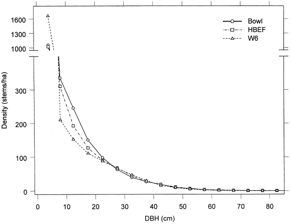
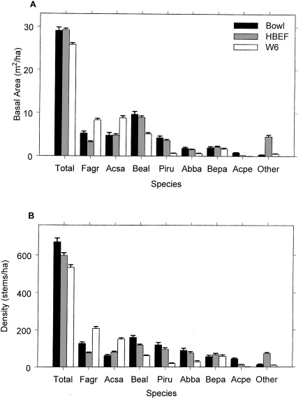
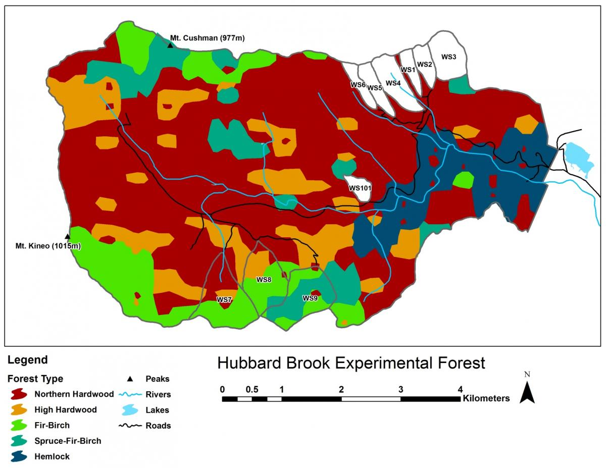
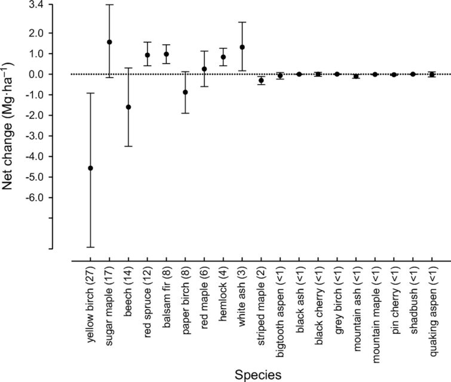
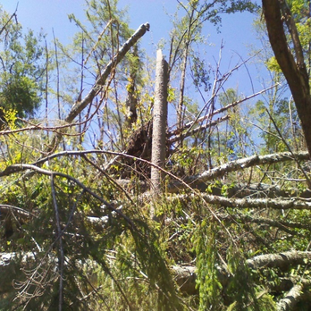
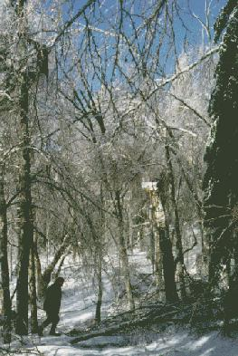
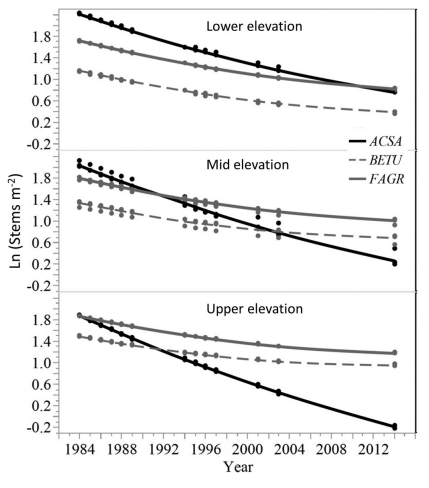
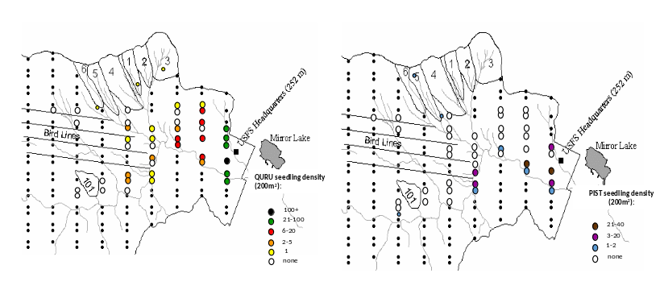

Chapter Editor: [John  Battles](https://hubbardbrook.org/people/john-battles/){target="_blank" rel="noopener"}

## Historical Overview

As originally conceived by @bormann1979, the Hubbard Brook landscape is dominated by northern hardwood forest which consists of a patchwork of stands of varying structure and composition that shifts through time, the “shifting-mosaic steady state.” The forest is dominated by three broadleaf deciduous tree species, sugar maple, yellow birch and American beech, with a mixture of several deciduous and evergreen conifer species. Above about 800 meters in the HB valley, subalpine forest of red spruce and balsam fir (and formerly mountain paper birch) is dominant, especially on thinner, less fertile soils.

The composition of the forest at Hubbard Brook has seen periods of relative stability interspersed with shifts owing to a variety of forces. These include climatic changes, natural disturbances such as pests and pathogens, and most recently human activity, especially logging in the 19th and 20th century. The Holocene forest vegetation history of the Hubbard Brook area has been reconstructed on the basis of sediment coring of Mirror Lake, located near the valley outlet (@fig-pollen; @davis1985). The area was deglaciated between 13-14,000 yr BP, and the climate soon warmed to resemble the modern climate. Spruce was the first tree species to invade post-glacial tundra around Mirror Lake and pollen data suggest that it spread widely through the HB valley by 11,000 yr BP. Fir, birch and Populus increased about 1,000 years later and spruce abundance subsequently declined. Thereafter, pine and oak became more abundant suggestive of a warmer climate 9-8,000 yr BP. By 7,000 yr BP, abundance of fir, pine and oak declined, while maple, beech and hemlock increased. Hemlock exhibited a sudden decline at about 5,000 yr BP that has been ascribed to an insect or pathogen, (but see @foster2006), and it then gradually recovered over a 1,000 year period. With that notable exception, and a resurgence in spruce abundance beginning about 2,000 yr BP, the forest composition in the HB valley was fairly stable after 6,000 yr BP until the arrival of Europeans in the 19th century. At the time of European settlement, the composition of the northern hardwood forest in the HB valley was comparable to the modern forest, being dominated by yellow birch, sugar maple and American beech; however, based on historical records [@chittenden1905] red spruce was more abundant and sugar maple less so in the pre-settlement forests of the White Mountains. Spruce was selectively logged from the HB valley in the late 19th century, reducing its abundance thereafter. Much of the HB valley was subsequently heavily logged during the first two decades of the 20thcentury and most of the modern forest stands date from this time period. An exceptional hurricane disturbance in 1938 blew down extensive areas of the south and east facing slopes and salvage logging following this event further opened the residual forest. Notably, the 1938 hurricane caused much less damage to younger stands that arose following early 20th century logging than older lightly cut areas of the forest [@peart1992]. In summary, the modern forest in the HB valley exhibits a complex age and size structure that varies spatially as a result of these historical large-scale disturbance events. However, despite this anthropogenic disturbance history the current structure and composition of the HB forest is similar to that of a virgin remnant forest at the Bowl Research National Area located about 30 km east of HB (@fig-sizeclass, @fig-basalarea; @schwarz2001, @martin1999).

![Pollen accumulation rates for pollen types in Mirror Lake [@davis1985].](figs/Composition/pollenComposition.s.png){#fig-pollen}

{#fig-sizeclass}

{#fig-basalarea}

## Modern Forest

A detailed picture of the current structure and composition of the second-growth forest at HB is provided on the basis of a valley-wide grid of 431 permanent plots. Overall, the size structure of the forest exhibits the usual “reverse-j” shaped curve typical of mature forests composed mostly of shade-tolerant species (@fig-sizeclass). Notably, sugar maple and beech are considerably more abundant and yellow birch and conifers less abundant in south-facing reference WS6 than for the entire HB valley.

Five principal forest vegetation types are distinguished within the HBEF (@fig-vegmap) including the core northern hardwood forest; a hemlock-hardwood type, restricted to the lower valley and; a high-elevation hardwood type, marked by the increased dominance of yellow birch relative to beech, the relative scarcity of sugar maple, and the inclusion of red spruce as a common species.

{#fig-vegmap}

At higher elevations, conifer dominated forests prevail with two distinct types: a spruce-fir-birch type and a fir-birch type (paper birch died out of the latter types during the early 21st century – see below). Early-successional forest stands are found on four small watersheds (WS2, 4, 5, 101) that were harvested experimentally between 1966 and 1984. On a valley-wide basis [@vandoorn2011], three tree species have exhibited declining biomass in recent years (yellow birch, American beech and paper birch) while five species have been increasing (sugar maple, red spruce, balsam fir, hemlock and white ash). The decline of American beech is a consequence of an introduced disease complex [@houston1975]; similar changes are anticipated in the near future for hemlock and white ash (see below).Trends in forest structure and composition are indicated by the key population parameters of mortality, growth and reproduction. Live tree biomass of the HB forest has been nearly constant in recent years, as losses in biomass owing to tree mortality (28.5 Mg/ha) have been balanced by gains from growth of surviving trees (24.2 Mg/ha) and recruitment into the \> 10 cm dbh class (2.8 Mg/ha). Losses from mortality on both a biomass and stem density basis have been greatest for yellow birch, the most abundant species in the HB valley. This trend probably reflects the age-structure of the yellow birch population that consists of veteran trees that pre-date 19th century logging and many individuals that regenerated after early 20th century logging and the 1938 hurricane. On a stem density basis balsam fir also exhibited high mortality, but these losses have been more than counterbalanced by high recruitment (@fig-demographic); fir also showed the highest relative growth rate of all tree species at HB. 

::: {style="float: right; width: 40%; margin-left: 1em;"}

![Demographic factors of dominant tree species in the Hubbard Brook Valley at the turn of the 21st century [@vandoorn2011].](figs/Composition/demographicFactors.png){#fig-demographic}

:::

Conversely, paper birch exhibited high mortality, low recruitment and the lowest growth rate of all tree species at the HBEF. This pattern signals a species in decline, reflecting in part senescence of a cohort originating from the large-scale disturbance in the early 20th century as well as possible stresses owing to ice storm damage and severe drought in recent years. The picture for paper birch is complicated by the fact that two species (*Betula papyrifera* and *B. cordifolia*) comprise the surveyed population, and future work comparing their dynamics is needed. 

The population of sugar maple, the second most abundant species at HB, appears to be near equilibrium on a valley-wide basis, with recruitment matching mortality on a density basis and growth exceeding mortality on a live biomass basis (@fig-annualnetchange). However, as discussed below, in some areas of the HB forest, especially in and around the experimental watersheds on the south facing slope (@fig-vegmap) sugar maple is clearly declining with high mortality and low reproduction. Moreover, at the stage of development of the HB forest, we would expect the relative abundance of sugar maple to be increasing on a valley-wide basis. Hence, sugar maple seems to be suffering from unexpected decline at HB. American beech is also declining throughout the HB valley, largely as a result of beech bark disease and losses from mortality greatly exceed growth. However, on a stem density basis, recruitment exceeds mortality, partly reflecting prolific vegetative sprouting from roots [@siccama2007]. Like sugar maple, red spruce is a population near steady state in the HB valley on both a biomass and stem density basis, despite clear evidence of its regional decline and susceptibility to damage resulting from soil base cation depletion by acid deposition [@adams1992]. Finally, although red maple appears to be increasing in abundance throughout most of its range in eastern North America [@abrams1998], this species shows no signs of expanding in the HB valley. Annual net change in aboveground biomass of 19 tree species across the entire Hubbard Brook Valley in first decade of 21st century. Error bars indicate 95% confidence intervals and numbers in parentheses are importance values.

{#fig-annualnetchange}

::: {#fig-basalareaTrends}

<iframe src="https://hbr-lter.github.io/OnlineBookGraphs/chapters/forest_composition/BasalArea-W1W6_Trends.html" width="100%" height="600" style="border: none;">
</iframe>

Thirty years of change in the relative dominance (proportion of total basal area) for three dominant tree species on reference watershed 6 and Ca-treated W1 based on 5-year surveys of all stems on the watershed. Error bars indicate 95% confidence intervals. This figure is updated with current data available in the Environmental Data Initiative Repository. Battles, J.J., T.J. Fahey, and N.L. Cleavitt. 2026. Hubbard Brook Experimental Forest: Watershed 1 Tree Inventory, 1996 - ongoing ver 1. Environmental Data Initiative. https://doi.org/10.6073/pasta/3d0031ea82d308f81ab26000a106b264 AND Battles, J.J., T.J. Fahey, N.L. Cleavitt, and T.G. Siccama. 2026. Hubbard Brook Experimental Forest: Watershed 6 Tree Inventory, 1965 - ongoing ver 1. Environmental Data Initiative. https://doi.org/10.6073/pasta/1aa4c3ad4c98ed151decc9ea7fa76694. Hover over graph to access interactive controls available at the top right (zoom/pan/etc). 

:::

Forest composition and its trends differ considerably between the south-facing experimental watersheds and the larger Hubbard Brook Valley. The relative dominance of sugar maple has been steadily declining on W6 since the 1980s (@fig-basalareaTrends). The fact that calcium remediation on W1 reversed this decline clearly implicates acid rain in this decline. Conversely, the relative dominance of American beech steadily increased until recently, reflecting in part reduced competition from sugar maple. The role of beech bark disease in mediating these patterns is complex, as explained in detail in the chapter [The Trouble with Beech](Beech.qmd). Note also that yellow birch is much less abundant in the experimental watersheds than the larger valley and shows no clear sign of decline, even most recently increasing on W6 perhaps responding to maple decline. 

## Tree Reproduction Ecology

The regeneration cycle of forest trees includes seed production and dispersal; seed dormancy, germination and establishment; understory tolerance and release and; vegetative reproduction. Most of these features are quite well understood in general for the dominant tree species in the HB valley. Pulsed seed production is observed for most trees, as illustrated for two of the three dominant trees at HB, sugar maple and American beech (@fig-seeddynamics). This behavior is interpreted as so-called “masting” for large-seeded species like beech, selected to satiate the mammalian seed predators that also serve as dispersal agents. The reasons for pulsed seed production of a tiny-seeded species like yellow birch is not conclusively known but could include greater efficiency of pollination. Dispersal limitation of HB tree species varies with the dispersal mechanism and typical dispersal distance of their seeds. At one extreme, the tiny, wind-dispersed seeds of birches exhibit little dispersal limitation in their spatial pattern [@schwarz2003]. In contrast, dispersal distance of beech seeds that rely on small mammals is usually limited to a few tens of meters, explaining the species limited regeneration by seed after large-scale disturbance (e.g., logging of WS2 and WS5 at HB; [@Hughes1988]. The importance of “safe-sites” for germination and establishment also varies with seed size, with tiny-seeded birches being restricted to exposed mineral soil or decaying logs where moisture retention is sufficient. Even on so-called safe sites, most germinants of all species soon die, often from damage by fungal pathogens and invertebrates such as slugs and insects [@cleavitt2011]. However, it only takes a small percentage of survivors to maintain a bank of seedlings in the forest understory [@marks1998], poised to take advantage of any disturbance to the canopy trees that will release them from severe competition and resource limitation.

::: {#fig-seeddynamics}

<iframe src="https://hbr-lter.github.io/OnlineBookGraphs/chapters/forest_composition/ACSA_FAGR_seeds.html" width="100%" height="600" style="border: none;">
</iframe>

Seed production for sugar maple (ASCA) and American beech (FAGR) at Hubbard Brook Experimental Forest, NH from 1993-2016. A-B: Bars show the annual mean for all collectors and asterisks denote mast years. The long-term mean is shown by a solid line. C-D: The standardized deviation of annual seed production from the long-term means (ASD). The dotted line shows the positive reflection of the minimum standardized deviate used to denote mast years as indicated in A. These data were first published in @cleavitt2017. This figure is updated with current data available in the Environmental Data Initiative Repository [@fahey2025]. Tree Seed Data at the Hubbard Brook Experimental Forest, 1993 - ongoing ver 4. Environmental Data Initiative. https://doi.org/10.6073/pasta/19e69d787124d60ccdfede1b5b813061). Hover over graph to access interactive controls available at the top right (zoom/pan/etc).

:::

A particularly intriguing regeneration strategy is exhibited by pin cherry, as studied in detail at HB [@marks1974; @thurston1992]. The seeds of this extremely shade-intolerant species can remain viable in a dormant seed bank in the soil for many decades. Pin cherry only germinates when a large canopy opening has occurred creating a change in enviromental conditions such as high light, soil temperature fluctuation and changes in soil nitrate. The seedlings grow very quickly in this high resource environment and soon begin flowering and fruiting, replenishing the seed bank. At HB the density of pin cherry in the seed bank apparently grew exponentially in response to the repeated disturbances in the late 19th and 20th century [@tierney1998].

All the deciduous trees in the HB forest are capable of vegetative reproduction by basal sprouting and some also by root sprouting (beech, aspen) and stem layering (striped maple). None of the conifers exhibit vegetative sprouting, although at higher elevations stem layering occurs in balsam fir. In theory, the role of vegetative reproduction is to allow a species to persist at a location when dispersal and genetic recombination are not possible. The competitive interaction between seedlings and sprouters varies depending upon species, site and canopy disturbance. At HB, American beech root sprouting is of particular interest: it reproduces mostly by root sprouting at higher elevations at HB, but seed reproduction is common on more favorable sites [@cleavitt2008]. Root sprouting is stimulated by damage to mother trees and their root systems [@jones1987] and prolific sprouting (“beech hell”) is observed across the HB valley. Some evidence suggests that this process has contributed to limited regeneration of sugar maple [@hane2003].

## Disturbance Ecology

The northern hardwood-conifer forest is dominated by shade tolerant tree species (sugar maple, beech, spruce, fir, hemlock) that rely on advanced regeneration of seedlings that persists beneath the closed forest canopy and are able to supply recruits when death of individual or small groups of overstory trees provide canopy gaps. However, intolerant (paper birch) and mid-tolerant species (yellow birch, white ash, red maple) also are abundant in the mature forest. Unlike many other North American forest regions, natural fires are uncommon in the northern hardwood region, with point return intervals exceeding approximately 3,000 years [@lorimer2003]. Thus, the dynamics of shifting-mosaic steady state forest [@bormann1979] depends on other causes of tree mortality. Based on the typical lifespans of the dominant species, in a forest where canopy recruits are derived primarily from death of individual trees through senescence, the point recurrence of canopy gaps would be a few hundred years. The prevalence of pit-and-mound micro-topography is suggestive of the important role of windstorms that causes tip-ups of large trees.

A variety of storms in the Northeast are capable of uprooting or snapping mature trees: hurricanes; extra-tropical cyclonic storms; tornadoes; and downbursts and other straight-line winds associated with thunderstorms that accompany strong cold fronts [@peterson2000]. @lorimer2003 concluded that point recurrence of large disturbances from windstorms exceeded 1,000 years for inland Northeast, considerably longer than for coastal areas visited more frequently by Atlantic hurricanes. Nevertheless, these intense windstorms can create gaps exceeding 0.1 ha and certainly provided plenty of opportunities for maintaining populations of intolerant and mid-tolerant species, as indicated by the high abundance of yellow birch even in the virgin forests at the Bowl and in Adirondack old-growth forests @martin1999]. At HB the legacy of the 1938 hurricane, as well as a recent downburst that created several gaps exceeding 1.0 ha in area, in and near HB (@fig-blowdownphoto), are emblematic of this role. In contrast, although a severe ice storm in 1998 caused widespread canopy damage at HB [@rhoads2002]; @fig-icedamagephoto), it provided only minimal regeneration and recruitment opportunities because resprouting in the damaged canopy returned the forest LAI to pre-disturbance levels within three years [@weeks2009]. Thus, ice storms, as well as unusual tree mortality resulting from species-specific pests and pathogens, can be considered diffuse disturbances that do not create large, discrete canopy gaps favoring less shade tolerant species. However, anticipated mortality of hemlock due to hemlock woolly adelgid infestation [@eschtruth2013] can be expected to create many large openings because it forms some nearly pure stands in the lower HB valley (@fig-vegmap).

{#fig-blowdownphoto}

{#fig-icedamagephoto}

## Human-Accelerated Environmental Change

Since the mid-20th century, the physical and biotic environment of the NE region has been rapidly changing. In particular, atmospheric CO~2~ concentration is increasing; the climate is getting warmer and wetter See [Climate Change chapter](ClimateChange.qmd). Atmospheric deposition of sulfuric acid increased to a peak in the 1970s and has declined since [@driscoll2001]; deposition of total nitrogen peaked at the turn of the century and has been declining recently [@lloret2016] and several exotic pests and pathogens have or soon will invade the forest.

The effects of acid deposition, and consequent depletion of soil base cations, has clearly impacted the health of the HB forest. Experimental restoration of soil Ca on WS1 ameliorated red spruce winter injury [@hawley2006], corrected canopy decline symptoms of sugar maple, and stimulated forest aboveground productivity @battles2014]. It also favored sugar maple seedling survival and growth [@juice2006]. Further striking evidence about the effects of soil calcium depletion on sugar maple is the virtual disappearance of this iconic species from the regrowing forest on W5 after the experimental whole-tree harvest in 1984. The removal of biomass significantly depleted soil base cations, most severely in the upper slope positions. In the thirty years following the harvest the relative abundance of sugar maple, originally the dominant species on the watershed, declined precipitously especially on the upper slopes [@cleavitt2018] (@fig-30yearsugarmaple. The broader response of forest composition to current reductions in acid and N loading will be difficult to detect in the face of many other changes, and the effects of atmospheric deposition of N on forest growth and health are not conclusively known, although recent evidence suggests a possible switch from N to P limitation of tree growth (Goswami et al., unpublished data)

{#fig-30yearsugarmaple}

Native insects have occasionally caused widespread defoliation at HB, but the effects of these pests on forest composition and structure are less profound than for exotic insects. Most notable to date has been the beech bark disease which first appeared at HB in the 1970s and has caused high mortality throughout the HB valley. A complex, ongoing response is anticipated as this insect-fungus disease complex has entered the aftermath phase [@houston1975], and prolific vegetative sprouts begin to dominate the canopy in many areas. In the immediate future, hemlock woolly adelgid and emerald ash borer are poised to invade HB in the next decade. Although neither hemlock nor white ash is among the most abundant species in the HB valley, their loss will cause some local re-sorting of forest structure and composition. Hemlock is a dominant species in the lower HB valley and its mortality is likely to facilitate the colonization of white pine and red oak (see below). White ash is locally abundant on richer soils, and we anticipate that its mortality will favor sugar maple.

Finally, the climate at HB is becoming gradually warmer and wetter, but the consequences of these changes are highly uncertain. For example, despite increased temperatures and growing season length at HB see [Climate Change chapter](ClimateChange.qmd) the two species that have exhibited the greatest increase in abundance in recent years are balsam fir and red spruce [@vandoorn2011], trees that would be predicted to recede to higher elevations in a warming climate. Some evidence also suggests that the striking decline of paper birch at HB may be linked to drought stress, even though annual average precipitation has increased by 20% since the mid-20th century; high temperatures and periodic summer droughts appear to contravene the precipitation trend. Nevertheless, we do see some clear signs of local climate warming as two species from warmer site are colonizing the HB valley, red oak and white pine (@fig-seedlingcolonization). Whether these species are successful at recruiting into the forest canopy will only be apparent in longer term, but the imminent decline of hemlock and white ash could be crucial to their success.

{#fig-seedlingcolonization}

## Questions for Further Study

* How will forest composition and structure respond to continuing climate change, especially increasing air temperature and summer precipitation?
* What was the role of large-scale natural disturbances (vs. single-tree replacement) in shaping the composition and structure of pre-Industrial northern hardwoods forests
* What species will replace white ash and hemlock following expected mass mortality?
* What factors facilitate the colonization of white pine and red oak in the lower valley?
* What differences characterize the demography and distribution of paper birch and mountain paper birch, and how does their recent mass mortality affect the dynamics of associated species?
* How will the continuing declines of the three dominant species – yellow birch, sugar maple, American beech – affect the future composition and structure of the HB forest?
* In the long-term how will the restoration of ecosystem calcium affect forest composition on WS1?
* Will base cation depletion resulting from whole-tree harvest of WS5 have significant effects on forest composition?

## Access Data

* Fahey, T. and N. Cleavitt. 2021. Tree Seed Data at the Hubbard Brook Experimental Forest, 1993 - present ver 2. Environmental Data Initiative. https://doi.org/10.6073/pasta/3d6b29aa80b150e5a9e28a839c05c211
* Battles, J.J., N. Cleavitt, and T. Fahey. 2022. Hubbard Brook Experimental Forest: Valleywide Plot Tree and Sapling Inventory – 1995, 2005, 2015 ver 6. Environmental Data Initiative. https://doi.org/10.6073/pasta/65b1f9e0111c189c68bc82083112fdeb
* Battles, J., N. Cleavitt, C. Johnson, S. Hamburg, T. Fahey, C. Driscoll, and G. Likens. 2019. Forest Inventory of a Northern Hardwood Forest: Watershed 6, 2017, Hubbard Brook Experimental Forest ver 1. Environmental Data Initiative. https://doi.org/10.6073/pasta/0593ba15fb76a4f085797126a1bea3a7
