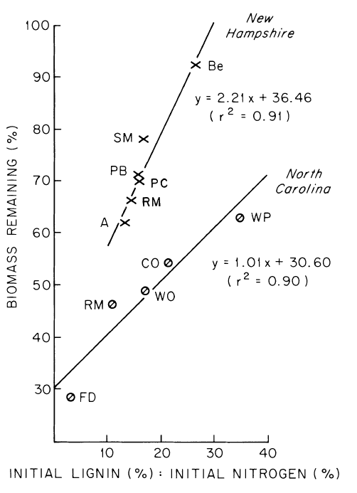
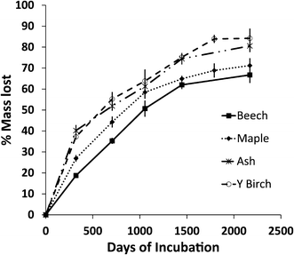

Chapter Editor: Timothy Fahey

<video controls 
       style="width:80%; max-width:900px; display:block; margin:1.5rem auto;">
  <source src="https://photos.smugmug.com/Videos/Videos/i-Xp58p5f/0/L7jWxJM6vT5qCKPpBR7jwR68hPn4bLLc4pvcKzD5p/1280/Christy%20Goodale%20talk_edited-1280.mp4" type="video/mp4">
</video>

Dr. Christy Goodale speaks about cross-site leaf litter decomposition studies that measure how beech leaves decompose in response to additions of calcium. Video filmed at the Throughfall low (also called “the Wedge”) site at the Hubbard Brook Experimental Forest on May 17, 2024.

## Introduction

Litter decomposition in forest ecosystems has been the subject of numerous studies, including several at Hubbard Brook (HB). Decay of aboveground litter is relatively easy to measure and interest in this topic originally revolved largely around ecological questions of mineral nutrient cycling. More recently the realization that forest soil is among the largest carbon pools on earth, and that changes in soil C stock could contribute to changes in atmospheric CO2 concentration, has further stimulated interest in decomposition and its sensitivity to human-accelerated environmental change. Here, we consider the linked processes of plant litter decomposition and soil C sequestration at HB.

An initial issue to address on this topic is the magnitude of the flux of different forms of litter in the HB forest: leaf and other non-woody aboveground litter, woody aboveground litter (mostly branches), dead boles, and fine and coarse woody roots. As detailed by Fahey et al. (2005) each of these sources of detritus constitutes a significant proportion of the total C input to forest soil at HB. In the mature northern hardwood forest adjacent to WS6 fine litterfall flux (comprised of about 88% leaf litter) averages 171 g C/m2-yr and is nearly constant from year-to-year in the absence of canopy disturbances. In contrast, coarse litterfall (mostly branches) is highly episodic, being associated with severe weather events (windstorms, ice storms, heavy snowfall); Fahey et al. (2005) estimated the long-term average at 20 g C/m2-yr. Even more variable, both temporally and spatially, is input of coarse woody debris associated with tree mortality. Based on long-term inventory in the forest west of WS6, this flux averages 120 g C/m2-yr (Siccama et al. 2007). Decomposition rates of these various aboveground detrital inputs differ considerably and their role in supplying soil C is not fully understood.

Carbon flux of belowground detritus is difficult to quantify directly. Two categories of root detritus are typically distinguished; the ephemeral fine roots of plants (< 1mm diameter) and the more permanent woody roots. Fahey et al. (2005) estimated C input to soil in the HB northern hardwood forest from fine and woody roots at about 90 and 40 g C/m2-yr, respectively, but they emphasized high uncertainty of both estimates. Using these estimates the ratio of aboveground to belowground detrital C input to soil at HB is roughly 1.6. However, rhizosphere C flux (RCF) is an additional large C input to soil and includes root exudation, rhizo-deposition and C allocation to extramatrical mycorrhizal fungal hyphae. This C flux is probably similar in magnitude to fine root mortality (Fahey et al. 2005). However, in this chapter we will not consider the decomposition of RCF.

Decomposition of organic matter has traditionally been represented as an exponential decay process (Olson 1963), analogous to decay of a radioactive isotope, i.e. (@eq-decay)

$$
X(t) = X (o) e-kt
$${#eq-decay}

Although other formulations sometimes show a better fit to decomposition studies – e.g., a two phase linear decay model – for comparative purposes, the exponential decay coefficient (k) is a convenient parameter. Also, the asymptote in the exponential decay of litter normally does not correspond to zero mass remaining; Berg et al. (1996) noted that decomposition approached a “limit value”, the remaining material being highly recalcitrant. This fraction may include some resistant polymers, especially by-products of microbial decomposition. It is reasonable to assume that some or most of the organic matter sequestered and stabilized in soil is represented by this apparently relatively recalcitrant fraction, although mechanisms other than biochemical resistance to decay contribute to soil C stabilization (Schmidt et al. 2011).

## Leaf Litter Decomposition

Gosz et al. (1973) measured dry weight loss and nutrient release from leaf litter of the three dominant northern hardwood species at HB over a one year period (@fig-LeafDecomp). Decay rate differed by species and decreased in the order of yellow birch, sugar maple, beech with corresponding k values of 0.85, 0.51 and 0.37. They noted that most of the difference between maple and beech was accounted for by greater leaching of soluble compounds from maple than beech leaf litter during the first month; thereafter, decay rates were similar for these two species. However, yellow birch decay following the leaching phase was much faster than beech and maple. Decay rates did not differ significantly across the elevation gradient from 550-770m. Similar patterns were observed at HB by Mellilo et al. (1982) although one-year decay rates were considerably lower (e.g., 0.08 for beech, and 0.25 for sugar maple).

::: {style="float: right; width: 40%; margin-left: 1em;"}

{#fig-LeafDecomp}
:::

The rate of decomposition of leaf litter depends upon environment, substrate chemistry and decomposer organisms. It seems likely that the contrasting decay rates of Gosz et al. (1973) and Mellilo et al. (1982) at HB resulted in part from environmental differences between the years of study. From their study at HB, Mellilo et al. (1982) concluded that the lignin to nitrogen concentration ratio provides an effective index of substrate quality for predicting early stages of leaf litter decay; high lignin:N is correlated with slow decay (@fig-LigNit).

Lignin is a polyphenolic polymer in plant cell walls that is resistant to decay, being decomposed primarily by oxidative enzymes such as phenol oxidase and peroxidases produced by white-rot fungi. Nitrogen is essential for microbial decomposers and is in relatively short supply in fresh leaf litter owing to efficient resorption of N from foliage prior to senescence (see Nitrogen Cycling chapter).
 
::: {style="float: left; width: 40%; margin-right: 1em;"}

{#fig-LigNit}
:::

The microbial decomposer community is highly diverse and complex, and the role of variation in microbial decomposers in determining leaf litter decay rate is not well understood. At the coarsest level fungi and bacteria are both dominant decomposers, but they are quite distinct in their physiological activity in the decay process (Waring 2013). Both groups produce extracellular enzymes that depolymerize the large biomolecules that contribute most of the mass of litter: cellulose, lignin, hemi-celluloses, proteins and fatty acids. Fungi have higher biomass C:N, broader enzymatic capabilities, slower biomass turnover rates and probably higher carbon-use efficiency than bacteria. In the low pH soils at HB, fungi are more abundant than bacteria and the high substrate C:N of leaf litter also favors fungi over bacteria. The litter decay process and the fate of litter C (and N) are influenced by this high fungal abundance.

Numerous soil invertebrates also play key roles in leaf litter decomposition. Mites and collembola (spring tails), the dominant soil microinvertebrates, are particularly abundant in the thick surface organic horizon (Fisk et al. 2006), but their role in litter decay is not well understood. Litter invertebrates are thought to play their principal role by shredding litter and thereby increasing surface:volume ratio (and decomposability) of the substrate, and through their feeding on microbial saprotrophs.

Most studies of leaf litter decay are terminated after 1-2 yr, but in terms of soil C sequestration longer-term dynamics are of particular interest. Lovett et al. (2016) quantified 6 yr of decay of the dominant hard wood species at HB (@fig-LeafLitterDecay). They observed the same order of decay as noted above: beech < maple < birch. Moreover, this order of decay was maintained through six years. The cumulative mass loss after 6 years ranged from 66% for beech to 80% for yellow birch yielding k values of 0.32 and 0.58 yr-1, respectively. In contrast, limit values, calculated from the asymptote of an exponential decay were more similar among species: roughly 20% of the initial mass of leaf litter appeared to be highly resistant to decomposition.

::: {style="float: right; width: 40%; margin-left: 1em;"}

{#fig-LeafLitterDecay}

:::

Leaf litter decomposition is expected to be sensitive to human-accelerated environmental changes because of its dependence on climate, substrate quality and decay organisms. Higher temperature and moisture would be expected to increase litter decomposition, especially during the growing season; however, any increase in the frequency of soil freezing owing to diminished snowpack might have the opposite effect, although current evidence is not conclusive (Christenson et al., in prep). One important change in substrate quality could be an increase in leaf litter N resulting from continued high atmospheric N addition, which can reduce foliar N resorption. In the early stages of decay higher substrate N should increase litter decay rates; however, the N addition response is complicated by apparent effect of exogenous N addition on litter decay: especially for lower substrate quality litter, decay rates may be suppressed (Knorr et al. 2005). Moreover, higher N is also correlated to less complete long-term litter decomposition (Berg et al. 2000), an effect that appears to coincide with N suppression of oxidative enzymes that degrade lignin (Weand et al. 2010). Soil acidification resulting from atmospheric deposition can also have an effect on leaf litter decay. Lovett et al. (2016) observed that restoration of soil Ca on WS1 at HB caused more complete decomposition of beech and maple litter, an effect that may contribute to decreased forest floor C content on the treated watershed.

Perhaps the most prominent biotic effect on litter decay is the colonization of northern forests by European and Asian earthworms. These non-native Annelida taxa can cause the complete disappearance of a leaf litter cohort within a year. Although much of this litter C remains partially decayed in soil, earthworm invasion clearly accelerates litter decay rate (Fahey et al. 2013). Exotic earthworms currently are restricted to only a few locations at HB (e.g., riparian forest) probably largely because of their intolerance of low pH soils.

## Fine Root Decomposition

Belowground, fine roots are analogous to leaves in terms of high tissue quality and rapid turnover. Avoiding methodological artifacts in measuring fine root decay is much more difficult than for leaf litter. Fine roots naturally die in the midst of a complex rhizosphere environment which is impossible to duplicate in a typical litter bag study. A few studies have shown that fine root decay rates in root litter bags are much slower than in situ rates (Dornbush et al. 2002) probably in part because the decomposer community is greatly altered (Li et al. 2015). Thus, literature conclusions about fine root decay, e.g. that fine roots decompose more slowly than leaf litter (Silver and Miya 2001), must be interpreted with caution.

At HB, Fahey et al. (1988) observed higher decay over 2 yr of 0.6-1 mm than <0.6 mm roots, a result that agrees with recent studies which attribute this difference to poorer substrate quality of the smallest fine roots (Goebel et al. 2011). Some observations of very rapid disappearance of fine roots in situ, using minirhizotrons and root screens (Tierney and Fahey 2001), suggest the possibility of much more rapid decay. Alternatively, these observations may reflect fine root herbivory, a topic that has received little study in forests (Wells et al. 2002). Differences in fine root decomposition among tree species also has received little study. At HB decay rates of 0.6-1 mm roots were similar between sugar maple, American beech and yellow birch (Fahey et al. 1988).

## Decomposition of Woody Substrates

As noted at the outset, woody litter comprises a large proportion of detrital input to soils in the HB forest; aboveground, branches contribute about 6-7% of total litterfall and boles of dead trees about 39%. Decomposition of branches in the form of logging slash was measured for two years following whole-tree harvest of WS5 at HB (J.W. Hughes, unpublished). Branch decay was not much different among the northern hardwood species, with k values ranging from 0.13 to 0.16, much lower than for leaf litter (0.32-0.58). By comparison, woody roots of similar diameter (2-10 cm) exhibited considerably slower decay than branches (k = 0.056 – 0.03; Fahey et al. 1988) and decay was consistently faster for maple than beech and birch. Fahey and Arthur (1994) noted exceptionally high variation in decay rates of woody roots, concurring with observations of bole wood decay at HB (Arthur et al. 1993, Johnson et al. 2014). We suspect that this variation in wood decay rates is attributed to the decay fungi that first colonize dead wood (Liu et al. 2013) because early colonizers often dominate the woody substrate to the exclusion of competitors. Thus, if the first colonizers are the white-rot fungi that are capable of very fast and complete decomposition of wood, then decay rates will be much faster than when slower brown-rot fungi are the first to colonize. Bole wood decay is slower than branches but similar to woody roots. At HB, Arthur et al. (1993) reported an overall k value for wood decay after clearfelling of WS2 of 0.096 yr-1. They noted the order of decay among northern hardwood species: beech > sugar maple > yellow birch. Johnson et al. (2014) measured decay rates of tree boles located beneath mature forest over a 16 year period. Their decay rates were similar to or slightly lower than observed by Arthur et al. (1993) but followed the same order by species: beech (0.097) > maple (0.079) > birch (0.065). No significant effect of bole diameter was detected over the range study (12-32 cm) owing in part to the high variation noted above.
Litter Decomposition and Soil C Sequestration

The sensitivity of litter decomposition to human-accelerated environmental changes raises questions about possible effects on soil C sequestration. The majority of the forest soil C stock is considered highly stable and hence probably insensitive to environmental change; nevertheless, the large pool of potentially labile C in upper soil horizons could respond to changing climate, soil fertility and exotic species invasions. Moreover, forest management activities could be designed to promote increased soil C sequestration as has been shown for agroecosystems.

Early conclusions that soil organic matter consists largely of highly recalcitrant components of plant detritus have been replaced by the understanding that most soil C is not inherently stable but rather protected from microbial enzyme degradation by physical forces in micro aggregates and in mineral-organic complexes (Schmidt et al. 2011). Moreover, most stabilized organic matter bears the biochemical signature of microbes rather than the original plant material from which it was derived. Also, current evidence indicates that belowground rather than aboveground detritus is the principal source of the majority of forest soil C (Matamala et al. 2003). These observations are important for understanding how soil C sequestration might respond to global change and forest management activities.

As noted earlier, Gosz et al. (1973) observed that a considerable proportion of leaf litter weight loss is associated with leaching of soluble organic matter in the early stages of decomposition. Most of this organic matter is retained within the soil profile by adsorption or precipitation on soil humic and mineral particles. Isotopic tracer studies in sugar maple forest indicate that most of this leached organic matter remains highly labile and is soon decomposed by soil microbes (Fahey et al. 2011); however, a small proportion likely is stabilized in mineral-organic complexes and micro aggregates. Some recent evidence indicates that dissolved organic matter is co-precipitated in the formation of secondary soil minerals, and hence may be stabilized within the mineral matrix (Lehmann et al, 2008). These processes are the subject of ongoing study of soil formation processes at HB.

Complex patterns of mobilization and retention of dissolved organic matter within the HB landscape have been revealed by studies of soil C distribution and soil solution and stream chemistry. Comparatively large amounts of DOC are generated in high-elevation conifer-dominated forest (Dittman et al. 2007). Retention of DOC occurs throughout the soil profile, but during wet periods considerable lateral flow mobilizes DOC in surface horizons and by-passes the spodic soil horizons, transporting soil C to the stream. The complexity of hydrologic flowpaths (see Hydrology chapter) can lead to considerable redistribution of soil C. For example, DOC generated in shallow bedrock-limited soils is transferred laterally and deposited in deeper soils in lower landscape positions. In the patchwork of perched water tables, soil C accumulates in part because of suppressed microbial activity owing to reducing conditions (Bailey et al. 2014). The net effect is considerable spatial variation in soil C pools (Table 1). Because the soil hydrologic processes that influence these patterns of soil C sequestration are sensitive to changing climate, we can anticipate possible responses to increasing precipitation and temperature in the 21st century but the nature of these responses remain highly uncertain.

::: {#fig-edidecompW6}

<iframe src="https://hbr-lter.github.io/OnlineBookGraphs/chapters/decomposition_carbon/ForestFloor_OrganicMatter.html" width="100%" height="600" style="border: none;">
</iframe>

Organic matter content of the surface organic horizons (Oie + Oa) on the reference watershed (WS6) at the Hubbard Brook Experimental Forest. Error bars indicate standard errors. (Fahey et al., 2005). This figure is updated with current data available in the Environmental Data Initiative Repository ( Johnson, C.E. 2024. Mass and Chemistry of Organic Horizons and Surface Mineral Soils on Watershed 6 at the Hubbard Brook Experimental Forest, 1976 - present ver 4. Environmental Data Initiative. https://doi.org/10.6073/pasta/ab29c15538e75cafd4a43a30d8033cec (Accessed 2024-04-11). Hover over graph to access interactive controls available at the top right (zoom/pan/etc).

:::

The acidic Spodosols that dominate the HB landscape are marked by thick forest floor organic horizons owing largely to limited mixing of detritus with mineral soil by macroinvertebrates (e.g., earthworms). This C pool comprises 19% of the total soil C stock in the HB forest. Early studies in and around HB indicated that C stocks in the organic horizons are highly dynamic, being sensitive to forest harvest with ca. 50% C loss over a decade after cutting (Dominski 1974, Covington 1981); however, subsequent work demonstrated that physical mixing processes into mineral soil probably accounted for most of this pattern, and forest floor organic layers may be much less dynamic than previously supposed (Yanai et al. 2003). Long-term monitoring of forest floor C pool in the mature forest at HB has supported the latter interpretation as no significant changes in this C pool were observed between 1977 and 2002 (@fig-organicmatterplotly).

However, most recently we have observed possible decline in the forest floor C stock in the mature forest at HB. Sensitivity of surface soil C to environmental change is further suggested by recent observations of sharp declines in WS1 where the soil Ca lost as a result of acid deposition was experimentally restored in 1999: an astounding 50% decline in forest floor organic C was observed between 1998 and 2014 (@fig-organicmatterplotly).

The cause of this striking response is not fully understood, but slight increases in long-term leaf litter decomposition (Lovett et al 2016) and decreased fine root inputs (Fahey et al. 2016) have likely contributed. These observations raise the possibility that depletion of soil Ca by acid rain caused an increase in soil C stocks so that deacidification in the 21st century may result in declining soil C sequestration in some temperate zone forests (Oulehle et al. 2011).

::: {#fig-organicmatterplotly}

<iframe src="https://hubbardbrook.github.io/decompCarbon/Fig5B_organicMatter.html" width="100%" height="600" style="border: none;">
</iframe>

Changes in organic matter content of forest floor horizons in reference (WS6) and calcium-amended (WS1) watersheds at Hubbard Brook Experimental Forest. This figure is updated with current data available in the Environmental Data Initiative Repository ( Johnson, C.E. 2022. Mass and Chemistry of Organic Horizons and Surface Mineral Soils on Watershed 1 at the Hubbard Brook Experimental Forest 1996-present ver 3. Environmental Data Initiative. https://doi.org/10.6073/pasta/7395cf86c134440f38d800ca59a4857b and Johnson, C.E. 2024. Mass and Chemistry of Organic Horizons and Surface Mineral Soils on Watershed 6 at the Hubbard Brook Experimental Forest, 1976 - present ver 4. Environmental Data Initiative. https://doi.org/10.6073/pasta/ab29c15538e75cafd4a43a30d8033cec (Accessed 2024-04-11). Hover over graph to access interactive controls available at the top right (zoom/pan/etc).
  
::: 

## Questions for Further Study

* What biotic and environmental factors cause high interannual variation in leaf litter decomposition?
* How does the community of microbial decomposers vary spatially and temporally? How does that variation influence litter decay?
* What is the true rate of decay of fine roots in situ in the soil, and what environmental and biotic factors influence fine root decay rates?
* What is the cause of the rapid loss of forest floor carbon during natural and experimental (WS1) deacidification of the soil?
* What are the principal sources of soil carbon deep in the soil profile?

## Access Data

    Lovett, G., M. Arthur, and K. Crowley. 2019. Effect of calcium addition on litter decomposition; data from reciprocal litter transplant experiment at Hubbard Brook, NH ver 1. Environmental Data Initiative.
    https://doi.org/10.6073/pasta/f69978b45f6cb5828a38ecaf56145f13
    Johnson, C.E. 2022. Mass and Chemistry of Organic Horizons and Surface Mineral Soils on Watershed 6 at the Hubbard Brook Experimental Forest, 1976 - present ver 3. Environmental Data Initiative.
    https://doi.org/10.6073/pasta/96ef3d45e9a7d719ae7731f0719bd483

## References

Arthur, M. A., Tritton, L. M., & Fahey, T. J. (1993). Dead bole mass and nutrients remaining 23 years after clear-felling of a northern hardwood forest. *Canadian Journal of Forest Research, 23*, 1298–1305. [https://doi.org/10.1139/x93-166](https://doi.org/10.1139/x93-166){target="_blank" rel="noopener"}

Bailey, S. W., Brousseau, P. A., McGuire, K. J., & Ross, D. S. (2014). Influence of landscape position and transient water table on soil development and carbon distribution in a steep, headwater catchment. *Geoderma, 226–227*, 279–289. [https://doi.org/10.1016/j.geoderma.2014.02.017](https://doi.org/10.1016/j.geoderma.2014.02.017){target="_blank" rel="noopener"}  

Berg, B., Johansson, M.-B., Ekbohm, G., McClaugherty, C., Rutigliano, F., & De Santo, A. V. (1996). Maximum decomposition limits of forest litter types: A synthesis. *Canadian Journal of Botany, 74*, 659–672. [https://doi.org/10.1139/b96-084](https://doi.org/10.1139/b96-084){target="_blank" rel="noopener"}  

Berg, B., Johansson, M.-B., & Meentemeyer, V. (2000). Litter decomposition in a transect of Norway spruce forests: Substrate quality and climate control. *Canadian Journal of Forest Research, 30*, 1136–1147. https://doi.org/10.1139/x00-04](https://doi.org/10.1139/x00-04){target="_blank" rel="noopener"}  

Covington, W. W. (1981). Changes in forest floor organic matter and nutrient content following clearcutting in northern hardwoods. *Ecology, 62*(1), 41–48. [https://doi.org/10.2307/1936666](https://doi.org/10.2307/1936666){target="_blank" rel="noopener"}  

Dittman, J. A., Driscoll, C. T., Groffman, P. M., & Fahey, T. J. (2007). Dynamics of nitrogen and dissolved organic carbon at the Hubbard Brook Experimental Forest. *Ecology, 88*, 1153–1166. [https://doi.org/10.1890/06-0834](https://doi.org/10.1890/06-0834){target="_blank" rel="noopener"}  

Dominski, A. S. (1974). Soil nitrate release from a clearcut watershed in the Hubbard Brook Forest, New Hampshire. Unpublished report, School of Forestry and Environmental Studies, Yale University.  

Dornbush, M. E., Isenhart, T. M., & Raich, J. W. (2002). Quantifying fine-root decomposition: An alternative to buried litterbags. *Ecology, 83*, 2985–2990. [https://doi.org/10.1890/0012-9658(2002)083%5B2985:QFRDAA%5D2.0.CO;2](https://doi.org/10.1890/0012-9658(2002)083%5B2985:QFRDAA%5D2.0.CO;2){target="_blank" rel="noopener"}  

Fahey, T. J., Yavitt, J. B., Sherman, R. E., Maerz, J. C., Groffman, P. M., Fisk, M. C., & Bohlen, P. (2013). Earthworm effects on the conversion of litter C and N into soil organic matter in a sugar maple forest. *Ecological Applications, 23*(5), 1185–1201. [https://doi.org/10.1890/12-1760.1](https://doi.org/10.1890/12-1760.1){target="_blank" rel="noopener"}  

Fahey, T. J., Siccama, T. G., Driscoll, C. T., Likens, G. E., Campbell, J., Johnson, C. E., Aber, J. D., Cole, J. J., Fisk, M. C., Groffman, P. M., Hamburg, S. P., Holmes, R. T., Schwarz, P. A., & Yanai, R. D. (2005). The biogeochemistry of carbon at Hubbard Brook. *Biogeochemistry, 75*, 109–176. [https://doi.org/10.1007/s10533-004-6321-y](https://doi.org/10.1007/s10533-004-6321-y){target="_blank" rel="noopener"}  

Fahey, T. J., Hughes, J. W., Pu, M., & Arthur, M. A. (1988). Root decomposition and nutrient flux following whole-tree harvest of northern hardwood forest. *Forest Science, 34*(3), 744–768. [https://doi.org/10.1093/forestscience/34.3.744](https://doi.org/10.1093/forestscience/34.3.744){target="_blank" rel="noopener"} 

Fahey, T. J., & Arthur, M. A. (1994). Further studies of root decomposition following harvest of a northern hardwood forest. *Forest Science, 40*(4), 618–629.  

Fahey, T. J., Heinz, A. K., Battles, J. J., Fisk, M. C., Driscoll, C. T., Blum, J. D., & Johnson, C. E. (2016). Fine root biomass declined in response to restoration of soil calcium in a northern hardwood forest. *Canadian Journal of Forest Research, 46*(5), 738–744. [https://doi.org/10.1139/cjfr-2015-0434](https://doi.org/10.1139/cjfr-2015-0434){target="_blank" rel="noopener"}  

Fahey, T. J., Yavitt, J. B., Sherman, R. E., Groffman, P. M., Fisk, M. C., & Maerz, J. C. (2011). Transport of carbon and nitrogen between litter and soil organic matter in a northern hardwood forest. *Ecosystems, 14*(2), 326–340. [https://doi.org/10.1007/s10021-011-9414-1](https://doi.org/10.1007/s10021-011-9414-1){target="_blank" rel="noopener"}  

Fisk, M. C., Kessler, W. R., Goodale, C. L., Fahey, T. J., Groffman, P. M., & Driscoll, C. T. (2006). Landscape variation in microarthropod response to calcium addition in a northern hardwood forest. *Pedobiologia, 50*, 69–78. [https://doi.org/10.1016/j.pedobi.2005.11.001](https://doi.org/10.1016/j.pedobi.2005.11.001){target="_blank" rel="noopener"}  

Goebel, M., Hobbie, S. E., Bulaj, B., Zadworny, M., Archibald, D. D., Oleksyn, J., Reich, P. B., & Eissenstat, D. M. (2011). Decomposition of the finest root branching orders: Linking belowground dynamics to fine-root function and structure. *Ecological Monographs, 81*, 89–102. [https://doi.org/10.1890/09-2390.1](https://doi.org/10.1890/09-2390.1){target="_blank" rel="noopener"}  

Gosz, J. R., Likens, G. E., & Bormann, F. H. (1973). Nutrient release from decomposing leaf and branch litter in the Hubbard Brook Forest, New Hampshire. *Ecological Monographs, 43*, 173–191. [https://doi.org/10.2307/1942193](https://doi.org/10.2307/1942193){target="_blank" rel="noopener"}  

Johnson, C. E., Siccama, T. G., Denny, E. G., Koppers, M. M., & Vogt, D. J. (2014). In situ decomposition of northern hardwood tree boles: Decay rates and nutrient dynamics in wood and bark. *Canadian Journal of Forest Research, 44*, 1515–1524. [https://doi.org/10.1139/cjfr-2014-0221](https://doi.org/10.1139/cjfr-2014-0221){target="_blank" rel="noopener"}  

Knorr, M., Frey, S. D., & Curtis, P. S. (2005). Nitrogen additions and litter decomposition: A meta-analysis. *Ecology, 86*(12), 3252–3257. [https://doi.org/10.1890/05-0150](https://doi.org/10.1890/05-0150){target="_blank" rel="noopener"}  

Lehmann, J., Solomon, D., Kinyangi, J., Dathe, L., Wirick, S., & Jacobsen, C. (2008). Spatial complexity of soil organic matter forms at nanometre scales. *Nature Geoscience, 1*, 238–242. [https://doi.org/10.1038/ngeo155](https://doi.org/10.1038/ngeo155){target="_blank" rel="noopener"}  

Li, A., Fahey, T. J., Pawlowska, T. E., Fisk, M. C., & Burtis, J. (2015). Fine root decomposition, nutrient mobilization and fungal communities in a pine forest ecosystem. *Soil Biology & Biochemistry, 83*, 76–83. [https://doi.org/10.1016/j.soilbio.2015.01.019](https://doi.org/10.1016/j.soilbio.2015.01.019){target="_blank" rel="noopener"}

Liu, W., Schaefer, D., Lu, Q., & Liu, X. (2013). What controls the variability of wood-decay rates? *Forest Ecology and Management, 310*, 623–631. [https://doi.org/10.1016/j.foreco.2013.09.013](https://doi.org/10.1016/j.foreco.2013.09.013){target="_blank" rel="noopener"}  

Lovett, G. M., Arthur, M. A., & Crowley, K. F. (2016). Effects of calcium on the rate and extent of litter decomposition in a northern hardwood forest. *Ecosystems, 19*(1), 87–97. [https://doi.org/10.1007/s10021-015-9919-0](https://doi.org/10.1007/s10021-015-9919-0){target="_blank" rel="noopener"}  

Matamala, R., Gonzalez-Meler, M. A., Jastrow, J. D., Norby, R. J., & Schlesinger, W. H. (2003). Impacts of fine root turnover on forest NPP and soil C sequestration potential. *Science, 302*(5649), 1385–1387. [https://doi.org/10.1126/science.1089543](https://doi.org/10.1126/science.1089543){target="_blank" rel="noopener"}  

Melillo, J. M., Aber, J. D., & Muratore, J. M. (1982). Nitrogen and lignin control of hardwood leaf litter decomposition dynamics. *Ecology, 63*, 621–626. [https://doi.org/10.2307/1936780](https://doi.org/10.2307/1936780){target="_blank" rel="noopener"}  

Olson, J. S. (1963). Energy storage and the balance of producers and decomposers in ecological systems. *Ecology, 44*, 322–331. [https://doi.org/10.2307/1932179](https://doi.org/10.2307/1932179){target="_blank" rel="noopener"}  

Oulehle, F., Evans, C. D., Hofmeister, J., Krejci, R., Tahovska, K., Persson, T., Cudlin, P., & Hruska, J. (2011). Major changes in forest carbon and nitrogen cycling caused by declining sulphur deposition. *Global Change Biology, 17*(10), 3115–3129. [https://doi.org/10.1111/j.1365-2486.2011.02468.x](https://doi.org/10.1111/j.1365-2486.2011.02468.x){target="_blank" rel="noopener"}  

Schmidt, M. W., Torn, M. S., Abiven, S., Dittmar, T., Guggenberger, G., Janssens, I. A., Kleber, M., Kögel-Knabner, I., Lehmann, J., Manning, D. A., & Nannipieri, P. (2011). Persistence of soil organic matter as an ecosystem property. *Nature, 478*(7367), 49–56. [https://doi.org/10.1038/nature10386](https://doi.org/10.1038/nature10386){target="_blank" rel="noopener"}  

Siccama, T. G., Fahey, T. J., Johnson, C. E., Sherry, T. W., Denny, E. G., Girdler, B., Likens, G. E., & Schwarz, P. A. (2007). Population and biomass dynamics of trees in a northern hardwood forest at Hubbard Brook. *Canadian Journal of Forest Research, 37*, 737–749. [https://doi.org/10.1139/X06-261](https://doi.org/10.1139/X06-261){target="_blank" rel="noopener"}  

Silver, W. L., & Miya, R. K. (2001). Global patterns in root decomposition: Comparisons of climate and litter quality effects. *Oecologia, 129*(3), 407–419. [https://doi.org/10.1007/s004420100740](https://doi.org/10.1007/s004420100740){target="_blank" rel="noopener"}  

Tierney, G. L., & Fahey, T. J. (2001). Evaluating minirhizotron estimates of fine root longevity and production in the forest floor of a temperate broadleaf forest. *Plant and Soil, 229*(2), 167–176. [https://doi.org/10.1023/A:1004829423160](https://doi.org/10.1023/A:1004829423160){target="_blank" rel="noopener"}  

Waring, B. G. (2013). Exploring relationships between enzyme activities and leaf litter decomposition in a wet tropical forest. *Soil Biology & Biochemistry, 64*, 89–95. [https://doi.org/10.1016/j.soilbio.2013.04.010](https://doi.org/10.1016/j.soilbio.2013.04.010){target="_blank" rel="noopener"}  

Weand, M. P., Arthur, M. A., Lovett, G. M., McCulley, R. L., & Weathers, K. C. (2010). Effects of tree species and N additions on forest floor microbial communities and extracellular enzyme activities. *Soil Biology & Biochemistry, 42*, 2161–2173. [https://doi.org/10.1016/j.soilbio.2010.08.012](https://doi.org/10.1016/j.soilbio.2010.08.012){target="_blank" rel="noopener"}  

Wells, C. E., Glenn, D. M., & Eissenstat, D. M. (2002). Soil insects alter fine root demography in peach (*Prunus persica*). *Plant, Cell & Environment, 25*, 431–439. [https://doi.org/10.1046/j.1365-3040.2002.00793.x](https://doi.org/10.1046/j.1365-3040.2002.00793.x){target="_blank" rel="noopener"}  

Yanai, R. D., Stehman, S. V., Arthur, M. A., Prescott, C. E., Friedland, A. J., Siccama, T. G., & Binkley, D. (2003). Detecting change in forest floor carbon. *Soil Science Society of America Journal, 67*(5), 1583–1593. [https://doi.org/10.2136/sssaj2003.1583](https://doi.org/10.2136/sssaj2003.1583){target="_blank" rel="noopener"}  
