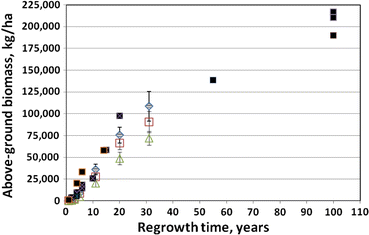
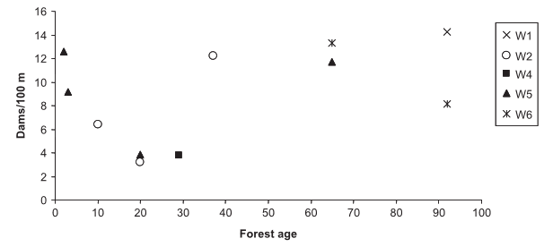
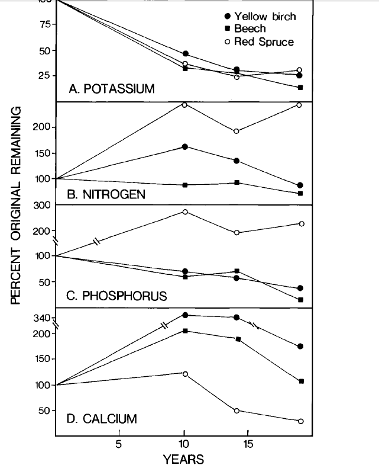
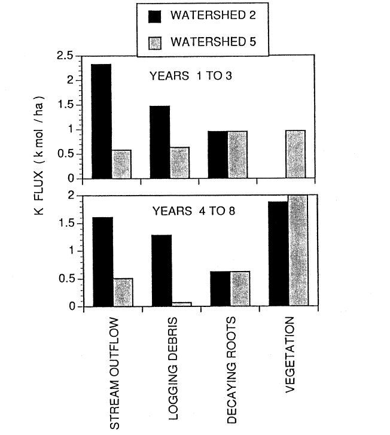
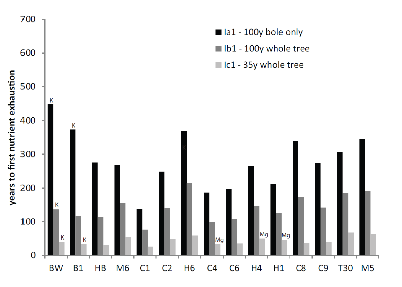
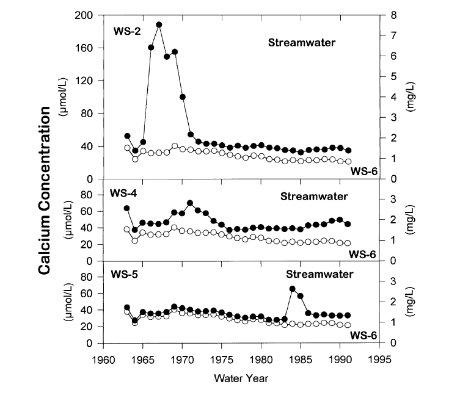
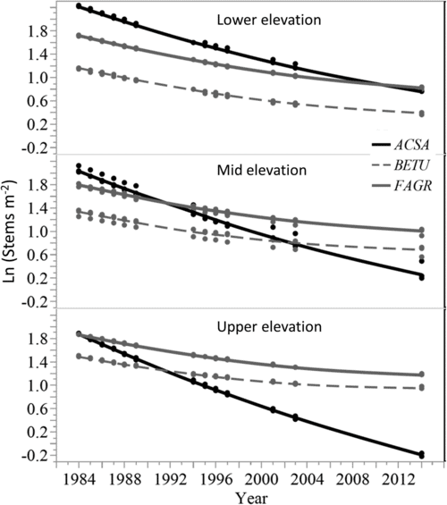

<video controls 
       style="width:80%; max-width:900px; display:block; margin:1.5rem auto;">
  <source src="https://photos.smugmug.com/Videos/Videos/i-2TZZK4R/0/LjpbMhXzrGNPhjnXZBrhHDpT3pVzJFmm2v3bJgvF9/1280/Tim%20Fahey%20talk-1280.mp4" type="video/mp4">
</video>

In this video, Dr. Timothy Fahey speaks about the whole-tree harvest which took place in Watershed 5 at the Hubbard Brook Experimental Forest in 1983-84. He describes how the study sought to answer questions about how whole-tree harvesting impacts the movement of carbon and nutrients through northern hardwood forest ecosystems. Video filmed on May 17, 2024. 

Chapter Editors: Timothy Fahey

The Hubbard Brook study was originally established to evaluate the influence of forests and forest management on the hydrology of montane forest catchments. (see Hydrology chapter for details). However, it soon became evident that other ecosystem parameters could be measured and compared among the different forest management treatments. The hydrology objective was expanded to include element cycling and water quality and today, forest management treatments are a key component of the ecological studies at HBES. @tbl-mgmtchap-watersheds includes a brief summary of the 10 delineated watersheds, duration of studies and overview of treatments (see Experimental Watersheds for full details on each).

| WS  | Initial Yr. | Treatment | Objectives |
|:---:|:-----------:|-----------|------------|
| 1   | 1956 | In October 1999 the Ca content of soil was increased through the application of wollastonite (CaSiO₃). | To evaluate the role of Ca supply in regulating the structure and function of base-poor forest and aquatic ecosystems |
| 2   | 1957 | Devegetated for three years, 1965–1967. Trees and shrubs were felled and herbicides applied to prevent regrowth. | To assess the ecosystem response to deforestation |
| 3   | 1957 | None | Watershed 3 is used as a hydrologic reference watershed |
| 4   | 1960 | Strip cut in phases (1970, 1972, 1974) in ~25 m swaths parallel to contours; merchantable material removed | To determine how strip cutting affects nutrient and hydrological cycling and regeneration |
| 5   | 1962 | Whole-tree harvest (1983–1984), removing ~180 t/ha biomass | To assess ecosystem response to whole-tree harvest |
| 6   | 1963 | None | Watershed 6 is used as a biogeochemical reference watershed |
| 7   | 1965 | None | Streamwater monitoring |
| 8   | 1968 | None | Streamwater monitoring |
| 9   | 1995 | None | Streamwater monitoring |
| 101 | 1970 | Stem-only block clearcut (Nov 1970); branches and tops left on site | To study effects of clearcutting on hydrology and nutrient cycling |s
: *Hubbard Brook watersheds.*
{#tbl-mgmtchap-watersheds}{tbl-colwidths="[10, 10, 40, 40]"}

In the process of quantifying water flux and nutrient cycles at the small watershed scale it was imperative to measure vegetation composition, structure and productivity and their responses to forest management. Thus, vegetation inventory and process studies were conducted in reference and treated watersheds (Bormann et al. 1970, Siccama et al. 1970, Reiners 1992). Although not designed explicitly to explore vegetation processes and their response to forest management activities, these early studies provided several important insights.

The important role of the buried-seed strategist, pin cherry, in the recovery of ecosystem processes on clear-cut sites was established by Marks (1974); this fast-growing species quickly establishes tight nutrient cycling and high production in the forest. Nevertheless, in the W2 experiment, where vegetation regrowth was inhibited for three years after clear-felling, and the density of pin cherry was greatly reduced compared with more typical clearcuts, the long-term trajectory of forest biomass accumulation was not much affected (Reiners et al. 2012; @fig-mgmtchap-regrowth).

{#fig-mgmtchap-regrowth}

The surprising resilience of forest vegetation production even in the face of extremely high site nutrient losses (see Forest Harvest and Base Cation Budgets, below) was also demonstrated by this long-term study on WS2. In fact, subsequent research has indicated the potential for suppression of growth of co-existing tree species when the pin cherry soil seed bank grows exponentially to very high densities following repeated harvest cycles (Tierney and Fahey 1998). Species supression could have negative effects on the economic sustainability of short-rotation forest cutting (Erikson et al. 1999).

Another insight into forest vegetation responses to forest harvest was provided by the WS4 experiment in which a forest watershed was progressively strip cut over a period of six years to evaluate effects on nutrient retention (see section below, Nitrogen and Base Cations in Streamwater). Scarification of the soil surface provided ideal conditions for germination and survival of yellow birch which is now the dominant species in the forty-year-old forest. This result reinforced observations of Marquis (1966) who suggested that strip cutting could favor birch reproduction in hardwood forests. The key role of disturbance of the soil surface (or lack thereof) during forest harvest was further demonstrated in the whole-tree harvest experiment on WS5: in the absence of physical disruption to pre-existing vegetation, clearcutting had little effect on the spatial patterns of understory vegetation (Hughes and Fahey 1991). This result helps to account for the minimal effect of clearcut harvest on plant diversity of cutover northern hardwood sites (Gove et al. 1992).

## Soil Erosion and Sedimentation

In addition to interest in hydrology, the managers who established the HBEF were concerned about forest management effects on soil erosion, water turbidity and sedimentation. Because of the coarse-textured and well-drained soils in the region, New England’s forests are not prone to high erosion rates (Bormann et al. 1974). However, disturbance to soils, especially scarification and compaction associated with the heavy equipment used in logging, can result in overland flow during intense rain and snowmelt events and with it, the potential for accelerated erosion rates. Research at HBEF has contributed to understanding the precautions that are needed to avoid such problems (Martin and Hornbeck 1994).

The long-term average background rate of sediment yield in reference, uncut watersheds at the HBEF averages about 25-50 kg/ha-yr, exclusive of suspended fine sediments which are difficult to quantify (Martin and Hornbeck 1994). Peak sediment yield in the deforestation experiment on WS2 was considerably higher (67-365 kg/ha-yr). Although no significant mechanical damage to the soil occurred in this experimental treatment, where the trees were felled and left in place, the inhibition of vegetation regrowth undoubtedly contributed to lack of soil binding by plant root systems. Thus, erosion peaked a few years after clear-felling as root systems decayed, pre-existing debris dams on streams were washed away and not replenished, and many stream banks failed (Martin and Hornbeck 1994).

In subsequent experiments on WS4, WS101 and WS5 standard logging practices were employed including precautions to control soil erosion despite the use of heavy equipment. Although stream sediment yield increased for about three years after harvest on WS5, cumulative erosion rates were only about twice as high as would be expected without logging. Thus, when forestry best management practices are employed, forest harvest, even in the rugged topography of the White Mountains, can be conducted without severe deterioration of stream water quality. However, the nature of stream habitats is inevitably affected unless forested buffer strips are retained along stream channels. Warren et al. (2007) observed a U-shaped distribution of debris dams on HB streams following forest harvest with a minimum dam frequency reached at 20-30 years post-harvest before recovering to precut values several decades later (@fig-mgmtchap-debrisdam).

{#fig-mgmtchap-debrisdam}

## Soil Organic Matter

Concerns about rising atmospheric CO2 and global climate change stimulated interest in the effects of forest management on soil carbon pools. Early chronosequence studies in and around the HBEF suggested that C stocks in forest floor organic horizons may be greatly reduced following clear-cut harvest before recovering over decadal time scales of forest regrowth (see Decomposition chapter). The presumed mechanism included more rapid decomposition and smaller inputs of plant detritus for several years following forest harvest. However, subsequent research indicated that loss of forest floor organic matter was overestimated in the chronosequences (Yanai et al. 2003), and only relatively small changes in forest floor mass actually occurred after clearcutting northern hardwoods. Direct measurements of changes in soil C pools following whole-tree harvest of WS5 indicated that in the first three years after cutting any decreases in soil C owing to rapid decomposition and reduced plant detrital inputs were counterbalanced by C inputs from residual biomass including roots and small branches and twigs. Moreover, mechanical disruption and mixing of forest floor into soil may have actually increased the C pool in mineral soil (Ryan et al. 1992). However, by eight years post-harvest, soil C pools in WS5 declined significantly (Johnson et al. 1995) before recovering to near pre-harvest levels by year 15. These observations illustrate the surprisingly dynamic nature of surface soil C in northern hardwood forest ecosystems.

Soil organic matter (SOM) serves a variety of roles that enhance soil fertility and quality, including influences on porosity and bulk density, water-holding capacity, pH and cation exchange, and labile nutrient pools (especially N and P). Following the WS5 forest harvest, cation exchange capacity (CEC) in mineral soils increased substantially and remained elevated for several years. This increase in CEC reflected changes in both the quantity and quality of SOM, as the charge properties of SOM were altered by the harvest. However, characterization of soil C in clear-cut and reference watersheds revealed no clear differences in the structural chemistry of SOM, and the explanation of the CEC effects remains unresolved (Dai et al. 2001).

## Mineralization of Residual Biomass

Element recycling from plant biomass left on site following forest harvest is a principal source of essential nutrients to re-growing vegetation. Detailed measurements of decomposition and nutrient mineralization of this residual biomass were conducted following the clearfelling of WS2 and the clear-cut harvest experiments on WS4 and WS5. This section focuses on patterns of mineral release; decomposition rates of wood and roots are described in the Decompositon and C Sequestration chapter.

Fourteen years after clearfelling of WS2 about 75% of initial bolewood biomass had decomposed, increasing to 89% by year 23 (Arthur et al. 1993). Although nutrient concentrations in decaying wood were not measured in year 14, chemical analysis of wood in various stages of decay in year 23 indicates that the rate of mineralization of macronutrients from residual woody biomass decreased in the following order:

$$
K > Ca = Mg > P > N
$${eq-macromin}

By year 23, the percentage of these macronutrients released from decaying wood were:

N=31% P=68% Ca=Mg=86% K=93%

Thus, for the principal base cations, mineralization from woody detritus is apparently an important source of base cation supply to recovering vegetation during the first and second decades, whereas this recycling is somewhat delayed for N and P. Notably, substantial amounts of fine roots colonize more highly decayed wood (Arthur et al. 1993)

The largest residual pool of nutrients following whole-tree harvest is the tree root systems. Decomposition rates of small roots are slower than for comparable sized twigs, whereas large woody roots decay more rapidly than branches (Fahey et al. 1988). The most striking difference in nutrient release rates between roots and aboveground detritus is the prolonged accumulation of N, P and especially Ca in roots (@fig-rootnut). Thus, except for K, element release from decaying roots is a smaller source of macronutrients than aboveground detritus for plant uptake, during the first decade after forest harvest.

{#fig-rootnut}

## Nitrate and Base Cations in Streamwater

Perhaps the most striking observation of the original deforestation experiment on WS2 at the HBEF was the extra-ordinary increase in stream nitrate concentrations. In the second year after clearfelling and inhibition of forest regrowth, nitrate concentrations in the WS2 streamwater were over 50-fold higher than in the reference WS6, despite substantially higher flow volumes! As detailed in the chapter on Nitrogen Cycling, the lack of plant root N uptake, combined with continued mineralization of soil organic N by the microbial community, generated NH4 that accumulated in soil and stimulated autotrophic nitrification (Bormann et al. 1968). Coincident increases in base cation concentrations in streamwater can be attributed to related processes: nitrification generates two moles of H+ for every mole of ammonium nitrified and the H+ exchanges for base cations on the soil cation exchange complex, mobilizing these cations as dissolved nitrate salts. Thus, the results of the WS2 experiment initially raised public concerns about possible consequences of forest clearcutting for site and surface water quality.

Subsequent studies were conducted in the HBEF to evaluate the responses to more typical forest harvest activities in which wood products are removed from the site and vegetation recovery commences immediately. Not surprisingly the block clearcut of WS101 and the progressive strip cut (with forested stream buffer strip) of WS4 resulted in much more modest increases in nutrient concentrations (Hornbeck et al. 1986). For example, nitrate-N outputs increased by about 50% for the strip-cutting and by 128% for the block clearcut, much lower than the deforestation study. Similarly base cation losses were elevated by standard clearcutting but to a lesser degree than for deforestation. Notably losses of K were promoted by clear-cutting to a greater extent than Ca (Hornbeck et al. 1986).

## Forest Harvest and Base Cation Budgets

The concern that repeated forest harvest could deplete soil nutrient supplies and depress forest production was first raised in the context of whole-tree harvest because removal of nutrient-rich tissues for woody biofuel markets could exacerbate losses from standard bole-only harvest (White 1974). Subsequent budgetary calculations based on observations from Hubbard Brook and other watershed research sites confirmed the legitimacy of such concerns (Mann et al. 1988). For example, Federer et al. (1989) suggested that the combined losses from leaching and wood product removal could potentially deplete the readily-weathered soil Ca pools on century time-scales.

In response to these concerns and to forest industry activities during the energy crisis of the 1970s, a whole-tree harvest experiment was conducted on WS5 at HBEF in winter 1983-1984. Nutrient budget calculations for the standard clear-cut experiments (WS4, WS101) at the HBEF indicate that losses of both Ca and K associated with wood product removals are slightly smaller than streamwater losses (@fig-mgmtchap-massbal).

{#fig-mgmtchap-massbal}

In contrast, although streamwater losses were slightly lower for the whole-tree than bole-only harvests, total losses of Ca and K were over twice as high for whole-tree harvest because of much greater removal in wood products (Likens et al. 1994, 1998). Thus, depletion of soil nutrient cations by intensive forest harvest practices seems possible. These mass-balance studies raise questions about the timing and sources of nutrient depletion of soils following harvest and the potential of soil mineral weathering to counteract these removals.

The comparative role of logging debris and decaying root systems to supply vegetation demand in the early years following forest cutting is illustrated by budgetary calculations for WS2 (clear-felling, dead biomass left in place and vegetation regrowth inhibited for three years) and WS5 (whole-tree harvest). Stream output of both Ca and K was about 5-fold higher in the first three years for WS2 than WS5, declining to about 3-fold higher from year 4-8 (@fig-kflux).

{#fig-kflux}

This accelerated leaching loss in years 1-3 for WS2 was attributed to both the lack of plant uptake and to mineralization of logging debris, the latter contributing considerably more than the former. In years 4-8 continued high losses of Ca and K on WS2 were associated mostly with release from logging debris. Because root systems decayed in place in both studies, they supplied similar amounts of nutrients to leaching losses and vegetation uptake. However, K was released from decaying roots and logging debris much faster than Ca (see above, Mineralization of Residual Biomass), contributing to higher re-supply to vegetation and presumably soil exchangeable pools.

The immediate (3 year) response of soil chemistry to the WS5 whole-tree harvest was a slight decline in base saturation and pH, but the accelerated leaching of nutrient cations did not result in significant depletion of exchangeable cation pools (Johnson et al. 1991). Despite continued accelerated leaching losses and rapid accumulation in re-growing forest vegetation, pools of exchangeable nutrient cations were maintained in WS5 through 8 years (Johnson et al. 1997) and even 20+ years of ecosystem development (@fig-exchca). Although in the early stages following harvest, recycling from residual plant detritus (logging slash and root systems) can explain the maintenance of exchangeable pools, in later years mass-balance calculations indicate that rapid weathering of primary minerals must play an important role in supplying vegetation regrowth.

{#fig-exchca}

A full accounting of the potential for intensified harvest to deplete soil nutrient pools needs to include both rotation length (time interval between harvests) and soil mineral weathering. Vadeboncouer et al. (2014) constructed nutrient budgets, at the rotation time scale, for three harvest intensities and 15 northern hardwood stands on glacial till derived soils in the White Mountains. They concluded that short-rotation forest harvest could rapidly deplete soil nutrient capital on some sites, but long-rotations are unlikely to induce soil nutrient deficiencies on century time scales (@fig-nutexhaustion).

{#fig-nutexhaustion}

These observations raise interesting and unresolved questions about mineral weathering rates in forest soils. For example, the prolonged acceleration of base cation losses by leaching from soils following harvest (@fig-streamca), despite rapid accumulation in re-growing vegetation, suggests that weathering rates have increased above their long-term average values (Yanai et al. 2005).

{#fig-streamca}

Perhaps biological acceleration of mineral weathering by mycorrhizae can mitigate soil nutrient depletion (Rosling et al. 2004). In any case, considerable uncertainty remains in understanding the implications of intensified and short-rotation forestry practices for the sustainability of forest production in northern hardwood ecosystems.

The combined effect of acid rain and forest harvest in depleting soil base cation pools and thereby affecting forest dynamics was starkly illustrated by the whole-tree harvest of WS5. As detailed in Ch 17, sugar maple is particularly sensitive to reductions in base saturation and exchangeable calcium. Although sugar maple was the dominant species on WS5 prior to harvest, and it was the most abundant species in the regenerating forest during the first several years after harvest, in subsequent years sugar maple exhibited a striking decline (Cleavitt et al. 2017; @fig-stemden). Particularly at mid and higher elevation sites in WS5, where soil Ca depletion was most severe, nearly all the sugar maple seedlings and saplings died between year 10 and 30 after harvest. Although competition with American beech undoubtedly contributed to this decline, even in locations with minimal competition from beech high maple mortality was observed. For forest managers a key lesson from this research is that even in places where sugar maple is abundant in advanced regeneration its success at stocking cut-over stands is not assured, especially on sites where soil base saturation is particularly low (e.g., less than 20%).

{#fig-stemden}

## Questions for Further Study.

* What is the role of ectomycorrhizal-induced mineral weathering in maintaining the supply of base cations and phosphorus during forest regrowth following intensive harvest?
* If the current “third-growth” forest on WS2, WS4, WS5 or WS101 was again intensively harvested? Would the recovering forest become acutely nutrient limited as a result of severe depletion of nutrient capital?
 What are the long-term effects of repeated forest harvest on the composition of the overstory and understory vegetation?
* What is the effect of repeated forest harvest on the total pool of carbon in vegetation, detritus and soil? Will intensive harvest for woody biofuels result in a net increase or decrease in greenhouse gas forcing of climate when all components of the harvest cycle are considered?

## References
Arthur, M. A., L. M. Tritton and T. J. Fahey. 1993. Dead bole mass and nutrients remaining 23 years after clear-felling of a northern hardwood forest. Canadian Journal of Forest Research 23:1298-1305.

Bormann, F. H., G. E. Likens, T. G. Siccama, R. S. Pierce and J. S. Eaton. 1974. The export of nutrients and recovery of stable conditions following deforestation at Hubbard Brook. Ecological Monographs 44:255–277. doi:10.2307/2937031.

Bormann, F. H., T. G. Siccama, G. E. Likens and R. H. Whittaker. 1970. The Hubbard Brook Ecosystem Study: composition and dynamics of the tree stratum. Ecological Monographs 40:373–388.

Bormann, F. H., G. E. Likens, D. W. Fisher, and R. S. Pierce. 1968. Nutrient loss accelerated by clear-cutting of a forest ecosystem. Science 159:882–884.

Cleavitt, N. L., Battles, J. J., Johnson, C. E., & Fahey, T. J. (2017). Long-term decline of sugar maple following forest harvest, Hubbard Brook Experimental Forest, New Hampshire. Canadian Journal of Forest Research, 48(1), 23-31.

Dai, K. H., C. E. Johnson and C. T. Driscoll. 2001. Organic matter chemistry and dynamics in clear-cut and unmanaged hardwood forest ecosystems. Biogeochem 54:51–83.

Erickson, J. D., D. Chapman, T. J. Fahey and M. Christ. 1999. Nonrenewability in forest rotations: Implications for economic and ecological sustainability. Ecological Economics 31(1):91-106.

Fahey, T. J., J. W. Hughes, M. Pu and M. A. Arthur. 1988. Root decomposition and nutrient flux following whole-tree harvest of northern hardwood forest. Forest Science 34:744-768.

Federer, C. A., J. W. Hornbeck, L. M. Tritton, C. W. Martin, R. S. Pierce and C. T. Smith. 1989. Long-term depletion of calcium and other nutrients in eastern US forests. Environmental Management 13:593-601.

Gove, J. H., C. W. Martin, G. P. Paul, D. S. Solomon and J. W. Hornbeck. 1992. Plant species diversity on even-aged harvests at the Hubbard Brook Experimental Forest: 10-year results. Canadian Journal of Forest Research 22(11):1800-1806.

Hornbeck, J. W., C. Martin, R. Pierce, F. Bormann, G. Likens and J. Eaton. 1986. Clearcutting northern hardwoods: Effects on hydrologic and nutrient ion budgets. Forest Science, 32:667-686.

Hughes, J. W. and T. J. Fahey. 1991. Colonization dynamics of herbs and shrubs in a disturbed northern hardwood forest. Journal of Ecology 79(3):605-616.

Johnson, C. E., R. B. Romanowicz and T.G. Siccama. 1997. Conservation of exchangeable cations after clear-cutting of a northern hardwood forest. Canadian Journal of Forest Research 27:859–868.

Johnson, C. E., C. T. Driscoll, T. J. Fahey, T. G. Siccama and J. W. Hughes. 1995. Carbon dynamics following clear-cutting of a northern hardwood forest ecosystem. pp. 463-488. In: J. M. Kelly and W. W. McFee (eds.). Carbon: Forms and Functions in Forest Soils. American Soc. of Agronomy, Madison, WI

Johnson, C. E., A. H. Johnson, T. G. Siccama. 1991. Whole-tree clear-cutting effects on exchangeable cations and soil acidity. Soil Science Society of America Journal. 55:502–508.

Likens, G. E., C. T. Driscoll, D. C. Buso, T. G. Siccama, C. E. Johnson, G. M. Lovett, D. F. Ryan, T. J. Fahey and W. A. Reiners. 1994. The biogeochemistry of potassium at Hubbard Brook. Biogeochemistry 25:61-125.

Likens, G. E., C. T. Driscoll, D. C. Buso, T. G. Siccama, C. E. Johnson, G. M. Lovett, T. J. Fahey, W. A. Reiners, D. F. Ryan, C. W. Martin and S. W. Bailey. 1998. The biogeochemistry of calcium at Hubbard Brook. Biogeochemistry, 41:89-173.

Mann, L. K., D. W. Johnson, D. C. West, D. W. Cole, J. W. Hornbeck, C. W. Martin, H. Riekerk, C. T. Smith, W. T. Swank, L. M. Tritton, and D. H. van Lear. 1988. Effects of whole-tree and stem-only clearcutting on postharvest hydrologic losses, nutrient capital, and regrowth. Forest Science 34:412–428.

Marks, P. L. 1974. The role of pin cherry (Prunus pensylvanica L.) in the maintenance of stability in northern hardwood ecosystems. Ecological Monographs 44:73–88.

Marquis, D. A. 1966. Germination and growth of paper birch and yellow birch in simulated strip cuttings. Research Paper NE-54. Upper Darby, PA: U. S. Department of Agriculture, Forest Service, Northeastern Forest Experiment Station. 19 p.

Martin, C. W. and J. W. Hornbeck. 1994. Logging in New England need not cause sedimentation of streams. Northern Journal of Applied Forestry 11:17–23.

Reiners, W. A. 1992. Twenty years of ecosystem reorganization following experimental deforestation and regrowth suppression. Ecological Monographs 62:503–523.

Reiners, W. A., K. L. Driese, T. J. Fahey and K. G. Gerow. 2012. Effects of three years of regrowth inhibition on the resilience of a clear-cut northern hardwood forest. Ecosystems 15:1351-1362. doi:10.1007/s10021-012-9589-0

Rosling, A., B. D. Lindahl and R.D. Finlay. 2004. Carbon allocation in intact mycorrhizal systems of Pinus sylvestris L. seedlings colonizing different mineral substrates. New Phytol 162:795–802.

Ryan, D. F., T. G. Huntington and C. W. Martin. 1992. Redistribution of soil nitrogen, carbon and organic matter by mechanical disturbance during whole-tree harvesting in northern hardwoods. Forest Ecology and Management 49:87-99.

Siccama, T. G., F. H. Bormann and G.E. Likens. 1970. The Hubbard Brook ecosystem study: productivity, nutrients, and phytosociology of the herbaceous layer. Ecological Monographs 40:389–402.

Tierney, G. L. and T. J. Fahey. 1998. Soil seed bank dynamics of pin cherry in northern hardwood forest, New Hampshire, USA. Canadian Journal of Forest Research 28:1471-1480.

Vadeboncoeur, M. A., S. P. Hamburg, R. D. Yanai and J. D. Blum. 2014. Rates of sustainable forest harvest depend on rotation length and weathering of soil minerals. Forest Ecology and Management. 318:194-205.

Warren, D. R., E. S. Bernhardt, R. O. Hall Jr. and G. E. Likens, G.E. 2007. Forest age, wood and nutrient dynamics in headwater streams of the Hubbard Brook Experimental Forest, NH. Earth Surface Processes and Landforms 32:1154-1163.

White, E. H. 1974. Whole-tree harvesting depletes soil nutrients. Canadian Journal of Forest Research 4:530–535.

Yanai, R. D., W. S. Currie amd C. L. Goodale. 2003. Soil carbon dynamics after forest harvest: an ecosystem paradigm reconsidered. Ecosystems 6(3):197-212.

Yanai, R. D., J. D. Blum, S. P. Hamburg, M. A. Arthur, C. A. Nezat and T. G. Siccama. 2005. New insights into calcium depletion in northeastern forests. Journal of Forestry. 103:14-20.