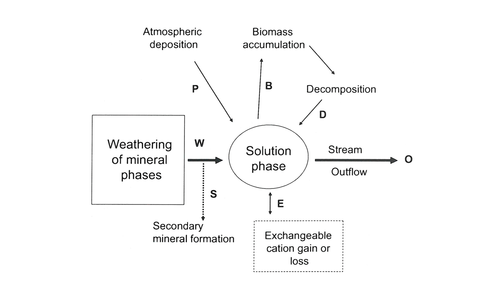
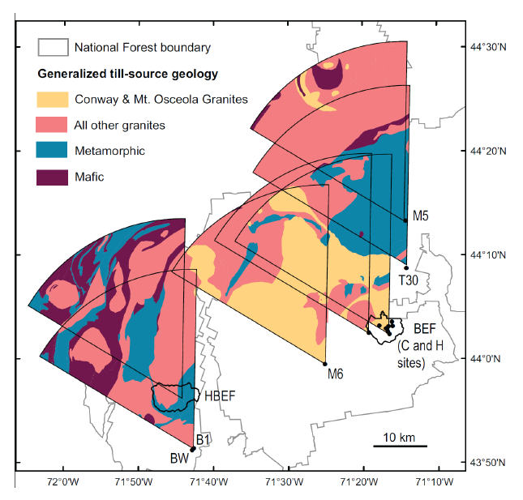
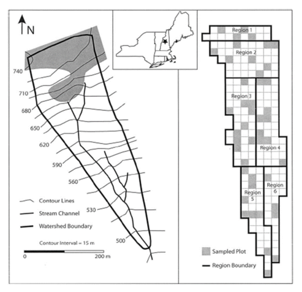
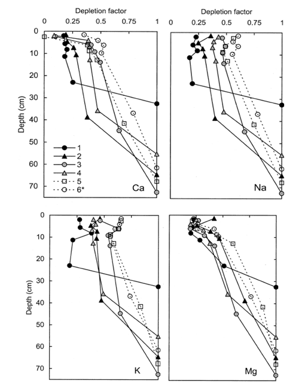
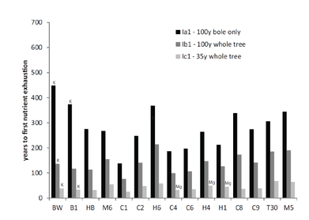

Chapter Editor: Timothy Fahey

Weathering is the breakdown of rocks and minerals which involves physical disintegration as well as chemical dissolution, processes which go hand in hand in soil development. In this chapter we concentrate on the chemical weathering of rocks and minerals in the Hubbard Brook landscape where the watershed mass-balance approach has facilitated estimation of present day weathering rates, as demonstrated in the Homework Exercises at the end of this volume. An excellent summary of the biotic concepts of weathering in a forest ecosystem context can be found in Cronan (2018, Ch. 7; see Fig. 1).

Chemical weathering of rocks and minerals is important to forest ecosystem dynamics because it is the principal source of several macronutrients required by the biota: Ca, Mg, K, P, Fe, Mn. Dissolution of these elements plays a key role in determining the chemical composition of soil, soil solutions and downstream ecosystems. As the principal source of the strong base cations, weathering serves to neutralize acids entering the forest by atmospheric deposition (see Acid Deposition chapter). In the long-term mineral weathering also influences global climate because weathering of silicate minerals consumes CO2 through the generation of bicarbonate alkalinity in streamwater (Berner et al. 1983). Weathering of silicate minerals in terrestrial ecosystems is critical to the supply of dissolved silica in riverine and eventually coastal and marine ecosystems where it is assimilated by diatoms and helps drive aquatic productivity. Research at Hubbard Brook has provided a variety of key insights into the process and measurement of chemical weathering which we summarize in this chapter.

First, some basic background on weathering and its measurement. The igneous and metamorphic rocks that comprise the parent material of the soils at Hubbard Brook and many, particularly montane, areas of the Northeast are comprised of a suite of silicate minerals such as quartz, feldspars and micas. The dissolution of these minerals by water constitutes the process of chemical weathering. The different silicate minerals exhibit highly varying (orders of magnitude) intrinsic rates of dissolution; thus, the weathering rate of rocks depends upon their mineral composition. Climate exerts an important influence on weathering both because of temperature dependence of chemical reactions and because precipitation influences hydrology and the movement of water and transport of solutes through the soil. Biological activity also regulates weathering rate both as a source of acidity that drives weathering reactions and through its influence on the chemical composition of the soil solution. The weathering rate in a soil decreases with soil age because the most easily weathered minerals are lost relatively soon after soil formation is initiated, leaving behind more slowly weathered, resistant minerals. Finally, topography exerts a strong influence on weathering rates primarily through its influence on erosion which removes more highly weathered surface particles and exposes fresh, unweathered surfaces to the forces driving chemical weathering; thus, weathering rates in mountainous terrain are much higher than in more gentle terrain, other factors being equal.

The weathering rate can be expressed either in terms of the total mass of rocks and primary minerals lost from the soil profile or in terms of particular elemental constituents, often the principal base cations Ca, Mg, K, Na expressed in units of moles of charge per unit area and time (molc/ha-yr). Because two of the principal constituents of most silicate minerals – Al and Si - are typically converted into secondary minerals (e.g., clay minerals) at rates that are difficult to determine, these elements are usually excluded from calculations of weathering rates though they may be useful indicators of the weathering process. Analysis of clay mineralogy of soils at Hubbard Brook has shown that kaolinite and vermiculite are formed as secondary minerals.

The two most common approaches for estimating weathering rates actually measure two distinct features of weathering. First, long-term average weathering rate in soils of known age, such as the glacially-derived soils of the Northeast (ca. 14,000 years old), can be estimated by quantifying the depth distribution in soil of the concentration of an immobile element present in the rocks, usually titanium or zirconium. Second, the current-day weathering rate can be estimated by the traditional small watershed mass-balance approach:

$$
Wi = Oi - Pi ± ΔBi
$$ {#eq-weatheringrate}

Where Wi is the annual weathering rate of element i; Oi is annual outflow of i from the watershed in stream discharge, Pi is annual precipitation input of i and ΔBi is annual change in the stock of i in vegetation (@fig-minweather_massbal). Actually this traditional formulation is more accurately termed “net soil release” because it assumes that soil is at “steady-state” and ignores changes in soil components that are difficult to quantify including exchangeable ions, secondary minerals and soil organic matter. The equation describing the full mass balance of the current annual denudation rate (Wi) would be:

$$
Wi = Oi - Pi ± ΔBi ± ΔSi ± ΔEi ± ΔSMi
$$ {#eq-massbal_denudation}

where Si is soil organic matter, Ei is the exchangeable pool, and SMi is secondary mineral pool. Research at Hubbard Brook has attempted to address this difficult biogeochemical problem in part because of its importance to acid rain effects on soil nutrient depletion. Note also that we would expect for a particular forested landscape that the long-term average weathering or denudation rate would exceed the current rate because as noted earlier the former reflects earlier, more rapid weathering of easily-weathered minerals in younger soils.

{#fig-minweather_massbal}

Over 50 yr ago Johnson et al. (1968) analyzed the dissolved base cation (Ca, Mg, K, N) budget that Likens et al. (1967) had calculated for the Hubbard Brook small watersheds to gain insights into the rates of chemical weathering in this forested ecosystem. They assumed near steady-state conditions in the ecosystem justified on the basis of three conditions: 1. Stream-water chemistry was relatively constant, indicating a continuous process of cation supply by weathering; 2. The northern hardwood forest is near steady-state biomass, accumulating cations at a slow rate in wood or soil humus; and 3. The mineral phase of the soil consists of locally-derived glacial till and bedrock, i.e. Kinsman formation granodiorite and Rangeley formation mica schist. Using the bulk chemical composition of these rocks, the net budgets of Na and Ca, and the concentrations of these elements in weathering products as indicated by the highly weathered soil E horizons, they calculated a current rock weathering rate of 400-1,000 kg/ha-yr. Assuming a long-term average rate since glaciation of 800 kg/ha-yr, then the rocks would be completely weathered to about 50 cm depth. Subsequent research has clarified and corrected this early work by accounting for changes in the cation stocks of biomass and soils as explained below.

{#fig-tillmap}

A more detailed view of the soil weathering process requires specific knowledge of the mineral composition of the soil parent materials. Hubbard Brook soils are formed in glacial till mostly derived locally from the two bedrock types in the Hubbard Brook valley. Bailey and Hornbeck (1992) used a till source mapping approach to predict the mineral composition of glacial till in the region (@fig-tillmap); this approach relies on knowledge of bedrock geology and direction of glacial ice movement and has proved quite accurate. As detailed later, this approach was applied by Vadeboncoeur et al. (2014) to project the time to exhaustion of soil base cation stocks under different conditions of soil lithology and harvest intensity in the White Mountain regions (see also Ch 5). At a local scale the mineral composition can be evaluated directly by sampling C horizons; Nezat et al. (2004) identified the minerals in polished thin sections of the fine fraction of soil C horizons collected throughout W1(see below). Bailey et al. (2003) evaluated the dominant lithologies of the glacial till in the six S-facing experimental watersheds by collecting pebbles from soil B and C horizons in several soil pits distributed across the landscape; as expected, they were mostly granodiorite and schist. Together, these samples support the conclusion that the principal primary minerals in the soil parent material in the experimental watersheds (W1-6) are plagioclase and feldspar with smaller amounts of biotite, hornblende and muscovite, and trace quantities of various other minerals including apatite. The chemical composition of these minerals is illustrated in Table 1.

| Mineral         | Abundance volume % | n  | CaO   | Fe₂O₃ | Al₂O₃ | SiO₂ | K₂O  | MgO   | Na₂O | TiO₂ |
|------------------|-------------------:|---:|-------|-------|-------|------|------|-------|------|-------|
| Plagioclase      | 27                 | 19 | 3.68  | <0.1  | 23.4  | 62.8 | 0.12 | <0.02 | 9.65 | <0.05 |
| Alkali feldspar  | 18                 | 5  | <0.03 | <0.1  | 19.3  | 64.3 | 15.4 | <0.02 | 0.94 | <0.05 |
| Biotite          | 3                  | 6  | 0.04  | 27.6  | 20.3  | 37.0 | 8.0  | 4.41  | 0.10 | 3.28 |
| Hornblende       | 1                  | 4  | 12.05 | 22.4  | 13.0  | 43.2 | 0.65 | 8.64  | 1.61 | 0.61 |
| Muscovite        | 4                  | 5  | <0.03 | 1.9   | 37.5  | 48.7 | 9.67 | 0.85  | 0.62 | 0.85 |
: **Abundance and bulk chemical composition of five principal minerals in glacial till on Watershed 1. From Nezat et al. (2004).**
{#tbl-chemcomp}

Nezat et al. (2004) used the soil depletion-titanium approach described earlier to estimate the long-term weathering rate of base cations on W1. They subdivided the catchment into six “regions” (@fig-w1map) to demonstrate patterns of variation in weathering rate and thereby to provide insights into the weathering process. They sampled soils by depth down to the C horizon and then completely digested sub-samples of seven soil horizons to quantify the total element content in each layer. They computed the depletion of base cations on the basis of changes in the concentration of Ti relative to unweathered parent material. This approach assumes that the underlying parent material was originally uniform in composition after glacial recession roughly 14,000 years BP, and that Ti is immobile in the soil profile. Thus, the loss of other constituents results in an increase in the solum Ti concentration so that a depletion factor (dx) for each element in a soil horizon (h) can be estimated:

$$
Dx,h = (xh/Tih)(xc/Tic)
$$ {#eq-depletionfactor}

where xh and xc (mmol/g) are concentrations of element x in the fine soil fraction from horizon h and from the C horizons, respectively; and Tih and Tic are corresponding concentrations of titanium (Nezat et al. 2004). As noted earlier, because the major mineral components, Si and Al, are significantly converted to secondary minerals, this method is not appropriate for estimating their weathering rate.

{#fig-w1map}

As expected, Ti concentration decreased with depth in all the W1 regions; this pattern is illustrated in @fig-titanium, normalizing the concentrations in each region against that in the C horizon. The resulting long-term weathering rate (14,000 yr) of the principal base cations, expressed in units of moles of ionic charge (molc) and averaged over the whole watershed, was estimated at 35 molc/m2-yr. Depletion factors for the four base cations illustrate that the soils in the upper elevation zones of the watershed were intensely depleted throughout the soil profile, whereas at lower elevations cation concentrations declined more gradually with depth (@fig-cation); for example, about 80% of Ca has been lost from each horizon at upper elevations in region 1 (@fig-w1map), compared to only 20-60% in the lower elevations (region 5 and 6). Thus, the weathering rate varied by about 2-fold across W1, with the highest rates in the spruce-fir zone at the top of the watershed and the lowest in low elevation regions 5 and 6. Nezat et al. (2004) speculated that the higher weathering in the upper elevation zone reflected the long-term predominance of conifer vegetation, as explored later.

![Titanium concentrations in the upper horizons normalized to the titanium concentrations of the C horizon. The numbers in the legend indicate the regions of W-1. Datapoints are plotted at the midpoint depth of each horizon (Oa, E, Bh, Bs1, Bs2) or the mean upper boundary of the horizon (horizon C). Approximate horizon boundaries are marked to the right of the graph. The ratios for Region 6* were calculated by substituting the watershed man of the C hrozon chemical composition for that of the C horizon in Region 6.](figs/weathering/Titanium_upperhorizon.png){#fig-titanium}

Besides basic interest as a fundamental process in terrestrial biogeochemistry, weathering has attracted scientific attention because of its key role in forest ecosystem responses to acid deposition (see Acid Deposition chapter). At Hubbard Brook, Johnson et al. (1981) explained the neutralization of acid rain in soil as a two-step process, 1) initial neutralization by reactive aluminum (ultimately derived from weathering) at the low soil pH levels typical of acid surface soils in this region (pH 4.7-5.2), followed by 2) neutralization of H+ and Al acidity by chemical weathering of base cations contained in the soil silicate minerals. As noted by Likens and Bormann (1993) the supply of H+ from external sources (acid deposition) and internal process (e.g. organic acids and carbon dioxide generated by biological activity) is entirely neutralized within the soil profile, thereby driving the weathering process. However, the outflow of base cations from the watershed in stream discharge includes both potential depletion of the exchangeable pool as well as current mineral weathering (Figure 1). Distinguishing between these sources is crucial both to understanding patterns and drivers of the weathering process and the effects of acid deposition and forest management activities on soil fertility. For example, what is the rate of recovery of soil base saturation from cation depletion during the acid rain era? And how much removal of base cations in forest harvest operations can soils tolerate without threats to forest ecosystem health? How do the answers to these questions depend upon the lithology of soil parent materials? Research in the Hubbard Brook Ecosystem Study has addressed these problems quantitatively.

Of particular interest has been the rate of weathering and soil depletion of calcium both because it is the most abundant base cation in the soil and because key biological components appear to be highly sensitive to reduced Ca supply and to the Ca:Al ratio in soils and surface water (Cronan and Grigal 1995). Federer et al. (1989) concluded that Ca is the nutrient most commonly exhausted from soil available pools by forest harvest and acid deposition in eastern North America. Bailey et al. (2003) took advantage of the long-term record of element fluxes at HBR and in particular the ecosystem Na:Ca ratio to distinguish soil depletion and weathering sources. This approach relies on the fact that Na storage in biomass, secondary minerals and cation exchange sites is minimal, so that net ecosystem losses are nearly equivalent to weathering flux (see Eq. 2, above). On this basis they showed that weathering fluxes are greater in two larger watershed with deeper soils at HBEF (W3, W4) perhaps because of greater soil-water contact time. They were able to constrain the Ca weathering flux in the experimental watersheds based on mineral chemistry and measured Na:Ca ratios to the range 54-132 mol/ha-yr. They also demonstrated conclusively the contribution of strong acid anion leaching of exchangeable Ca to long-term soil depletion. They concluded that although soil Ca depletion peaked in the early 1970s, the net depletion continued into the 21st century at reduced rates, indicating the need for additional vigilance in acid deposition control.

{#fig-cation}

An independent demonstration of the important contribution of depletion of exchangeable base cations to net soil release at HBR was provided in the aforementioned soil depletion analysis of Nezat et al. (2004). They took advantage of the measured long-term weathering rate based on soil Ti concentrations, together with a power law function relating long-term weathering rate to soil age (Taylor and Blum 1995) to show that measured net soil release of base cations from 1982-1992 (Johnson et al. 2000) for W6 greatly exceeded (ca. 9-fold) the estimated present day mineral weathering rate, clearly demonstrating the large contribution of soil base cation depletion to net soil release. Their analysis by region in W1 (Figure 3) also indicated that the difference between current-day weathering rates and net cation losses increases markedly downslope, being greatest in the deeper soils near the base of the watershed.

As noted earlier the soils at HBR, like most glacial till derived soils, contain a variety of lithologies and a complex mixture of primary minerals. The chemical composition and intrinsic resistance to weathering of the various minerals differ markedly. Thus, the supply of base cations like Ca to soil available pools by weathering varies with the lithology and mineralogy of the soil parent materials. Although the intrinsic resistance of various minerals to chemical weathering can be evaluated in lab studies with pure minerals, the actual rate of weathering of different minerals in soils must be inferred by indirect methods because most soils contain a complex mixture of minerals and the soil environment cannot be reproduced in the laboratory. Nezat et al. (2004) estimated the long-term weathering rate of the principal primary minerals in the C horizon parent materials on W1 (Table 1) using a geochemical mass-balance approach. Plagioclase, the 2nd most abundant mineral after quartz (SiO2) is the source of essentially all the net Na lost from W1; thus, based upon the long-term weathering rate and the elemental composition of this plagioclase (Table 1) and assuming congruent weathering to kaolinite, they estimated that about 70% of the Ca lost from the soil profile has come from plagioclase weathering; this mineral remains the principal source to the present day (Likens et al. 1998). Using net Na losses, Johnson et al. (2000) showed that current-day plagioclase weathering rates are much higher in the deeper, less-weathered soils at the base of the watersheds than in the depleted upper-elevation zones. This spatial pattern of weathering is consistent with soil solution chemistry which shows higher concentrations of calcium and other base cations in soil solutions at lower elevations than at higher elevations (@fig-calciumphdoc a).

Although present in only trace quantities in the rocks, the Ca-rich mineral, apatite, is a significant source of Ca weathering in the HBR soils. Small crystals of apatite are included in feldspars and quartz and this mineral when exposed to weathering forces dissolves much more rapidly than Na-rich plagioclase. Blum et al. (2002) estimated that apatite contains a least 12% of the Ca content of the soil parent material in W1. Because apatite is also the principal mineral source of P in these soils, the contribution of apatite weathering to Ca supply can be constrained based upon measured soil depletion of P and the Ca:P stoichiometry of apatite. On this basis, Nezat et al. (2004) indicated that apatite is the second largest source of Ca lost from the soils in W1 and together with plagioclase has contributed nearly 90% of Ca loss from soils. An additional 8% can be attributed to weathering of hornblende which is present in small amounts in soils (Table 1) and weathers at a similar rate to plagioclase. The other common minerals in the W1 soils are K-feldspar (18% by volume) and biotite (3%) which are the principal weathering sources of K and Mg, respectively. The latter mineral also is a significant source of K loss, apparently accounting for about 20% of the long-term weathering loss.

As noted earlier, rates of mineral weathering at HBR are higher in the upper elevation zones where conifer forests dominate. Conifers may enhance weathering in several ways. First, they produce more acid surface soils than hardwoods which promote high weathering rates. This spatial variation in acidity is illustrated in the depth and spatial pattern of soil solution pH (@fig-calciumphdoc b). Soil solution pH is lowest in organic horizons at the high elevation spruce-fir zone at Hubbard Brook and increases at greater soil depth and at lower elevations. Second, soil solutions in conifer forests contain higher concentrations of dissolved organic carbon and organic acids (Dittman et al. 2007; Fakhraei and Driscoll 2015; @fig-calciumphdoc c) which may contribute to more intense weathering of feldspar and plagioclase at the top of the watershed (Hogan and Blum 2003). Also note that the partial pressure of carbon dioxide in Hubbard Brook soil is more than an order of magnitude greater than atmospheric values (Fakhraei and Driscoll 2015). Production of carbon dioxide from root and microbial respiration also enhances weathering. Third, essentially all the trees in this zone are ectomycorrhizal (spruce-fir-birch) and exude low molecular weight organic acids (such as citrate) that can enhance weathering of certain minerals, including hornblende and apatite (Blum et al. 2002). It also has been suggested that ectomycorrhizal fungi promote the weathering of apatite to gain access to P in soil primary minerals. Although ectomycorrhizal tree species (e.g., beech, birch) are also common at lower elevations at HBR, arbuscular mycorrhizal species are abundant as well (maples, ash). The importance of this difference in mycorrhizal associations has been called into question, however, by empirical studies of Remiszewski et al. (2016) at HBR. They evaluated short-term weathering rates using mineral-containing soil bags incubated in situ in groves of arbuscular (maple) and ectomycorrhizal trees (beech, birch). Although they observed indications of enhanced weathering in the presence of fungal hyphae there was no clear evidence for higher rates for ecto than arbuscular mycorrhizal trees. It seems possible that both types of mycorrhizae are directly involved in mineral weathering.

{#fig-calciumphdoc}

{#fig-nutdep}

A regional perspective on soil weathering and its implications for soil nutrient supply in the Northeast was provided by comparative studies of weathering rates across the White Mountains. Schaller et al. (2010) compared long-term weathering rates at Hubbard Brook with those at Bartlett Experimental Forest and a few other sites using the soil depletion approach. They noted that the weathering rates at their regional sites varied considerably, possibly reflecting differences in climate, vegetation and topography. They also noted that the overall average weathering rate across 13 sites was about half that in W1 at HBEF despite broad similarity in environment, vegetation and parent materials. They suggested that differences among sites might reflect variation in feldspar composition and its weathering rate across locations. Vadeboncoeur et al. (2014) expanded upon the analysis of Schaller et al. (2010) to evaluate variation in the sustainability of forest harvest activities as constrained by supply of nutrients by soil mineral weathering. They used till-source modeling to predict the lithology of glacial-derived parent materials in 15 sites across the White Mountains (Fig. 2), together with stock sizes in forest and soil and weathering rates measured at HBEF and other sites. They applied three harvesting regimes at each site ranging in intensity from 100-yr rotation stem-only (least intense) to 35-year rotation whole-tree harvest (most). On most sites, calcium was the macronutrient that was most sensitive to exhaustion. Under the most intense harvest scenario most sites would be exhausted of available calcium supply within one to three 35-year rotations, whereas stem-only harvest at longer rotation could be sustained for several centuries (@fig-nutdep). Clearly, intensive harvest of northern hardwood-conifer forests on acid, base-poor soils is not a sustainable forest management practice without artificial augmentation of base cation supply (Vadeboncoeur et al. 2014).

Nevertheless, the experimental whole-tree harvest on W5 did not result in a striking decline of soil exchangeable base cations despite the low base saturation of these soils prior to harvest resulting from decades of acid deposition, except perhaps in the most depleted upper elevation zones (Cleavitt et al. 2017). Moreover, soil solution Ca concentrations have remained elevated above those in the adjacent reference watershed for two decades after the harvest (see Ch 5, Fig. 8), suggesting an augmented source of base cations. One possibility is that mineral weathering has increased in W5 in response to increased proton supply and lower soil pH. Laboratory studies have clearly shown that weathering rates of silicate minerals are stimulated by decreasing pH; however, HB soils are well buffered and show only small decreases of pH in response to decreased base saturation. Bailey et al. (2003) suggested that dissolution of calcium oxalate in soil organic matter might be a continuing source of additional Ca in W5.

## Questions for further study

* What are the effects on increasing temperatures and precipitation (see Climate Change chapter) on mineral weathering rates?
* How sensitive is the weathering rate to soil acidification?
* What are the sources of sustained increases in calcium concentration of streamwater in W5 following whole-tree harvest?
* What is the rate of formation of secondary soil minerals, a sink for Si and Al weathered from primary minerals?
* Why is the long-term weathering rate in W1 twice as high in the upper-elevation zone, and what is the possible role of coniferous forest in increasing weathering rates?
* What is the role of mycorrhizal associations in mineral weathering and are there really any differences between ecto and arbuscular mycorrhizae in stimulating weathering?

## Access Data

## References

April, R., Newton, R., & Coles, L. T. (1986). Chemical weathering in two Adirondack watersheds: Past and present-day rates. *Geological Society of America Bulletin, 97*(10), 1232–1238.

Bailey, S. W., & Hornbeck, J. W. (1992). Lithologic composition and rock weathering potential of forested, glacial-till soils. *Research Paper NE-662.* Radnor, PA: USDA Forest Service, Northeastern Forest Experiment Station. *(no DOI available — government technical report)*

Bailey, S. W., Buso, D. C., & Likens, G. E. (2003). Implications of sodium mass balance for interpreting the calcium cycle of a forested ecosystem. *Ecology, 84*(2), 471–484. [https://doi.org/10.1890/0012-9658(2003)084[0471:IOSMBF]2.0.CO;2](https://doi.org/10.1890/0012-9658(2003)084[0471:IOSMBF]2.0.CO;2){target="_blank" rel="noopener"}

Berner, R. A. (1992). Weathering, plants, and the long-term carbon cycle. *Geochimica et Cosmochimica Acta, 56*(8), 3225–3231. [https://doi.org/10.1016/0016-7037(92)90300-8](https://doi.org/10.1016/0016-7037(92)90300-8){target="_blank" rel="noopener"}

Blum, J. D., Klaue, A., Nezat, C. A., Driscoll, C. T., Johnson, C. E., Siccama, T. G., Eagar, C., Fahey, T. J., & Likens, G. E. (2002). Mycorrhizal weathering of apatite as an important calcium source in base-poor forest ecosystems. *Nature, 417*(6890), 729–731. [https://doi.org/10.1038/nature00793](https://doi.org/10.1038/nature00793){target="_blank" rel="noopener"}

Cronan, C. S. (2018). *Ecosystem Biogeochemistry.* Springer, New York. *(book — no DOI)*

Cronan, C. S., & Grigal, D. F. (1995). Use of calcium/aluminum ratios as indicators of stress in forest ecosystems. *Journal of Environmental Quality, 24*(2), 209–226. [https://doi.org/10.2134/jeq1995.00472425002400020002x](https://doi.org/10.2134/jeq1995.00472425002400020002x){target="_blank" rel="noopener"}

Dittman, J. A., Driscoll, C. T., Groffman, P. M., & Fahey, T. J. (2007). Dynamics of nitrogen and dissolved organic carbon at the Hubbard Brook Experimental Forest. *Ecology, 88*(5), 1153–1166. [https://doi.org/10.1890/06-0834](https://doi.org/10.1890/06-0834){target="_blank" rel="noopener"}

Fakhraei, H., & Driscoll, C. T. (2015). Proton and aluminum binding properties of organic acids in surface waters of the northeastern U.S. *Environmental Science & Technology, 49*(5), 2939–2947. [https://doi.org/10.1021/es504024u](https://doi.org/10.1021/es504024u){target="_blank" rel="noopener"}

Federer, C. A., Hornbeck, J. W., Tritton, L. M., Martin, C. W., Pierce, R. S., & Smith, C. T. (1989). Long-term depletion of calcium and other nutrients in eastern US forests. *Environmental Management, 13*(5), 593–601. [https://doi.org/10.1007/BF01874965](https://doi.org/10.1007/BF01874965){target="_blank" rel="noopener"}

Hogan, J. F., & Blum, J. D. (2003). Tracing hydrologic flow paths in a small forested watershed using variations in ⁸⁷Sr/⁸⁶Sr, [Ca]/[Sr], [Ba]/[Sr] and δ¹⁸O. *Water Resources Research, 39*(10), 1282. [https://doi.org/10.1029/2002WR001856](https://doi.org/10.1029/2002WR001856){target="_blank" rel="noopener"}

Johnson, C. E., Driscoll, C. T., Siccama, T. G., & Likens, G. E. (2000). Element fluxes and landscape position in a northern hardwood forest watershed ecosystem. *Ecosystems, 3*(2), 159–184. [https://doi.org/10.1007/s100210000017](https://doi.org/10.1007/s100210000017){target="_blank" rel="noopener"}

Johnson, N. M., Driscoll, C. T., Eaton, J. S., Likens, G. E., & McDowell, W. H. (1981). 'Acid rain', dissolved aluminum and chemical weathering at the Hubbard Brook Experimental Forest, New Hampshire. *Geochimica et Cosmochimica Acta, 45*(9), 1421–1437. [https://doi.org/10.1016/0016-7037(81)90276-3](https://doi.org/10.1016/0016-7037(81)90276-3){target="_blank" rel="noopener"}

Johnson, N. M., Likens, G. E., Bormann, F. H., & Pierce, R. S. (1968). Rate of chemical weathering of silicate minerals in New Hampshire. *Geochimica et Cosmochimica Acta, 32*(5), 531–545. [https://doi.org/10.1016/0016-7037(68)90044-6](https://doi.org/10.1016/0016-7037(68)90044-6){target="_blank" rel="noopener"}

Likens, G. E., Bormann, F. H., Johnson, N. M., & Pierce, R. S. (1967). The calcium, magnesium, potassium, and sodium budgets for a small forested ecosystem. *Ecology, 48*(5), 772–785. [https://doi.org/10.2307/1933735](https://doi.org/10.2307/1933735){target="_blank" rel="noopener"}

Likens, G. E., & Bormann, F. H. (1993). *Biogeochemistry of a Forested Ecosystem,* 2nd edition. Springer, New York. *(book — no DOI)*

Nezat, C. A., Blum, J. D., Klaue, A., Johnson, C. E., & Siccama, T. G. (2004). Influence of landscape position and vegetation on long-term weathering rates at the Hubbard Brook Experimental Forest, New Hampshire, USA. *Geochimica et Cosmochimica Acta, 68*(14), 3065–3078. [https://doi.org/10.1016/j.gca.2004.01.021](https://doi.org/10.1016/j.gca.2004.01.021){target="_blank" rel="noopener"}

Remiszewski, K. A., Bryce, J. G., Fahnestock, M. F., Pettitt, E. A., Blichert-Toft, J., Vadeboncoeur, M. A., & Bailey, S. W. (2016). Elemental and isotopic perspectives on the impact of arbuscular mycorrhizal and ectomycorrhizal fungi on mineral weathering across imposed geologic gradients. *Chemical Geology, 445*, 164–171. [https://doi.org/10.1016/j.chemgeo.2016.05.005](https://doi.org/10.1016/j.chemgeo.2016.05.005){target="_blank" rel="noopener"}

Schaller, M., Blum, J. D., Hamburg, S. P., & Vadeboncoeur, M. A. (2010). Spatial variability of long-term chemical weathering rates in the White Mountains, New Hampshire, USA. *Geoderma, 154*(3–4), 294–301. [https://doi.org/10.1016/j.geoderma.2009.10.017](https://doi.org/10.1016/j.geoderma.2009.10.017){target="_blank" rel="noopener"}

Taylor, A., & Blum, J. D. (1995). Relation between soil age and silicate weathering rates determined from the chemical evolution of a glacial chronosequence. *Geology, 23*(11), 979–982.  [https://doi.org/10.1130/0091-7613(1995)023<0979:RBSAAS>2.3.CO;2](https://doi.org/10.1130/0091-7613(1995)023<0979:RBSAAS>2.3.CO;2){target="_blank" rel="noopener"}

Vadeboncoeur, M. A., Hamburg, S. P., Yanai, R. D., & Blum, J. D. (2014). Rates of sustainable forest harvest depend on rotation length and weathering of soil minerals. *Forest Ecology and Management, 318*, 194–205. [https://doi.org/10.1016/j.foreco.2014.01.012](https://doi.org/10.1016/j.foreco.2014.01.012){target="_blank" rel="noopener"}