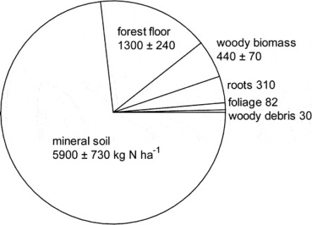
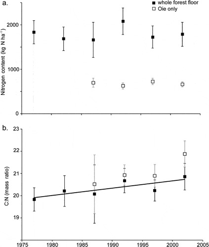
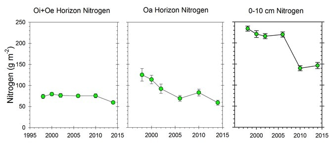
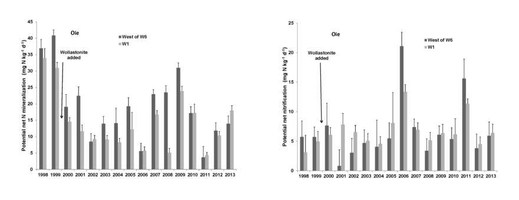

<video controls 
       style="width:80%; max-width:900px; display:block; margin:1.5rem auto;">
  <source src="https://photos.smugmug.com/Videos/Videos/i-MCg9dNZ/0/MjZ4WJqR3gfGhBzjf5QsPWTwSNbr4tMd4vRXcchMs/1280/Peter%20Groffman%20talk_edited-1280.mp4" type="video/mp4">
</video>

Dr. Peter Groffman describes Hubbard Brook’s record of soil and atmospheric gas fluxes at the Bear Brook-mid Plot in the Hubbard Brook Experimental Forest on May 17, 2024.

Chapter Editors: Peter Groffman

## Introduction

Nitrogen is generally regarded as the nutrient that is most limiting to plants in northern forests (Vitousek and Howarth 1991). However, decades of high atmospheric N deposition due to human activity in industrialized regions has altered the natural N cycle in ways that are only partially understood. Many temperate forests are believed to be at or near N saturation, a point where adverse effects of excess N concentration on ecosystem health ensue (Aber et al. 1998). Thus, improved understanding of the forest N cycle is important for designing optimal policies of N management. The N cycle is exceptionally complex because N exists in such a wide variety of compounds that include solid, dissolved and gaseous forms. At HB scientists are wrestling with an as yet unexplained behavior of the forest N budget: despite continuing high atmospheric inputs to the ecosystem, N is strongly retained with only trace levels of N lost in streamflow (@fig-nitrate). This observation is particularly perplexing because the pool of N in forest biomass has remained roughly constant for the past 30 years. Thus, some soil processes must account for these unexpected results.

::: {#fig-nitrate}
<iframe src="https://hubbardbrook.github.io/NitrogenCycling/fig1_nitrate_graph.html" width="100%" height="600" style="border: none;">
</iframe>

Nitrate concentration in the stream draining WS6 at the Hubbard Brook Experimental Forest. This figure is updated with current data available in the Environmental Data Initiative Repository (Hubbard Brook Watershed Ecosystem Record (HBWatER). 2022. Continuous precipitation and stream chemistry data, Hubbard Brook Ecosystem Study, 1963 – present. ver 7. Environmental Data Initiative. https://doi.org/10.6073/pasta/b8ae3f31fcd2de3f53b2b394f122aa69). Hover over graph to access interactive controls available at the top right (zoom/pan/etc).

:::

## Atmospheric N Inputs

In many pristine forests the principal source of available N is biological N2 fixation, a process carried out by the prokaryotic diazotrophs, bacteria and archaea. In many terrestrial ecosystems most of the N2 fixation is attributed to symbiotic N2 fixing plants, but at HB there are no N2-fixing plant species in the upland forest (although Alnus rugosa occurs in wetlands and streamsides), so that any N2 fixation is by non-symbiotic organisms. Roskowski (1980) estimated asymbiotic N2 fixation in decaying wood (thought to be the principal site of fixation) at HB to be less than 2 kg N/ha-yr, with the highest rates in young stands and old-growth forests where dead wood biomass is highest. Evidence from a controlled mass-balance study at HB suggests that considerable associative N2 fixation, i.e. carried out by rhizosphere bacteria, may occur in N-poor soils (Bormann et al. 1982), but whether that potential N input pathway is significant in HB soils remains unknown. Although epiphytic lichens capable of N2 fixation are found in the spruce-fir zone at HB (Cleavitt, personal observation), it is unlikely that they contribute significantly to the N budget of the gaged watersheds.

Currently, the largest input flux of reactive N to the HB forest is atmospheric deposition. Quantifying this flux is challenging because N is deposited in several forms including dissolved, particulate and gaseous N. Yanai et al. (2013) synthesized estimates of atmospheric N input to HB based on measurements of bulk and wet precipitation and atmospheric chemistry. At its peak in the late 20th century, total atmospheric N input averaged 9.5 kg N/ha-yr, with about 6% entering as dry deposition of particulate and gaseous N. Since that time N deposition has declined dramatically as a result of improved emission controls and current atmospheric input is about 6 kg N/ha-yr. Although natural background atmospheric N input is not known precisely, it was likely less than 1 kg N/ha-yr.
Nitrogen Outputs

Long-term monitoring of stream discharge and streamwater N concentration provides precise estimates of the output of N from gaged watersheds at HB. During early years of the record (1960s and 1970s) N flux in streamflow averaged about 4.5 kg N/ha-yr, similar to inputs from N2 fixation and atmospheric deposition. However, after the late 1970's, N concentrations in streamwater declined rapidly (@fig-nitrate), and for the past 20 years has averaged less than 1.5 kg N/ha-yr, much lower than inputs. Most stream N flux has been in the form of nitrate generated by bacterial nitrification in soil, with smaller amounts in the form of dissolved organic N.

Brief spikes of N flux in streamflow in 1979 and 1988 (@fig-nitrate) followed winters with exceptional soil freezing events, and experimental studies at HB indicate that soil frost damaged roots (Tierney et al. 2001, Cleavitt et al. 2008), suppressed plant root uptake (Comerford et al. 2013) and stimulated soil nitrate leaching (Fitzhugh et al. 2001). Similarly, stream N flux increased markedly following a severe ice storm in 1998 (@fig-nitrate) primarily because root uptake was greatly suppressed as forest canopy damage reduced plant N demand (Rhoads et al. 2002; Houlton et al. 2003). These results illustrate the dominant role of plant uptake in regulating soil and stream N dynamics.

Gaseous N output in the form of N2O and N2, generated by microbial nitrification and denitrification, may be a significant N flux pathway at HB, but this flux is notoriously difficult to quantify. Annual flux of N2O has been estimated by direct measurements to range from about 0.3-1.4 kg N/ha-yr at the turn of the 21st century (Groffman et al. 2006, 2009). The greatest source of uncertainty for gaseous N flux concerns N2 because the partitioning of gaseous N losses between N2O and N2 is poorly constrained (Schlesinger 2009); accurate measurement of gaseous N2 flux is difficult because of the high background N2 concentration in the soil atmosphere.

{#fig-npools}

## Forest Ecosystem N Pools

{#fig-ffn}

The largest N pool in the HB ecosystem is mineral soil organic matter which comprised nearly 75% of total N in the mature forest on WS5 in 1982-83 (@fig-npools; Yanai et al. 2013).

Forest floor organic matter (16% of total ecosystem N) and live tree biomass (10%) made up most of the remainder. Mineral soil organic matter is less dynamic pool than other pools but because of its large size and high spatial variability, accurately quantifying changes in the soil N pool has been impossible to date. Although early studies in and around HB suggested that the forest floor organic matter pool may be quite dynamic, especially following forest harvest, more recent work indicates that this pool did not change significantly over 25 yr of monitoring (@fig-ffn)

Surprisingly, the C:N ratio of forest floor organic matter increased slightly but significantly over this interval (@fig-ffn), counter to expectations from N saturation theory. Most recently, however, we see evidence that the forest floor N pool on WS1, where soil Ca was experimentally restored in 1999 (Johnson et al. 2014) has declined significantly in recent years, suggesting an effect of ecosystem acidification on soil N pools and fluxes (@fig-ffminca).

The most dynamic N pool in the forest is tree biomass (live and dead) which can change dramatically following disturbance that cause pulses of tree mortality (see Forest Composition chapter). In the early years of the HBES (1960s-1970s) the N pool in forest biomass on reference WS6 was rapidly accumulating (about 17 kg N/ha-yr) as the forest recovered from logging and disturbance by the 1938 hurricane. This was followed by an interval of slower accumulation in the 1980s (ca. 5 kg N/ha-yr), a plateau in the 1990s and a slight decline since 2000. Although they fluctuate considerably from year-to-year, foliar N concentrations have not shown any systematic changes between 1965 and the present. However, N concentrations in the largest tree biomass pools, woody tissues and roots, have not been monitored through time and considerable uncertainty about possible changes in their pool size remains.

## Internal Cycling of N

{#fig-ffminca}

Nitrogen undergoes a variety of internal transformations and fluxes within forest ecosystems that influence its behavior as a growth-limiting nutrient. Most uptake of N by fine roots and mycorrhizae in the HB forest is in the inorganic forms, NH4+ and NO3-. NH4+ is the product of mineralization of organic N in detritus by microbial heterotrophs, and NO3- is generated via nitrification by autotrophic bacteria and archaea (see below). The proportion of N uptake in these two forms is not known. Plant uptake of N in forests is difficult to measure directly, but this important flux can be estimated indirectly based upon measurements of other N cycle processes including live biomass increment, canopy net throughfall flux, litterfall and root turnover. As noted above, the live tree biomass N pool at HB WS6 was nearly constant during the 1990s and early 2000s (after which it declined largely as a result of ice storm damage); thus, live biomass N increment was nil. At this time Lovett et al. (1996) measured net throughfall flux of inorganic N. Their analysis indicated that the mature forest canopy was a small sink for inorganic N in precipitation, about 1 kg N/ha-yr, suggesting possible foliar assimilation of precipitation N. However, at the same time significant amounts of dissolved organic C (and undoubtedly DON) were leached from the canopy so that the net balance of throughfall N flux was probably nil. Notably, young forest on WS5 exhibited significantly higher retention of inorganic N (about 2 kg N/ha-yr), possibly reflecting physiological differences in N economy of young vs. mature northern hardwood forest (Lovett et al. 1996).

Aboveground litterfall flux of N was measured in ca 50-yr-old forest at HB in 1968-69 (Gosz et al. 1972) and has been monitored continuously since 1992. In 1968-69 this flux was estimated at 54 kg N/ha-yr. The largest cause of annual variation in litterfall N flux is leaf resorption. Ryan and Bormann (1982) estimated this flux for the HB forest at 36 kg N/ha-yr. Thus, root uptake to supply new leaf growth is about 54-36= 18 kgN/ha-yr. Subsequent measurements of foliage and fresh litter chemistry indicate that this flux can vary by 50% or more between years for unknown reasons (Hughes and Fahey 1994) possibly related to fall weather variation. Thus, in the growing season following a year of relatively low resorption, a greater proportion of leaf N demand must be met by root uptake.

The final component contributing to the plant N uptake calculation is growth (or turnover) of fine roots. Although this component is analogous to leaf litterfall, some evidence indicates that N resorption from fine roots before senescence and death is minimal (Nambiar and Fife 1991; Gordon and Jackson 2000). Based upon measurements of the N content of fine root (< 1mm) biomass in the HB forest (115 kg N/ha; Fahey et al. 1988), and assuming an average two-year longevity of those roots (Tierney and Fahey 2002), N flux to supply new root growth is about 57 kg N/ha-yr. In sum, we estimate plant N uptake in the HB forest at 57 + 18 = 75 kg N/ha-yr. The largest sources of variation and uncertainty in this flux are N resorption and root turnover.

During the initial stages of leaf litter decay, the N concentration in the litter increases markedly as a result of mineralization and loss of C (as CO2 and DOC ) and immobilization of N by microbial decomposers. At HB, Melillo et al. (1982) demonstrated that not only was N immobilized in decaying leaf litter, but N was transported from the environment into decaying litter; after one year the mass of N in decaying litter was 30-55% higher than at the outset. Subsequent research has demonstrated that this input of N to decaying litter is transported from underlying soil by fungal hyphae. The flux is primarily sink dependent (rather than source), so that the lower the initial litter N concentration the greater the flux (Li and Fahey 2013); hence, in effect, the greater the plant N resorption from leaves, the greater this uptake of N by decaying litter. The fungal hyphae of decomposers that scavenge available N from soil must be competing intensely with mycorrhizal fungal hyphae supplying plant uptake. In growing seasons following high N resorption mycorrhizal N uptake is low and litter N flux is high, and vice versa. Woody detritus also is a strong N sink during early stages of decay, but becomes a net source after about 20 years (Arthur et al. 1993). These important processes in the forest N cycle have received little detailed study and could contribute to assumed mineral soil N retention at HB (see below; Fahey et al. 2011).

After the first year of decomposition, net N mineralization of leaf litter supplies plant available N in forest soil. The larger process of N mineralization in bulk soil has been measured for HB soils using both in situ and laboratory incubation methods. This process tends to track soil temperature on a seasonal basis (Groffman et al. 2009) and high annual variation is observed (@fig-nminnit) with annual estimates (31-171 kg N/ha-yr) bracketing N uptake calculations (75 kgN/ha-yr).

{#fig-nminnit}

The causes of annual variation in soil N mineralization and nitrification are not well understood, but include apparent effects of severe soil freezing and canopy disturbance (e.g., ice storm; Dittman et al. 2007). Soil N mineralization rates are generally lower at lower elevations in the northern hardwood forest at HB; these differences are tentatively attributed to drought effects (Duran et al. 2014, Bohlen et al. 2001).

Net nitrification in bulk soil is measured using the same methods as net mineralization. In general, nitrification rate is roughly half of net mineralization at HB, but this also varies annually, seasonally and spatially (Groffman et al. 2009). The principal factor influencing annual variation in nitrification is plant root uptake: when uptake of N is reduced by forest disturbances, the NH4+ substrate released during decomposition accumulates in soil and nitrification rate can greatly increase. This effect was first observed during devegetation of WS2, as nitrate in stream water reached very high concentrations (over 50 mg/L; Likens et al. 1970). Similarly, natural disturbances that reduce plant uptake -- soil freezing, insect defoliation, ice storm – also result in high nitrification rates and NO3 leaching from soils (Houlton et al. 2003).

Nitrogen transport through soils and to streams at HB varies systematically across the watershed landscape (Dittman et al. 2007). In the upper elevation conifer forest dissolved organic N is dominant in soil and surface waters whereas NO3 is the predominant N form in hardwood forest zones in both soil solutions and streams. Within the soil profile N retention is centered in the densely rooted upper mineral soil, but N retention also occurs in subsoil and stream, suggesting that physical and streamside processes also contribute to ecosystem N retention. Hydrologic flow paths can override both biotic and abiotic retention mechanisms, as direct flushing of N occurs from surface organic horizons into the stream by lateral flow, during wet periods (Dittman et al. 2007).

## Missing Source to Missing Sink

As noted at the outset of this chapter, an enduring mystery about the HB nitrogen cycle is why the mature forest ecosystem continues to strongly retain N in apparent conflict with the theory of N saturation: what is the missing sink for N now that forest biomass is no longer accumulating? In fact, in the early years of the study when the younger forest was rapidly accumulating N in biomass the question was what is the missing source of N (@fig-massbal).

{#fig-massbal}

Two possible explanations, not mutually exclusive, now appear most likely. First, recent measurements suggest that gaseous losses of N, especially via denitrification, may be larger than traditionally expected for the generally coarse, well-drained and aerated soils at HB (Wexler et al. 2014, Morse et al. 2015). If so, then gaseous N loss could contribute an important missing sink for N. To account for the changing long-term N balance – from missing source to missing sink – denitrification rates must have changed dramatically between the 1960's-1970's and the1990's-present time period. Some limited empirical observations support lower N2O fluxes 35 yrs ago (Keller et al. 1983) than more recently (Groffman et al. 2006). Higher soil NO3 concentrations resulting from lower plant demand and increasing soil temperature and moisture from regional climate change (see Climate Change chapter) could contribute to higher denitrification in HB soils.

An alternative (or complementary) process that could contribute to the N balance mystery is the soil N bank hypothesis. During intervals of high vegetation N demand, such as forest recovery from large-scale disturbance, soil organic N could be “mined” from mineral soil and the soil N bank drawn down. In later stages of forest development N requirements could be met by detrital recycling and excess N might accumulate in soil organic matter, refilling the N bank account. Evidence to test this hypothesis is being collected in a chronosequence of forest stands in and around the HBEF.

## N oligotrophication

Recent declines in atmospheric N deposition and unexplained declines in N export from the Hubbard Brook forest (@fig-nitrate) have raised new concerns about N shortages or oligotrophication that could reduce forest productivity, and the capacity for forests to respond dynamically to disturbance and environmental change (Groffman et al. 2018). N oligotrophication in forest soils may be driven by several factors. First, increases in atmospheric CO2 concentrations lead to increases in carbon flow from the atmosphere through soils that stimulates microbial immobilization of N and decreases available N for plants. Decreased available N in soils can result in increased N resorption by trees, which reduces litterfall N input to soils, further limiting available N supply and leading to further declines in soil N availability. Moreover, N oligotrophication may be exacerbated by changes in climate that increase the length of the growing season and increase biological demand for available N by both plants and microbes. This demand may also be increasing as soils and microbial and plant communities continue to recover from acid rain. These results suggest a need to re-evaluate the nature and extent of N cycling in temperate forests and assess how changing conditions will influence forest ecosystem response to multiple, dynamic stresses of global environmental change.

## Questions for Further Study.

* How will the N cycle respond to continuing decline in atmospheric N deposition?
* What is the cause of high annual variation in potential N mineralization and nitrification (Fig. 5)?
* What is the magnitude, pattern and microbiology of gaseous N fluxes?
* What are the principal sources and dynamics of the large N pool in deep soil horizons?
* Has the concentration of N in woody tissues of trees changed over the long-term at HB?
* Can we better constrain the magnitude of nitrogen fixation?

## Access Data

* Hubbard Brook Watershed Ecosystem Record (HBWatER). 2021. Continuous precipitation and stream chemistry data, Hubbard Brook Ecosystem Study, 1963 – present. ver 6. Environmental Data Initiative. https://doi.org/10.6073/pasta/ee9815b41b79c134fd714736ce98676a 
* Johnson, C.E. 2022. Mass and Chemistry of Organic Horizons and Surface Mineral Soils on Watershed 6 at the Hubbard Brook Experimental Forest, 1976 - present ver 3. Environmental Data Initiative. https://doi.org/10.6073/pasta/96ef3d45e9a7d719ae7731f0719bd483
* Johnson, C.E. 2022. Mass and Chemistry of Organic Horizons and Surface Mineral Soils on Watershed 1 at the Hubbard Brook Experimental Forest 1996-present ver 3. Environmental Data Initiative.
    https://doi.org/10.6073/pasta/7395cf86c134440f38d800ca59a4857b

## References

Aber, J. D., McDowell, W., Nadelhoffer, K. J., Magill, A., Berntson, G., Kamakea, M., McNulty, S., Currie, W., Rustad, L., & Fernandez, I. (1998). Nitrogen saturation in temperate forest ecosystems. *BioScience, 48*(11), 921–934. [https://doi.org/10.2307/1313296](https://doi.org/10.2307/1313296){target="_blank" rel="noopener"}

Arthur, M. A., Tritton, L. M., & Fahey, T. J. (1993). Dead bole mass and nutrients remaining 23 years after clear-felling of a northern hardwood forest. *Canadian Journal of Forest Research, 23*(7), 1298–1305. [https://doi.org/10.1139/x93-166](https://doi.org/10.1139/x93-166){target="_blank" rel="noopener"}

Bohlen, P. J., Groffman, P. M., Driscoll, C. T., Fahey, T. J., & Siccama, T. G. (2001). Plant-soil-microbial interactions in a northern hardwood forest. *Ecology, 82*(4), 965–978. [https://doi.org/10.1890/0012-9658(2001)082[0965:PSMIIA]2.0.CO;2](https://doi.org/10.1890/0012-9658(2001)082[0965:PSMIIA]2.0.CO;2){target="_blank" rel="noopener"}

Bormann, B. T., Keller, C. K., Wang, D., & Bormann, F. H. (2002). Lessons from the sandbox: Is unexplained nitrogen real? *Ecosystems, 5*(7), 727–733. [https://doi.org/10.1007/s10021-002-0189-2](https://doi.org/10.1007/s10021-002-0189-2){target="_blank" rel="noopener"}

Cleavitt, N. L., Fahey, T. J., Groffman, P. M., Hardy, J. P., Henry, K. S., & Driscoll, C. T. (2008). Effects of soil freezing on fine roots in a northern hardwood forest. *Canadian Journal of Forest Research, 38*(1), 82–91. [https://doi.org/10.1139/X07-133](https://doi.org/10.1139/X07-133){target="_blank" rel="noopener"}

Comerford, D. P., Schaberg, P. G., Templer, P. H., Socci, A. M., Campbell, J. L., & Wallin, K. F. (2013). Influence of experimental snow removal on root and canopy physiology of sugar maple trees in a northern hardwood forest. *Oecologia, 171*(1), 261–269. [https://doi.org/10.1007/s00442-012-2393-x](https://doi.org/10.1007/s00442-012-2393-x){target="_blank" rel="noopener"}

Dittman, J. A., Driscoll, C. T., Groffman, P. M., & Fahey, T. J. (2007). Dynamics of nitrogen and dissolved organic carbon at the Hubbard Brook Experimental Forest. *Ecology, 88*(5), 1153–1166. [https://doi.org/10.1890/06-0834](https://doi.org/10.1890/06-0834){target="_blank" rel="noopener"}

Durán, J., Morse, J. L., Groffman, P. M., Campbell, J. L., Christenson, L. M., Driscoll, C. T., Fahey, T. J., Fisk, M. C., Mitchell, M. J., & Templer, P. H. (2014). Winter climate change affects growing-season soil microbial biomass and activity in northern hardwood forests. *Global Change Biology, 20*(11), 3568–3577. [https://doi.org/10.1111/gcb.12624](https://doi.org/10.1111/gcb.12624){target="_blank" rel="noopener"}

Fahey, T. J., Yavitt, J. B., Sherman, R. E., Groffman, P. M., Fisk, M. C., & Maerz, J. C. (2011). Transport of carbon and nitrogen between litter and soil organic matter in a northern hardwood forest. *Ecosystems, 14*(3), 326–340. [https://doi.org/10.1007/s10021-011-9414-1](https://doi.org/10.1007/s10021-011-9414-1){target="_blank" rel="noopener"}

Fahey, T. J., Hughes, J. W., Pu, M., & Arthur, M. A. (1988). Root decomposition and nutrient flux following whole-tree harvest of northern hardwood forest. *Forest Science, 34*(3), 744–768. [https://doi.org/10.1093/forestscience/34.3.744](https://doi.org/10.1093/forestscience/34.3.744){target="_blank" rel="noopener"}

Fitzhugh, R. D., Driscoll, C. T., Groffman, P. M., Tierney, G. L., Fahey, T. J., & Hardy, J. P. (2001). Effects of soil freezing disturbance on soil solution nitrogen, phosphorus, and carbon chemistry in a northern hardwood ecosystem. *Biogeochemistry, 56*(2), 215–238. [https://doi.org/10.1023/A:1013076609950](https://doi.org/10.1023/A:1013076609950){target="_blank" rel="noopener"}

Gordon, W. S., & Jackson, R. B. (2000). Nutrient concentrations in fine roots. *Ecology, 81*(1), 275–280. [https://doi.org/10.1890/0012-9658(2000)081[0275:NCIFR]2.0.CO;2](https://doi.org/10.1890/0012-9658(2000)081[0275:NCIFR]2.0.CO;2){target="_blank" rel="noopener"}

Gosz, J. R., Likens, G. E., & Bormann, F. H. (1972). Nutrient content of litterfall on the Hubbard Brook Experimental Forest, New Hampshire. *Ecology, 53*(5), 769–784. [https://doi.org/10.2307/1934293](https://doi.org/10.2307/1934293){target="_blank" rel="noopener"}

Groffman, P. M., Hardy, J. P., Driscoll, C. T., & Fahey, T. J. (2006). Snow depth, soil freezing, and fluxes of carbon dioxide, nitrous oxide and methane in a northern hardwood forest. *Global Change Biology, 12*(9), 1748–1760. [https://doi.org/10.1111/j.1365-2486.2006.01194.x](https://doi.org/10.1111/j.1365-2486.2006.01194.x){target="_blank" rel="noopener"}

Groffman, P., Hardy, J., Fisk, M., Fahey, T., & Driscoll, C. (2009). Climate variation and soil carbon and nitrogen cycling processes in a northern hardwood forest. *Ecosystems, 12*(6), 927–943. [https://doi.org/10.1007/s10021-009-9268-y](https://doi.org/10.1007/s10021-009-9268-y){target="_blank" rel="noopener"}

Groffman, P. M., Driscoll, C. T., Durán, J., Campbell, J. L., Christenson, L. M., Fahey, T. J., Fisk, M. C., Fuss, C., Likens, G. E., Lovett, G., Rustad, L., & Templer, P. H. (2018). Nitrogen oligotrophication in northern hardwood forests. *Biogeochemistry, 141*(3), 523–539. [https://doi.org/10.1007/s10533-018-0445-y](https://doi.org/10.1007/s10533-018-0445-y){target="_blank" rel="noopener"}

Houlton, B. Z., Driscoll, C. T., Fahey, T. J., Likens, G. E., Groffman, P. M., Bernhardt, E. S., & Buso, D. C. (2003). Nitrogen dynamics in ice storm-damaged forest ecosystems: Implications for nitrogen limitation theory. *Ecosystems, 6*(5), 431–443. [https://doi.org/10.1007/s10021-002-0198-1](https://doi.org/10.1007/s10021-002-0198-1){target="_blank" rel="noopener"}

Hughes, J. W., & Fahey, T. J. (1994). Litterfall dynamics and ecosystem recovery during forest development. *Forest Ecology and Management, 63*(2–3), 181–198. [https://doi.org/10.1016/0378-1127(94)90110-4](https://doi.org/10.1016/0378-1127(94)90110-4){target="_blank" rel="noopener"}

Johnson, C. E., Driscoll, C. T., Blum, J. D., Fahey, T. J., & Battles, J. J. (2014). Soil chemical dynamics after calcium silicate addition to a northern hardwood forest. *Soil Science Society of America Journal, 78*(4), 1458–1468. [https://doi.org/10.2136/sssaj2014.03.0114](https://doi.org/10.2136/sssaj2014.03.0114){target="_blank" rel="noopener"}

Keller, M., Goreau, T. J., Wofsy, S. C., Kaplan, W. A., & McElroy, M. B. (1983). Production of nitrous oxide and consumption of methane by forest soils. *Geophysical Research Letters, 10*(12), 1156–1159. [https://doi.org/10.1029/GL010i012p01156](https://doi.org/10.1029/GL010i012p01156){target="_blank" rel="noopener"}

Li, A., & Fahey, T. J. (2013). Nitrogen translocation to fresh litter in northern hardwood forest. *Ecosystems, 16*(3), 521–528. [https://doi.org/10.1007/s10021-012-9627-y](https://doi.org/10.1007/s10021-012-9627-y){target="_blank" rel="noopener"}

Likens, G. E., Bormann, F. H., Johnson, N. M., Fisher, D. W., & Pierce, R. S. (1970). Effects of forest cutting and herbicide treatment on nutrient budgets in the Hubbard Brook watershed-ecosystem. *Ecological Monographs, 40*(1), 23–47. [https://doi.org/10.2307/1942440](https://doi.org/10.2307/1942440){target="_blank" rel="noopener"}

Lovett, G. M., Nolan, S. S., Driscoll, C. T., & Fahey, T. J. (1996). Factors regulating throughfall flux in a forested landscape. *Canadian Journal of Forest Research, 26*(12), 2134–2144. [https://doi.org/10.1139/x26-242](https://doi.org/10.1139/x26-242){target="_blank" rel="noopener"}

Melillo, J. M., Aber, J. D., & Muratore, J. F. (1982). Nitrogen and lignin control of hardwood leaf litter decomposition dynamics. *Ecology, 63*(3), 621–626. [https://doi.org/10.2307/1936780](https://doi.org/10.2307/1936780){target="_blank" rel="noopener"}

Morse, J. L., Durán, J., & Groffman, P. M. (2015). Soil denitrification fluxes in a northern hardwood forest: The importance of snowmelt and implications for ecosystem N budgets. *Ecosystems, 18*(3), 520–532. [https://doi.org/10.1007/s10021-015-9844-2](https://doi.org/10.1007/s10021-015-9844-2){target="_blank" rel="noopener"}

Nambiar, E. K., & Fife, D. N. (1991). Nutrient translocation in temperate conifers. *Tree Physiology, 9*(1–2), 185–207. [https://doi.org/10.1093/treephys/9.1-2.185](https://doi.org/10.1093/treephys/9.1-2.185){target="_blank" rel="noopener"}

Rhoads, A. G., Hamburg, S. P., Fahey, T. J., Siccama, T. G., Hane, E. N., Battles, J., Cogbill, C., Randall, J., & Wilson, G. (2002). Effects of a intense ice storm on the structure of a northern hardwood forest. *Canadian Journal of Forest Research, 32*(9), 1763–1775. [https://doi.org/10.1139/x02-089](https://doi.org/10.1139/x02-089){target="_blank" rel="noopener"}

Roskowski, J. (1980). Nitrogen fixation in hardwood forests of the northeastern United States. *Plant and Soil, 54*(1), 33–44. [https://doi.org/10.1007/BF02181997](https://doi.org/10.1007/BF02181997){target="_blank" rel="noopener"}

Ryan, D. F., & Bormann, F. H. (1982). Nutrient resorption in northern hardwood forests. *BioScience, 32*(1), 29–32. [https://doi.org/10.2307/1308751](https://doi.org/10.2307/1308751){target="_blank" rel="noopener"}

Schlesinger, W. H. (2009). On the fate of anthropogenic nitrogen. *Proceedings of the National Academy of Sciences, 106*(1), 203–208. [https://doi.org/10.1073/pnas.0810193105](https://doi.org/10.1073/pnas.0810193105){target="_blank" rel="noopener"}

Tierney, G. L., & Fahey, T. J. (2002). Fine root turnover in a northern hardwood forest: a direct comparison of the radiocarbon and minirhizotron methods. *Canadian Journal of Forest Research, 32*(9), 1692–1697. [https://doi.org/10.1139/x02-123](https://doi.org/10.1139/x02-123){target="_blank" rel="noopener"}

Tierney, G. L., Fahey, T. J., Groffman, P. M., Hardy, J. P., Fitzhugh, R. D., & Driscoll, C. T. (2001). Soil freezing alters fine root dynamics in a northern hardwood forest. *Biogeochemistry, 56*(2), 175–190. [https://doi.org/10.1023/A:1013072519889](https://doi.org/10.1023/A:1013072519889){target="_blank" rel="noopener"}

Vitousek, P. M., & Howarth, R. W. (1991). Nitrogen limitation on land and in the sea: how can it occur? *Biogeochemistry, 13*(2), 87–115. [https://doi.org/10.1007/BF00002772](https://doi.org/10.1007/BF00002772){target="_blank" rel="noopener"}

Wexler, S. K., Goodale, C. L., McGuire, K. J., Bailey, S. W., & Groffman, P. M. (2014). Isotopic signals of summer denitrification in a northern hardwood forested catchment. *Proceedings of the National Academy of Sciences, 111*(46), 16413–16418. [https://doi.org/10.1073/pnas.1404321111](https://doi.org/10.1073/pnas.1404321111){target="_blank" rel="noopener"}

Yanai, R. D., Vadeboncoeur, M. A., Hamburg, S. P., Arthur, M. A., Fuss, C. B., Groffman, P. M., Siccama, T. G., & Driscoll, C. T. (2013). From missing source to missing sink: long-term changes in the nitrogen budget of a northern hardwood forest. *Environmental Science & Technology, 47*(20), 11440–11448. [https://doi.org/10.1021/es4025723](https://doi.org/10.1021/es4025723){target="_blank" rel="noopener"}
