Chapter Editor: Timothy Fahey

## Introduction

Roots play a variety of roles in forest ecosystems. Although we usually think of the key role of roots (actually mycorrhizae) in acquiring soil resources, they also serve to anchor the plant and as a place for storing nutrients and carbohydrates. Studying the structure and function of tree root systems requires brute strength or clever techniques because they are difficult to access. At Hubbard Brook considerable attention has been applied to understanding root systems of the trees because they are crucial to forest ecosystem production and biogeochemistry. Here we provide a brief overview of root studies at HB. For a general overview of root structure, anatomy and function we refer readers to treatises on the topics of roots (Eshel and Beeckman 2013) and mycorrhizae (Smith and Read 2010).

## Root Biomass

Roots typically comprise about 20-25% of total plant biomass in forests; Mokany et al. (2006) summarized global data on root:shoot biomass (R:S) ratios of terrestrial vegetation, indicating a median value of 0.24 for mature temperate broadleaf forests. Based on exceptionally detailed measurements at HB, R:S of the 80-yr-old forest on W6 was estimated at 0.26 (i.e. roots comprised 21% of total plant biomass; Fahey et al. 2005a). Total root biomass was estimated independently by two labor-intensive methods at HB: quantitative soil pits (Fahey et al. 1988) and allometric equations derived by excavation of root systems of 81 sample trees (Whittaker et al. 1974). These estimates differed by 8%. Most of the root biomass in the mature forest is contained in large woody roots (Table 1); for example, fine roots (<2 mm diameter) comprise only about 10% of total root biomass and coarse woody roots (>1 cm diameter) make up 56% (Fahey et al. 1988).
Table 1. Lateral woody root biomass (>0.6mm) in summer 1983 on watershed 5 at Hubbard Brook. Values in parentheses are standard errors based upon 58 soil pits. 	

**Table 1. Lateral woody root biomass (>0.6 mm) in summer 1983 on watershed 5 at Hubbard Brook. Values in parentheses are standard errors based upon 58 soil pits.**

| Soil Depth     | 0.6–1.0 | 1.0–2.5 | 2.5–5.0 | 5.0–10 | >10  | Total        |
|----------------|--------:|--------:|--------:|-------:|-----:|--------------|
| Forest Floor   |      40 |      63 |     112 |    216 |  745 | 1187 (303)   |
| 0–10 cm        |      37 |      57 |      69 |    109 |  133 | 605 (77)     |
| 10–20 cm       |      26 |      46 |      50 |     69 |  248 | 440 (118)    |
| >20 cm         |      31 |      70 |      73 |     88 |  182 | 444 (87)     |
| **Total**      | 134 (13)| 235 (25)| 315 (25)| 482 (47)|1509 (394)| 2676 (539) |

Tree roots are highly concentrated in the surface soil horizons in most temperate forests (Jackson et al. 1996). In northern hardwood forests about 83% of total root biomass is found in the upper 20 cm of soil, and about 40% of fine root biomass is located in the forest floor organic horizons (@fig-rootdepth). Nevertheless, fine and coarse roots can extend to greater depths (50+ cm) in soil including the C horizon (@fig-rootdepth), probably depending on soil characteristics such as dense pan layers and perched water tables. In general, the biotic and environmental factors that regulate these gross features of forest root systems are only partially understood. Not surprisingly, R:S ratio increases as shoot biomass decreases, and R:S tends to be greater on sandy soils (Mokany et al. 2006) and on poorly-drained soils (Coutts 1983). Probably the relatively high R:S ratio at HB reflects the sandy texture or the low soil fertility.

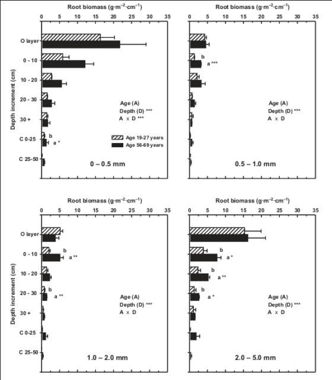{#fig-rootdepth}

Root biomass, size distributions and R:S ratios all change systematically during forest stand development: root biomass and the proportion of large woody roots increase and R:S decreases (Mokany et al. 2006) as forests develop. For example, in northern hardwoods at nearby Bartlett Experimental Forest, biomass of roots <2 cm diameter nearly doubled between age 19-27 yr and age 56-69 yr (Yanai et al. 2006; @fig-biomass). Fine root (< 1mm) biomass increased from 300 g/m2 to 410 g/m2 between stand age 40 and 100 yr at HB (Bae et al. 2015). Roots in mature forest also extend to greater depths than for young forest (Yanai et al. 2006), analogous to increasing canopy heights.

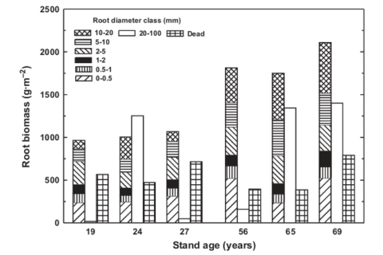{#fig-biomass}

## Root Classification

Fine roots are typically defined on the basis of a diameter cut-off (e.g. <1 mm), and most research at HB has employed this definition. From a functional view a more informative approach relies on root order, based on branching pattern: the most distal root segments are classified as the lowest order (1), second-order root segments are formed at the junction of 1st order roots and so on, analogous to the geomorphology of streams (Fitter 1982). The low-order fine roots (order 1-2 or 1-3) are most important in soil resource uptake (water, mineral nutrients) and usually form mycorrhizal symbiosis while the higher orders (order 4-5) are anatomically adapted for resource transport (McCormack et al. 2015). However, sampling fine root systems by branching order is difficult and applications of the root order system at Hubbard Brook has been limited; for example, Fahey et al. (2012) observed that order 1-2 fine roots (0.2-0.3 mm diameter) of sugar maple had median longevity of about 220 d whereas for order 4-5 roots (0.6-1.4 mm) median longevity was about 2 years. Additional research utilizing the root order concept is needed to be better characterize fine root function in the HB forest.

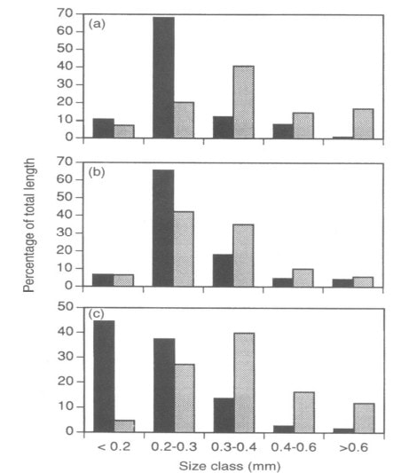{#fig-length}

## Root Function

From the standpoint of resource uptake functions root length is a more informative measure of root abundance than root biomass; most nutrient uptake models use root length as the basis for uptake calculations (e.g. Yanai 1994). The distribution of the total length of fine roots across diameter classes differs between soil horizons and among the dominant northern hardwood species at HB (Fahey and Hughes 1994; @fig-length). Roots are smaller in diameter in surface organic horizons than in underlying mineral soil for all three species, and sugar maple roots are smaller than those of beech and yellow birch. A useful index of morphology of fine roots is the specific root length (SRL), defined as the length to dry mass ratio; fine roots with higher SRL would be expected to maximize uptake (length) per energy cost (mass) as shown by Yanai et al. (1995). For a particular root diameter class, SRL is usually higher for roots in forest floor than mineral soil (@fig-finerootlength); hence, it is not surprising that uptake per unit root mass of a scarce resource like P is much greater in forest floor horizons (see Phosphorus chapter)

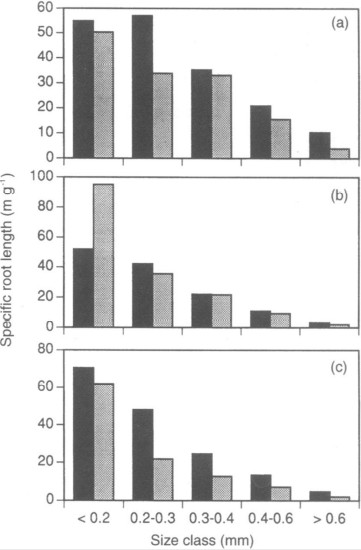{#fig-finerootlength}

## Root Production

Root production is difficult to measure because accessing the root system inevitably alters the soil environment and the dynamics of roots. A common approach using root ingrowth cores probably overestimates root production because roots proliferate in the resource-rich, root-free environment of the ingrowth core. Based on this approach fine root production was estimated to be 350 g/m2-yr in the northern hardwood forest at HB, about equally divided between forest floor and mineral soil (Fahey and Hughes 1994). This estimate greatly exceeds the value obtained by measuring fine root biomass (<1 mm) and calculating production from the turnover rate of fine roots. Tierney and Fahey (2002) estimated fine root turnover using minirhizotron (MR) observations in the HB forest at 0.35 yr-1, which they applied to long-term average fine root biomass (<1 mm) of 520 g/m2 to obtain a fine root production estimate of 182 g.m2-yr. The turnover rate estimate of Tierney and Fahey (2002) is lower than other MR estimates for northern hardwood forests (e.g., Hendrick and Pregitzer 1992) because it accounts for the skewed distribution of fine root lifespans (see below). Resolving the differences between ingrowth core and MR estimates of fine root production remains an important challenge. Additional root production is associated with coarse, woody roots (>1 mm) but direct measurements are lacking for HB or indeed for any forests. Fahey et al. (2005a) estimated woody root production for the HB forest to be 76 g/m2-yr based on the assumption that they turn over at the same rate as analogous aboveground biomass (twigs, branches). Thus, woody root production appears to be less than half as large as fine root production, but more refined approaches are needed to confirm these estimates.

Together with aboveground measurements, these estimates provide a basis for calculating the ratio of belowground to total forest production for HB (i.e. BNPP:NPP). The resulting value for the ca. 90-yr-old northern hardwood forest (in the late 1990s) is about 0.3, slightly higher than the average value of 0.26 for temperate deciduous forests (Tierney and Fahey 2007). Higher values of BNPP:NPP are observed in grasslands (0.52) and evergreen boreal forests (0.40).

Also, note that the ratio of root:shoot biomass (0.26) is considerably lower than the ratio of BNPP:ANPP (0.45), reflecting the higher proportion of tissues with relatively rapid turnover in root systems.

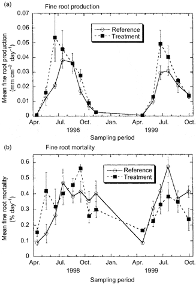{#fig-mortality}

In the cold temperate HB environment seasonal variation in root growth is strongly linked to soil temperature. Observations using MR indicate that root growth commences soon after soils warm following melting of the snowpack in April (Tierney et al. 2001; @fig-mortality), but growth rates remain low until soil temperatures warm in late May and June, coincident with leaf growth. This differs from some warm temperate deciduous forests where root growth declines during leaf expansion, possibly because of competing C demand (Teskey and Hinckley 1981; Joslin et al. 2001). In forests where soils dry out during late summer, root growth peaks early in the growing season (Hendrick and Pregitzer 1997; Joslin et al. 2001) whereas in the normally moist HB environment root growth remains high in late summer and early fall, closely tracking temperature (@fig-season).

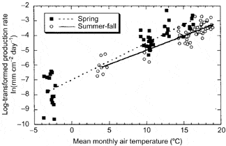{#fig-season}

## Root Longevity

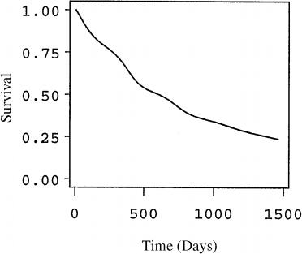{#fig-survivor}

Unlike leaves, fine roots do not appear to undergo programmed senescence with the formation of an abscission layer. Rather, fine root mortality is a continuous process, perhaps responding to local depletion of soil nutrient availability. At HB root mortality roughly tracks root growth and, surprisingly, high overwinter mortality is not normally observed (@fig-mortality) although severe soil freezing has been shown to damage roots of northern hardwood trees at HB (Cleavitt et al. 2008; Tierney et al. 2001; Comerford et al. 2013; @fig-mortality). The role of soil invertebrates and fungal pathogens in fine root mortality has received limited attention and deserves further study.

Extensive observations using MR at HB provide a basis for quantifying the survivorship of fine roots in the northern hardwood forest (@fig-survivor). In general, mortality hazard is initially high but gradually declines for roots surviving past the first few months. Although the median lifespan of fine roots is about 1.5 yr, a substantial fraction (ca. 20%) may live over three years. This strong skewing of the survivorship curve helps to explain an apparent disagreement in the literature on fine roots: Gaudinski et al. (2001) estimated fine root lifespan in eastern deciduous forest using a bomb 14C approach at 3-18 years, whereas other approaches, including MR at HBEF have indicated much shorter lifespans, < 3 yr.

## Mycorrhizae

Few of the fine roots in the forest are simply plant tissues; most are actually a mycorrhizal symbiosis. The northern hardwood forest at HB consists of a mixture of tree species that exhibit the two most common types of mycorrhizae: arbuscular mycorrhizae (AM: maples, cherry, ash) and ectomycorrhizae (EM: birches, beech, conifers). These two types of mycorrhizae differ markedly in terms of morphology, physiology and the taxonomy of the fungal partner (Smith and Read 2010). Exactly how these contrasting mycorrhizal types interact within the northern hardwood forest is an intriguing question. For example, AM are well known to enhance plant uptake of P (Bolan 1991) and EM fungal communities are highly sensitive to N supply (Lilleskov et al. 2002). Phillips et al. (2013) proposed that these different mycorrhizal types regulate the nutrient economy of forest ecosystems through different couplings among the C-N-P cycles. The sensitivity of mycorrhizal associations to ongoing global environmental change (Treseder 2004) is an important topic deserving attention at HB.

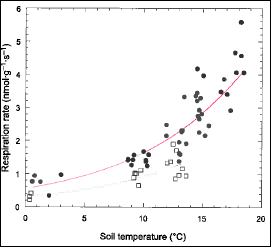{#fig-respiration}

## Root Activity and Nutrient Uptake

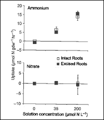{#fig-nuptake}

Physiological activity of roots is particularly difficult to measure in situ in forests because of sensitivity to disruption of root-soil interactions. Measurements on detached fine roots at HB indicate that respiration increases with soil temperature, following an exponential relationship with a Q10 value of about 3 (Fahey et al. 2005b; @fig-respiration); thus, root respiration is highly sensitive to climate warming. Although soil moisture also affects root respiration it is difficult to separate drought effects from confounding temperature effects (Davidson et al. 1998). The current consensus suggests that only severe drought conditions reduce root respiration (Burton et al. 1998; Fahey et al. 2005b) but more study is needed.

Two general approaches to measurement of nutrient uptake by roots of forest trees have been applied at HB (Socci and Templer 2011). In the in situ depletion method, roots remain connected to the tree whereas uptake of isotopically-labeled nutrients (e.g. 15N) is measured on excised roots. The former method generally yields higher uptake estimates (@fig-nuptake) that are more in line with mass-balance calculations. Campbell et al. (2014) applied the in situ approach in a snow removal experiment at HB and demonstrated that severe soil freezing reduced root N uptake (@fig-freeze), supporting the interpretation that increased nitrate leaching from northern hardwood forest soils following soil freezing is driven primarily by reduced root N uptake.

A considerable proportion of the C allocated belowground by forest trees is transported to the soil adjacent to the roots, known as rhizosphere C flux (RCF). The C fuels microbial activity including extra-matrical mycorrhizal fungal hyphae, facilitating acquisition of mineral nutrients. Phillips and Fahey (2005) measured RCF of saplings of sugar maple and yellow birch at HB using an isotope labeling approach and extrapolated that 7-12% of tree C assimilation was diverted to RCF in the HB forest. This RCF results in higher microbial biomass, enzymatic activity and organic matter mineralization in rhizosphere soil than in bulk soil, so-called rhizosphere effects. Experimental fertilization studies at HB also indicate that RCF and rhizosphere effects may be modulated by trees in response to changes in nutrient availability (@fig-rhizosphere; Phillips and Fahey 2007, 2008).

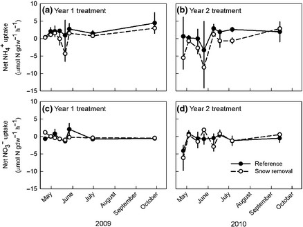{#fig-freeze}

## Root Response to Environmental Change

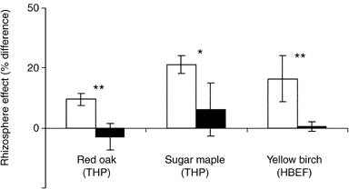{#fig-rhizosphere}

Human-accelerated environmental changes (climate, pollution, land-use) can be expected to cause substantial alteration of root dynamics of forest ecosystems (Norby and Jackson 2000). Indeed, depletion of base cations at HB during the 20th century was a probable cause of increased fine root biomass in the northern hardwood forest; i.e. experimental restoration of soil calcium resulted in a 30% decline in fine root biomass in WS1 (@fig-massrat; Fahey et al. 2016). Consequently, lower C inputs to forest floor horizons via root turnover and RCF also may have contributed to the decline in forest floor organic matter in WS1. Other important root responses to environmental changes can be expected. In particular, because both root growth and respiration are closely tied to soil temperature (@fig-season; @fig-respiration; Atkin et al. 2000), we can anticipate changes in response to global warming during the 21st century. For example, the duration of root growth will probably increase; together with higher respiration rates this will result in increased CO2 flux from root systems. More difficult to predict are the possible effects of declining soil N availability resulting from reduced anthropogenic N inputs (see Nitrogen Cycling chapter) and changing P availability associated with soil pH increases due to reduced acid deposition. Moreover, factors controlling fine root turnover are not well understood for HB or any forest ecosystems. Conceptual and methodological advances are needed to inform predictions of root system responses to global change.

{#fig-massrat}

A better basis for predicting the response of root production to variation in soil nutrient availability has been provided by observations of the MELNHE study of forest ecosystem co-limitation. We hypothesized that increased soil nutrient availability would cause a decrease in tree investment in root nutrient uptake, the so-called “plant functional equilibrium theory” (Thornley 1991). Surprisingly, we have observed just the opposite: significant increases in fine root production in response to long-term addition of N (in mature forest stands; Shan et al. 2022, @fig-ingrowth) and of N + P (in early successional stands; Li et al, in review). Apparently, tree investment in root production can be constrained by nutrient limitation or co-limitation, perhaps reflecting the need for stoichiometrically balanced nutrition.

Fine root growth measured using ingrowth cores in three mature forest stands treated with N and P addition in a full factorial design A. root length and B. root biomass

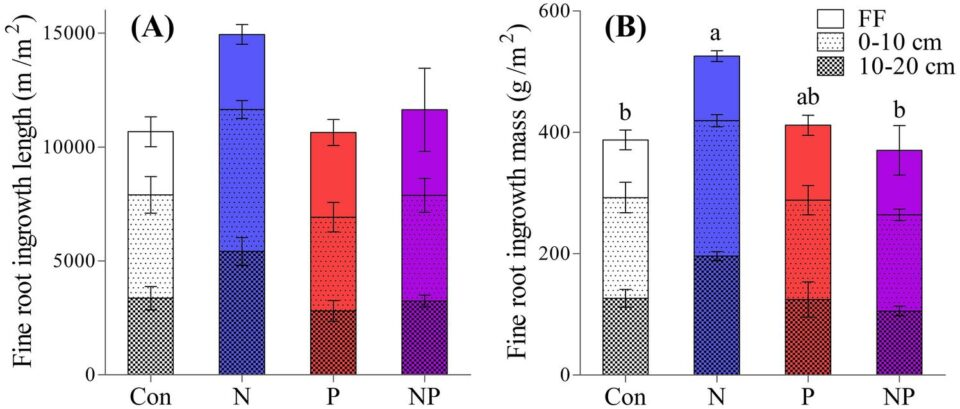{#fig-ingrowth}

## Questions for further study

* What are the principal factors regulating the allocation of C to root systems and the turnover rate of fine roots in the hardwood forest?
* Can we resolve the discrepancy in estimates of fine root production between in-growth cores and minirhizotrons?
* What are the principal causes of fine root mortality? What is the role invertebrate herbivory and fungal pathogens in root death?
* What is the rate of production and turnover of woody roots?
* How are root length and biomass distributed among the orders of fine roots of the dominant tree species and different soil horizons?
* How do the root systems of trees with arbuscular mycorrhizae and ectomycorrhizae interact in various soil horizons of the northern hardwood forest? How will these interactions respond to environmental changes?
* How does nutrient uptake by tree roots respond to environmental changes especially climate and pollutant deposition?
* How does rhizosphere carbon flux influence soil nutrient availability and nutrient acquisition by forest trees?

## Access Data

* Fahey, T. 2019. Fine Root Data at the Hubbard Brook Experimental Forest, 1998 and 2013 collections ver 1. Environmental Data Initiative. https://doi.org/10.6073/pasta/c8bd8a99fc7c99de07995c456fa5c601.

## References

Atkin, O. K., Edwards, E. J., & Loveys, B. R. (2000). Response of root respiration to changes in temperature and its relevance to global warming. <em>New Phytologist, 147</em>(1), 141–154. <a href="https://doi.org/10.1046/j.1469-8137.2000.00683.x">https://doi.org/10.1046/j.1469-8137.2000.00683.x</a>

Bae, K., Fahey, T. J., Yanai, R. D., & Fisk, M. C. (2015). Soil nitrogen availability affects belowground carbon allocation and soil respiration in northern hardwood forests of New Hampshire. <em>Ecosystems, 18</em>(7), 1179–1191. <a href="https://doi.org/10.1007/s10021-015-9892-7">https://doi.org/10.1007/s10021-015-9892-7</a>

Bolan, N. S. (1991). A critical review on the role of mycorrhizal fungi in the uptake of phosphorus by plants. <em>Plant and Soil, 134</em>(2), 189–207. <a href="https://doi.org/10.1007/BF00012037">https://doi.org/10.1007/BF00012037</a>

Burton, A. J., Pregitzer, K. S., Zogg, G. P., & Zak, D. R. (1998). Drought reduces root respiration in sugar maple forests. <em>Ecological Applications, 8</em>(3), 771–778. <a href="https://doi.org/10.1890/1051-0761(1998)008[0771:DRRRIS]2.0.CO;2">https://doi.org/10.1890/1051-0761(1998)008[0771:DRRRIS]2.0.CO;2</a>

Campbell, J. L., Socci, A. M., & Templer, P. H. (2014). Increased nitrogen leaching following soil freezing is due to decreased root uptake in a northern hardwood forest. <em>Global Change Biology, 20</em>(8), 2663–2673. <a href="https://doi.org/10.1111/gcb.12532">https://doi.org/10.1111/gcb.12532</a>

Cleavitt, N. L., Fahey, T. J., Groffman, P. M., Hardy, J. P., Henry, K. S., & Driscoll, C. T. (2008). Effects of soil freezing on fine roots in a northern hardwood forest. <em>Canadian Journal of Forest Research, 38</em>(1), 82–91. <a href="https://doi.org/10.1139/X07-133">https://doi.org/10.1139/X07-133</a>

Comerford, D. P., Schaberg, P. G., Templer, P. H., Socci, A. M., Campbell, J. L., & Wallin, K. F. (2013). Influence of experimental snow removal on root and canopy physiology of sugar maple trees. <em>Oecologia, 171</em>(1), 261–269. <a href="https://doi.org/10.1007/s00442-012-2409-3">https://doi.org/10.1007/s00442-012-2409-3</a>

Coutts, M. P. (1983). Root architecture and tree stability. <em>Plant and Soil, 71</em>(1), 171–188. <a href="https://doi.org/10.1007/BF02182666">https://doi.org/10.1007/BF02182666</a>

Davidson, E. A., Belk, E., & Boone, R. D. (1998). Soil water content and temperature as independent or confounded factors controlling soil respiration. <em>Global Change Biology, 4</em>(2), 217–227. <a href="https://doi.org/10.1046/j.1365-2486.1998.00128.x">https://doi.org/10.1046/j.1365-2486.1998.00128.x</a>

Eshel, A., & Beeckman, T. (Eds.). (2013). <em>Plant roots: The hidden half</em>. CRC Press.

Fahey, T. J., & Hughes, J. W. (1994). Fine root dynamics in a northern hardwood forest ecosystem. <em>Journal of Ecology, 82</em>, 533–548. <a href="https://doi.org/10.2307/2261262">https://doi.org/10.2307/2261262</a>

Fahey, T. J., Heinz, A. K., Battles, J. J., Fisk, M. C., Driscoll, C. T., Blum, J. D., & Johnson, C. E. (2016). Fine root biomass declined following restoration of soil calcium. <em>Canadian Journal of Forest Research, 46</em>(5), 738–744. <a href="https://doi.org/10.1139/cjfr-2015-0390">https://doi.org/10.1139/cjfr-2015-0390</a>

Fahey, T. J., Hughes, J. W., Pu, M., & Arthur, M. A. (1988). Root decomposition and nutrient flux following whole-tree harvest. <em>Forest Science, 34</em>(3), 744–768.

Fahey, T. J., Jacobs, K. R., & Sherman, R. E. (2012). Fine root turnover estimated by 13C labeling. <em>Canadian Journal of Forest Research, 42</em>(10), 1792–1795. <a href="https://doi.org/10.1139/x2012-111">https://doi.org/10.1139/x2012-111</a>

Fahey, T. J., Siccama, T. G., Driscoll, C. T., Likens, G. E., Campbell, J., Johnson, C. E., Battles, J. J., Aber, J. D., Cole, J. J., Fisk, M. C., & Groffman, P. M. (2005a). The biogeochemistry of carbon at Hubbard Brook. <em>Biogeochemistry, 75</em>(1), 109–176. <a href="https://doi.org/10.1007/s10533-004-6321-y">https://doi.org/10.1007/s10533-004-6321-y</a>

Fahey, T. J., Tierney, G. L., Fitzhugh, R. D., Wilson, G. F., & Siccama, T. G. (2005b). Soil respiration and soil carbon balance in a northern hardwood forest. <em>Canadian Journal of Forest Research, 35</em>(2), 244–253. <a href="https://doi.org/10.1139/x04-170">https://doi.org/10.1139/x04-170</a>

Fitter, A. H. (1982). Morphometric analysis of root systems. <em>Plant, Cell and Environment, 5</em>(4), 313–322. <a href="https://doi.org/10.1111/j.1365-3040.1982.tb00914.x">https://doi.org/10.1111/j.1365-3040.1982.tb00914.x</a>

Gaudinski, J. B., Trumbore, S. E., Davidson, E. A., Cook, A. C., Markewitz, D., & Richter, D. D. (2001). The age of fine-root carbon in three forests. <em>Oecologia, 129</em>(3), 420–429. <a href="https://doi.org/10.1007/s004420100752">https://doi.org/10.1007/s004420100752</a>

Hendrick, R. L., & Pregitzer, K. S. (1992). The demography of fine roots. <em>Ecology, 73</em>(3), 1094–1104. <a href="https://doi.org/10.2307/1940173">https://doi.org/10.2307/1940173</a>

Hendrick, R. L., & Pregitzer, K. S. (1997). Fine root demography and the soil environment. <em>Ecoscience, 4</em>(1), 99–105.

Jackson, R. B., Canadell, J., Ehleringer, J. R., Mooney, H. A., Sala, O. E., & Schulze, E. D. (1996). A global analysis of root distributions. <em>Oecologia, 108</em>(3), 389–411. <a href="https://doi.org/10.1007/BF00333714">https://doi.org/10.1007/BF00333714</a>

Joslin, J. D., Wolfe, M. H., & Hanson, P. J. (2001). Factors controlling root elongation timing. <em>Plant and Soil, 228</em>(2), 201–212.

Lilleskov, E. A., Fahey, T. J., Horton, T. R., & Lovett, G. M. (2002). Ectomycorrhizal fungal community change across nitrogen gradients. <em>Ecology, 83</em>(1), 104–115.

McCormack, M. L., et al. (2015). Redefining fine roots improves understanding of belowground processes. <em>New Phytologist, 207</em>(3), 505–518. <a href="https://doi.org/10.1111/nph.13363">https://doi.org/10.1111/nph.13363</a>

Mokany, K., Raison, R. J., & Prokushkin, A. S. (2006). Root:shoot ratios in terrestrial biomes. <em>Global Change Biology, 12</em>(1), 84–96. <a href="https://doi.org/10.1111/j.1365-2486.2005.001045.x">https://doi.org/10.1111/j.1365-2486.2005.001045.x</a>

Norby, R. J., & Jackson, R. B. (2000). Root dynamics and global change. <em>New Phytologist, 147</em>(1), 3–12. <a href="https://doi.org/10.1046/j.1469-8137.2000.00692.x">https://doi.org/10.1046/j.1469-8137.2000.00692.x</a>

Phillips, R. P., & Fahey, T. J. (2005). Rhizosphere carbon flux patterns. <em>Global Change Biology, 11</em>(6), 983–995. <a href="https://doi.org/10.1111/j.1365-2486.2005.00954.x">https://doi.org/10.1111/j.1365-2486.2005.00954.x</a>

Phillips, R. P., & Fahey, T. J. (2007). Fertilization effects on fine root biomass. <em>New Phytologist, 176</em>(3), 655–664. <a href="https://doi.org/10.1111/j.1469-8137.2007.02200.x">https://doi.org/10.1111/j.1469-8137.2007.02200.x</a>

Phillips, R. P., & Fahey, T. J. (2008). Soil fertility and rhizosphere effects. <em>Soil Science Society of America Journal, 72</em>(2), 453–461.

Phillips, R. P., Brzostek, E., & Midgley, M. G. (2013). The mycorrhizal-associated nutrient economy. <em>New Phytologist, 199</em>(1), 41–51. <a href="https://doi.org/10.1111/nph.12221">https://doi.org/10.1111/nph.12221</a>

Shan, S., Devens, H., Fahey, T. J., Yanai, R. D., & Fisk, M. C. (2022). Fine root growth response to nitrogen addition. <em>Ecosystems</em>. <a href="https://doi.org/10.1007/s10021-021-00695-3">https://doi.org/10.1007/s10021-021-00695-3</a>

Smith, S. E., & Read, D. J. (2010). <em>Mycorrhizal symbiosis</em>. Academic Press.

Socci, A. M., & Templer, P. H. (2011). Temporal patterns of nitrogen uptake. <em>Plant Ecology & Diversity, 4</em>(2–3), 141–152.

Teskey, R. O., & Hinckley, T. M. (1981). Root growth responses to temperature and water potential. <em>Physiologia Plantarum, 52</em>(3), 363–369.

Thornley, J. H. M. (1991). A transport-resistance model of forest growth. <em>Annals of Botany, 68</em>(3), 211–226.

Tierney, G. L., & Fahey, T. J. (2002). Fine root turnover comparison methods. <em>Canadian Journal of Forest Research, 32</em>(9), 1692–1697.

Tierney, G. L., & Fahey, T. J. (2007). Estimating belowground primary productivity. In T. J. Fahey & A. K. Knapp (Eds.), <em>Principles and standards for measuring primary production</em>. Oxford University Press.

Tierney, G. L., Fahey, T. J., Groffman, P. M., Hardy, J. P., Fitzhugh, R. D., & Driscoll, C. T. (2001). Soil freezing alters fine root dynamics. <em>Biogeochemistry, 56</em>(2), 175–190.

Tierney, G. L., Fahey, T. J., Groffman, P. M., Hardy, J. P., Fitzhugh, R. D., Driscoll, C. T., & Yavitt, J. B. (2003). Environmental control of fine root dynamics. <em>Global Change Biology, 9</em>(5), 670–679.

Treseder, K. K. (2004). Mycorrhizal responses to nitrogen and phosphorus. <em>New Phytologist, 164</em>(2), 347–355.

Whittaker, R. H., Bormann, F. H., Likens, G. E., & Siccama, T. G. (1974). Forest biomass and production. <em>Ecological Monographs, 44</em>(2), 233–254.

Yanai, R. D. (1994). A steady-state model of nutrient uptake. <em>Soil Science Society of America Journal, 58</em>(5), 1562–1571.

Yanai, R. D., Fahey, T. J., & Miller, S. L. (1995). Efficiency of nutrient acquisition. In <em>Resource physiology of conifers</em> (pp. 75–103). Academic Press.

Yanai, R. D., Park, B. B., & Hamburg, S. P. (2006). Root distribution in northern hardwood stands. <em>Canadian Journal of Forest Research, 36</em>(2), 450–459.

