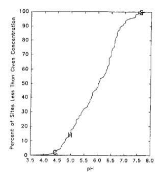
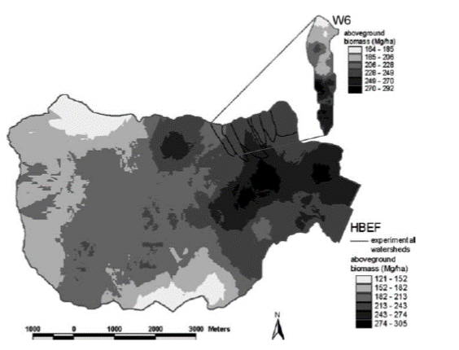
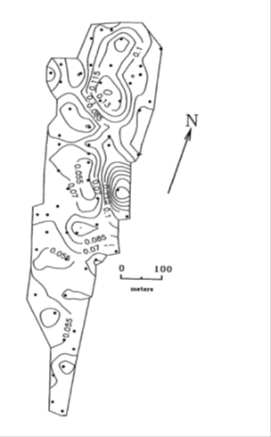
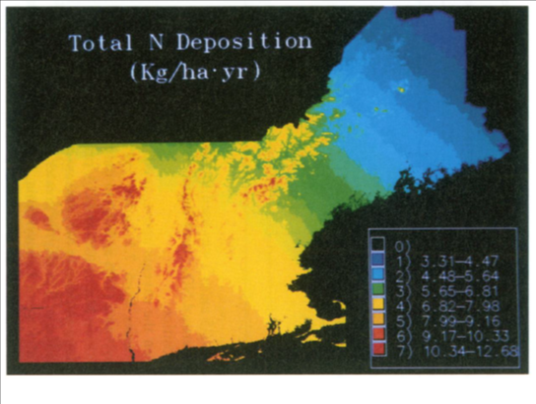
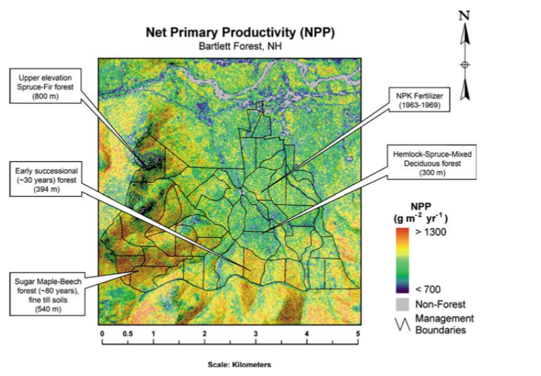
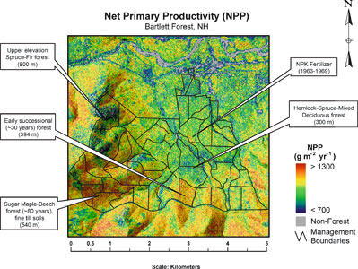
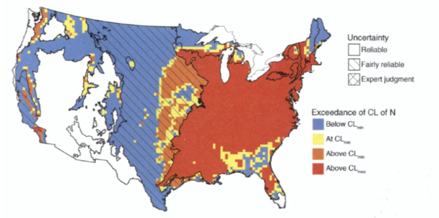

Chapter Editors: Timothy Fahey

## Introduction

Logistical considerations usually restrict the scale of direct ecological observations, and for some purposes a broader view of ecological patterns and processes is needed. Approaches for converting small-scale observations to larger spatial scales is denoted as 'scaling up.' The term scale is defined in ecological and geographic usage as the proportion a model of reality bears to the thing it represents; consider the scale of a map which is the ratio between map distance and the corresponding distance on the ground. Because we can never capture all scales of variation in representations of nature, it is important to choose an appropriate scale for the problem at hand. For example, although soil water moves at small scales through innumerable tiny pores of different dimensions and connectivity, to capture the essence of flash flooding in watersheds it is most practical to ignore that level of detail and scale up to landscape level patterns of water storage and transport, as in a contributing area model (Beven and Kirkby, 1979).

In ecology and biogeochemistry most measurements and experimental manipulations are conducted at the plot scale with the size of the plot representing a compromise between logistical practicality and the demands of statistical inference. Experimental manipulations in forests are usually conducted in plots that encompass several to many overstory trees. Of course, at HBEF experimental manipulations of small catchments at the scale of several hectares have been conducted to utilize the watershed mass-balance approach (Bormann and Likens, 1967), but these experiments have been necessarily unreplicated, limiting statistical rigor, in a trade-off with measurement accuracy. Measurement of energy and gas fluxes using eddy co-variance approaches involves the somewhat fuzzy concept of the tower footprint, an area upwind of the measurement tower whose scale and position varies depending upon air flow (Baldocchi, 2003). In all these situations (plots, footprints, watersheds) researchers quantify processes with the aim of better understanding causal mechanism that can provide insights for broader interpretation, prediction and scaling up.

The practical value of scaling up in ecological applications can scarcely be overemphasized. At the largest scale, climate change is a global phenomenon that is driven by numerous mechanisms studied at many different scales that are then aggregated to inform general circulation models and coupled land-ocean-atmosphere models for predictive purposes. At a smaller scale the quantity and quality of municipal water supplies typically are determined at the large catchment scale whereas measurements to support these determinations are made at points or plots (e.g., precipitation, pollutant loading, stream discharge, etc). Economic calculations of the costs and benefits of pollution reductions must account for broad-scale responses that can be captured, for example, by critical loads modeling (Pardo et al. 2011). In addition, basic discovery of ecological phenomena can be provided by scaling-up exercises such as the identification of thresholds or non-linearities.

Approaches for scaling up range from simple linear interpolations to complex, model-based approaches that rely on computer simulations. Underlying many scaling-up exercises is the existence of scalable relationships, i.e. some feature(s) that can be readily measured at large scale that provides a relatively accurate prediction of something else that is impossible to measure at such large scales. For example, Monteith (1972) demonstrated that photosynthetic production of vegetation (impossible to measure at large scale) is linearly related to the interception of visible radiation by the plant canopy; this scalable relationship provides the basis for global estimation of terrestrial production because radiation interception can be measured at large scales by satellite remote sensing (Ruimy et al. 1999). A further refinement is provided by the scalable relationship between gross photosynthetic rate and foliar nitrogen concentration (Evans, 1989); the latter can be estimated remotely using multispectral reflectance imagery (Martin and Aber 1997). Continuing advances in remote sensing technologies together with new computational approaches promise increasingly accurate scaling up of a wide variety of ecological and biogeochemical patterns and processes in the future.

The objective of this chapter is to introduce readers to approaches and insights provided by scaling-up exercises in the Hubbard Brook Ecosystem Study. Note that several of the examples represent work conducted at our sister site, Bartlett Experimental Forest (BEF), where the early installation of an eddy-covariance tower provided the impetus for scaling up atmospheric flux measurements that have not been, until recently, available for the HBEF (Jenkins et al. 2007).

## Gradient and Comparative Studies

The generality of ecological and biogeochemical observations from a single research site like the HBEF can be limited by the rather narrow range of site conditions encountered. In some ways the HBEF is representative of the Northern Forest region with its mixed northern hardwood forest in the rugged terrain of the White Mountains. However, the soils and surface water within the HBEF tend towards the lowest acid buffering capacity because of the particular mix of geological formations and glacial till materials (Fahey et al. 2015). Also, the entire HBEF has been continuously forested as contrasted with many regional landscapes that experienced at least a brief period of pasturing or cultivation, with consequent legacy effects on ecosystem dynamics (Compton and Boone, 2000).

In recognition of such limitations in terms of generality, researchers in the HBES have conducted comparative studies at sites representing a broader range of conditions than for the intensive HBEF site. For example, Hornbeck et al. (1997) compared acid-base chemistry of soils and surface waters between the HBEF and other regional watersheds with differing soil parent materials (@fig-scaling-streamph). They showed that source mapping of glacial till could provide reliable predictions of the acid-base status of glacially-derived soils. And on a similar gradient of sites, Park et al. (2008) demonstrated that fine root production increases linearly with soil exchangeable calcium, a result that could not be detected within the narrower range of soil Ca at HBEF. Similarly, Bae et al. (2015) compared total belowground C allocation (TBCA) of northern hardwood forests across a gradient of site fertility (HBEF being intermediate) and showed that TBCA decreased linearly with increasing nitrogen cycling rate, as explained in more detail in Ch. 7. The effects of an agricultural legacy on forest soils and vegetation composition have been evaluated by comparing the HBEF with a set of post-agricultural forests located nearby (Hamburg 1983). Both forest composition and soil characteristics were profoundly altered by agricultural activities; thus, broader application of principles of forest watershed biogeochemistry derived from the intensive studies at the HBEF have been facilitated by cross-site comparisons with contrasting regional sites (Fahey et al. 2015).

{#fig-scaling-streamph}

## Interpolation, Geostatistics and Regression Models

Perhaps the simplest approach for scaling up from plot-level

measurements is interpolation, a method of estimating new data points within the range of a set of known data points. For example, at HB the forest is measured at the valley-wide scale (3,000 ha) using a suite of 450 small (0.05 ha) permanent plots. Fahey et al. (2005) applied linear interpolation to map forest biomass and aboveground production at the valley-wide scale based on these data (@fig-scaling-biomassmap). This map illustrates some patterns of variation, such as the high forest biomass in the north-central part of the valley, that would not be otherwise evident. Similarly, Likens et al. (1994) mapped soil properties across the entire WS5 at HB on the basis of 120 quantitative soil pits (@fig-scaling-exchangableK).

{#fig-scaling-biomassmap}

{#fig-scaling-exchangableK}

A more advanced approach to spatial analysis is provided by geostatistical models that go beyond the interpolation problem by considering the studied phenomenon at unmeasured locations as a set of correlated random variables. Although a full explanation of these approaches is beyond the scope of this chapter, Schwarz et al. (2003) applied geostatistical models for the valley-wide forest plots at HB to demonstrate that the distributions of all the dominant trees are dispersal limited (i.e. limited seed distribution), with the exception of yellow birch whose tiny seeds are exceptionally widely dispersed. McGuire et al. (2014) analyzed the spatial pattern of stream-water chemistry across the entire HBEF (@fig-valleywidestreamchem) using geostatistical approaches. They observed that expected patterns of spatial dependence of flow-connected relationships (e.g., increasing homogeneity with downstream distance) occurred for some but not all solutes, suggesting different control mechanisms such as landscape vs. in-stream processes.

{#fig-valleywidestreamchem}

Another simple approach to scaling up relies on linear regression models applied in a spatial context. For example, Ollinger et al. (1993) mapped spatial patterns of atmospheric deposition in the northeastern United States based on National Atmospheric Deposition Program measurements and an empirical regression model relating element fluxes to longitude and elevation (@fig-scaling-ndepositionmap). This model has been applied to evaluate nitrogen saturation of forested landscapes of the Northeast. In a more advanced approach, Blackard et al. (2008) used plot data on forest biomass from the USDA Forest Service FIA program, together with plot attributes and other geospatial datasets (e.g., from remote sensing, see below) to map national-scale forest biomass. Such approaches could provide increased precision and accuracy for accounting purposes in global climate change accounting and regulation.

{#fig-scaling-ndepositionmap}

## Remote Sensing and Simulation Modelling

The most common approaches for scaling up ecological observations rely on remote sensing technologies based on sensors mounted on towers, aircraft, or satellites. Depending on the problem being tackled any of a number of difference sensors can be used, including passive sensors that detect reflected or emitted radiation and active sensors like radar and lidar that send a signal and detect its return. The spatial and spectral resolution varies widely among the different sensors. For example, Landsat 5 records six reflective spectral wavelength bands at a spatial resolution (pixel size) of 30m, and MODIS records seven spectral bands between 620 and 2155 nm wavelength at 250-500m spatial resolution. The data from many satellite sensors are available online. The AVIRIS sensor typically is mounted on aircraft and records 224 contiguous wavelength bands between 360 and 2500 nm at a spatial resolution of about 18 m. AVIRIS images are obtained on a project-specific basis at relatively high cost, but they can provide an exceptional quality of remote sensing information (see below). Ground-based measurements are applied to calibrate or validate such remotely sensed information.

Remote sensing has proven to be particularly powerful for scaling up observations of the changing phenology of deciduous forests. Such changes in the duration of the growing season are crucial for driving trends in the carbon balance of forest landscapes. At the HBEF ground-based, direct observations of canopy phenology have been obtained for several decades and indicate that the duration of green canopy conditions has increased by about 0.2 days/yr during recent decades (Richardson et al. 2006). How does this trend vary over broad spatial scales and how does it relate to forest carbon balances? At larger scales, satellite-based remote sensing has been applied to map regional and even global phenology (Reed et al. 1994). And to connect with carbon balances, ground-based sensing of canopy phenology using digital cameras was used on the footprint of the Bartlett Experimental Forest (BEF) eddy flux tower to relate gross primary productivity to spring and fall phenological indexes (Richardson et al. 2009). Connecting the large-scale satellite sensors to small-scale patterns of variation in phenology and ecosystem function remains a major challenge. However, recent work based in part on observations from HB and BEF, indicate the potential for accurate, real-time global monitoring of the start of the growing season at 30 m spatial resolution based on time series from multiple sensors (Melaas et al. 2014), and rapid advances can be anticipated in the near future.

In addition to their role in the global C balance, forests influence climate through effects on albedo, the reflection of solar radiation by earth??s surface. For example, Bonan (2008) suggested that expansion of forest cover in arctic regions could reinforce climate warming by reducing albedo (i.e. by shading the snow cover with its high albedo) despite the prominent role of afforestation in carbon sequestration in tree biomass. Thus, accurate, large-scale observations and predictions of land surface albedo are desired. The satellite-based MODIS sensor provides coarse scale (500m resolution) albedo measurements, including a daily snow albedo product available online. However, this product relies on calibration against a large, homogenous snow-covered surface, whereas temperate zone forested landscapes are highly heterogeneous. Burakowski et al. (2015) addressed this limitation by comparing satellite imagery against high resolution (5m) hyperspectral imagery for the BEF landscape. The albedo of the BEF deciduous forest in dormant (leaf off) conditions increased from 0.10 with no snow cover to 0.14-0.18 when snow was present under the canopy. The MODIS snow albedo products performed surprisingly well in such heterogeneous landscapes, supporting their usefulness for global climate models.

The existence of strong correlations between foliar nutrients (especially N) and the spectral reflectance of leaf tissue has provided a powerful scalable relationship for large-scale, remote sensing of forest canopy chemistry (Petersenet al. 1988). In particular, reflectance in the near-infrared (NIR) wavelengths is often highly correlated with foliar N concentrations. After calibrating the remotely-sensed NIR reflectance using field-based canopy chemistry, Ollinger and colleagues mapped the estimated canopy N concentration for the BEF (Ollinger and Smith 2005) and HBEF (@fig-scaling-canopyNmap). Notably for the latter, some spatial patterns of canopy N can be visualized including low N in conifer-dominated forests at high elevations and high N in the young forests on W2, W4, and W5 (Figure 6). Because of the close relationship between foliar N concentration and photosynthetic capacity, the potential for mapping forest carbon dynamics on the basis of this scalable relationship was demonstrated, as explained next.

{#fig-scaling-canopyNmap}

The PnET family of models (Aber and Federer 1992) has been widely applied in the HBES to simulate forest water, carbon and nutrient fluxes and to predict responses to environmental changes. Ollinger and Smith (2005) parameterized PnET with spatially-distributed canopy N content to map forest productivity in BEF (@fig-scaling-BEFNPP). A field-based validation using measured wood growth increment indicated satisfactory agreement, supporting the conclusion that N exerts primary control over landscape-level patterns of forest productivity and reinforcing concerns about ecosystem N saturation, as discussed next.

{#fig-scaling-BEFNPP}

## Critical Loads Mapping

The critical load approach to evaluating potential impacts of air pollution of ecosystems has been widely applied in Europe as a tool for negotiating pollution regulations (Posch et al. 1995). The critical load is defined as the deposition rate of a pollutant below which no harmful effect occurs over the long term. Research at HB and elsewhere has established a strong basis for evaluating critical loads of N for local forested landscapes across the US (Pardo and Driscoll 1996). To be most useful, critical load mapping is a tool that can support calculations of cost-benefit relationships for pollution mitigation efforts. Pardo et al. (2011) expanded critical load mapping to a continental scale, synthesizing information on ecosystem N processing and ecological responses for major ecoregions across the U.S. (@fig-scaling-criticalload). They observed that current N deposition exceeds the critical load over most of U.S. east of the Mississippi River. They argue convincingly for a more prominent role of critical load mapping as a policy tool in the US where this approach has seen limited application.

{#fig-scaling-criticalload}

## Conclusions

Early models of global climate change, so-called general circulation models, concentrated upon the couplings between the global ocean and atmosphere. The realization of complex feedbacks between climate change and land processes (e.g., C sequestration, aerosol production, albedo change) has stimulated the search for approaches to coupled land-air-ocean modeling. These approaches are currently constrained by inadequate understanding of the nature and causes of spatial variation in key processes like plant production, N and P cycling, and heterotrophic consumption and microbial decomposition in terrestrial landscapes. Research at the local scale provides insights into these processes, but our ability to extend this process research to regional and global scales remains limited. Continuing advances in remote sensing and computer modeling can be expected to increase the accuracy of large-scale measurements and predictions thereby reducing the high levels of uncertainty in our understanding of the risks of human-accelerated global environmental change.
Questions for Further Study

* What will the de-acidification of acidified northern forest soils mean for the future of the large temperate forest C sink over coming decades? What sort of combined experimental, remote sensing and modeling approaches could be applied to this question?
* Similarly, what about the effect of rapidly declining atmospheric N deposition?
* Explain an example of a 'scalable relationship', other than the ones described in the chapter.
* How could critical loads mapping be applied to quantify the economic cost-benefit relationship for reducing atmospheric deposition of pollutants like N?
* Satellite remote sensing measurements based on reflectance spectra like the normalized difference vegetation index (NDVI) typically saturate (i.e. show no additional change) above leaf area index (LAI) of about 3. However, LAI of the HB forest mostly exceeds 6. How could remote sensing methods be adapted to scale up spatial patterns of LAI in such high LAI forests?

## Access Data

* Battles, J.J., N. Cleavitt, and T. Fahey. 2022. Hubbard Brook Experimental Forest: Valleywide Plot Tree and Sapling Inventory – 1995, 2005, 2015 ver 6. Environmental Data Initiative. https://doi.org/10.6073/pasta/65b1f9e0111c189c68bc82083112fdeb (Accessed 2022-06-16).
* Likens, G. and D. Buso. 2019. Chemistry of Streamwater at the Hubbard Brook Experimental Forest, Valleywide Measurements, 2001 ver 2. Environmental Data Initiative. https://doi.org/10.6073/pasta/189538da2cb5d101082188d5b496d1e5 (Accessed 2022-06-16).
* Ollinger, S. and L. Lepine. 2021. Hubbard Brook Experimental Forest: Hyperspectral Foliar N map and associated field data, 2012 ver 1. Environmental Data Initiative. https://doi.org/10.6073/pasta/39436325cebb0407ea68c6b87012f968 (Accessed 2022-06-16).

References

## References

Aber, J.D. and Federer, C.A., 1992. A generalized, lumped-parameter model of photosynthesis, evapotranspiration and net primary production in tem), pp.109-176.

Baldocchi, D.D., 2003. Assessing the eddy covariance technique for evaluating carbon dioxide exchange rates of ecosystems: past, present and future. Global change biology, 9(4), pp.479-492.

Bae, K., Fahey, T.J., Yanai, R.D. and Fisk, M., 2015. Soil nitrogen availability affects belowground carbon allocation and soil respiration in northern hardwood forests of New Hampshire. Ecosystems, 18(7), pp.1179-1191.

Beven, K. J., & Kirkby, M. J. (1979). A physically based, variable contributing area model of basin hydrology/Un modèle à base physique de zone d'appel variable de l'hydrologie du bassin versant. Hydrological Sciences Journal, 24(1), 43-69.

Blackard, J.A., Finco, M.V., Helmer, E.H., Holden, G.R., Hoppus, M.L., Jacobs, D.M., Lister, A.J., Moisen, G.G., Nelson, M.D., Riemann, R. and Ruefenacht, B., 2008. Mapping US forest biomass using nationwide forest inventory data and moderate resolution information. Remote sensing of Environment, 112(4), pp.1658-1677.

Bonan, G.B., 2008. Forests and climate change: forcings, feedbacks, and the climate benefits of forests. science, 320(5882), pp.1444-1449.

Bormann, F.H. and Likens, G.E., 1967. Nutrient cycling. Science, 155(3761), pp.424-429.Pardo, L.H., Fenn, M.E., Goodale, C.L., Geiser, L.H., Driscoll, C.T., Allen, E.B., Baron, J.S., Bobbink, R., Bowman, W.D., Clark, C.M. and Emmett, B., 2011. Effects of nitrogen deposition and empirical nitrogen critical loads for ecoregions of the United States. Ecological Applications, 21(8), pp.3049-3082.

Burakowski, E.A., Ollinger, S.V., Lepine, L., Schaaf, C.B., Wang, Z., Dibb, J.E., Hollinger, D.Y., Kim, J., Erb, A. and Martin, M., 2015. Spatial scaling of reflectance and surface albedo over a mixed-use, temperate forest landscape during snow-covered periods. Remote Sensing of Environment, 158, pp.465-477.Evans, J.R., 1989. Photosynthesis and nitrogen relationships in leaves of C 3 plants. Oecologia, 78(1), pp.9-19.

Fahey, T.J., Templer, P.H., Anderson, B.T., Battles, J.J., Campbell, J.L., Driscoll, C.T., Fusco, A.R., Green, M.B., Kassam, K.A.S., Rodenhouse, N.L. and Rustad, L., 2015. The promise and peril of intensive‐site‐based ecological research: insights from the Hubbard Brook ecosystem study. Ecology, 96(4), pp.885-901.

Hamburg, S.P., 1983. Effects of forest growth on soil nitrogen and organic matter pools following release from subsistence agriculture. In 6. North American Forest Soils Conference, Knoxville (USA), Jun 1983. Dept. of Forestry, University of Tennessee.

Jenkins, J.P., Richardson, A.D., Braswell, B.H., Ollinger, S.V., Hollinger, D.Y. and Smith, M.L., 2007. Refining light-use efficiency calculations for a deciduous forest canopy using simultaneous tower-based carbon flux and radiometric measurements. Agricultural and Forest Meteorology, 143(1), pp.64-79.

Hornbeck, J.W., Bailey, S.W., Buso, D.C. and Shanley, J.B., 1997. Streamwater chemistry and nutrient budgets for forested watersheds in New England: variability and management implications. Forest Ecology and Management, 93(1), pp.73-89.

Likens, G.E., Driscoll, C.T., Buso, D.C., Siccama, T.G., Johnson, C.E., Lovett, G.M., Ryan, D.F., Fahey, T. and Reiners, W.A., 1994. The biogeochemistry of potassium at Hubbard Brook. Biogeochemistry, 25(2), pp.61-125.

McGuire, K.J., Torgersen, C.E., Likens, G.E., Buso, D.C., Lowe, W.H. and Bailey, S.W., 2014. Network analysis reveals multiscale controls on streamwater chemistry. Proceedings of the National Academy of Sciences, 111(19), pp.7030-7035.

Martin, M.E. and Aber, J.D., 1997. High spectral resolution remote sensing of forest canopy lignin, nitrogen, and ecosystem processes. Ecological applications, 7(2), pp.431-443.

Melaas, E.K., Friedl, M.A. and Richardson, A.D., 2016. Multiscale modeling of spring phenology across Deciduous Forests in the Eastern United States. Global change biology, 22(2), pp.792-805.

Monteith, J.L., 1972. Solar radiation and productivity in tropical ecosystems. Journal of applied ecology, 9(3), pp.747-766.

Ollinger, S.V. and Smith, M.L., 2005. Net primary production and canopy nitrogen in a temperate forest landscape: an analysis using imaging spectroscopy, modeling and field data. Ecosystems, 8(7), pp.760-778.Park, B.B., Yanai, R.D., Fahey, T.J., Bailey, S.W., Siccama, T.G., Shanley, J.B. and Cleavitt, N.L., 2008. Fi

Ollinger, S.V., Aber, J.D., Lovett, G.M., Millham, S.E., Lathrop, R.G. and Ellis, J.M., 1993. A spatial model of atmospheric deposition for the northeastern US. Ecological Applications, 3(3), pp.459-472.Pardo, L.H. and Driscoll, C.T., 1996. Critical loads for nitrogen deposition: case studies at two northern hardwood forests. Water, Air, & Soil Pollution, 89(1), pp.105-128.

Pardo, L.H., Fenn, M.E., Goodale, C.L., Geiser, L.H., Driscoll, C.T., Allen, E.B., Baron, J.S., Bobbink, R., Bowman, W.D., Clark, C.M. and Emmett, B., 2011. Effects of nitrogen deposition and empirical nitrogen critical loads for ecoregions of the United States. Ecological Applications, 21(8), pp.3049-3082.

Peterson, D.L., Aber, J.D., Matson, P.A., Card, D.H., Swanberg, N., Wessman, C. and Spanner, M., 1988. Remote sensing of forest canopy and leaf biochemical contents. Remote Sensing of Environment, 24(1), pp.85-108.

Posch, M., de Smet, P.A., Hettelingh, J.P. and Downing, R.J., 1995. Calculation and mapping of critical thresholds in Europe: Status report 1995.

Reed, B.C., Brown, J.F., VanderZee, D., Loveland, T.R., Merchant, J.W. and Ohlen, D.O., 1994. Variability of land cover phenology in the United States. Journal of Vegetation Science, 5(5), pp.703-714.

Richardson, A.D., Bailey, A.S., Denny, E.G., Martin, C.W. and O'Keefe, J., 2006. Phenology of a northern hardwood forest canopy. Global Change Biology, 12(7), pp.1174-1188.

Richardson, A.D., Braswell, B.H., Hollinger, D.Y., Jenkins, J.P. and Ollinger, S.V., 2009. Near‐surface remote sensing of spatial and temporal variation in canopy phenology. Ecological Applications, 19(6), pp.1417-1428.

Ruimy, A., Kergoat, L., Bondeau, A.1999. Comparing global models of terrestrial net primary productivity (NPP): Analysis of differences in light absorption and light‐use efficiency. Global Change Biology, 5(S1), pp.56-64.

Compton, J.E. and Boone, R.D., 2000. Long‐term impacts of agriculture on soil carbon and nitrogen in New England forests. Ecology, 81(8), pp.2314-2330.

Schwarz, P.A., Fahey, T.J. and McCulloch, C.E., 2003. Factors controlling spatial variation of tree species abundance in a forested landscape. Ecology, 84(7), pp.1862-1878.
