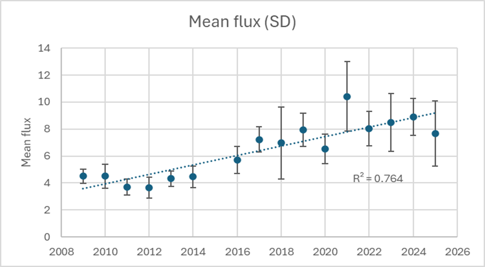
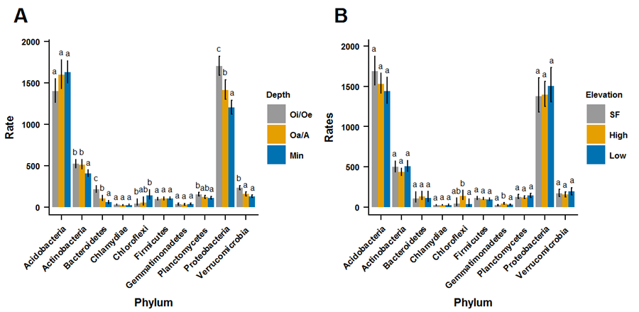
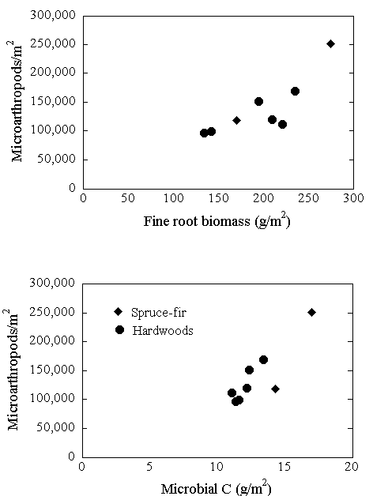

# Where do the leaves go: The importance of soil biology in the forest ecosystem.

Chapter Editors: Peter Groffman and Melany Fisk

One of the great mysteries in the forest at Hubbard Brook is where do the leaves go? Each autumn, there is a massive transfer of mass, carbon and nutrients from the trees to the forest floor via “litterfall”, yet the forest is not filling up with leaves. Where do they go? The topic of this chapter is how microbes and other components of the soil biological community decompose these leaves; returning most of the carbon to the atmosphere, facilitating cycling of nutrients back to the trees, and making most of the mass disappear.

An even deeper mystery is why does so much of the productivity of the forest end up in this humble detrital recycling? Approximately 80% of the energy that the forest “fixes” from the sun ends up in litterfall. Why does the forest ecosystem “invest” so much of its energetic “capital” in detritus? The main answer is that the recycling or “mineralization” of nutrients contained in litterfall is essential to the sustained productivity of the forest. While trees can retain (or resorb) some portion of the nutrients contained in leaves before the fall, they lose a significant amount of their nutrient capital in litterfall. These nutrients must be recycled back to the trees through the decomposition process that returns most of the carbon in the leaves back to the atmosphere and releases the nutrients to the soil environment where they can be taken up by trees. Soil biology is therefore central to the sustained productivity of the ecosystem. The specific nutrient transformation processes are covered in other chapters; here we will focus on the organisms that carry out these processes.

It is important to note that not ALL of the litterfall carbon returns to the atmosphere. A small remainder (\<1%) of each years’ litterfall crop becomes part of the soil organic matter pool that is essential for maintaining the physical and chemical properties of the soil that support biological activity and habitat for plant roots and soil micro- and macroorganisms. Transformation of litter into soil organic matter is a complex process requiring interactions between soil fauna and microbes. Soil biology is thus essential to establishment and maintenance of ecosystem structure and biodiversity.

Soil biological processes are also key regulators of ecosystem response to disturbance. The activity and growth of microorganisms respond rapidly and dynamically to environmental changes. Disturbances that alter the tree canopy change soil temperature and moisture, which are key drivers of microbial activity and growth. Canopy disturbances that reduce plant uptake can lead to marked increases in leaching losses from the ecosystem because if the nutrients released through decomposition and nutrient mineralization processes are not taken up by plants, they are vulnerable to loss in water cascading from the atmosphere, through the soil, and towards streams. This flux of water is also increased by canopy disturbance. Microbial processes have been central to the nutrient losses following disturbance that have been well studied at Hubbard Brook (Bormann and Likens 1967, Likens et al. 1969). These processes also underlie much of the nature and extent of ecosystem response to many aspects of global environmental change such as changes in atmospheric chemistry, temperature and precipitation (Shaver et al. 2000, Driscoll et al. 2001, Driscoll et al. 2003, Melillo et al. 2011).

In this chapter we will explore who are the main biological actors in the soil that carry out these essential decomposition and nutrient cycling functions, how we have studied them at Hubbard Brook, and what are the key ecosystem-scale dynamics that affect and are affected by these actors.

## Who is there?

The biomass and diversity of organisms in the soil is surprisingly large. Soil is often referred to as “the poor person’s rain forest” (Giller 1996) due to the large number of species, the vast majority of which are unidentified, that are commonly present. Surface soils often contain up to 1 billion bacterial cells and many meters of fungal hyphae per gram of soil (Paul 2007). The large biomass of soil creates a conundrum in that the amount of carbon required to support this biomass is often very large relative to the amount of carbon that is fixed by the plants in any given year. This reasoning has led to the assumption that the vast majority of the soil biomass is inactive or in some type of resting state. In some cases analysis of soil metabolic states does not support this assumption (Brookes et al. 1983), suggesting that our ideas about the maintenance requirements of soil organisms, i.e., how much carbon is required to keep them alive, which are based on laboratory cultures, are wildly incorrect. Other work suggests that 90% or more of microbial biomass is inactive (Anderson and Domsch 1985, Blagodotskaya and Kuzyakov 2013), made up of dormant (Lennon and Jones 2011) and dead microorganisms (Carini et al. 2016). Resolving these questions about the physiological status of microorganisms in soil would help us to evaluate whether our measurements of biomass and taxonomic composition are actually representative of the organisms contributing to ecosystem function.

The abundance and diversity of the soil biota has been very challenging to study. Direct microscopic analysis of soil is complicated by the density and complexity of the medium, so it has been very difficult to make direct observations of soil organisms, especially in situ. In addition to imperfect estimates produced by direct microscopy (Stahl et al. 1995), a variety of extractions methods have been employed for quantifying the size of the soil microbial biomass (Tate 2017). The methods involve extracting some component of the biomass, e.g, lipids, or chloroform-labile carbon, and making some assumption about extraction efficiency to produce an estimate of biomass. These methods, though widely used, produce variable results due to uneven extraction efficiency for different components of the biomass and in different types of soils.

The diversity of the soil biological community has been ever more challenging to characterize. Many soil microorganisms have been isolated and cultured, but these approaches have typically favored species that grow rapidly on rich media such as nutrient broth; such conditions are very rarely found in soil. We thus have the most information about organisms that are almost certainly not dominant actors in the soil ecosystem. New methods for the extraction and analysis of DNA and RNA from soil have revolutionized our ability to characterize soil microbial communities. However, these approaches have not solved the problem of identifying the slow-growing, difficult to culture organisms (Zimmerman et al. 2014). Without organisms in culture, our understanding of key life history and physiological traits of each species remains limited, as does our ability to translate the species lists generated by molecular genetic approaches into knowledge of the ecology of the organisms comprising these communities and mediating decomposition and nutrient cycling processes. Moreover, we have no guarantee that the DNA that we extract from soil comes from organisms that are active in the community. Establishing relationships between microbial community composition measured with molecular methods, and specific microbial activities and functions has been difficult (Prosser 2012).

The miniscule size of soil microorganisms contributes to challenge of untangling community-level controls of microbial processes. The soil sampling schemes typically used to study the decomposition and nutrient recycling processes carried out by microorganisms are appropriately designed to capture the spatial and temporal scales relevant to plant distributions and growth, as the plants are the primary producers that supply the energy to drive C and nutrient recycling. However, the responsible prokaryote and fungal communities operate on vastly different spatio-temporal scales that can be difficult for us to perceive. As a consequence, our measurements of microbial processes correspond with the activities of a combination of many, many microbial communities, such that direct links are questionable between those communities and the measured processes. For instance, sampling the prokaryote "community" in a 0.01 m2 plot is comparable to what we would find if we sampled plants at the scale of the entire United States -- not very illuminating if we try to link that measure of the plant community to its function in ecosystems. Careful consideration of these differences can help us to interpret results of biotic community characterizations with respect to the soil processes of interest.

The soil fauna, a wide variety of invertebrates, are widely recognized as a catalyst for decomposition and a regulator of the structure and function of the microbial biomass, but they have received much less attention than the microbial community because they are difficult to identify and study in the laboratory (Coleman et al. 2004). Fauna are fundamental to decomposition, facilitating physical degradation and increasing microbial access to detritus. They can also directly regulate microbial communities through predation and influence nutrient availability and uptake by plants. Given their sensitivity to climate (Christenson et al. 2010, Templer et al. 2012) and soil chemical conditions (Oulehle et al. 2011, Beier et al. 2012), and the capacity of changes in faunal communities (e.g., earthworm colonization) to fundamentally alter the structure and function of ecosytems (Bohlen et al. 2004), soil fauna deserve a great deal mor study (Brussaad 1998).

While fauna are relatively easy to extract from soil using simple heat sources (e.g., light bulbs) that drive fauna from samples into collection vessels Edwards 1991 they are tedious to identify. Efforts to simplify classification into functional guilds have facilitated analysis of relationships between the structure of faunal communities and ecosystem functions such as decomposition (Brussaard 1998). Still, analysis of faunal communities, and how their response to environmental change regulates ecosystem response to these changes, has lagged behind analysis of microbial communities, which has been transformed by the new molecular approaches mentioned above. Soil biology measurements at Hubbard Brook

## Microbial biomass

While microbial processes were long recognized as central to the watershed-scale biogeochemistry that was the focus of much of the research at Hubbard Brook, systematic long-term monitoring of microbial biomass and activity did not begin until 1994 (Bohlen et al. 2001) (@fig-MicrobialCarbon). Since that time, soil samples (split into Oie, Oa and mineral soil horizons) have been taken along an elevation gradient in the Bear Brook watershed, just west of watershed 6 in mid-summer (early July) in all years and three times per year (early spring/May, mid-summer (July), fall (October) some years. Sites for long-term monitoring of microbial biomass and activity were paired with long-term litterfall sampling sites (Hughes and Fahey 1994) and include low elevation hardwood, mid-elevation hardwood, high elevation hardwood and spruce/fir vegetation zones.

The suite of microbial biomass and activity measurements includes microbial biomass carbon and nitrogen content, microbial respiration, potential net N mineralization and nitrification and denitrification potential. Ancillary measurements include pools of inorganic nitrogen (ammonium, nitrate), soil pH, soil moisture, and soil organic matter content. Microbial biomass carbon and nitrogen content are measured using the chloroform fumigation-incubation method (Jenkinson and Powlson 1976, Tate 2017). In this method, soil samples are fumigated with chloroform to kill and lyse microbial cells. Samples are then inoculated with a small aliquot (1% by weight) of fresh soil and incubated for 10 days in the laboratory. Microorganisms in the fresh soil rapidly colonize the soil and metabolize the lysed cells, releasing carbon dioxide and inorganic nitrogen. The “flushes” of carbon dioxide and inorganic nitrogen produced during this incubation are directly proportional to the carbon and nitrogen content of the microbial biomass in the original sample. This indirect approach to quantifying the size of the microbial biomass produces variable results in different soils due to differences in the effectiveness of the chloroform fumigation, the nature and extent of the recolonization of the microbial population, and the ability of this population to access and metabolize the carbon and nitrogen released by the fumigation.

At the same time that fumigated and inoculated samples are incubating, parallel incubations of unfumigated soil provide estimates of microbial respiration, potential net nitrogen mineralization, and potential net nitrification. These process rates are calculated from the accumulation of carbon dioxide, ammonium plus nitrate, and nitrate only respectively. Results from these incubations can also be expressed as pools of labile carbon and nitrogen. Samples are also analyzed for denitrification potential using a short term anaerobic assay (Groffman et al. 1999).

Microbial biomass carbon (@fig-MicrobialCarbon) and nitrogen (@fig-MicrobialNitrogen) content vary markedly with soil horizon, with higher concentrations in the Oie (surface, less decomposed organic material) than in the Oa (just below the Oie, more decomposed organic material) and much lower levels in the top 10 cm of the mineral soil. These differences closely track the organic matter content of the different horizons and are consistent with ideas that microbial biomass represents approximately 1% of the total soil organic carbon pool (Anderson and Domsch 1989). The C:N (F@fig-MicrobialCN) of the microbial biomass does not consistently vary with soil horizon.

::: {#fig-MicrobialCarbon}
<iframe src="https://hubbardbrook.github.io/soilBiology/f1_micro_biomass_C.html" width="100%" height="600" style="border: none;">

</iframe>

Microbial biomass carbon in the Oie, Oa and mineral soil horizons in the Bear Brook watershed (west of the reference watershed 6) at the Hubbard Brook Experimental Forest. Samples were taken in mid-summer (early July) each year from four sites along an elevation gradient ranging from 200 to 700 meters. This figure is updated with current data available in the Environmental Data Initiative Repository (EDI; https://portal.edirepository.org). Hover over graph to access interactive controls available at the top right (zoom/pan/etc).

:::

::: {#fig-MicrobialNitrogen}

<iframe src="https://hubbardbrook.github.io/soilBiology/f2_micro_biomass_N.html" width="100%" height="600" style="border: none;">
</iframe>

Microbial biomass nitrogen in the Oie, Oa and mineral soil horizons in the Bear Brook watershed (west of the reference watershed 6) at the Hubbard Brook Experimental Forest. Samples were taken in mid-summer (early July) each year from four sites along an elevation gradient ranging from 200 to 700 meters. This figure is updated with current data available in the Environmental Data Initiative Repository (EDI; https://portal.edirepository.org). Hover over graph to access interactive controls available at the top right (zoom/pan/etc).

:::

Temporal patterns in microbial biomass are difficult to discern. Microbial biomass carbon appeared to be declining in the 1990s at the time sampling began and then appears to increase in the 2000s, but there is much year to year variation. Much of the variation is likely driven by soil moisture conditions at the time of sampling, even though care is taken to avoid sampling at particularly wet or particularly dry conditions. These results highlight that it is difficult to track annual variation in a variable based on one-time sampling.

::: {#fig-MicrobialCN}

<iframe src="https://hubbardbrook.github.io/soilBiology/f3_micro_CN.html" width="100%" height="600" style="border: none;">
</iframe>

Microbial C:N in the Oie, Oa and mineral soil horizons in the Bear Brook watershed (west of the reference watershed 6) at the Hubbard Brook Experimental Forest. Samples were taken in mid-summer (early July) each year from four sites along an elevation gradient ranging from 200 to 700 meters. This figure is updated with current data available in the Environmental Data Initiative Repository (EDI; https://portal.edirepository.org). Hover over graph to access interactive controls available at the top right (zoom/pan/etc).

:::

::: {#fig-MicrobialRespiration}

<iframe src="https://hubbardbrook.github.io/soilBiology/f4_micro_respiration.html" width="100%" height="600" style="border: none;">
</iframe>

Microbial respiration in the Oie, Oa and mineral soil horizons in the Bear Brook watershed (west of the reference watershed 6) at the Hubbard Brook Experimental Forest. Samples were taken in mid-summer (early July) each year from four sites along an elevation gradient ranging from 200 to 700 meters. This figure is updated with current data available in the Environmental Data Initiative Repository (EDI; https://portal.edirepository.org). Hover over graph to access interactive controls available at the top right (zoom/pan/etc).

:::

An increase in microbial biomass carbon would be consistent with long-term declines in watershed nitrogen export (see Nitrogen Cycling chapter) that have been observed at Hubbard Brook and with ideas about a climate and carbon-driven nitrogen oligotrophication that has developed since the 1990’s (Durán et al. 2016, Groffman et al. 2018). These ideas center on increases in the flow of carbon from the atmosphere through vegetation and into soils driven by increases in atmospheric CO2 (Drake et al. 2011, Zak et al. 2011) and from the forest floor into soils by deacidificaton (Oulehle et al. 2011). Increases in carbon flow to soil should lead to increases in microbial biomass and respirable carbon (or soil respiration, @fig-MicrobialRespiration), which would increase demand for microbial biomass nitrogen and the C:N of the microbial biomass. While there are hints of such increases in our long-term data, more detailed and high resolution studies are needed to determine if these dynamics are occurring at Hubbard Brook. 

We have most recently observed a striking increase in emissions of CO2 from soils in and around Hubbard Brook (Mann et al. 2024, Possinger et al. 2025). Long-term field monitoring of soil respiration at HBEF and accompanying the MELNHE experiment at a suite of sites in the region both indicate a doubling of CO2 emissions beginning in about 2012-2013 and continuing to the present (@fig-co2flux). These observations are consistent with the hypothesized increased flow of C through trees to soil. The mystery now is what mechanisms can account for such an abrupt change in soil C cycling. More detailed and high resolution studies are needed to determine the causes of these dynamics in the soils at Hubbard Brook. 

{#fig-co2flux}

The likelihood that dead microbial biomass is a substantial contribution to persistent pools of organic C and nutrients in soils (Kallenbach et al. 2016) highlights the need to complement biomass with turnover measures if we are to understand the microbial role in nutrient sequestration in these soils (Fisk et al. 2015).

The long-term microbial biomass data provide a context for evaluating microbial populations responsible for specific microbial processes, such as denitrification. For example, our long-term data on denitrification potential (@fig-DenitrificationBB) are based on an enzyme assay that estimates the biomass of denitrifying enzymes present in soil at the time of sampling (Smith and Tiedje 1979). The ratio of denitrification potential to microbial biomass carbon (@fig-DenitrificationDEA) thus provides information on spatial and temporal variation in the importance of this form of anaerobic nitrate-based respiration in the soils at Hubbard Brook. Declining trends in both denitrification potential and the ratio of denitrification potential to microbial biomass carbon are consistent with ideas and data (including a decline in nitrous oxide emissions from soil) showing nitrogen oligotrophication at the site (Groffman et al. 2018).

::: {#fig-DenitrificationBB}

<iframe src="https://hubbardbrook.github.io/soilBiology/f5_micro_Denitrification.html" width="100%" height="600" style="border: none;">
</iframe>

Denitrification potential in the Oie, Oa and mineral soil horizons in the Bear Brook watershed (west of the reference watershed 6) at the Hubbard Brook Experimental Forest. Samples were taken in mid-summer (early July) each year from four sites along an elevation gradient ranging from 200 to 700 meters. This figure is updated with current data available in the Environmental Data Initiative Repository (EDI; https://portal.edirepository.org). Hover over graph to access interactive controls available at the top right (zoom/pan/etc).

:::

::: {#fig-DenitrificationDEA}

<iframe src="https://hubbardbrook.github.io/soilBiology/f6_denitrification_biomass_C.html" width="100%" height="600" style="border: none;">
</iframe>

Denitrification potential (DEA): Microbial biomass C (BIOC) in the Oie, Oa and mineral soil horizons in the Bear Brook watershed (west of the reference watershed 6) at the Hubbard Brook Experimental Forest. Samples were taken in mid-summer (early July) each year from four sites along an elevation gradient ranging from 200 to 700 meters. This figure is updated with current data available in the Environmental Data Initiative Repository (EDI; https://portal.edirepository.org). Hover over graph to access interactive controls available at the top right (zoom/pan/etc).

:::

Despite abundant information on microbial activity in the soils at HBEF, relatively little is known about its microbial community. For simplicity studies of the bacterial community typically report patterns at the phylum level. One study based on sequences of cloned fragments in mineral soil found that Acidobacteria were the dominant phylum (Sridevi et al. 2012). More recently, bacterial community analysis, based on 16s rRNA genes (Roco, unpublished data), indicates that members of the Proteobacteria and Acidobacteria phyla are equally dominant in soils at Hubbard Brook, ranging from 30-40%, across all of the metagenomes (@fig-SoilBiology_BacterialPhyla). Members of the Actinobacteria comprised about 10% of the reads. Other phyla, such as the Verrucomicrobia, Planctomycetes, and Bacteroidetes made up about 5% of the total. Surprisingly, no significant differences in the occurrence of the top three phyla were detected across three elevation zones. The lack of differences between the samples from different elevations is unexpected given the thicker Oi/Oe and Oa/A layers in the spruce-fir zone than in the hardwood forest at Hubbard Brook.

{#fig-SoilBiology_BacterialPhyla}

Significant differences in bacterial community composition were detected when grouped by soil depth or horizon. For example, Proteobacteria were more prevalent in the organic Oi/Oe layer than in the mineral B soil horizon (p \< 0.05), whereas the Actinobacteria showed the opposite trend, being more abundant in the mineral B layer. The predominance of Acidobacteria in the mineral B soil seems inconsistent with its less acidic pH compared with the more acidic Oi/Oe and Oa/A layers. Presumably, the oligotrophic Acidobacteria (Koyama et al. 2014) thrive in the low nutrient conditions in the mineral B soil, as contrasted with the copiotrophic (nutrient demanding) Proteobacteria (Koyama et al. 2014) that prefer the more fertile organic soil layers. Although Bacteroidetes had a low relative abundance, they exhibited the greatest proportion in Oi/Oe layer, also consistent with their copiotrophic lifestyle.

Fungi are a broad group including mycorrhizal and saprotrophic organisms and encompassing wide variation in traits relating to the ecology and the functions of these organisms. No systematic surveys have been reported for Hubbard Brook; however, fungi in the surface 5 cm of temperate deciduous forests sampled by Tedersoo et al. (2014) were comprised mostly of members of the Ascomycota and Basidiomycota, in similar proportions, with much a much smaller fraction represented by members of the Zygomycota in the groups Mortierellaomycotina and Mucormycotina. Within these broader groups, the Agaricomycetes accounted for over 50% of total taxa detected, with the remainder classified (in decreasing order) in the Mortierellomycotina, Sordariomycetes, Eurotiomycetes, Leotiomycetes, Dothiodeomycetes, Tremellomycetes, and Mucoromycotina. Many of these taxonomic groups contain both mycorrhizal and saprotrophic fungi. Fungal distributions in forest soils exhibit strong vertical gradients, with saprotrophic fungi dominating in surface organic horizons and mycorrhizal fungi dominating in mineral soils (Lindahl et al. 2007).

Mycorrhizal fungi in the northern hardwood forests at Hubbard Brook belong to the arbuscular-mycorrhizal (AM) and ectomycorrhizal (EM) fungi, both of which colonize fine roots of trees and function as an extension of root systems to facilitate acquisition of belowground resources. AM fungi associate primarily with maples, ash, basswood, and cherry in northern hardwood forests. These fungal associates rely entirely on their tree hosts for C and energy, and are thought to contribute most substantially to the P nutrition of their hosts (Smith and Read 2010). EM fungi associate primarily with beech, birches, oaks, hemlock, spruce, and fir in northern hardwood forests. EM fungi can contribute some to organic matter decomposition, and are most recognized for their role in N nutrition of their hosts (Smith and Read 2010).

Mycorrhizal fungal communities are far more diverse than those of their host trees, and individual fungal species do not have strong tree species-specific host preferences. However the AM vs EM composition of the mycorrhizal community will be sensitive to ongoing changes in forest composition at Hubbard Brook, including those arising from environmental changes that favor oak expansion or sugar maple decline, or the impact of pathogens and pests such as beech bark disease or the emerald ash borer. Moreover, the N status of ecosystems is known to strongly influence species composition of both AM and EM fungi (Treseder et al. 2018, vanDiepen et al. 2011, Morrison et al. 2016).

Saprotrophic fungi include those that decompose wood, leaf litter, and soil organic matter. Distinct communities can occur in these different habitats, corresponding with ecological traits of the organisms and also variation among species in the enzymatic pathways that dictate the types of organic compounds that can be decomposed (Dix and Webster 1995, Deacon et al. 2006, vanDiepen et al. 2017). The long threadlike hyphal growth form of fungi means that they can extend between habitats, translocating resources from soils to litter (Fahey et al. 2011, Li and Fahey 2013) and from soil and litter to wood (Peay et al. 2016).

Spatial distributions of fungi in forests is heterogeneous with large changes in species composition across the forest floor (Stursova et al. 2016). While spatial distributions of individual species in forests can relate to those of individual trees, heterogeneity at this scale is accentuated by several factors. These include the patchiness of woody litter resources which creates islands of substrate for species capable of wood decomposition, the tendency for fungal spores not to disperse far from their sources (Peay et al. 2016), and the ability of early-colonizing species to drive the trajectory of community development (i.e. "priority effects"; Fukami et al. 2010). Availability of wood substrates promotes fungal diversity in northern hardwood forests (Dove and Keeton 2015), suggesting that management history of northeastern hardwood forests can influence fungal communities. Spatial heterogeneity of resources, combined with priority effects and wide variation among species in their contributions to decomposition processes, contribute to heterogeneity in decomposition and nutrient recycling processes that is strongly linked to community composition at spatial scales that are much smaller than those of plant species distributions. These patterns have been found for woody and root litter in northeastern forests. including Hubbard Brook (Fisk et al. 2011).

Long-term enrichment of N from anthropogenic deposition is likely one of the most important factors altering fungal communities at Hubbard Brook. Long-term N deposition experiments in hardwood forests show marked changes in communities of AM fungi, EM fungi, and saprotrophs in response to N enrichment, accompanied by increases in saprotrophic relative to mycorrhizal fungal abundance (van Diepen et al. 2011 Morrison et al. 2016).

## Soil fauna

::: {style="float: right; width: 40%; margin-right: 1em;"}

{#SoilBiology_Arthropods}

:::

The long-term microbial biomass carbon and nitrogen monitoring sites have been used as a platform for analysis of soil faunal populations at Hubbard Brook. Fisk et al. 2010 extracted microarthropods from soil cores collected from the Oe + Oa layers of the forest floor. Microarthropods in all samples were separated into four major groups for enumeration: Collembola, and three Acari suborders (Mesostigmata, Prostigmata, and Oribatei). These data and the long-term microbial biomass and activity data were used to explore relationships among detrital C sources, decomposer microorganisms, microarthropod abundance, and nitrogen availability across the landscape. Microarthropod abundances in the forest floor were very high (Oe + Oa horizons; 106,000/m2 to 184,500/m2) and varied with elevation, with consistently higher numbers in low-elevation hardwoods and upper conifer zones and lower abundance in mid- and high-elevation hardwoods. Similar patterns were observed for microbial biomass C and respiration in the Oie horizon suggesting that microarthropod abundance and microbial biomass respond to similar factors across the landscape (@fig-MicrobialCarbon). Neither microbial biomass nor microarthropod abundance were related to forest floor mass or to annual aboveground fine litterfall flux. However, a positive correlation with fine root biomass (@fig-MicrobialCarbon) suggests that roots may be the key source of carbon for both groups.

Christenson et al. 2018 examined litter and soil invertebrates along elevation gradients at Hubbard Brook to explore the role of climate, especially winter snow depth and soil freezing, as a controller of invertebrates and litter decomposition. Overall abundance and richness of invertebrates in litter declined with elevation, while the diversity and abundance of soil invertebrates did not vary along the gradient. Relationships between invertebrate communities, snow depth, soil temperature, soil moisture and decomposition were complex suggesting that more detailed studies of climate drivers and change are needed to predict future changes. Templer et al. 2012b explored these drivers in more detail with a snow-removal treatment that increased the depth and duration of soil frost, decreased soil temperatures, and led to a reduced abundance of some arthropod taxa, including Araneae, Pseudoscorpionida, Hymenoptera, Collembola, adult Coleoptera, and larval Diptera and an increase in other taxa, including Hemiptera. Delayed snowpack also decreased arthropod richness by 30% and Simpson’s index of diversity by 22% during the subsequent growing season. These experimental results suggest that winter climate changes may reduce the abundance and alter the community composition of arthropods living in the forest floor, which could have implications for how the forests at Hubbard Brook respond to future environmental change.

## Microbes in ecosystems: Plants rule, microbes drool

A major theme of the research at Hubbard Brook is how ecosystems respond to disturbance, with a special focus on biogeochemical responses such as watershed export of nutrients. Soil biological communities play a major, but complex role in these responses. The decomposition and nutrient mineralization processes carried out by these communities are affected directly by disturbances that alter soil conditions (temperature and moisture). However, these processes are also affected indirectly by disturbance effects on the plant community which has a strong, often dominant effect on soil conditions, nutrient uptake and carbon supply to the soil. For example, disturbances that remove the forest canopy will cause the soil to be warmer (more sunlight) and drier (more evaporation), but these effects are likely to be smaller than increases in soil moisture caused by reductions in transpiration and changes in carbon inputs associated with detritus inputs (increase) and root exudation (decrease).

Analysis of the role of soil biology in ecosystem response to disturbance must also consider that plants can respond more dynamically to subtle (and not so subtle) environmental variation and change. For example, as atmospheric CO2 increases, plants take up extra carbon and grow more, but this extra growth creates extra demand for nitrogen (Finzi et al. 2007). Plants have the ability to invest resources to acquire the nitrogen they need by increasing flow into the soil and producing nitrogen-acquiring enzymes (Drake et al. 2011). These plant-driven effects on soil biological communities are potentially as, or more important than direct climate-change driven effects on soil temperature and moisture (Melillo et al. 2011).

At Hubbard Brook we have seen several examples where interactions between plant and soil biological communities have controlled ecosystem biogeochemical response to disturbance. In a series of snow removal experiments to create soil freezing disturbance, we have observed marked increases in nutrient export, with little change in microbial biomass and activity (Fitzhugh et al. 2001, Groffman et al. 2001a, b, Sorensen et al. 2016b, Sorensen et al. 2018). In these experiments, the increases in nutrient export appear to be driven almost entirely by decreases in plant nutrient uptake caused by freezing damage to roots (Tierney et al. 2001, Cleavitt et al. 2008, Campbell et al. 2014, Sorensen et al. 201a). More detailed analyses are needed to determine if there are changes in microbial community composition or more subtle changes in biomass and activity that are not detected by our relatively coarse measurements and short-term experiments (Sorensen et al. 2016b, Sorensen et al.2018).

Analysis of an ice storm disturbance showed similar interactions between plant and soil biological communities (Houlton et al. 2003). In this example, once again, marked increases in nutrient export were observed, with little change in microbial biomass and activity. Here the increases in export were driven by reductions in plant uptake caused by significant (30%) canopy loss associated with ice damage. Once the canopy recovered, the increased nutrient export disappeared. Microbial nitrogen cycle process rates (mineralization, nitrification, denitrification) were significant and important, but were not affected by the disturbance and recovery.

A final example comes from a watershed-scale calcium addition experiment that caused marked increases in forest growth (Battles et al. 2014) and decreases in the flow of nitrogen through microbial (Groffman et al. 2006, Groffman and Fisk 2011) and faunal (Fisk et al. 2006) communities. In this example, plants appeared to be better able to exploit the decrease in soil acidity caused by the calcium addition than soil biological communities. This exploitation involved increased formation of mycorrhizal associations (Juice et al. 2006) which allowed trees to increase rates of carbon fixation and nitrogen uptake, outcompeting soil microbes for nitrogen. Microbial process rates were able to increase in response to calcium additions in laboratory mesocosm experiments without plants, but not in field plots when competition with plants prevented a response (Groffman and Fisk 2011). Soil fauna, which were expected to markedly respond to the calcium addition, showed little (mostly negative) or no response, perhaps because new species were unable to disperse and colonize soils affected by the addition (Fisk et al. 2006).

We give these examples not to diminish the importance or decrease interest in detailed analysis of soil biological communities, but rather to emphasize that ecosystem studies must be rooted in a holistic approach that considers interactions between components as regulators of ecosystem structure, function and environmental change. Soil biological communities are one of the most important and dynamic, yet poorly characterized, of these components. The challenge for the next few decades is to continue to use and develop new techniques for studying these communities while remembering to frame our analyses in a whole-system context.

## Questions for Further Study

-   How is the active microbial biomass in soil related to the index of microbial biomass provided by fumigation methods?
-   Soil acidification and deacidification at HBR have coincided with likely increased soil C supply from CO2 fertilization. How can these factors that probably influence soil N availability be disentangled?
-   Colonization of sugar maple roots by arbuscular mycorrhizal fungi is sensitive to soil calcium availability. What is the mechanism and implication of this sensitivity?
-   Energy is supplied to soil microbial communities by both aboveground litter and roots (exudation and turnover). What proportion of microbial activity is provided by these different sources and how might that change in the future?
-   Winter climate change and soil freezing alter soil fauna communities. What effect do these changes have on soil function? \*Why do the responses of plant uptake to disturbances and environmental change appear to override microbial community responses?

## References

Anderson, T. H., & Domsch, K. H. (1985). Determination of ecophysiological maintenance carbon requirements of soil microorganisms in a dormant state. <em>Biology and Fertility of Soils, 1</em>, 81–89. <a href="https://doi.org/10.1007/BF00255134">https://doi.org/10.1007/BF00255134</a>

Anderson, T. H., & Domsch, K. H. (1989). Ratios of microbial biomass carbon to total organic carbon in arable soils. <em>Soil Biology & Biochemistry, 21</em>, 471–479. <a href="https://doi.org/10.1016/0038-0717(89)90117-X">https://doi.org/10.1016/0038-0717(89)90117-X</a>

Battles, J. J., Fahey, T. J., Driscoll, C. T., Jr., Blum, J. D., & Johnson, C. E. (2014). Restoring soil calcium reverses forest decline. <em>Environmental Science & Technology Letters, 1</em>, 15–19. <a href="https://doi.org/10.1021/ez400033d">https://doi.org/10.1021/ez400033d</a>

Beier, C. M., Woods, A. M., Hotopp, K. P., Gibbs, J. P., Mitchell, M. J., Dovčiak, M., Leopold, D. J., Lawrence, G. B., & Page, B. D. (2012). Changes in faunal and vegetation communities along a soil calcium gradient in northern hardwood forests. <em>Canadian Journal of Forest Research, 42</em>, 1141–1152. <a href="https://doi.org/10.1139/x2012-066">https://doi.org/10.1139/x2012-066</a>

Blagodatskaya, E., & Kuzyakov, Y. (2013). Active microorganisms in soil: Critical review of estimation criteria and approaches. <em>Soil Biology & Biochemistry, 67</em>, 192–211. <a href="https://doi.org/10.1016/j.soilbio.2013.08.024">https://doi.org/10.1016/j.soilbio.2013.08.024</a>

Bohlen, P. J., Groffman, P. M., Driscoll, C. T., Fahey, T. J., & Siccama, T. G. (2001). Plant–soil–microbial interactions in a northern hardwood forest. <em>Ecology, 82</em>, 965–978. <a href="https://doi.org/10.1890/0012-9658(2001)082[0965:PSMIIA]2.0.CO;2">https://doi.org/10.1890/0012-9658(2001)082\[0965:PSMIIA\]2.0.CO;2</a>

Bohlen, P. J., Groffman, P. M., Fahey, T. J., Fisk, M. C., Suarez, E., Pelletier, D. M., & Fahey, R. T. (2004). Ecosystem consequences of exotic earthworm invasion of north temperate forests. <em>Ecosystems, 7</em>, 1–12. <a href="https://doi.org/10.1007/s10021-003-0126-z">https://doi.org/10.1007/s10021-003-0126-z</a>

Bormann, F. H., & Likens, G. E. (1967). Nutrient cycling. <em>Science, 155</em>, 424–429. <a href="https://doi.org/10.1126/science.155.3761.424">https://doi.org/10.1126/science.155.3761.424</a>

Brookes, P. C., Tate, K. R., & Jenkinson, D. S. (1983). The adenylate energy-charge of the soil microbial biomass. <em>Soil Biology & Biochemistry, 15</em>, 9–16. <a href="https://doi.org/10.1016/0038-0717(83)90125-1">https://doi.org/10.1016/0038-0717(83)90125-1</a>

Brussaard, L. (1998). Soil fauna, guilds, functional groups and ecosystem processes. <em>Applied Soil Ecology, 9</em>, 123–135. <a href="https://doi.org/10.1016/S0929-1393(98)00065-1">https://doi.org/10.1016/S0929-1393(98)00065-1</a>

Campbell, J. L., Socci, A. M., & Templer, P. H. (2014). Increased nitrogen leaching following soil freezing is due to decreased root uptake in a northern hardwood forest. <em>Global Change Biology, 20</em>, 2663–2673. <a href="https://doi.org/10.1111/gcb.12532">https://doi.org/10.1111/gcb.12532</a>

Carini, P., Marsden, P. J., Leff, J. W., Morgan, E. E., Strickland, M. S., & Fierer, N. (2016). Relic DNA is abundant in soil and obscures estimates of soil microbial diversity. <em>Nature Microbiology, 2</em>, 16242. <a href="https://doi.org/10.1038/nmicrobiol.2016.242">https://doi.org/10.1038/nmicrobiol.2016.242</a>

Christenson, L. M., Mitchell, M. J., Groffman, P. M., & Lovett, G. M. (2010). Winter climate change implications for decomposition in northeastern forests: Comparisons of sugar maple litter to herbivore fecal inputs. <em>Global Change Biology, 16</em>, 2589–2601. <a href="https://doi.org/10.1111/j.1365-2486.2010.02103.x">https://doi.org/10.1111/j.1365-2486.2010.02103.x</a>

Cleavitt, N. L., Fahey, T. J., Groffman, P. M., Hardy, J. P., Henry, K. S., & Driscoll, C. T. (2008). Effects of soil freezing on fine roots in a northern hardwood forest. <em>Canadian Journal of Forest Research, 38</em>, 82–91. <a href="https://doi.org/10.1139/X07-133">https://doi.org/10.1139/X07-133</a>

Coleman, D. C., Crossley, D. A., & Hendrix, P. F. (2004). <em>Fundamentals of soil ecology</em> (2nd ed.). Elsevier.

Deacon, L. J., Pryce-Miller, E. J., Frankland, J. C., Bainbridge, B. W., Moore, P. D., & Robinson, C. H. (2006). Diversity and function of decomposer fungi from a grassland soil. <em>Soil Biology & Biochemistry, 38</em>, 7–20. <a href="https://doi.org/10.1016/j.soilbio.2005.04.021">https://doi.org/10.1016/j.soilbio.2005.04.021</a>

Dix, N. J., & Webster, J. (1995). <em>Fungal ecology</em>. Chapman & Hall.

Dove, N. C., & Keeton, W. S. (2015). Structural complexity enhancement increases fungal species richness in northern hardwood forests. <em>Fungal Ecology, 13</em>, 181–192. <a href="https://doi.org/10.1016/j.funeco.2014.09.009">https://doi.org/10.1016/j.funeco.2014.09.009</a>

Drake, J. E., Gallet-Budynek, A., Hofmockel, K. S., Bernhardt, E. S., Billings, S. A., Jackson, R. B., et al. (2011). Increases in the flux of carbon belowground stimulate nitrogen uptake and sustain long-term forest productivity under elevated CO₂. <em>Ecology Letters, 14</em>, 349–357. <a href="https://doi.org/10.1111/j.1461-0248.2011.01593.x">https://doi.org/10.1111/j.1461-0248.2011.01593.x</a>

Driscoll, C. T., Lawrence, G. B., Bulger, A. J., Butler, T. J., Cronan, C. S., Eagar, C., et al. (2001). Acidic deposition in the northeastern United States: Sources and inputs, ecosystem effects, and management strategies. <em>BioScience, 51</em>, 180–198. <a href="https://doi.org/10.1641/0006-3568(2001)051[0180:ADITNU]2.0.CO;2">https://doi.org/10.1641/0006-3568(2001)051\[0180:ADITNU\]2.0.CO;2</a>

Driscoll, C. T., Whitall, D., Aber, J., Boyer, E., Castro, C., Cronan, C., et al. (2003). Nitrogen pollution in the northeastern United States: Sources, effects, and management options. <em>BioScience, 53</em>, 357–374. <a href="https://doi.org/10.1641/0006-3568(2003)053[0357:NPITNU]2.0.CO;2">https://doi.org/10.1641/0006-3568(2003)053\[0357:NPITNU\]2.0.CO;2</a>

Durán, J., Morse, J. L., Groffman, P. M., Campbell, J. L., Christenson, L. M., Driscoll, C. T., Fahey, T. J., Fisk, M. C., Likens, G. E., Melillo, J. M., Mitchell, M. J., Templer, P. H., & Vadeboncoeur, M. A. (2016). Climate change decreases nitrogen pools and mineralization rates in northern hardwood forests. <em>Ecosphere, 7</em>, e01251. <a href="https://doi.org/10.1002/ecs2.1251">https://doi.org/10.1002/ecs2.1251</a>

Edwards, C. A. (1991). The assessment of populations of soil-inhabiting invertebrates. <em>Agriculture, Ecosystems & Environment, 34</em>, 145–176. <a href="https://doi.org/10.1016/0167-8809(91)90102-4">https://doi.org/10.1016/0167-8809(91)90102-4</a>

Fahey, T. J., Yavitt, J. B., Sherman, R. E., Groffman, P. M., Fisk, M. C., & Maerz, J. C. (2011). Transport of carbon and nitrogen between litter and soil organic matter in a northern hardwood forest. <em>Ecosystems, 14</em>(2), 326–340. <a href="https://doi.org/10.1007/s10021-010-9414-y">https://doi.org/10.1007/s10021-010-9414-y</a>

Finzi, A. C., Norby, R. J., Calfapietra, C., Gallet-Budynek, A., Gielen, B., Holmes, W. E., Hoosbeek, M. R., Iversen, C. M., Jackson, R. B., Kubiske, M. E., Ledford, J., Liberloo, M., Oren, R., Polle, A., Pritchard, S., Zak, D. R., Schlesinger, W. H., & Ceulemans, R. (2007). Increases in nitrogen uptake rather than nitrogen-use efficiency support higher rates of temperate forest productivity under elevated CO₂. <em>Proceedings of the National Academy of Sciences, 104</em>, 14014–14019. <a href="https://doi.org/10.1073/pnas.0706518104">https://doi.org/10.1073/pnas.0706518104</a>

Fisk, M. C., Santangelo, S., & Minick, K. J. (2015). Carbon mineralization is promoted by phosphorus and reduced by nitrogen addition in the organic horizon of northern hardwood forests. <em>Soil Biology & Biochemistry, 81</em>, 212–218. <a href="https://doi.org/10.1016/j.soilbio.2014.11.018">https://doi.org/10.1016/j.soilbio.2014.11.018</a>

Fisk, M. C., Sobieraj, J. H., Fahey, T. J., Costello, A. M., & Crist, T. O. (2011). Rhizosphere disturbance influences fungal colonization and community development on dead fine roots. <em>Plant and Soil, 341</em>, 279–293. <a href="https://doi.org/10.1007/s11104-010-0644-0">https://doi.org/10.1007/s11104-010-0644-0</a>

Fisk, M. C., Fahey, T. J., & Groffman, P. M. (2010). Carbon resources, soil organisms, and nitrogen availability: Landscape patterns in a northern hardwood forest. <em>Forest Ecology and Management, 260</em>, 1175–1183. <a href="https://doi.org/10.1016/j.foreco.2010.06.039">https://doi.org/10.1016/j.foreco.2010.06.039</a>

Fisk, M. C., Kessler, W. R., Goodale, A., Fahey, T. J., Groffman, P. M., & Driscoll, C. T. (2006). Landscape variation in microarthropod response to calcium addition in a northern hardwood forest ecosystem. <em>Pedobiologia, 50</em>, 69–78. <a href="https://doi.org/10.1016/j.pedobi.2005.09.003">https://doi.org/10.1016/j.pedobi.2005.09.003</a>

Fitzhugh, R. D., Driscoll, C. T., Groffman, P. M., Tierney, G. L., Fahey, T. J., & Hardy, J. P. (2001). Effects of soil freezing disturbance on soil solution nitrogen, phosphorus, and carbon chemistry in a northern hardwood ecosystem. <em>Biogeochemistry, 56</em>, 215–238. <a href="https://doi.org/10.1023/A:1013036600370">https://doi.org/10.1023/A:1013036600370</a>

Fukami, T., Dickie, I. A., Wilkie, J. P., Paulus, B. C., Park, D., Roberts, A., Buchanan, P. K., & Allen, R. B. (2010). Assembly history dictates ecosystem functioning: Evidence from wood decomposer communities. <em>Ecology Letters, 13</em>, 675–684. <a href="https://doi.org/10.1111/j.1461-0248.2010.01465.x">https://doi.org/10.1111/j.1461-0248.2010.01465.x</a>

Giller, P. S. (1996). The diversity of soil communities, the ‘poor man's tropical rainforest’. <em>Biodiversity & Conservation, 5</em>, 135–168. <a href="https://doi.org/10.1007/BF00055827">https://doi.org/10.1007/BF00055827</a>

Groffman, P. M., Driscoll, C. T., Fahey, T. J., Hardy, J. P., Fitzhugh, R. D., & Tierney, G. L. (2001a). Colder soils in a warmer world: A snow manipulation study in a northern hardwood forest ecosystem. <em>Biogeochemistry, 56</em>, 135–150. <a href="https://doi.org/10.1023/A:1013039830323">https://doi.org/10.1023/A:1013039830323</a>

Groffman, P. M., Driscoll, C. T., Fahey, T. J., Hardy, J. P., Fitzhugh, R. D., & Tierney, G. L. (2001b). Effects of mild winter freezing on soil nitrogen and carbon dynamics in a northern hardwood forest. <em>Biogeochemistry, 56</em>, 191–213. <a href="https://doi.org/10.1023/A:1013036027656">https://doi.org/10.1023/A:1013036027656</a>

Groffman, P. M., & Fisk, M. C. (2011). Calcium constrains plant control over forest ecosystem nitrogen cycling. <em>Ecology, 92</em>, 2035–2042. <a href="https://doi.org/10.1890/10-2186.1">https://doi.org/10.1890/10-2186.1</a>

Groffman, P. M., Fisk, M. C., Driscoll, C. T., Likens, G. E., Fahey, T. J., Eagar, C., & Pardo, L. H. (2006). Calcium additions and microbial nitrogen cycle processes in a northern hardwood forest. <em>Ecosystems, 9</em>, 1289–1305. <a href="https://doi.org/10.1007/s10021-006-0178-x">https://doi.org/10.1007/s10021-006-0178-x</a>

Houlton, B. Z., Driscoll, C. T., Fahey, T. J., Likens, G. E., Groffman, P. M., Bernhardt, E. S., & Buso, D. C. (2003). Nitrogen dynamics in ice storm-damaged forest ecosystems: Implications for nitrogen limitation theory. <em>Ecosystems, 6</em>, 431–443. <a href="https://doi.org/10.1007/s10021-002-0202-8">https://doi.org/10.1007/s10021-002-0202-8</a>

Hughes, J. W., & Fahey, T. J. (1994). Litterfall dynamics and ecosystem recovery during forest development. <em>Forest Ecology and Management, 63</em>, 181–198. <a href="https://doi.org/10.1016/0378-1127(94)90108-2">https://doi.org/10.1016/0378-1127(94)90108-2</a>

Jenkinson, D. S., & Powlson, D. S. (1976). The effects of biocidal treatments on metabolism in soil V. A method for measuring soil biomass. <em>Soil Biology & Biochemistry, 8</em>, 209–213. <a href="https://doi.org/10.1016/0038-0717(76)90005-5">https://doi.org/10.1016/0038-0717(76)90005-5</a>

Juice, S. M., Fahey, T. J., Siccama, T. G., Driscoll, C. T., Denny, E. G., Eagar, C., Cleavitt, N. L., Minocha, R., & Richardson, A. D. (2006). Response of sugar maple to calcium addition to a northern hardwood forest. <em>Ecology, 87</em>, 1267–1280. <a href="https://doi.org/10.1890/0012-9658(2006)87[1267:ROSMTC]2.0.CO;2">https://doi.org/10.1890/0012-9658(2006)87[1267:ROSMTC]2.0.CO;2</a>

Kallenbach, C. M., Frey, S. D., & Grandy, A. S. (2016). Direct evidence for microbial-derived soil organic matter formation and its ecophysiological controls. <em>Nature Communications, 7</em>, 13630. <a href="https://doi.org/10.1038/ncomms13630">https://doi.org/10.1038/ncomms13630</a>

Koyama, A., Wallenstein, M. D., Simpson, R. T., & Moore, J. C. (2014). Soil bacterial community composition altered by increased nutrient availability in Arctic tundra soils. <em>Frontiers in Microbiology, 5</em>, 516. <a href="https://doi.org/10.3389/fmicb.2014.00516">https://doi.org/10.3389/fmicb.2014.00516</a>

Lennon, J. T., & Jones, S. E. (2011). Microbial seed banks: The ecological and evolutionary implications of dormancy. <em>Nature Reviews Microbiology, 9</em>, 119–130. <a href="https://doi.org/10.1038/nrmicro2504">https://doi.org/10.1038/nrmicro2504</a>

Li, A., & Fahey, T. J. (2013). Nitrogen translocation to fresh litter in a northern hardwood forest. <em>Ecosystems, 16</em>(3), 521–528. <a href="https://doi.org/10.1007/s10021-012-9624-1">https://doi.org/10.1007/s10021-012-9624-1</a>

Likens, G. E., Bormann, F. H., & Johnson, N. M. (1969). Nitrification: Importance to nutrient losses from a cutover forested ecosystem. <em>Science, 163</em>, 1205–1206. <a href="https://doi.org/10.1126/science.163.3872.1205">https://doi.org/10.1126/science.163.3872.1205</a>

Lindahl, B. D., Ihrmark, K., Boberg, J., Trumbore, S. E., Högberg, P., Stenlid, J., & Finlay, R. D. (2007). Spatial separation of litter decomposition and mycorrhizal nitrogen uptake in a boreal forest. <em>New Phytologist, 173</em>, 611–620. <a href="https://doi.org/10.1111/j.1469-8137.2006.01936.x">https://doi.org/10.1111/j.1469-8137.2006.01936.x</a>

Melillo, J. M., et al. (2011). Soil warming, carbon–nitrogen interactions, and forest carbon budgets. <em>Proceedings of the National Academy of Sciences, 108</em>, 9508–9512. <a href="https://doi.org/10.1073/pnas.1018189108">https://doi.org/10.1073/pnas.1018189108</a>

Morrison, E. W., Frey, S. D., Sadowsky, J. J., van Diepen, L. T. A., Thomas, W. K., & Pringle, A. (2016). Chronic nitrogen additions fundamentally restructure the soil fungal community in a temperate forest. <em>Fungal Ecology, 23</em>, 48–57. <a href="https://doi.org/10.1016/j.funeco.2016.06.011">https://doi.org/10.1016/j.funeco.2016.06.011</a>

Oulehle, F., Evans, C. D., Hofmeister, J., Krejci, R., Tahovska, K., Persson, T., Cudlin, P., & Hruska, J. (2011). Major changes in forest carbon and nitrogen cycling caused by declining sulphur deposition. <em>Global Change Biology, 17</em>, 3115–3129. <a href="https://doi.org/10.1111/j.1365-2486.2011.02468.x">https://doi.org/10.1111/j.1365-2486.2011.02468.x</a>

Paul, E. A. (Ed.). (2007). <em>Soil microbiology, ecology, and biochemistry</em> (3rd ed.). Academic Press.

Peay, K. G., Kennedy, P. G., & Talbot, J. M. (2016). Dimensions of biodiversity in the Earth mycobiome. <em>Nature Reviews Microbiology, 14</em>, 434–447. <a href="https://doi.org/10.1038/nrmicro.2016.59">https://doi.org/10.1038/nrmicro.2016.59</a>

Prosser, J. I. (2012). Ecosystem processes and interactions in a morass of diversity. <em>FEMS Microbiology Ecology, 81</em>, 507–519. <a href="https://doi.org/10.1111/j.1574-6941.2012.01435.x">https://doi.org/10.1111/j.1574-6941.2012.01435.x</a>

Shaver, G. R., et al. (2000). Global warming and terrestrial ecosystems: A conceptual framework for analysis. <em>BioScience, 50</em>, 871–882. <a href="https://doi.org/10.1641/0006-3568(2000)050[0871:GWATEA]2.0.CO;2">https://doi.org/10.1641/0006-3568(2000)050[0871:GWATEA]2.0.CO;2</a>

Smith, M. S., & Tiedje, J. M. (1979). Phases of denitrification following oxygen depletion in soil. <em>Soil Biology & Biochemistry, 11</em>, 261–267. <a href="https://doi.org/10.1016/0038-0717(79)90071-3">https://doi.org/10.1016/0038-0717(79)90071-3</a>

Smith, S. E., & Read, D. J. (2010). <em>Mycorrhizal symbiosis</em>. Academic Press.

Sorensen, P. O., Finzi, A. C., Giasson, M.-A., Reinmann, A. B., Sanders-DeMott, R., & Templer, P. H. (2018). Winter soil freeze–thaw cycles reduce soil microbial biomass and activity. <em>Soil Biology & Biochemistry, 116</em>, 39–47. <a href="https://doi.org/10.1016/j.soilbio.2017.09.025">https://doi.org/10.1016/j.soilbio.2017.09.025</a>

Sorensen, P. O., Templer, P. H., Christenson, L., Duran, J., Fahey, T., Fisk, M. C., Groffman, P. M., Morse, J. L., & Finzi, A. C. (2016a). Reduced snow cover alters root–microbe interactions. <em>Ecology, 97</em>, 3359–3368. <a href="https://doi.org/10.1002/ecy.1602">https://doi.org/10.1002/ecy.1602</a>

Sorensen, P. O., Templer, P. H., & Finzi, A. C. (2016b). Effects of winter snowpack and soil frost on microbial biomass. <em>Biogeochemistry, 128</em>, 141–154. <a href="https://doi.org/10.1007/s10533-016-0200-1">https://doi.org/10.1007/s10533-016-0200-1</a>

Stahl, P. D., Parkin, T. B., & Eash, N. S. (1995). Sources of error in microscopic methods for estimating fungal biomass. <em>Soil Biology & Biochemistry, 27</em>, 1091–1097. <a href="https://doi.org/10.1016/0038-0717(95)00032-4">https://doi.org/10.1016/0038-0717(95)00032-4</a>

Stursová, M., Barta, J., Šantrůčková, H., & Baldrian, P. (2016). Small-scale spatial heterogeneity of microbial communities in forest soil. <em>FEMS Microbiology Ecology, 92</em>. <a href="https://doi.org/10.1093/femsec/fiw185">https://doi.org/10.1093/femsec/fiw185</a>

Tate, K. R. (Ed.). (2017). <em>Microbial biomass: A paradigm shift in terrestrial biogeochemistry</em>. World Scientific.

Tedersoo, L., et al. (2014). Global diversity and geography of soil fungi. <em>Science, 346</em>, 1256688. <a href="https://doi.org/10.1126/science.1256688">https://doi.org/10.1126/science.1256688</a>

Templer, P. H., et al. (2012). Impact of reduced winter snowpack on litter arthropods. <em>Biology and Fertility of Soils, 48</em>, 413–424. <a href="https://doi.org/10.1007/s00374-011-0644-3">https://doi.org/10.1007/s00374-011-0644-3</a>

Tierney, G. L., Fahey, T. J., Groffman, P. M., Hardy, J. P., Fitzhugh, R. D., & Driscoll, C. T. (2001). Soil freezing alters fine root dynamics in a northern hardwood forest. <em>Biogeochemistry, 56</em>, 175–190. <a href="https://doi.org/10.1023/A:1013036827835">https://doi.org/10.1023/A:1013036827835</a>

Treseder, K. K., et al. (2018). Arbuscular mycorrhizal fungi as mediators of ecosystem responses to nitrogen deposition. <em>Journal of Ecology, 106</em>, 480–489. <a href="https://doi.org/10.1111/1365-2745.12927">https://doi.org/10.1111/1365-2745.12927</a>

van Diepen, L. T. A., Lilleskov, E. A., & Pregitzer, K. S. (2011). Nitrogen deposition effects on mycorrhizal fungi. <em>Molecular Ecology, 20</em>, 799–811. <a href="https://doi.org/10.1111/j.1365-294X.2010.04974.x">https://doi.org/10.1111/j.1365-294X.2010.04974.x</a>

van Diepen, L. T. A., Frey, S. D., Landis, E. A., Morrison, E. W., & Pringle, A. (2017). Fungi exposed to chronic nitrogen enrichment are less able to decay litter. <em>Ecology, 98</em>(1), 5–11. <a href="https://doi.org/10.1002/ecy.1620">https://doi.org/10.1002/ecy.1620</a>

Zak, D. R., Pregitzer, K. S., Kubiske, M. E., & Burton, A. J. (2011). Forest productivity under elevated CO₂ and O₃. <em>Ecology Letters, 14</em>, 1220–1226. <a href="https://doi.org/10.1111/j.1461-0248.2011.01692.x">https://doi.org/10.1111/j.1461-0248.2011.01692.x</a>

Zimmerman, N., Izard, J., Klatt, C., Zhou, J., & Aronson, E. (2014). Environmental microbial sequencing methods for ecologists. <em>Frontiers in Ecology and the Environment, 12</em>, 224–231. <a href="https://doi.org/10.1890/130164">https://doi.org/10.1890/130164</a>

