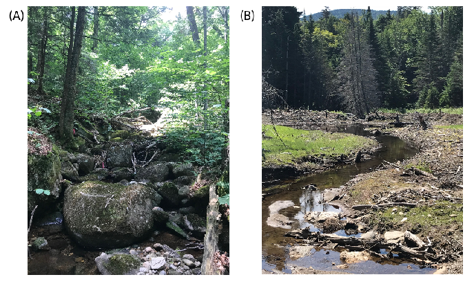
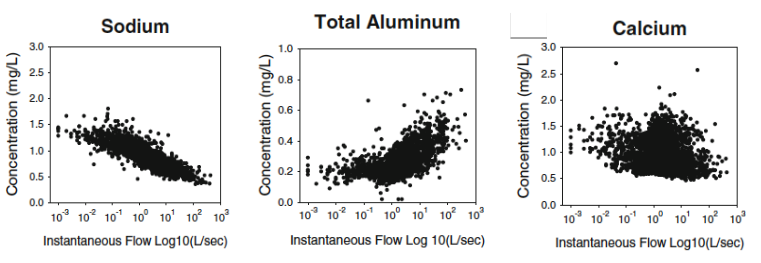
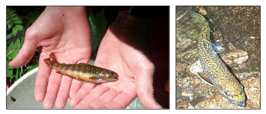
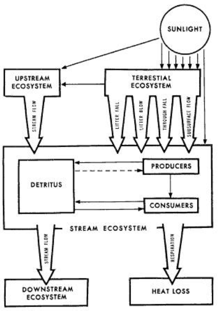
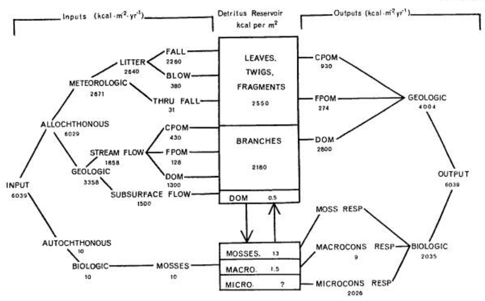
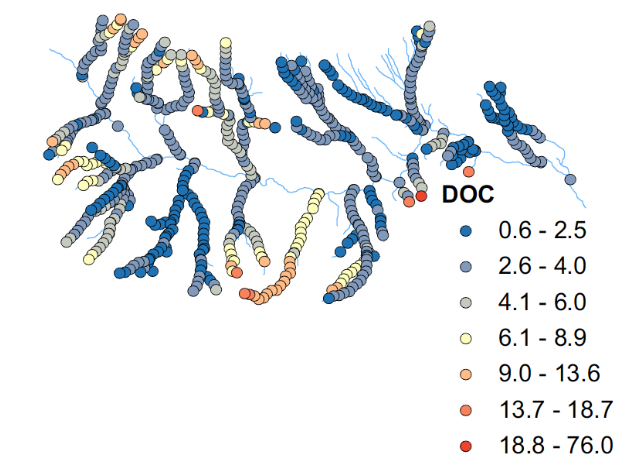
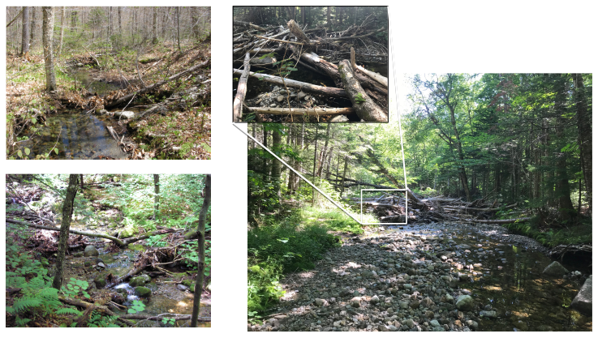
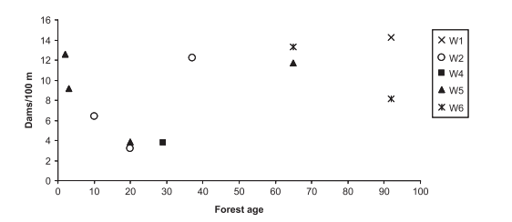
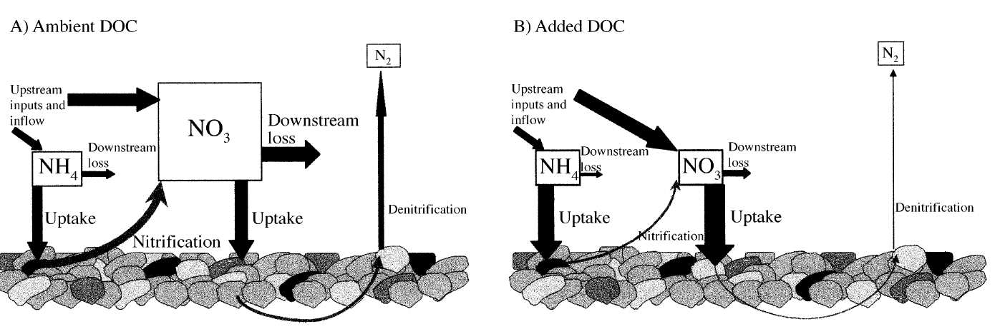

Chapter Editors: Dana Warren and Timothy Fahey

## Introduction

For outdoor enthusiasts, forest streams provide among the most attractive venues: the babbling brook, clear cold water cascading over craggy boulders; deep pools inviting a dive to the bottom; trout darting under banks; and a drink of pure refreshment (“champagne for dogs”). The symphony of the babbling brook lulls one to sleep whether on a welcome rest stop on a long hike or an overnight backpacking trip. From an ecological standpoint streams act as an important conduit for matter and energy leaving the forested ecosystem, but also form a distinct and complex ecosystem in their own right. The Hubbard Brook Ecosystem Study (HBES) pioneered investigation of streams as discrete ecosystems in which a diverse biotic community stores and processes energy and mineral nutrients and delivers products to downstream ecosystems and the atmosphere (Fisher and Likens 1972, Meyer and Likens 1979, Bilby and Likens 1980). The base of new knowledge provided by early studies of Bear Brook within the Hubbard Brook Experimental Forest (HBEF), together with ongoing work linking aquatic and terrestrial ecosystems, stimulated the continuing search for a better understanding of stream ecosystem dynamics. In this chapter we provide a brief overview of some key insights provided by the HBES into the structure and function of headwater streams that drain the forests of this montane landscape.

## The physical template of HBEF streams

{#fig-channel}

As with terrestrial ecosystems, a stream’s location on the planet and in the landscape can have a strong influence on its structure and function. In addition, a great deal of focus is applied at smaller scales where a stream is located within the network of connected waterways in a catchment. At the broadest spatial scale, Hubbard Brook is in the northern hemisphere of the globe at a latitude of 43 degrees, which sets an important seasonal template for this system with winter from December to March and summer from June to September. Given the latitude and the precipitation patterns inherent to the location in the northeastern part of the North American continent, Hubbard Brook often has a sizable winter snowpack. This sets a hydrologic regime with the largest flows usually occurring in the spring and annual minimum flows occurring in late summer. Further, because of the strong seasonality in this region, the deciduous trees that grow in the Hubbard Brook valley lose their leaves in the fall and regenerate new ones in the spring. This loss and subsequent regeneration of leaves from trees has strong direct and indirect influences on stream function. These seasonal dynamics that include the magnitude and timing of spring run-off as well as the timing of leaf-on and litter fall are two primary aspects of HBEF streams that we expect to shift in coming decades as a result of changing climate.

At a regional scale, the underlying geology and geologic history of New Hampshire also provides an important template for the structure and function of streams in the Hubbard Brook valley. Relatively recent glaciation and the dominance of slowly weathering granitic bedrock have led to u-shaped valleys, shallow soils, and limited background nutrient availability, which together affect the chemistry and hydrology of Hubbard Brook and its tributaries. Most of the tributary streams are confined – meaning that the channels do not easily meander across a valley bottom – and are dominated by boulder substrates (@fig-channel a). There are exceptions, such as in abandoned beaver ponds and a few alluvial sections of the mainstem river bottom (@fig-channel b), but overall channel movement is more limited here than in other systems, and the stream side (riparian) communities can have a large influence on the stream.

{#fig-network}

Considering the regional context of Hubbard Brook itself, the 4th/5th order mainstem drains a watershed of ca. 3000 ha and flows into the Pemigewasset-Merrimack River, a large watershed encompassing nearly two-thirds of the state of New Hampshire. As a 4th/5th-order stream (depending upon where you are in the network), the mainstem Hubbard Brook is considered a mid-size tributary in this region. Stream order is a common and useful description of a stream that encompasses a general picture of size, but also relative location within the stream network. The smallest headwaters are first-order streams. A second-order stream is formed when two first-order streams come together, and a third-order stream forms at the confluence of two second-order streams (@fig-network). In the classic (Strahler 1957) stream order classification, adding an additional lower order streams does not change the overall stream order. So, a second-order stream entering a third-order stream, while influencing stream discharge would not affect stream order. The system can only be raised to a fourth-order stream when two third-order tributaries unite. Across the landscape, we find fewer higher order streams as it becomes uncommon for increasingly larger tributaries to meet. As we consider the HBES watershed, we find an abundance of first- and second-order streams with just a few third-order tributaries (@fig-network).

In this system, and indeed in nearly all watersheds, the vast majority of overall river miles occur in low-order headwater streams. For example, Zimmer et al. (2013) indicate that the hydrologic reference watershed (W3), located on the south-facing slope of the Hubbard Brook valley, contains about 800 m of perennial stream channel, 2550 m of intermittent channel (flow only in wet seasons) and 450 m of ephemeral channel (flow only briefly during large rain events). The total channel density (all types) in W3 is about 90 m/ha and translates to a total channel length of about 270 km in the watershed. So, while we often fish, boat or swim in the larger-order rivers, when we study the collective role of streams in the retention and processing of nutrients and carbon, most of the action is in the headwaters. These small, low-order, streams are also where we see the greatest interaction between streams and the adjacent upland forests and Hubbard Brook scientists have often been at the forefront of research highlighting the value and importance of headwater streams (Lowe and Likens 2005). The primary tributaries to Hubbard Brook are labeled on @fig-network.

## Insights into behavior of the chemical constituents of a stream

One of the foundational ideas that scientists from Hubbard Brook articulated early in the development of studying stream ecosystems was that the chemical constituents of a stream reflect processes in the watershed, linking these aquatic and terrestrial ecosystems. The analogy they used was as a doctor may take a sample of your blood to evaluate your health, ecologists could potentially sample streams and infer something about the health or function of the larger watershed. Many of the other chapters in this book illustrate how this perspective was used. In this chapter, we consider two key questions that are critical to the interpretation of stream chemistry data: First, do processes in the stream affect what we see at a weir, confluence or other point of water collection in a basin? Second, how does the concentration change as stream flow changes? These questions are critical to understand the flux of dissolved material leaving a catchment, which depends on the concentration of a given element in the stream water and total discharge at the collection point.

![Stream concentration of nitrate over a 2-year period in watershed 1 and watershed 6 encompassing the summer after the 1998 ice storm. The terrestrial disturbance event increased export to streams, but samples collected along the stream in each catchment illustrate that the magnitude of the ice storm effect on stream nitrate concentrations declined moving downstream, illustrating the role of streams in attenuating the nutrient export signal from this disturbance event (taken from Bernhardt et al. 2003 – PNAS).](figs/stream/StreamChemistryIceStorm.png){#fig-icestorm}

One of the better studies exploring the question of whether in-stream processes affect the interpretation of catchment processes based on watershed outputs was conducted by a Cornell graduate student and her colleagues following the 1998 ice storm (Bernhardt et al. 2003). The ice storm damaged a large number of trees in winter 1998, and in response high nitrogen export occurred the following summer. But what this student showed was that export at the weir was only a fraction of what entered the stream. Nitrogen concentrations were substantially higher further upstream in the watershed (closer to the hardest hit areas) and the ice storm signal on nitrogen was attenuated moving downstream because of uptake and retention in the stream (@fig-icestorm). This highlights the role of in-stream processes in nutrient retention, lending credence to the idea that streams are not just a pipe exporting signals from the terrestrial environment, but rather a functional component of the larger watershed ecosystem.

This is a great example of stream function in a watershed, but nitrogen – as detailed below – is very biologically reactive. What about other elements? The study of less-biologically reactive elements has received less attention but key insights have been gained from studies at HBEF. The amount of positively charged atoms or molecules leaving a basin can tell us a great deal about soil properties, the rates at which rocks are weathered (see Ch. 19) and about how a system may be responding to upland forest management. This brings us to our second question. Because the total mass of a given element or molecule that is lost from a given basin can tell us about both biotic and abiotic processes in the watershed, there is interest in how the concentration of a given element or molecule changes with discharge. And there is also interest in such “concentration-to-discharge” relationships because the nature of these relationships themselves can also tell us about how the watershed functions deep in the ground where direct measurements are very difficult.

Precipitation can enter stream through a number of different pathways, and abiotic and biotic reactions occurring along these pathways can influence what ultimately reaches streams. The nature of water infiltration and amount of a given element that is encountered in the process may vary, and in-turn, this can lead to distinctly different patterns of how chemical concentrations change with stream discharge. We may see a dilution effect when the new water entering the stream does not encounter new sources of a given element. Alternatively the new water may encounter a chemical on its way to the stream and supply that chemical at the same concentration as it already exists in the stream water. In this case, the concentration of the solute doesn’t change with discharge – known as a chemostatic response. Alternatively, hysteresis may occur when given chemicals are flushed from the system early in a rain event, but then as the rain persists the availability of that chemical declines resulting in subsequent dilution. Therefore, on the rising limb of a storm event the concentration of a solute is high at a given discharge level, but on the falling limb of the storm the concentration of that solute is much lower at that same discharge level. When we plot concentration against discharge in this situation, we see a circular pattern through time.

{#fig-discharge}

{#fig-valleychem}

How does this all relate to HBEF? Well some of the early work on these solute by discharge relationships was done at HBEF and there were a number of interesting results that came out of that work. For example, sodium exhibits dilution during a storm while aluminum increases and calcium is more chemostatic (@fig-discharge). The changes in the concentration of inorganic aluminum are also tied to changes in hydrogen ion concentrations and are particularly noteworthy for aquatic biota because an excess of aluminum can be toxic for stream biota (Baldigo et al. 2007). The patterns in discharge-concentration relationships from Hubbard Brook are still used today as classic examples to illustrate these concepts in texts books (e.g.(Allen and Castillo 2007). Further, these relationships are understandably affected by local conditions and studies evaluating discharge to concentration relationships in a new area often discuss how their system aligns with or differs from the “standard” behavior for that element as found in HBEF systems. More recently there has been work focusing on the spatial dynamics of stream chemistry. This was initiated by a study in which water samples were collected every 100 m from every tributary in the main HBEF valley (Likens and Buso 2006). This study explored spatial patterns (rather than temporal patterns) in streamwater chemistry. As with the concentration by discharge relationships, different ions behaved differently with some having strong longitudinal gradients in concentration across elevations within and among sub-catchments (e.g. hydrogen ions and dissolved organic carbon (DOC)) while others were more spatially consistent (e.g. sulfate and dissolved silica) (@fig-valleychem). More recently McGuire et al. (2014) applied a novel statistical analysis to provide a more quantitative assessment of the spatial dynamics of stream nutrients where they found clear spatial patterns at multiple spatial scales as well as nested patterns in availability of different ions and nutrients. The Biogeochemistry chapter discusses HBEF stream chemistry in greater detail.

### Bear Brook

Given their importance to ecosystem processes within the stream network, most of the research on streams at HBEF has been focused on the headwaters. The “iconic” headwater stream at HBEF is Bear Brook and its tributaries. Bear Brook is a 2nd to 3rd order stream below the gaging stations of W5 and W6 (denoted with a red asterisk on @fig-network), and has been the setting for many stream ecosystem studies over the past 40 years. We begin with a description of its key characteristics, which are representative of headwater streams throughout HBEF and the broader northern New England region.

Bear Brook empties into the main Hubbard Brook at 340 m elevation and drains a forested watershed of 132 ha, with maximum elevation of 790 m (Fig. 2). The soils in the watershed are generally thin, highly porous and well drained with interflow drainage predominating. The soils and streambed are derived from glacial tills and the underlying bedrock is medium to coarse-grained sillamanitic gneiss. The soils are naturally base poor and highly acidic (pH 4 to 4.5) exacerbated by base cation losses owing to acid deposition in the 20th century (see Ch. 17). The forest is mostly northern hardwoods with subalpine conifers at the highest elevations, and stream channels are mostly heavily shaded.

The reach of Bear Brook that was the subject of many studies is 1.7 km in length spanning an elevation range of 340-600 m (Fisher and Likens 1973). The mean slope is 14% and the width of the channel ranges from 2.2 to 4 m. Depth varies from shallow riffles to small pools up to 0.6 m deep. Stream morphology is characterized as “stair steps” with small pools connected by free fall zones and riffles. Pools are mostly formed by organic debris dams or large boulders. The substrate of the streambed consists of cobbles, boulders and bedrock with localized accumulations of fine sediments and organic debris; sediments are loose, poorly sorted and not cohesive and mostly well oxygenated to several cm depth (McDowell 1985).

{#fig-trout}

Stream chemistry in Bear Brook is extremely dilute but has changed markedly over the period of study as detailed in Ch. 17. The pH of stream water now averages about 5.4, but was as low as 4.8 in the mid-20th century. Oxygen saturation is nearly always 100%. Concentrations of inorganic nutrients are very low, and the stream is highly oligotrophic. Concentrations of most dissolved solutes vary within a narrow range and are dependent upon stream discharge. Dissolved organic carbon concentrations also are low (1-5 mg/L), with lowest values at low flow and highest during autumn (McDowell and Likens 1988). Bear Brook contains fish through most of the second and third-order sections of the stream (up to about 1000 m upstream from its confluence with the mainstem Hubbard Brook). Brook trout (Salvelinus fontinalis) are the only fish present at this time (@fig-trout). Sculpin (Cottus spp.) were observed in the lower sections of the stream when scientists first started working at HBEF in the 1950’s, but they are no longer present (presumably due to acid deposition impacts; (Warren et al. 2008).

## Insights into stream energy and organic matter budgets from HBEF

{#fig-concept}

Fisher and Likens (1972, 1973) constructed the first energy and organic matter budget for a lotic ecosystem in their study of the metabolism of a 1700 m reach of Bear Brook in the HBEF. They developed a simple compartment model of an idealized stream ecosystem (@fig-concept) and proceeded to collect energy flow data to allow an assessment of its metabolism on an ecosystem basis. They characterized this headwater stream as strongly heterotrophic in that nearly all the potential energy input to the stream is allochthonous, terrestrial plant detritus or energy supplied from upstream; less than 1% is autochthonous, in-stream primary production. At the time of this study, algae and vascular hydrophytes were essentially absent while a small amount of bryophyte production was measured. Of the total annual energy input, 44% was supplied from the forest into that stream reach directly, mostly as particulate organic matter (litter) and 56% entered from inflowing waters roughly equally divided between dissolved (47%) and particulate (53%) forms (and this carbon also had a primarily terrestrial origin). Almost two-thirds of the annual energy input was exported downstream, with the remainder lost as heat through consumer activity (@fig-energy).

Energy is stored in the stream ecosystem primarily in the form of organic detritus, and based on two years of measurement this reservoir appeared to be relatively stable. Thus, the stream was defined as a near-equilibrium system; however, they noted that the system is not necessarily “mature”, acknowledging that carbon dynamics can change over time. Both physical forces and the activities of a complex heterotrophic community result in the net conversion of coarse particulate organic matter (CPOM) into fine POM. The input flux of dissolved OM into the stream reach via stream and groundwater was similar to the fluvial output (@fig-energy). An additional portion of DOM is generated within the stream. For example, the ratio of DOM to POM entering the stream reach was 0.86 whereas for that leaving the stream the ratio was 2.3; thus, a large proportion of the DOM export was derived from POM. Total respiratory loss of energy and organic matter was estimated by the difference (assuming equilibrium) at 34% of total outputs and was predominately microbial, as macroconsumers (mostly insects) were estimated to comprise only 0.2% of total outputs (@fig-energy).

{#fig-energy}

### Organic matter dynamics

Since the pioneering work of Fisher and Likens on Bear Brook, numerous studies have been conducted on the stream ecosystems of the HBEF, resulting in many refinements in understanding (Findlay et al. 1997). A stream like Bear Brook is a typical, highly heterotrophic lotic ecosystem, but the behavior of the ecosystem may depart from the picture of an equilibrium system. Processing of carbon is highly heterogeneous in space and regional environmental changes are contributing in complex ways to long-term temporal fluctuations. Various organisms respond differently to variations in organic matter supply, and organic matter dynamics interact with inorganic nutrient dynamics. In the following sections we highlight some of the new insights into stream energy and organic matter dynamics provided by the HBES.

Although Bear Brook is clearly a strongly heterotrophic stream ecosystem, some evidence for a greater role of instream primary production in supplying secondary production has been obtained. Algae can be an important food source for aquatic insects in part because they are more nutritious and easily digested than particulate detritus. Mayer and Likens (1987) observed that algae comprised about half of the diet of an abundant grazing insect (a caddisfly; Trichoptera) and supported three-fourths of caddisfly growth. However, apparently most stream insects in this system are less dependent on algae; for example, Hall et al. (2001) estimated that algae supplied only about 5% of secondary production associated with primary consumers in Bear Brook. However, this is still a much higher proportion than the algal contribution of <1% of the organic matter input. Light availability is the principal environmental factor limiting algal production in the heavily shaded Bear Brook beneath the closed canopy forest, and as expected the higher light reaching the larger main Hubbard Brook stimulates greater benthic algal production (Hall et al. 2001). As a result, algae supply a much higher proportion of energy fueling secondary production in Hubbard Brook (28%) compared to Bear Brook.

Although light is clearly the primary limiting factor for algae in HB headwater streams, the possible role of co-limitation by mineral nutrients is likely given the dilute concentrations of the stream water. There is a period of time when light availability is high during the spring following snowmelt in April – after snow and ice cover have left and before full leaf expansion (usually late May). In some recent years there have been observations of a burst of algal growth during this period when nutrient limitation is likely to be a factor. This flush of spring algal growth is not routinely observed though and there is ongoing research to understand the drivers of stream primary production in spring. In summer, primary production in the streams shifts back to being predominantly light limited. Indeed, experimental enrichment of stream water N and P did not stimulate algal growth discounting the role of inorganic nutrient limitations (Bernhardt and Likens 2004). The spatial and temporal dynamics of primary production in HB headwater streams remains an active area of research at HBEF as we seek to understand the factors that drive autotrophy in these systems.

In addition to leaf litter, wood and occasional periods of increased algal growth in the streams, another important component of the stream carbon budget is dissolved organic carbon (DOC). The origin and chemical composition of DOC in HB streams were characterized in detail by McDowell and Likens (1988). The organic chemistry composition of stream water DOC was similar to that of water found in B-horizon soil, and they emphasized the key role played by abiotic adsorption reactions in mineral soil in regulating the flux of DOC into streams. Concentration of DOC in BB and other headwater streams at HB and elsewhere in the region typically increase significantly with stream flow. Three mechanisms contribute to this temporal pattern: 1) channel flushing of DOC, 2) direct deposition of DOC-rich throughfall into the stream, and 3) a higher proportion of soil water delivered by shallow flow paths with much higher DOC concentrations. The longitudinal variation in DOC along stream reaches within the HBEF are non-uniform, some showing increases and other decreases or no change (as in BB) with distance along the stream (Likens and Buso 2004; @fig-docspatial).

{#fig-docspatial}

The last observation begs the question: what mechanisms regulate the retention of DOC in these headwater streams? McDowell (1985) added DOC derived from leaf litter extracts to BB and observed that DOC was rapidly removed from stream water, primarily by abiotic adsorption in stream sediments rich in iron and aluminum oxides. In the laboratory, adsorption of leaf leachate to sediments resulted in a subsequent increase in microbial respiration, suggesting that the abiotic retention of DOC allows subsequent utilization by stream microflora. More recently, Bernhardt and McDowell (2008) indicated that direct biotic assimilation was also an important mechanism of DOC retention, and not surprisingly labile components of DOC (monomeric carbohydrates and N-containing DOC) were most rapidly assimilated.

The activity of stream biota in utilizing organic matter sources drives variation in community respiration (CR). Hedin (1990) measured sediment CR in HB streams and observed high correlations with sediment OM content but not stream DOC (Fig. 5). However, CR in streams was much lower per unit sediment OM than for lake sediments, presumably because of differences in the quality of OM (terrestrial detritus in streams vs. algae and macrophytes in lakes).

Epilithic bacteria are a key component of the heterotrophic community in most stream ecosystems. In particular, bacteria are more abundant than fungi colonizing fine benthic organic matter (FBOM) as shown in a survey of nine headwater streams, including Bear Brook (Findlay et al. 2002). Thus, bacteria probably process most FBOM that accumulates in pools in low order streams. Another potential source of energy for these bacteria is epilithic algae as a tight coupling of algal and bacterial activity has been observed in many systems – which is why the biofilm on stream bottoms is often referred to as periphyton or biofilm rather than just algae. Both periphyton and biofilm encompass benthic algae and the fungi and heterotrophic bacteria that co-occur with them. However, Findlay and Howe (1993) evaluated co-variation in these two trophic groups (heterotrophic bacteria and benthic algae) across a variety of streams in the HBEF, representing a wide range in algal abundance and productivity. Surprisingly, bacterial abundance was not consistently correlated with algal abundance despite large differences in primary production between the streams. Moreover, shade-induced reduction in algal abundance did not depress bacterial growth rates. Thus, in these highly oligotrophic streams there is not a tight trophic connection between algae and bacteria perhaps because the systems are so dominated by allochthonous energy supply.

Although it has become clear that microbial communities exhibit spatial variability at a range of scales, i.e. “everything is not everywhere”, the particular environmental factors generating biogeographical patterns are not well known, especially for lotic ecosystems. The HB valley was an ideal site for assessing spatial patterns of distribution of bacterial communities inhabiting FBOM because of the wide range in stream chemistry and organic matter sources (Fierer et al. 2007). Streams of similar pH across the HB valley had similar FBOM bacterial communities. And differences in stream water pH was the single most important factor correlated with variation in bacterial composition. With increasing pH the relative abundance of acidobacteria decreased and that of proteobacteria increased. Thus, the composition and probably the function of stream microbial communities vary in predictable patterns in relation to catchment biogeochemistry. And, as we see continued recovery of surface water chemistry from acid deposition, we may expect concurrent shifts in microbial communities in HB streams.

Finally, on the time-scale of forest ecosystem development, Bechtold et al. (2017) recently evaluated how forest age may influence instream ecosystem processes. The mostly even-aged mid-succession forests that dominate the HB valley are typical of much of the northeastern US and formed a mid-point along an age sequence of northeastern forested watersheds in the Bechtold et al (2017) study. Light availability and benthic algal abundance exhibited a U-shaped relationship with forest age, driven by forest canopy structure. Streams draining old-growth forests had higher CR and greater retention of C inputs than for streams in younger stands. Thus, long-term changes in stream ecosystem dynamics seem to reflect streamside forest ecosystem processes.

## Insights into the role of wood in streams from HBEF

{#fig-woodjam}

In small woodland streams the most important retention mechanism for CPOM that allows further processing by heterotrophs is entrapment by organic debris dams (@fig-woodjam). These dams typically form when a large piece of wood falls into the stream and lodges against rocks in the streambed and bank. Smaller pieces of wood are then caught and provide a structure on which leaves accumulate, ultimately forming a pool on the upstream side where fine sediments settle (Bilby and Likens 1980). Surveys of debris dams across the HB valley in the early 1970s demonstrated that they decreased in abundance with increasing stream order from 33.5/100 m in 1st order streams, 12.7/100 m in 2nd order and 2.5/100 m in 3rd order streams. Much of the organic matter stock in low order streams was contained in the dam structures, ranging from 75% in 1st order to 20% in 3rd order (Bilby and Likens 1980). Debris dams are periodically washed out during high flow events, and after clearcutting of W2 and W5 the combination of higher flow and low wood inputs resulted in a dramatic decrease in debris dam abundance (Hedin et al. 1988). Thus, a U-shaped distribution of debris dam frequency against forest age characterizes headwater streams in the Northeast (@fig-woodbiomass; (Warren et al. 2007).

{#fig-woodbiomass}

Removal of debris dams from a 175 m stretch of Bear Brook resulted in a 5-fold increase in POM export and a 6% increase in DOC export from the stream compared with pre-removal fluxes (Bilby and Likens 1980). The increase in DOC flux resulted from higher concentrations at high discharge. Export of FPOM increased most dramatically at high discharge after dam removal, and CPOM increased markedly as well. The “flashy” nature of stream discharge in the headwater streams of the HBEF plays a key role in limiting the stock of organic matter stored in a stream largely because of the degradation of debris dams during high flow events (Hall and Likens 2004).

Debris dams are focal sites for metabolism in headwater streams. Hedin (1990) measured 3-fold higher rates of sediment community respiration in pools behind dams than for other locations in the stream, reflecting the accumulation of organic matter. Similarly, processing of mineral nutrients, especially P (Meyer and Likens 1979) and N (Steinhart et al. 2000) are focused in the “hot-spots” of debris dams, as detailed below.

## Insights into stream nutrient dynamics from HBEF

### Phosphorus

Interest in the behavior of mineral nutrients like N and P in headwater stream ecosystems derives from their possible role as growth-limiting factors and especially from their importance to the function and health of downstream ecosystems, rivers, lakes, estuaries and coastal oceans. Meyer and Likens (1979) constructed one of the first P budgets for a stream reach in Bear Brook at the HBEF. Four vectors account for P input to BB: tributary inflow (62%), terrestrial detritus (23%), subsurface seepage (10%) and atmospheric deposition (5%). In a typical year total input to BB equals output, and two-thirds of the output occurs on just 10 days of high flow events. On most days input greatly exceeds output which favors instream processing; hence, the stream ecosystem works in two distinct modes, a “processing” mode and a “throughput” mode. Across years the input/output (I/O) ratio for the stream depends strongly on annual streamflow.

The internal processing of P is more consistent through time compared to the high variation in the I/O budget. Retention of P in the stream is driven primarily by adsorption of organic P in stream inorganic sediments; the equilibrium P concentration for typical sediments is 2 ug P/L (Meyer and Likens 1979). Dissolved P is also assimilated instream by bryophytes, algae and bacteria. Meyer (1979) observed removal of dissolved P as a pulse addition passed over a bryophyte bed within BB. Considering the biological components of stream P cycling, we see the conversion of both dissolved P and coarse particulate P (i.e. P in litter) into fine particulate P. This occurs through breakdown of coarse organic material (containing P) into fine organic material containing P and through the sloughing of algae or bryophyte biomass which contains inorganic P that was assimilated into these stream producers (the abundance of primary producers is low but this source of P nonetheless warrants consideration – particularly in regard to bryophytes). The fine particulate P then becomes the dominant form for export downstream of organic P in these systems (Meyer and Likens 1979). The processes involved in coarse particulate P processing within the stream were studied using leaf litter packs (Meyer et al. 1981). Litter decayed slowest where it was buried in sediments in pools formed by debris dams primarily because of protection from physical abrasion. Phosphorus was immobilized in decaying litter and this process was fastest where litter was buried in sediments. Hence, instream P dynamics varied longitudinally within the stream ecosystem, again reflecting the strong influence of debris dams.

### Nitrogen

A particular interest in the instream dynamics of N has been stimulated by the mystery concerning the long-term temporal trend of N outflow from the reference watershed at HB: contrary to expectations, N flux from W6 has strongly declined since the late 1960s (see Ch. 7). Hall and Likens (1984) demonstrated that N flux associated with stream biota was a minor component of stream N flux, and was overshadowed by dissolved N transport. However, an early study of N dynamics using experimental N additions indicated that a significant proportion (12-25%) of the nitrate (NO3-) flux from a headwater catchment could be derived from instream transformation (Richey et al. 1985), suggesting a potentially important role of instream biotic activity in regulating catchment N flux.

The many chemical forms and transformations of N make the study of its instream dynamics somewhat more complex than P. However, advances in the analysis of pulse additions of N to streams have provided a better understanding of instream N transformations (Stream-Solute-Workshop 1990). Moreover, the ability to trace N flux using the stable isotope 15N has resulted in steady advances in knowledge since the 1980s. To understand the language of stream N dynamics it is necessary to briefly introduce the nutrient spiraling concept and the standard measurement of uptake length and related metrics. In most ecosystems nutrients are cycled largely in place, but in streams transport must be incorporated into the conceptual framework: an atom in stream water is transported some distance downstream before being incorporated into biota or adsorbed to a particle surface, and eventually returned to the stream water in dissolved form. Newbold et al. (1981)characterized this cycle of downstream transport as a “spiral.” The uptake length (m) for N in a stream reach is the average downstream distance travelled by a N atom prior to its removal from the water column. The uptake velocity (Vt, m/s) estimates benthic demand for N relative to supply and takes into account differences in discharge among streams, thereby facilitating comparison of uptake between streams that differ in depth and velocity (Hall et al. 2002). Peterson et al. (Peterson et al. 2001) compared 15N uptake in a suite of forested streams including the HBEF and demonstrated that N uptake velocity was greater in smaller than larger streams and that uptake length for NH4+ (10-100m) was an order of magnitude less than for NO3- (100-1000m).

The key instream processes influencing stream N dynamics are sediment adsorption and biotic assimilation of NH4+, conversion of NH4+ to NO3- by autotrophic prokaryotes via nitrification and reduction of NO3- to gaseous forms (N2O, N2) by bacterial denitrification. Richey (1985) demonstrated significant sediment adsorption and biotic assimilation of NH4 in HB streams. Bernhardt and Likens (2002) evaluated the interaction between stream C availability and concurrent N dynamics. The addition of a labile C source (acetate) to the stream stimulated bacterial growth and NH4 assimilation leading to higher whole-stream nitrification (@fig-docconcept). Bernhardt et al. (2002) tested the hypothesis that variation in NO3- concentrations among streams in the HB valley was driven in part by differences in instream N processing. Although they observed that the proportion of stream NH4 that was nitrified correlated positively with ambient stream NO3- concentration, they concluded that rates of instream nitrification and NO3- uptake were too low to contribute significantly to variation in stream NO3-. They proposed that when NO3- inputs are high there may be a shift in the competitive balance between heterotrophic N assimilation and nitrification. The connection of instream N processing to watershed vegetation disturbance, and consequently NO3- leaching, was evaluated by Bernhardt et al. (2003). They argued that the increased NO3- leaching associated with disturbance also stimulated increased instream N retention resulting from high loading of woody debris and increased periphyton production. This instream processing apparently suppressed watershed-scale NO3- losses following a severe ice storm at the HBEF (Bernhardt et al. 2003).

{#fig-docconcept}

Could instream processes help to account for the decline in dissolved N losses from HB watersheds since the late 1960s? Although streams comprise only a small percentage of catchment surface area, stream budget studies suggested that they play a significant role in removal of NO3- delivered from the watershed (Burns 1998). The principal process that could contribute to permanent removal of N by a stream is denitrification. Steinhart et al. (2000) measured some high rates of denitrification in northeastern U.S. forested streams and Bernhardt et al. (2005) suggested that consequent instream NO3- removal by denitrification could be a significant flux pathway in HB watersheds. Changes in stream channel characteristics, especially wood loading and debris dams, might contribute to higher instream denitrification; Steinhart (2000) suggested that denitrification might account for higher N removal from streams associated with woody debris. Warren et al. (2013) compared changes in nitrate uptake velocity following debris dam removal at HB, testing the hypothesis that dams contributed to denitrification. Surprisingly, however, they observed an increase in NO3- uptake velocity following dam removal, possibly because an increase in availability of stable sediment substrates stimulated periphyton growth and N assimilation. The challenge of converting instantaneous, point measurements of denitrification into whole ecosystem fluxes continues to constrain our understanding of forest watershed N dynamics, both in soils and in streams.

## Insights from HBEF research on airborne pollutants in streams

### Acid rain

After learning that rainfall in the region was very acidic and realizing possible implications for forested watersheds, Likens and colleagues conducted a whole-stream acidification experiment on Norris Brook at the HBEF. The experiment was designed to mimic an acute snowmelt event that creates a pulse of acidity in streams (see Ch. 17). They measured “drift” of benthic invertebrates, considered a behavioral response to stress (Hall et al. 1982). The acid pulse resulted in a marked increase in invertebrate drift, especially for mayflies and chironomids, during the first five days following treatment. They concluded that acid stress can alter the structure and function of the benthic invertebrate community in headwater streams. The likely role of Al toxicity, associated with watershed acidification, in driving the invertebrate drift response was suggested by a follow-up experiment in which AlCl3 was added to the same stream (Hall et al. 1985).

### Mercury

Controls on mobilization of mercury from forest soils to streams also are connected to episodic acidic pulses during snowmelt. Mercury is of particular concern as a surface water pollutant because of toxicity in fish and possible human exposures (Driscoll et al. 2007). Mobilization of Hg from upland forest soils is associated with binding to DOC and because DOC increases with discharge, so does Hg. Dittman et al. (2010) noted that hydrophobic DOC preferentially binds Hg in forest floor horizons and during high flow events shallow soil water flow paths deliver most of the annual Hg loading to HB streams on a few days as DOC-Hg complexes. Demers et al. (2010) suggested that methylmercury, the most toxic form, is produced in forest floor horizons during winter and flushed into streams with acidic pulses containing high DOC and Al. Despite comparatively low overall DOC levels in HB streams; hydrologic source areas and flow paths appear to control Hg mobilization to headwater streams and downstream ecosystems.

## Conclusion

We have told you about five core areas of research in the field of stream ecology where studies from HBEF have made notable contributions (spatial and temporal dynamics of stream chemistry, organic matter in streams, large wood in streams, stream nutrient cycling, and airborne pollutants in streams). This chapter focuses on research highlights and is by no means a complete review of HBEF stream research. For example, work on stream biota are not included here but there is a growing body of research on aquatic animals at HBEF - particularly for salamanders – that warrants its own chapter. Overall, one can point to the work in Hubbard Brook streams – and Bear Brook in particular – as providing important foundational research into streams and stream ecosystem function. And, stream research at HBEF is ongoing. We continue to explore stream chemistry, stream productivity, wood in streams, stream biota, and the many connections between the stream aquatic ecosystem and terrestrial ecosystems that surround them.

## Questions for Further Study

* How will shifts in the timing of forest canopy phenological events (leaf out, leaf fall) influence instream processes?
* What factors constrain spring algal blooms in headwater streams, resulting in high annual and spatial variation?
* What factors explain the unexpectedly weak trophic connection between algae and bacteria in headwater streams?
* How can point measurements of stream denitrification be scaled up to estimate whole channel denitrification flux?
* What is the contribution of instream processes to the outflow of nitrate from small watersheds, and how does this contribution vary spatially and temporally?

## Access Data

* Likens, G. and D. Buso. 2019. Chemistry of Streamwater at the Hubbard Brook Experimental Forest, Valleywide Measurements, 2001 ver 2. Environmental Data Initiative. https://doi.org/10.6073/pasta/189538da2cb5d101082188d5b496d1e5.
* Hubbard Brook Watershed Ecosystem Record (HBWatER). 2021. Continuous precipitation and stream chemistry data, Hubbard Brook Ecosystem Study, 1963 – present. ver 6. Environmental Data Initiative. https://doi.org/10.6073/pasta/ee9815b41b79c134fd714736ce98676a.

## References

Allen, D. M., & Castillo, M. M. (2007). <em>Stream ecology: Structure and function of running waters</em> (2nd ed.). Springer.

Baldigo, B. P., Lawrence, G. B., & Simonin, H. A. (2007). Persistent mortality of brook trout in episodically acidified streams. <em>Transactions of the American Fisheries Society, 136</em>, 121–134. <a href="https://doi.org/10.1577/T06-044.1">https://doi.org/10.1577/T06-044.1</a>

Bechtold, H. A., Rosi, E. J., Warren, D. R., & Keeton, W. S. (2017). Forest age influences in-stream ecosystem processes. <em>Ecosystems, 20</em>, 1058–1071. <a href="https://doi.org/10.1007/s10021-016-0083-y">https://doi.org/10.1007/s10021-016-0083-y</a>

Bernhardt, E. S., Hall, R. O., & Likens, G. E. (2002). Whole-system estimates of nitrification and nitrate uptake. <em>Ecosystems, 5</em>, 419–430. <a href="https://doi.org/10.1007/s10021-002-0161-3">https://doi.org/10.1007/s10021-002-0161-3</a>

Bernhardt, E. S., & Likens, G. E. (2004). Controls on periphyton biomass in heterotrophic streams. <em>Freshwater Biology, 49</em>, 14–27. <a href="https://doi.org/10.1046/j.1365-2427.2003.01161.x">https://doi.org/10.1046/j.1365-2427.2003.01161.x</a>

Bernhardt, E. S., Likens, G. E., Driscoll, C. T., & Buso, D. C. (2003). In-stream uptake dampens effects of forest disturbance. <em>Proceedings of the National Academy of Sciences, 100</em>, 10304–10308. <a href="https://doi.org/10.1073/pnas.1633633100">https://doi.org/10.1073/pnas.1633633100</a>

Bernhardt, E. S., Likens, G. E., Hall, R. O., Buso, D. C., Fisher, S. G., Burton, T. M., Meyer, J. L., McDowell, W. H., Mayer, M. S., Bowden, W. B., Findlay, S. E. G., Macneale, K. H., Stelzer, R., & Lowe, W. H. (2005). Can't see the forest for the stream? <em>BioScience, 55</em>, 219–230. <a href="https://doi.org/10.1641/0006-3568(2005)055[0219:CSTFFT]2.0.CO;2">https://doi.org/10.1641/0006-3568(2005)055[0219:CSTFFT]2.0.CO;2</a>

Bernhardt, E. S., & McDowell, W. H. (2008). DOM uptake comparisons over two decades. <em>Journal of Geophysical Research: Biogeosciences, 113</em>, G03017. <a href="https://doi.org/10.1029/2007JG000618">https://doi.org/10.1029/2007JG000618</a>

Bilby, R. E., & Likens, G. E. (1980). Importance of organic debris dams. <em>Ecology, 61</em>, 1107–1113. <a href="https://doi.org/10.2307/1936831">https://doi.org/10.2307/1936831</a>

Burns, D. A. (1998). Retention of nitrate in an upland stream. <em>Biogeochemistry, 40</em>, 73–96. <a href="https://doi.org/10.1023/A:1005983026479">https://doi.org/10.1023/A:1005983026479</a>

Demers, J. D., Driscoll, C. T., & Shanley, J. B. (2010). Mercury mobilization during snowmelt. <em>Water Resources Research, 46</em>, W07511. <a href="https://doi.org/10.1029/2009WR008294">https://doi.org/10.1029/2009WR008294</a>

Dittman, J. A., Shanley, J. B., Driscoll, C. T., Aiken, G. R., Chalmers, A. T., Towse, J. E., & Selvendiran, P. (2010). Mercury dynamics and DOC. <em>Water Resources Research, 46</em>, W07510. <a href="https://doi.org/10.1029/2009WR008086">https://doi.org/10.1029/2009WR008086</a>

Driscoll, C. T., Han, Y. J., Chen, C. Y., Evers, D. C., Lambert, K. F., Holsen, T. M., Kamman, N. C., & Munson, R. K. (2007). Mercury contamination in forest and freshwater ecosystems. <em>BioScience, 57</em>, 17–28. <a href="https://doi.org/10.1641/B570106">https://doi.org/10.1641/B570106</a>

Fierer, N., Morse, J. L., Berthrong, S. T., Bernhardt, E. S., & Jackson, R. B. (2007). Stream bacterial biogeography. <em>Ecology, 88</em>, 2162–2173. <a href="https://doi.org/10.1890/06-1861.1">https://doi.org/10.1890/06-1861.1</a>

Findlay, S., & Howe, K. (1993). Bacterial–algal relationships. <em>Ecology, 74</em>, 2326–2336. <a href="https://doi.org/10.2307/1939579">https://doi.org/10.2307/1939579</a>

Findlay, S., Likens, G. E., Hedin, L., Fisher, S. G., & McDowell, W. H. (1997). Organic matter dynamics in Bear Brook. <em>Journal of the North American Benthological Society, 16</em>, 43–46.

Findlay, S., Tank, J., Dye, S., Valett, H. M., Mulholland, P. J., McDowell, W. H., Johnson, S. L., Hamilton, S. K., Edmonds, J., Dodds, W. K., & Bowden, W. B. (2002). Microbial biomass in detritus pools. <em>Microbial Ecology, 43</em>, 55–66. <a href="https://doi.org/10.1007/s00248-001-0037-1">https://doi.org/10.1007/s00248-001-0037-1</a>

Fisher, S. G., & Likens, G. E. (1972). Organic energy budget of a stream. <em>BioScience, 22</em>, 33–35. <a href="https://doi.org/10.2307/1296052">https://doi.org/10.2307/1296052</a>

Fisher, S. G., & Likens, G. E. (1973). Energy flow in Bear Brook. <em>Ecological Monographs, 43</em>, 421–439. <a href="https://doi.org/10.2307/1942301">https://doi.org/10.2307/1942301</a>

Hall, R. J., Driscoll, C. T., Likens, G. E., & Pratt, J. M. (1985). Aluminum additions to streams. <em>Limnology and Oceanography, 30</em>, 212–220.

Hall, R. J., & Likens, G. E. (1984). Discharge effects on chemical flux. <em>Canadian Journal of Fisheries and Aquatic Sciences, 41</em>, 1132–1138.

Hall, R. J., Pratt, J. M., & Likens, G. E. (1982). Acidification effects on macroinvertebrates. <em>Water, Air, and Soil Pollution, 18</em>, 273–287.

Hall, R. O., Bernhardt, E. S., & Likens, G. E. (2002). Nutrient uptake and transient storage. <em>Limnology and Oceanography, 47</em>, 255–265.

Hall, R. O., Likens, G. E., & Malcolm, H. M. (2001). Trophic basis of invertebrate production. <em>Journal of the North American Benthological Society, 20</em>, 432–447.

Hedin, L. O. (1990). Sediment community respiration. <em>Oikos, 57</em>, 94–105.

Likens, G. E., & Buso, D. C. (2006). Variation in streamwater chemistry. <em>Biogeochemistry, 78</em>, 1–30. <a href="https://doi.org/10.1007/s10533-005-2024-2">https://doi.org/10.1007/s10533-005-2024-2</a>

Lowe, W. H., & Likens, G. E. (2005). Headwater streams importance. <em>BioScience, 55</em>, 196–197.

Mayer, M. S., & Likens, G. E. (1987). Role of algae in food webs. <em>Journal of the North American Benthological Society, 6</em>, 262–269.

McDowell, W. H. (1985). DOC retention in streams. <em>Biogeochemistry, 1</em>, 329–352.

McDowell, W. H., & Likens, G. E. (1988). DOC origin and flux. <em>Ecological Monographs, 58</em>, 177–195.

McGuire, K. J., Torgersen, C. E., Likens, G. E., Buso, D. C., Lowe, W. H., & Bailey, S. W. (2014). Multiscale controls on stream chemistry. <em>Proceedings of the National Academy of Sciences, 111</em>, 7030–7035. <a href="https://doi.org/10.1073/pnas.1404820111">https://doi.org/10.1073/pnas.1404820111</a>

Meyer, J. L., & Likens, G. E. (1979). Phosphorus transport in streams. <em>Ecology, 60</em>, 1255–1269.

Meyer, J. L., Likens, G. E., & Sloane, J. (1981). Nutrient flux in headwater streams. <em>Archiv für Hydrobiologie, 91</em>, 28–44.

Newbold, J. D., Elwood, J. W., O'Neill, R. V., & Van Winkle, W. (1981). Nutrient spiraling in streams. <em>Canadian Journal of Fisheries and Aquatic Sciences, 38</em>, 860–863. <a href="https://doi.org/10.1139/f81-114">https://doi.org/10.1139/f81-114</a>

Peterson, B. J., Wollheim, W. M., Mulholland, P. J., Webster, J. R., Meyer, J. L., Tank, J. L., Martí, E., Bowden, W. B., Valett, H. M., McDowell, W. H., Dodds, W. K., Hamilton, S. K., Gregory, S., & Morrall, D. D. (2001). Control of nitrogen export by headwater streams. <em>Science, 292</em>, 86–90. <a href="https://doi.org/10.1126/science.1056874">https://doi.org/10.1126/science.1056874</a>

Richey, J. S., McDowell, W. H., & Likens, G. E. (1985). Nitrogen transformations in streams. <em>Hydrobiologia, 124</em>, 129–139.

Steinhart, G. S., Likens, G. E., & Groffman, P. M. (2000). Denitrification in stream sediments. <em>Verhandlungen der Internationalen Vereinigung für Theoretische und Angewandte Limnologie, 27</em>, 1331–1336.

Strahler, A. N. (1957). Quantitative analysis of watershed geomorphology. <em>Transactions of the American Geophysical Union, 38</em>, 913–920. <a href="https://doi.org/10.1029/TR038i006p00913">https://doi.org/10.1029/TR038i006p00913</a>

Stream Solute Workshop. (1990). Concepts and methods for assessing solute dynamics. <em>Journal of the North American Benthological Society, 9</em>, 95–119.

Warren, D. R., Bernhardt, E. S., Hall, R. O., & Likens, G. E. (2007). Forest age and nutrient dynamics. <em>Earth Surface Processes and Landforms, 32</em>, 1154–1163. <a href="https://doi.org/10.1002/esp.1454">https://doi.org/10.1002/esp.1454</a>

Warren, D. R., Judd, K. E., Bade, D. L., Likens, G. E., & Kraft, C. E. (2013). Effects of wood removal. <em>Hydrobiologia, 717</em>, 119–131. <a href="https://doi.org/10.1007/s10750-013-1572-6">https://doi.org/10.1007/s10750-013-1572-6</a>

Warren, D. R., Likens, G. E., Buso, D. C., & Kraft, C. E. (2008). Fish distribution in acid-impacted watershed. <em>Northeastern Naturalist, 15</em>, 375–390.

Zimmer, M. A., Bailey, S. W., McGuire, K. J., & Bullen, T. D. (2013). Fine-scale variation in stream chemistry. <em>Hydrological Processes, 27</em>, 3438–3451. <a href="https://doi.org/10.1002/hyp.9484">https://doi.org/10.1002/hyp.9484</a>

