# Introduction {#chap-introduction .unnumbered}

This online book is designed as a concise but comprehensive synthesis of the Hubbard Brook Ecosystem Study (HBES). Many readers will be interested to see the award-winning book by Richard Holmes and Gene Likens entitled, Hubbard Brook: The Story Of A Forest Ecosystem, a synthesis of the HBES for a general audience. Advanced readers are directed to the book, Biogeochemistry of a Forested Ecosystem (2013) by Gene Likens as well as the series of detailed element monographs published in the journal Biogeochemistry (Likens et al. 1994 (K), 1998 (Ca), 2002 (S); Fahey et al. 2005 (C); and Lovett et al. 2005 (Cl)). The synthesis is presented at the level of a graduate or advanced undergraduate student audience. The primary objective of the book is to introduce students and other prospective researchers to the current state of knowledge about the Hubbard Brook ecosystem. The chapters have been developed by scientific experts on each of the topics studied in the HBES, and they will be updated and expanded as new knowledge and data are generated by the HBES – it is meant to be a living volume. Links to the broader literature and to HBES data sets are provided to facilitate more detailed explorations. Teaching and learning exercises that utilize data from the HBES will be added as they are developed by our experts for academic use.
<<<<<<< HEAD

::: {.chapter-item}
=======
>>>>>>> 169c6e7 (completed the index TOC)

::: chapter-item

**1. [Site, History, and Research Approaches](SiteHistory.qmd)**\
For over 60 years scientists have been studying the dynamics of forests and linked aquatic ecosystems in the Hubbard Brook Experimental Forest, New Hampshire, USA. The Hubbard Brook Ecosystem Study (HBES) is an ongoing effort to understand the ecology, hydrology, energetics and biogeochemistry of this temperate forest ecosystem. The synthesis that follows provides an overview of several components of the HBES interpreted in light of current understanding at the level of the advanced student.
:::

::: chapter-item

**2. [Climate Change](ClimateChange.qmd)**\
The Hubbard Brook Experimental Forest (HBEF) was established well before the issue of climate change emerged. However, many of the long-term measurements collected at the site have become valuable climate change indicators (Table 1). Perhaps any of these records would not be all that informative on their own, but combined they provide fairly convincing evidence of climate change at the HBEF that is compatible with regional trends in the northeastern U.S. (Hayhoe et al. 2007; Milillo et al. 2014).
:::

::: chapter-item

**3. [Hydrology](Hydrology.qmd)**\
The HBEF was established in 1955 for the purpose of studying the effects of forest management on streamflow and water quality, building upon pioneering work from other sites that established the efficacy of the paired small watershed approach (Bates and Henry 1928). The principle underlying the small watershed approach is that for a catchment with relatively watertight bedrock (thus minimal subsurface loss), water can leave the watershed only by stream discharge or evapotranspiration (ET).::
:::

::: chapter-item
[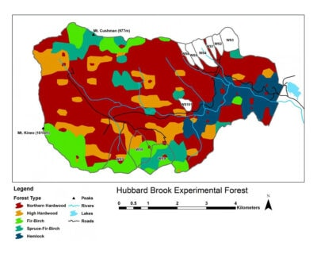](CompositionDynamics.qmd)

**4. [Forest Composition and Dynamics](CompositionDynamics.qmd)**\
The HBEF was established in 1955 for the purpose of studying the effects of forest management on streamflow and water quality, building upon pioneering work from other sites that established the efficacy of the paired small watershed approach (Bates and Henry 1928). The principle underlying the small watershed approach is that for a catchment with relatively watertight bedrock (thus minimal subsurface loss), water can leave the watershed only by stream discharge or evapotranspiration (ET).::
:::

::: chapter-item
[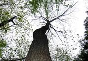](BiomassProductivity.qmd)

**5. [Forest Biomass and Primary Productivity](BiomassProductivity.qmd)**\
Biomass is the living (and sometimes including recently dead) organic material synthesized by plants and other organisms. The accumulation of biomass in forests is greater than in other Earth biomes because the trees must effectively lift their leaves above their neighbors in order to compete for the light resource; hence, forest biomass provides the structural material that allows the plants to grow tall. The biomass of trees in forests forms the three-dimensional structure in which all the other organisms are entrained and to which they are adapted for growth, survival and reproduction. Much of the energy and carbon stored in the forest resides in the biomass of the trees and understanding the factors regulating forest biomass and its accumulation is of fundamental importance to ecologists and foresters, alike.
:::

::: chapter-item
[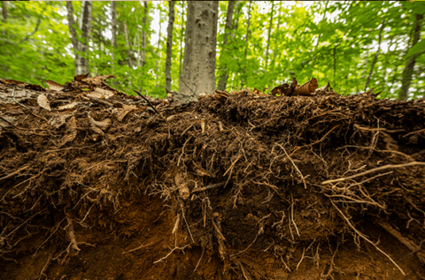](Decomp.qmd)

**6. [Decomposition and Soil Carbon Sequestration](Decomp.qmd)**\
Biomass is the living (and sometimes including recently dead) organic material synthesized by plants and other organisms. The accumulation of biomass in forests is greater than in other Earth biomes because the trees must effectively lift their leaves above their neighbors in order to compete for the light resource; hence, forest biomass provides the structural material that allows the plants to grow tall. The biomass of trees in forests forms the three-dimensional structure in which all the other organisms are entrained and to which they are adapted for growth, survival and reproduction. Much of the energy and carbon stored in the forest resides in the biomass of the trees and understanding the factors regulating forest biomass and its accumulation is of fundamental importance to ecologists and foresters, alike.
:::

::: chapter-item

**7. [Soil Biology](SoilBiology.qmd)**\
One of the great mysteries in the forest at Hubbard Brook is where do the leaves go? Each autumn, there is a massive transfer of mass, carbon and nutrients from the trees to the forest floor via “litterfall”, yet the forest is not filling up with leaves.
:::

::: chapter-item
[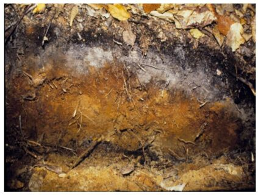](Biogeochemistry.qmd)

**8. [Biogeochemistry: Element behavior and Interactions](Biogeochemistry.qmd)**\
The stream draining a small watershed provides an integrated measurement of nutrient flux from the complex forest landscape. At Hubbard Brook, the role of forest vegetation in regulating biogeochemical cycles is evaluated by manipulating the forest ecosystem at the scale of the small watershed. Such studies provided novel insights into nutrient cycles in northern hardwood forest ecosystems; this led naturally to further mechanistic studies that would open up the watershed black box for a look inside..
:::

::: chapter-item
[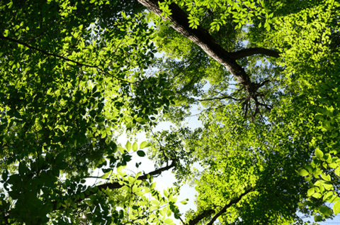](AtmosphericInputs.qmd)

**9. [Atmospheric inputs and canopy interactions of nutrients and pollutants](AtmosphericInputs.qmd)**\
While many of the nutrients that trees at Hubbard Brook need for growth are supplied from minerals in the soil, some, notably nitrogen (N) and sulfur (S), are primarily supplied by atmospheric deposition. In addition to being important for the nutrient supply of the forest, atmospheric deposition also delivers pollutants to the forest, particularly oxides of N and S and trace metals such as lead (Pb) and mercury (Hg). Because Hubbard Brook is downwind of many air pollution sources in the eastern and midwestern US, the forest has been receiving excess N, S and trace metal deposition for decades and has suffered consequences of that deposition. In this chapter we discuss the rates and mechanisms of deposition of these and other substances to the forest and how they interact with the canopy after they are deposited.
:::

<<<<<<< HEAD
::: {.chapter-item}

[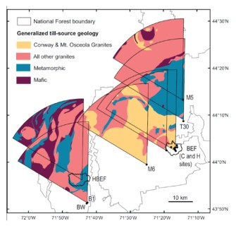](MineralWeathering.qmd)

**11. [MineralWeathering](MineralWeathering.qmd)**  
Mineral weathering is the largest source for many essential nutrients in forest ecosystems, and it also provides the principal mechanism of neutralizing acid deposition. The small watershed approach has served as an effective way to quantify this key ecosystem process.
:::

::: {.chapter-item}

[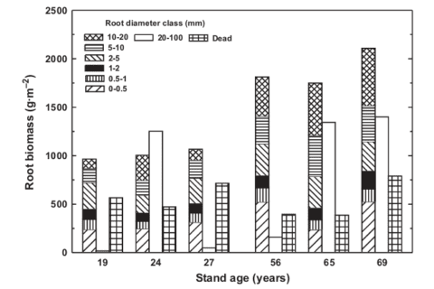](Roots.qmd)

**12. [Roots and Mycorrhizae](Roots.qmd)**  
Roots play a variety of roles in forest ecosystems. Although we usually think of the key role of roots (actually mycorrhizae) in acquiring soil resources, they also serve to anchor the plant and as a place for storing nutrients and carbohydrates. Studying the structure and function of tree root systems requires brute strength or clever techniques because they are difficult to access. At Hubbard Brook considerable attention has been applied to understanding root systems of the trees because they are crucial to forest ecosystem production and biogeochemistry. Here we provide a brief overview of root studies at HB.
:::

::: {.chapter-item}

[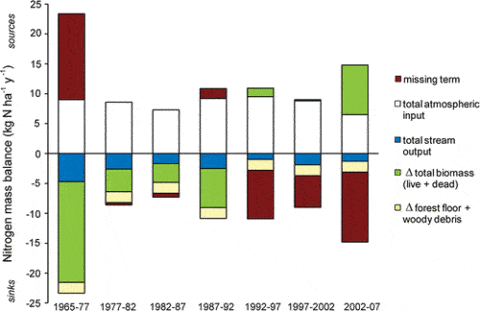](Nitrogen.qmd)

**13. [Nitrogen Cylcing](Nitrogen.qmd)**  
Nitrogen is generally regarded as the nutrient that is most limiting to plants in northern forests (Vitousek and Howarth 1991). However, decades of high atmospheric N deposition due to human activity in industrialized regions has altered the natural N cycle in ways that are only partially understood. Many temperate forests are believed to be at or near N saturation, a point where adverse effects on ecosystem health ensue (Aber et al. 1998). Thus, improved understanding of the forest N cycle is important for designing optimal policies of N management.o
:::

::: {.chapter-item}

[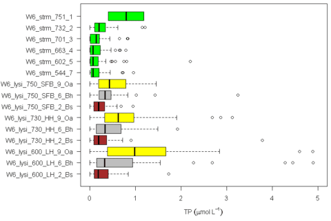](Phosphorus.qmd)

**14. [Phosphorus](Phosphorus.qmd)**  
Phosphorus is an essential macronutrient in all biological systems, and can be the nutrient most limiting to biological production in many aquatic and terrestrial ecosystems. In fact, recent evidence from Hubbard Brook indicates that P is the most limiting nutrient to primary productivity of the northern hardwood forest.
=======
::: chapter-item
[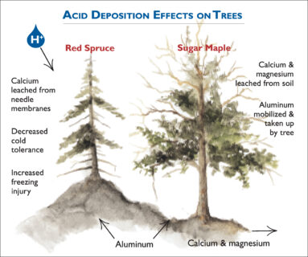](AcidDepositionEffects.qmd)

**10. [Ecosystem Effects of Acidic Deposition](AcidDepositionEffects.qmd)**\
Acidic deposition, which includes sulfuric and nitric acids and ammonium, has altered forest soils by depleting available calcium and magnesium and increasing concentrations of dissolved inorganic aluminum in soil waters, impacting the health of trees. Stream water quality has also been impaired in acid impacted regions like Hubbard Brook, which has reduced the species diversity and abundance of aquatic life. In eastern North America and Europe decreases in sulfur dioxide and nitrogen oxide emissions have decreased acidic deposition with some improvement in surface water quality. However, recovery of forest soils and biota has lagged. In this chapter effects of acidic deposition are illustrated using examples from the Hubbard Brook Ecosystem Study.
>>>>>>> 169c6e7 (completed the index TOC)

:::

::: chapter-item

**11. [MineralWeathering](MineralWeathering.qmd)**\
Mineral weathering is the largest source for many essential nutrients in forest ecosystems, and it also provides the principal mechanism of neutralizing acid deposition. The small watershed approach has served as an effective way to quantify this key ecosystem process.
:::

::: chapter-item

**12. [Roots and Mycorrhizae](Roots.qmd)**\
Roots play a variety of roles in forest ecosystems. Although we usually think of the key role of roots (actually mycorrhizae) in acquiring soil resources, they also serve to anchor the plant and as a place for storing nutrients and carbohydrates. Studying the structure and function of tree root systems requires brute strength or clever techniques because they are difficult to access. At Hubbard Brook considerable attention has been applied to understanding root systems of the trees because they are crucial to forest ecosystem production and biogeochemistry. Here we provide a brief overview of root studies at HB.
:::

::: chapter-item

**13. [Nitrogen Cylcing](Nitrogen.qmd)**\
Nitrogen is generally regarded as the nutrient that is most limiting to plants in northern forests (Vitousek and Howarth 1991). However, decades of high atmospheric N deposition due to human activity in industrialized regions has altered the natural N cycle in ways that are only partially understood. Many temperate forests are believed to be at or near N saturation, a point where adverse effects on ecosystem health ensue (Aber et al. 1998). Thus, improved understanding of the forest N cycle is important for designing optimal policies of N management.o
:::

::: chapter-item

**14. [Phosphorus](Phosphorus.qmd)**\
Phosphorus is an essential macronutrient in all biological systems, and can be the nutrient most limiting to biological production in many aquatic and terrestrial ecosystems. In fact, recent evidence from Hubbard Brook indicates that P is the most limiting nutrient to primary productivity of the northern hardwood forest.
:::

::: chapter-item
[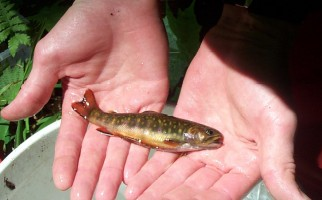](StreamEcosystems.qmd)

**15. [Stream Ecosystems](StreamEcosystems.qmd)**\
From an ecological standpoint streams act as an important conduit for matter and energy leaving the forested ecosystem, but also form a distinct and complex ecosystem in their own right. The Hubbard Brook Ecosystem Study (HBES) pioneered investigation of streams as discrete ecosystems in which a diverse biotic community stores and processes energy and mineral nutrients and delivers products to downstream ecosystems and the atmosphere.
:::

::: chapter-item

**16. [Forest Physiology and Phenology](PhysiologyPhenology.qmd)**\
The Hubbard Brook Ecosystem Study was established to use the small watershed approach to measure and model ecosystem element flux and cycling, but it has evolved to incorporate a complex matrix of projects studying a wide range of biogeochemical and ecological phenomenon. Fundamental to understanding many of these phenomenon is information regarding the structure and function of the defining life form there – trees.
:::

::: chapter-item
[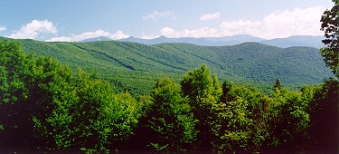](ForestManagement.qmd)

**17. [Forest Management and Ecosystem Dynamics](ForestManagement.qmd)**\
The Hubbard Brook study was originally established to evaluate the influence of forests and forest management on the hydrology of montane forest catchments. This topic is covered in detail in the Hydrology chapter and is not repeated here. The hydrology objective was soon expanded to include element cycling and water quality.
:::

::: chapter-item
[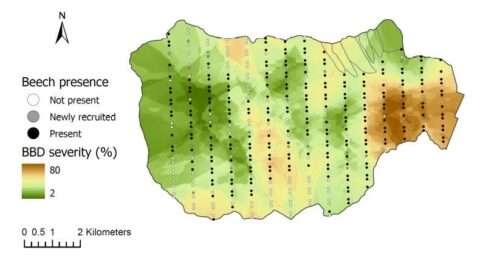](Beech.qmd)

**18. [Trouble with Beech](Beech.qmd)**\
American beech is a foundational tree species of the northern hardwood forest at Hubbard Brook and throughout the Northeast. However, the health of beech is deteriorating as a result of an introduced disease complex, beech bark disease (BBD), and it is likely to deteriorate further with climate warming and the imminent arrival to the region of beech leaf disease. Beech strongly influences forest habitat by its dense shade and production of energy-rich seeds. The phenomenon of “beech hell” (very dense understory thickets), originally attributed to BBD at HBEF, seems rather to have been favored by historic large seed crops and winter weather conditions that favored root sprouting.
:::

::: chapter-item
[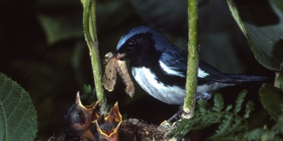](Birds.qmd)

**19. [All About Birds](Birds.qmd)**\
The bird research team has been studying the dynamics of breeding birds at Hubbard Brook for over 55 years. The work has provided numerous important insights into the patterns and controls of bird community composition and species’ abundances. Why have population abundances of some species decreased over time whereas others have remained stable or even increased? What mechanisms contribute to the large annual fluctuations of many species? These and many other questions are addressed in this chapter.
:::

::: chapter-item
[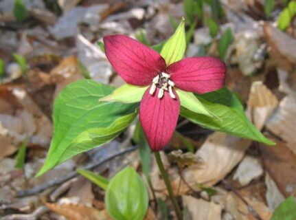](Understory.qmd)

**20. [Understory Vegetation](Understory.qmd)**\
Botanists, ecologists and woodland trampers have always been fascinated by the complex understory vegetation of forest ecosystems. The understory plants harbor an important component of the biodiversity in the forest. They also have a very heterogeneous spatial distribution that makes them particularly difficult to study. However, many fine level studies of understory plant vegetation have been conducted at the HBEF, particularly the seasonal changes in understory vegetation and the response of the understory to forest cutting.
:::

::: chapter-item
[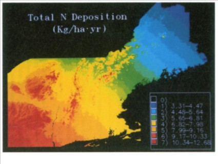](Scaling.qmd)

**21. [Scaling Up: Gradients, Models and Remote Sensing](Scaling.qmd)**\
Logistical considerations usually restrict the scale of direct ecological observations, and for some purposes a broader view of ecological patterns and processes is needed. Approaches for converting small-scale observations to larger spatial scales is denoted as “scaling up.” The term scale is defined in ecological and geographic usage as the proportion a model of reality bears to the thing it represents; consider the scale of a map which is the ratio between map distance and the corresponding distance on the ground. Because we can never capture all scales of variation in representations of nature, it is important to choose an appropriate scale for the problem at hand.
:::

::: {.chapter-item}

**15. [Stream Ecosystems](StreamEcosystems.qmd)**  
From an ecological standpoint streams act as an important conduit for matter and energy leaving the forested ecosystem, but also form a distinct and complex ecosystem in their own right. The Hubbard Brook Ecosystem Study (HBES) pioneered investigation of streams as discrete ecosystems in which a diverse biotic community stores and processes energy and mineral nutrients and delivers products to downstream ecosystems and the atmosphere.

:::

::: {.chapter-item}

**16. [Forest Physiology and Phenology](PhysiologyPhenology.qmd)**  
The Hubbard Brook Ecosystem Study was established to use the small watershed approach to measure and model ecosystem element flux and cycling, but it has evolved to incorporate a complex matrix of projects studying a wide range of biogeochemical and ecological phenomenon. Fundamental to understanding many of these phenomenon is information regarding the structure and function of the defining life form there – trees.
:::

::: {.chapter-item}

**17. [Forest Management and Ecosystem Dynamics](ForestManagement.qmd)**  
The Hubbard Brook study was originally established to evaluate the influence of forests and forest management on the hydrology of montane forest catchments. This topic is covered in detail in the Hydrology chapter and is not repeated here. The hydrology objective was soon expanded to include element cycling and water quality.
:::

::: {.chapter-item}

**18. [Trouble with Beech](Beech.qmd)**  
American beech is a foundational tree species of the northern hardwood forest at Hubbard Brook and throughout the Northeast. However, the health of beech is deteriorating as a result of an introduced disease complex, beech bark disease (BBD), and it is likely to deteriorate further with climate warming and the imminent arrival to the region of beech leaf disease. Beech strongly influences forest habitat by its dense shade and production of energy-rich seeds. The phenomenon of “beech hell” (very dense understory thickets), originally attributed to BBD at HBEF, seems rather to have been favored by historic large seed crops and winter weather conditions that favored root sprouting.
:::

::: {.chapter-item}

**19. [All About Birds](Birds.qmd)**  
The bird research team has been studying the dynamics of breeding birds at Hubbard Brook for over 55 years. The work has provided numerous important insights into the patterns and controls of bird community composition and species’ abundances. Why have population abundances of some species decreased over time whereas others have remained stable or even increased? What mechanisms contribute to the large annual fluctuations of many species? These and many other questions are addressed in this chapter. 
:::

::: {.chapter-item}

**20. [Understory Vegetation](Understory.qmd)**  
Botanists, ecologists and woodland trampers have always been fascinated by the complex understory vegetation of forest ecosystems. The understory plants harbor an important component of the biodiversity in the forest. They also have a very heterogeneous spatial distribution that makes them particularly difficult to study. However, many fine level studies of understory plant vegetation have been conducted at the HBEF, particularly the seasonal changes in understory vegetation and the response of the understory to forest cutting.
:::

::: {.chapter-item}

**21. [Scaling Up: Gradients, Models and Remote Sensing](Scaling.qmd)**  
Logistical considerations usually restrict the scale of direct ecological observations, and for some purposes a broader view of ecological patterns and processes is needed. Approaches for converting small-scale observations to larger spatial scales is denoted as “scaling up.” The term scale is defined in ecological and geographic usage as the proportion a model of reality bears to the thing it represents; consider the scale of a map which is the ratio between map distance and the corresponding distance on the ground. Because we can never capture all scales of variation in representations of nature, it is important to choose an appropriate scale for the problem at hand.
:::

